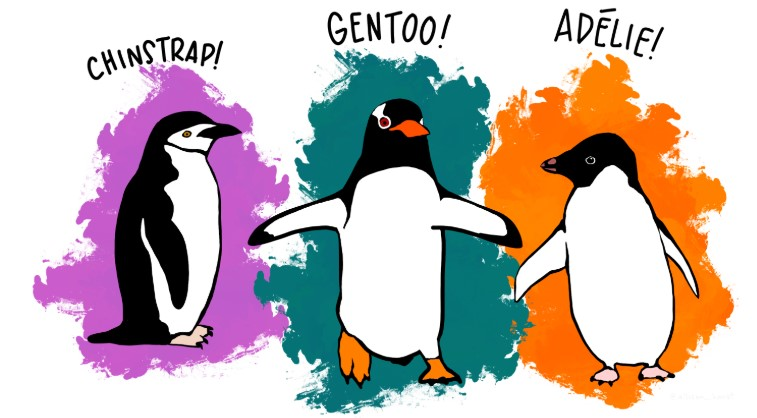

```{=html}

<style type="text/css">

/* Cascading Style Sheets (CSS) is a stylesheet language used to describe the presentation of a document written in HTML or XML. it is a simple mechanism for adding style (e.g., fonts, colors, spacing) to Web documents. */

h1.title {  /* Title - font specifications of the report title */
  font-size: 22px;
  font-weight: bold;
  color: DarkRed;
  text-align: center;
  font-family: "Gill Sans", sans-serif;
}
h4.author { /* Header 4 - font specifications for authors  */
  font-size: 18px;
  font-weight: bold;
  font-family: system-ui;
  color: navy;
  text-align: center;
}
h4.date { /* Header 4 - font specifications for the date  */
  font-size: 18px;
  font-family: system-ui;
  color: DarkBlue;
  text-align: center;
  font-weight: bold;
}
h1 { /* Header 1 - font specifications for level 1 section title  */
    font-size: 22px;
    font-family: "Times New Roman", Times, serif;
    color: navy;
    text-align: center;
    font-weight: bold;
}
h2 { /* Header 2 - font specifications for level 2 section title */
    font-size: 20px;
    font-family: "Times New Roman", Times, serif;
    color: navy;
    text-align: left;
    font-weight: bold;
}

h3 { /* Header 3 - font specifications of level 3 section title  */
    font-size: 18px;
    font-family: "Times New Roman", Times, serif;
    color: navy;
    text-align: left;
}

h4 { /* Header 4 - font specifications of level 4 section title  */
    font-size: 18px;
    font-family: "Times New Roman", Times, serif;
    color: darkred;
    text-align: left;
}

body { background-color:white; }

.highlightme { background-color:yellow; }

p { background-color:white; }

</style>
```

```{r setup, include=FALSE}
# code chunk specifies whether the R code, warnings, and output 
# will be included in the output files.
if (!require("knitr")) {
   install.packages("knitr")
   library(knitr)
}
if (!require("tidyverse")) {
   install.packages("tidyverse")
library(tidyverse)
}
if (!require("palmerpenguins")) {
   install.packages("palmerpenguins")
library(palmerpenguins)
}
if (!require("plotly")) {
   install.packages("plotly")
library(plotly)
}
if (!require("GGally")) {
   install.packages("GGally")
library(GGally)
}
if (!require("naniar")) {
   install.packages("naniar")
library(naniar)
}
if (!require("pool")) {
   install.packages("pool")
library(pool)
}
if (!require("DBI")) {
   install.packages("DBI")
library(DBI)
}
if (!require("RMySQL")) {
   install.packages("RMySQL")
library(RMySQL)
}
if (!require("randomForest")) {
   install.packages("randomForest")
library(randomForest)
}
if (!require("ggiraph")) {
   install.packages("ggiraph")
library(ggiraph)
}
if (!require("highcharter")) {
   install.packages("highcharter")
library(highcharter)
}
if (!require("broom")) {
   install.packages("broom")
library(broom)
}
## 
knitr::opts_chunk$set(echo = TRUE,   # include code chunk in the output file
                      warning = FALSE,# sometimes, you code may produce warning messages,
                                      # you can choose to include the warning messages in
                                      # the output file. 
                      results = TRUE, # you can also decide whether to include the output
                                      # in the output file.
                      message = FALSE,
                      comment = NA
                      )  
```

\

# Introduction

Technical communication, including report writing and visual representation, is a critical aspect of data science and machine learning (ML). By combining clear report writing and compelling visual representation, data professionals can unlock the full potential of their analyses, fostering understanding, trust, and impactful decision-making. Whether explaining model results, persuading stakeholders, or documenting processes, effective communication ensures the work creates tangible value.

These skills bridge the gap between complex technical work and actionable insights, ensuring that data-driven decisions are effectively communicated to diverse audiences. 


# Effective Visual Representation

Visual representation has become a cornerstone of effective communication. From simple bar charts to complex interactive dashboards, visualizations serve as powerful tools for summarizing, analyzing, and conveying information. The success of any visual representation hinges on its graphical components, which are the fundamental elements that bring data to life. These components, when used effectively, ensure clarity, precision, and engagement.


## Required Graphical Components


```{r fig.align='center', fig.width=7, fig.height=5, fig.cap="Graphical elements in an effective visual representation on correlation and numerical variables and their distributions."}
col0 = c("#4682B4", "#B4464B", "#B4AF46")
col.vec = ifelse(penguins$species == "Adelie", "#4682B4", 
                 ifelse(penguins$species == "Chinstrap", "#B4464B", "#B4AF46"))
par(mfrow=c(1,2), oma=c(0,0,2,0))
layout <- layout(matrix(c(1,1,2,3), 2, 2, byrow = F)) 
layout <- plot(penguins$bill_length_mm, penguins$bill_depth_mm, 
        col= col.vec,
        pch=16,
        xlab="Bill Depth (mm)",
        ylab="Bill Length (mm)",
        main="A: Bill Length by Bill Depth ",
        cex.main = 0.9,
        col.main = "blue")
        legend("bottomright", c("Adelie", "Chinstrap", "Gentoo"), pch=rep(16,3),
                col = col0,
                cex = 0.7, bty = "n")
layout <- boxplot(penguins$bill_depth_mm ~ penguins$species,
        xlab="Species",
        ylab="Bill Depth (mm)",
        col = col0,
        main="B: Bill Depth by species",
        cex.main = 0.9,
        col.main = "blue")
layout <- boxplot(penguins$bill_length_mm ~ penguins$species,
        xlab="Species",
        ylab="Bill Length (mm)",
        col = col0,
        main="C: Bill Length by species",
        cex.main = 0.9,
        col.main = "blue")
### 
layout <- mtext("Distribution and Coorlation Plots", side = 3, line = -0.5, outer = TRUE)

```

We next briefly explain the key graphical components in the above illustrative figure.


**Data Points: The Heart of the Visualization**

At the core of any visual representation are the data points. These individual markers encapsulate the values or observations within the dataset, forming the basis for patterns, trends, or relationships. For instance, in a scatter plot, each point represents a unique pairing of variables, while in a line chart, connected points reveal the trajectory of change over time. Without data points, a visualization would lack substance, making them the indispensable foundation of any graphical display.

**Axes: The Framework of Interpretation**

Axes provide the structural framework that anchors data points in a meaningful context. Typically represented as horizontal and vertical lines, axes define the coordinate space and allow viewers to interpret the scale and scope of the data. The X-axis often represents categories or time intervals, while the Y-axis denotes numerical values or metrics. Proper scaling, labeling, and unit representation on axes are critical for ensuring that data is interpreted accurately. For example, in a bar chart depicting revenue growth, a properly scaled Y-axis starting at zero prevents misrepresentation of trends.

**Labels: Guiding the Viewer**

Labels are essential textual elements that provide clarity and context to visual components. Axis labels describe the variables being measured, while data labels pinpoint specific values, enhancing the precision of the representation. For instance, a pie chart with clearly labeled slices ensures that viewers can quickly grasp the proportions of different categories. Thoughtfully designed labels not only aid interpretation but also enhance the overall usability of the visualization.

**Legends: Decoding the Representation**

Legends act as the key to understanding the symbols, colors, or patterns used in a visualization. Particularly in multi-variable representations, legends enable viewers to differentiate between categories or datasets. For example, a line chart with multiple colored lines representing different regions relies on a legend to clarify the mapping between colors and regions. A well-designed legend is concise, strategically placed, and aligned with the overall design of the visualization.

**Color: Enhancing Communication**

Color is one of the most powerful tools in a visual representation, capable of conveying information, drawing attention, and evoking emotions. Strategic use of color enhances the interpretability of data by differentiating categories, highlighting trends, or emphasizing critical points. For example, a heatmap uses color gradients to represent intensity or magnitude, while contrasting colors in a bar chart distinguish between categories. Accessibility considerations, such as using colorblind-friendly palettes, are essential to ensure inclusivity and broad usability.

**Titles, Captions, and Annotations: Providing Context**

Titles, captions, and annotations are textual components that offer context, summarize insights, or explain specific aspects of the visualization. The title acts as the headline, succinctly stating the purpose or takeaway of the visual. Captions provide supplementary information, such as data sources or methodology, while annotations highlight key trends, outliers, or benchmarks. Together, these components guide viewers through the data story and reinforce the intended message.

\

In summary, each graphical component contributes uniquely to the clarity and functionality of a visualization. When thoughtfully integrated, these elements work together to create a design that is intuitive, visually appealing, and effective in communicating its message.

An intuitive visualization ensures the audience can interpret information easily and accurately, without confusion or ambiguity. Aesthetics, such as harmonious color schemes and clean layouts, further enhance engagement and comprehension. By balancing clarity, functionality, and design, a well-crafted visualization transforms data into meaningful insights, empowering storytelling.


## Purposes of Viz Representation

Visual representation plays a pivotal role in the field of data science, especially during Exploratory Data Analysis (EDA) and feature engineering. These two phases are critical for understanding datasets, identifying patterns, and preparing data for machine learning models. The use of visualizations not only simplifies complex data but also enables analysts to uncover insights that may be obscured in raw numbers. In this context, understanding the purposes and types of visual representation becomes essential for effective analysis and feature development.

The purposes of visual representation can be broadly categorized into the following key areas.


**Understanding Data Distribution**

Visualizations help data scientists examine the distribution of individual variables. Charts such as histograms, density plots, and box plots are commonly used to identify the central tendency, spread, skewness, and presence of outliers. For instance, a histogram may reveal that a variable is right-skewed, suggesting the need for transformation to normalize the data.

**Identifying Patterns and Relationships**

During EDA, visualizations reveal patterns and relationships between variables. Scatter plots, pair plots, and heatmaps allow analysts to explore correlations and dependencies. For example, a scatter plot might show a strong positive correlation between advertising spend and sales, guiding feature selection for predictive models.

**Detecting Anomalies and Outliers**

Outliers can significantly impact machine learning models, making their detection crucial. Visual tools like box plots and scatter plots enable analysts to pinpoint anomalies effectively. For instance, a box plot of transaction amounts in a dataset may highlight unusually high values indicative of potential fraud.

**Validating Data Quality**

Visualizations help assess data quality by highlighting missing values, duplicates, or inconsistent patterns. Heatmaps or bar plots can be used to visualize missing data distributions, guiding the choice of imputation strategies.

**Guiding Feature Engineering**

Feature engineering involves creating or transforming features to improve model performance. Visualizations such as correlation matrices and decision boundary plots can inspire new feature combinations or transformations. For example, a high correlation between two variables might suggest creating an interaction term, while patterns in a scatter plot could indicate the need for feature scaling.

**Communicating Insights**

Visualizations are an effective way to communicate findings from EDA and feature engineering to stakeholders. Clear, concise graphs help bridge the gap between technical analysis and business decisions. For instance, a bar chart illustrating the importance of specific features can guide discussions on resource allocation or strategic focus.


## Types of Visual Representation

Visual representation is a cornerstone of Exploratory Data Analysis (EDA) and feature engineering, providing data scientists with tools to understand data, identify patterns, and prepare features for machine learning models. Different types of visualizations serve specific purposes, from understanding variable distributions to detecting outliers and relationships. Below are the primary types of visual representation used in these stages of data science.


**Univariate Visualizations**

Univariate visualizations focus on the distribution and characteristics of a single variable, helping to assess its central tendency, variability, and potential outliers. Depending on the types feature variables, the following charts are commonly used in practice

* **Histograms**: Used to display the frequency distribution of numerical variables, revealing skewness, modality, or gaps in the data.
* **Box Plots**: Highlight the spread, median, quartiles, and potential outliers, providing a concise summary of the variable's distribution.
* **Density Plots**: Smoothened versions of histograms that show the probability density function, making them useful for comparing distributions.
* **Bar Charts**: Ideal for visualizing the frequency of categorical variables, giving an overview of the dataset composition.

```{r fig.align='center', fig.width=5, fig.height=4, fig.cap="Comparing the distribution of two numerical variables"}
# Simulating sample data
data <- data.frame(Category = rep(c("A", "B"), each = 50),
                   Value = c(rnorm(50, mean = 5), rnorm(50, mean = 7)))

boxplot(data$Value ~ data$Category,
        xlab="Category",
        ylab="Value",
        col = c("skyblue", "purple"),
        main="Comparison between two Distributions",
        cex.main = 1.1,
        col.main = "navy")

```

**Bivariate Visualizations**

Bivariate visualizations explore relationships between two variables, uncovering dependencies or correlations that may guide feature selection or transformation.

* **Scatter Plots**: Used to identify correlations, clusters, or trends between two numerical variables.
* **Line Charts**: Suitable for temporal data, showing trends or changes over time.
* **Grouped Bar Charts**: Useful for comparing categories across multiple groups or subgroups.
* **Heatmaps**: Display correlations between variables using color gradients, making them a popular choice for visualizing correlation matrices.


```{r  fig.cap="Correlation between sepal length and petal length."}
# Load iris dataset
data(iris)
mrg <- list(l = 50, r = 50, b = 50, t = 50, pad = 20)
##
pal <- c("#1b9e77", "#d95f02", "#7570b3")
pal <- setNames(pal, c("virginica", "setosa", "versicolor"))
#
fig <- plot_ly(data = iris, x = ~Sepal.Length, y = ~Petal.Length, 
               color = ~Species, colors = pal,
                marker = list(size = ~Sepal.Length*2)) %>% 
       layout(title = 'Correlation between Petal Length and Sepal Length', 
              plot_bgcolor = "white", 
              xaxis = list(title = 'Sepal Length (cm)'), 
               yaxis = list(title = 'Sepal Width (cm)'), 
              legend = list(x = 0.7, 
                            y = 0.1, 
                           title=list(text='<b> Species of Iris </b>')),
              margin = mrg)
fig
```

 
**Multivariate Visualizations**

Multivariate visualizations provide insights into relationships among three or more variables, helping to identify complex interactions.

* **Pair Plots**: Offer a grid of scatter plots for all pairs of variables, along with histograms for individual variables, enabling a quick overview of relationships.
* **Interactive 3D Scatter Plots**: Visualize relationships in three dimensions, adding depth to the analysis of feature interactions. **caution** - static 3D scatter should be avoided.
* **Parallel Coordinates**: Represent multiple variables for each data point as connected line segments, useful for visualizing trends in high-dimensional data.
* **Bubble Charts**: Add a third dimension to scatter plots through bubble size, often used to incorporate a weight or magnitude factor.


```{r fig.cap="Pairwise scatter plot of numerical variables in the iris data"}
names(iris) = c("Sepal.L", "Sepal.W",  "Petal.L", "Petal.W", "Species" )
p <- ggpairs(iris, columns=1:4, 
             aes(color = factor(Species), alpha = 0.5), 
             upper = list(continuous = wrap("cor", size = 3)),
             margin = list(l = 50, r = 50, b = 50, t = 50, pad = 20)) +
      ggtitle("Pairwised Scatter Plot of Iris Data") + 
      theme(
         plot.title = element_text(hjust = 1),    # Center-align the title
         plot.margin = unit(c(1, 2, 2, 1), "cm")  # adjust the margin of the plot
  )
  #
ggplotly(p)
```


**Visualizations for Categorical Data**

Categorical data often requires distinct types of visual representation to highlight distributions and comparisons.

* **Stacked Bar Charts**: Display the composition of categories within subgroups, aiding in the analysis of proportions.
* **Mosaic Plots**: Provide a detailed view of the relationships between two or more categorical variables through proportional areas.
* **Violin Plots**: Combine box plots and density plots to show the distribution of numerical data across categories.

```{r fig.align='center', fig.width=5, fig.height=4, fig.cap="An illustrative example of stacked bar chart to compare the distributions of one categorical variable within categories of the other variable."}
# Example dataset
data <- data.frame(
  Category = c("A", "A", "B", "B", "C", "C"),
  Subcategory = c("X", "Y", "X", "Y", "X", "Y"),
  Value = c(10, 20, 15, 25, 30, 10)
)
#
# Create the stacked bar chart
plot <- plot_ly(
  data,
  x = ~Category,
  y = ~Value,
  color = ~Subcategory,
  type = "bar"
  ) %>%
  layout(
    barmode = "stack", # Stack the bars
    title = "Stacked Bar Chart",
    xaxis = list(title = "Category"),
    yaxis = list(title = "Value")
   )
# Display the plot
plot
```


**Specialized Visualizations for EDA**

Certain visualizations cater specifically to the needs of EDA, focusing on data quality and structure.

* **Missing Data Heatmaps**: Highlight the distribution and frequency of missing values across the data set, guiding imputation strategies.
* **Histogram Facets**: Display distributions of a numerical variable across levels of a categorical variable.
* **Outlier Plots**: Highlight anomalies using scatter plots or specialized visualizations like box plot whiskers.

```{r  fig.cap="Comparing the distributions numerical vaiable across the categories of a categorical variable."}
# Example dataset
data <- data.frame(
  Value = c(rnorm(100, mean = 5), rnorm(100, mean = 10)),
  Category = rep(c("Group 1", "Group 2"), each = 100)
)

# Create the faceted histogram
gg = ggplot(data, aes(x = Value, fill = Category)) +
  geom_histogram(aes(color = Category), bins = 20, alpha = 0.7, size = 1) +
  facet_wrap(~ Category, ncol = 1) + # Facet by Category
  scale_color_manual(values = c("Group 1" = "blue", "Group 2" = "green")) +
  scale_fill_manual(values = c("Group 1" = "lightblue", "Group 2" = "lightgreen")) +
  labs(
    title = "Histogram Facets with Colored Boundaries",
    x = "Value",
    y = "Frequency"
  ) +
  theme_minimal() +
  theme(
    plot.title = element_text(hjust = 0.5),
    strip.text = element_text(size = 12, face = "bold"),
    legend.position = "none" # Remove legend if it's redundant
  )
ggplotly(gg)
```


**Visualizations for Feature Engineering**

Feature engineering relies on visualizations to assess the effectiveness of transformations, combinations, and feature importance.

* **Correlation Matrices**: Display pairwise correlations between numerical variables, helping identify redundant or highly correlated features.
* **Feature Importance Plots**: Derived from machine learning models, these plots rank features based on their impact on model performance.
* **Decision Boundary Visualizations**: Show the regions created by a model’s predictions, useful for evaluating feature combinations.
* **Interaction Plots**: Illustrate the combined effect of two or more features on a target variable, often used in regression or classification problems.

```{r  fig.cap="Display the interaction effects in an ANOVA model"}
# Example dataset
data <- data.frame(
  Factor1 = rep(c("Low", "High"), each = 6),
  Factor2 = rep(c("A", "B", "C"), times = 4),
  Response = c(5, 6, 7, 10, 11, 12, 4, 5, 6, 9, 8, 10)
)

# Create the interaction plot
interact = ggplot(data, aes(x = Factor2, y = Response, group = Factor1, color = Factor1)) +
  geom_line(size = 1) +  # Lines representing interaction
  geom_point(size = 2) + # Points for data
  labs(
    title = "Interaction Plot",
    x = "Factor 2",
    y = "Response",
    color = "Factor 1"
  ) +
  theme_minimal() +
  theme(
    plot.title = element_text(size = 14, face = "bold", hjust = 0.5),
    axis.text = element_text(size = 12),
    legend.position = "top"
  )
div(ggplotly(interact),align="center")
```


**Interactive Visualizations**

Interactive visualizations enhance exploration by allowing users to manipulate the data dynamically.

* **Dashboards**: Combine multiple visualizations into a single interface, enabling filtering, zooming, and slicing of data for deeper insights.
* **Geospatial Maps**: Visualize geographic data with layers of interactivity, such as zooming into specific regions or displaying detailed tooltips.
* **Interactive Scatter Plots**: Allow users to hover over points for detailed information or filter data based on variable ranges.

\

In summary, the diversity of visual representation in EDA and feature engineering underscores its importance in understanding and preparing data for analysis. From univariate histograms to interactive dashboards, each type serves a unique purpose in exploring patterns, assessing data quality, and optimizing features for machine learning models. By selecting the appropriate visualization for the task at hand, data scientists can uncover insights, enhance communication, and drive better decision-making.


## Model-based Visualization

Visualization is vital in data science and machine learning (ML) because it transforms data, results, and model insights into comprehensible visual forms, aiding exploration, communication, and decision-making. 

### Model Performance Evaluation

Visualization is critical for evaluating and comparing model performance.

**Example**: ROC Curve for Classification

```{r}
library(pROC)
# Simulated classification results
ID = sample(1:150, 150, replace = FALSE)
true_labels <- c(rep(1, 50), rep(0,100))[ID]
predicted_probs <- c(rnorm(50, 3, 7), rnorm(100, 10,4))[ID]
# Plot ROC curve
roc_obj <- roc(true_labels, predicted_probs)
sen = roc_obj$sensitivities
spe = roc_obj$specificities
## 
par(pty = "s")
plot(1-spe, sen, type = "l", lwd = 2, lty = 1, col = "blue", 
     xlab = "1 - specificity",
     ylab = "sensitivity",
     main = "ROC Curve")
abline(0,1, lty = 2, lwd = 2, col = "red")
legend("bottomright", c("model-based Performance", "Random Guess"), 
       col=c("blue", "red"), lty=1:2, lwd = 2:1, bty = "n", cex = 0.8)
```

An interactive plot provides more granular information about the underlying plot.

```{r}
library(pROC)
# Simulated classification results
ID = sample(1:150, 150, replace = FALSE)
true_labels <- c(rep(1, 50), rep(0,100))[ID]
predicted_probs <- c(rnorm(50, 3, 7), rnorm(100, 10,4))[ID]
# Plot ROC curve
roc_obj <- roc(true_labels, predicted_probs)
sen = roc_obj$sensitivities
spe = roc_obj$specificities
SenSpe = data.frame(sen = sen, spe = spe)
## 
ggroc = ggplot(data = SenSpe, mapping = aes(x =(1-spe), y = sen)) +
        geom_rect(aes(xmin = 0, 
                      xmax = 1, 
                      ymin = 0, 
                      ymax = 1),
                      fill = "transparent", 
                      color = "darkgray", 
                      size = 0.4   # default is 0.5
                  ) +
        coord_cartesian(xlim = c(0,1), ylim = c(0,1)) +
        #geom_smooth(method = "loess", span = 0.1, col = "darkblue") + 
        #geom_line(col = "darkblue") +
        geom_path(col = "darkblue") +
        #geom_abline(col="darkred", linetype="dashed") +
        geom_segment(aes(x = 0, y = 0, xend = 1, yend = 1), 
                    color = "darkred", linetype = "dash") +

        ggtitle("Interactive ROC Curve") +
        theme(plot.title = element_text(
                                 family = "serif",  # Font family
                                 face = "bold",     # Font face
                                 color = "navy",    # Font color
                                 size = 14,         # Font size
                                 hjust = 0.5,       # Horizontal adjustment
                                 vjust = 1,         # Vertical adjustment
                                 angle = 0          # Font angle
                                 ),
              aspect.ratio = 1)
            
ggplotly(ggroc)

```


### Understanding Model Predictions

Visualization explains how models arrive at their predictions, essential for trust and transparency.

Example: Feature Importance in Random Forest

```{r}
library(randomForest)
# Fit a random forest model
rf_model <- randomForest(Species ~ ., data = iris, importance = TRUE)
# Plot feature importance
varImpPlot(rf_model, main = "Feature Importance in Random Forest")
```

```{r}
rf_model$importance
```


# R Interactive Graphical Functions

Interactive visualizations have become an indispensable tool in modern data science. Whether you're preparing a report, a presentation, or a dashboard, providing interactive figures can make the data more engaging, insightful, and accessible. In R, several powerful packages allow you to create dynamic, interactive plots. In the previous section, I used `ggpairs`, `plot_ly`, `ggplotly`, and `leaflet` to illustrate various R plots. In this section, we will compare some popular packages for interactive data visualizations in R, including `ggiraph`, `plotly`, `ggplotly`, and `highcharter`. These libraries are often used in conjunction with the **umbrella-package** `tidyverse` for data manipulation.

We will use these libraries to visualize relationship between two numerical variables and the distribution of numerical variable. The examples are based on the popular `Palmer Archipelago (Antarctica) penguin dataset` which is similar to the well-known `iris`. It is a great introductory data set for data exploration and visualization. 

```{r fig.align='center', out.width="60%", fig.cap="Three Palmer Archipelago (Antarctica) penguins"}

```

A copy of the data with missing values deleted is available at <https://pengdsci.github.io/STA552/w02/penguin.csv>. 

```{r}
penguins = read.csv("https://pengdsci.github.io/STA552/w02/penguin.csv")
```

The variables are described below:

* **species** a factor denoting penguin species (Adélie, Chinstrap and Gentoo)
* **island** a factor denoting island in Palmer Archipelago, Antarctica (Biscoe, Dream or Torgersen)
* **bill_length_mm** a number denoting bill length (millimeters)
* **bill_depth_mm** a number denoting bill depth (millimeters)
* **flipper_length_mm** an integer denoting flipper length (millimeters)
* **body_mass_g** an integer denoting body mass (grams)
* **sex** a factor denoting penguin sex (female, male)
* **year** an integer denoting the study year (2007, 2008, or 2009)

## Visualizing Relationship 

Two of the 8 feature variables **bill_length_mm** and **bill_depth_mm** will be used to demonstrate the interactive plots to visualize the relationship between them with different R graphical functions.

**ggiraph** 

The interactive graphical function `ggiraph()` is a wrapper of **ggplot()**. We first make a ggplot and then call `ggiraph()` to add interactive feature to the ggplot.


```{r}
fig_full= penguins %>% 
      ggplot(aes(x = bill_length_mm, 
                 y = bill_depth_mm, 
                 color = species, 
                 shape = species)) + 
      geom_point_interactive( 
                aes(tooltip = paste("bill_length_mm:", bill_length_mm, 
                           "<br>", "bill_depth_mm:", bill_depth_mm)), 
                    size = 2) + 
      geom_smooth_interactive(method = "lm", formula = "y ~ x") +
      labs(x = "Bill length (mm)", 
           y = "Bill width (mm)", 
           title = "Bill length vs. bill width", 
           subtitle = "Using the ggiraph package",
           color = "Species", shape = "Species") +
      theme_minimal() + 
      theme(plot.title = element_text(family = "serif",  # Font family
                                  face = "bold",         # Font face
                                  color = "navy",        # Font color
                                  size = 14,             # Font size
                                  hjust = 0.5,           # Horizontal adjustment
                                  vjust = 1,             # Vertical adjustment
                                  angle = 0,             # Font angle
                                  lineheight = 1),       # Line spacing
        plot.subtitle = element_text(                    # Subtitle customization
                                  face = "bold",         # Font face
                                  color = "navy",        # Font color
                                  size = 12,             # Font size
                                  hjust = 0.5,           # Horizontal adjustment
                                  vjust = 1,             # Vertical adjustment
                                  angle = 0,             # Font angle
                                  lineheight = 1),       # Line spacing
        plot.caption = element_text(hjust = 0.25),  # Caption customization
        plot.tag = element_text(face = "italic"),   # Tag customization
        plot.title.position = "plot",               # Title and subtitle position 
                                                    #  ("plot" or "panel")
        plot.caption.position = "panel",            # Caption position ("plot" or "panel")
        plot.tag.position = "top",                  # Tag position
        plot.margin = unit(c(0,1,4,1), "cm"))       # Margins (t, r, b, l)
girafe(ggobj = fig_full)
```

**plot_ly()**

In R, `plot_ly()` is a function from the **Plotly package** used to create interactive plots *directly by specifying the data and plot type*. It is a core function in the **plotly package** and serves as the starting point for building various types of visualizations such as scatter plots, line charts, bar charts, and more.  The key features are 

* **Dynamic Interactivity**: it supports zooming, panning, and tooltips (hover effects) for exploring data interactively.

* **Customizable Visuals**: It allows customization of colors, markers, axis labels, legends, and more.

* **Wide Range of Plot Types**: It handles scatter plots, bar charts, histograms, 3D plots, heatmaps, and more.

* **Layered Plotting**: It enables adding multiple traces (data layers) for creating complex visualizations.

* **Integration**: It works seamlessly with R Markdown, Shiny, and dashboards.

```{r}
plotly.fig = penguins %>% 
    plot_ly(x = ~bill_length_mm, 
            y = ~flipper_length_mm, 
            color = ~species, 
            symbol = ~species,
            type = "scatter", 
            mode = "markers",  
            marker = list(size = 10)) %>% 
    layout(
            plot_bgcolor = 'white',
            xaxis = list(title = "Bill Length (mm)", 
                         zeroline = FALSE, 
                         ticklen = 5),
             yaxis = list(title = "Flipper Length (mm)", 
                          zeroline = FALSE, 
                          ticklen = 5),
            title = "Bill length vs. bill width",
            legend = list(x = 0.01, 
                          y = 0.99, 
                          title=list(text='<b> Species of Penguins </b>')),
            margin = list(l = 50, r = 50, b = 50, t = 50, pad = 20)
  ) 
plotly.fig
```


**ggplotly**

`ggplotly()` is a powerful tool for adding interactivity to existing **ggplot2** plots in R. It bridges the gap between static and dynamic visualizations, allowing users to retain the familiar **ggplot2** workflow while benefiting from *Plotly's* interactivity. This makes it an ideal choice for exploratory data analysis, presentations, and dynamic reporting.

The key features of `ggplotly()` are

* **Interactivity**: It adds zoom, pan, hover tooltips, and legend interaction to static **ggplot2** plots.

* **Preserves ggplot2 Aesthetics**: It maintains the visual design and customization of **ggplot2** plots while making them interactive.

* **Compatibility**: It works seamlessly with ggplot2-based plots and integrates well with R Markdown, Shiny apps, and dashboards.

* **Customization**: It allows further enhancement of interactivity by modifying tooltips, legends, and layouts.

```{r}
fig_full <- penguins %>% 
  ggplot(aes(x = bill_length_mm, y = bill_depth_mm, 
             color = species, shape = species)) + 
  geom_point(size = 2) + 
  geom_smooth(method = "lm", formula = "y ~ x") +
  labs(x = "Bill length (mm)", 
       y = "Bill width (mm)", 
       title = "Bill length vs. bill width", 
       subtitle = "Using ggplot2 and ggplotly() from plotly",
       color = "Species", 
       shape = "Species") +
  theme_minimal() +
      theme(plot.title = element_text(family = "serif",  # Font family
                                  face = "bold",         # Font face
                                  color = "navy",        # Font color
                                  size = 14,             # Font size
                                  hjust = 0.5,           # Horizontal adjustment
                                  vjust = 1,             # Vertical adjustment
                                  angle = 0,             # Font angle
                                  lineheight = 1),       # Line spacing
        plot.subtitle = element_text(                    # Subtitle customization
                                  face = "bold",         # Font face
                                  color = "navy",        # Font color
                                  size = 12,             # Font size
                                  hjust = 0.5,           # Horizontal adjustment
                                  vjust = 1,             # Vertical adjustment
                                  angle = 0),            # Font angle
        plot.caption = element_text(hjust = 0.25),  # Caption customization
        plot.tag = element_text(face = "italic"),   # Tag customization
        plot.title.position = "plot",               # Title and subtitle position 
                                                    #  ("plot" or "panel")
        plot.caption.position = "panel",            # Caption position ("plot" or "panel")
        plot.tag.position = "top",                  # Tag position
        plot.margin = unit(c(1,1,1,1), "cm"))       # Margins (t, r, b, l)


ggplotly(fig_full)
```

**highcharter()**

In R, highcharter is a package that provides an interface to the Highcharts JavaScript library, allowing users to create highly interactive and customizable visualizations. It is particularly well-suited for creating charts with advanced interactivity, polished aesthetics, and a wide range of chart types, making it popular for dashboards, presentations, and web-based reporting.

The key features of `highcharter()`:

* **Wide Range of Chart Types**: It includes bar charts, line charts, scatter plots, heatmaps, treemaps, and more. It also supports advanced visualizations like gauge charts, stock charts, and maps.

* **Interactive Features**: It allows hover tooltips, zooming, panning, and legends. It also allows dynamic updates and animations.

* **Customizability**: It offers detailed control over chart aesthetics, including colors, themes, axis labels, and tooltips.

* **Integration**: It works seamlessly with tidyverse for data manipulation. It is compatible with R Markdown and Shiny for creating dynamic reports and dashboards.

* **Support for Themes**: It allows predefined themes such as `hc_theme_smpl()` and the ability to create custom themes.


```{r}
#penguins$colors = ifelse(penguins$species =="Adelie","#440154",
#                         ifelse(penguins$species =="Chinstrap", "#21908C", "#FDE725" ))
##
fig_highchart <- penguins %>% 
  hchart(type = "scatter", 
         hcaes(x = bill_length_mm, 
               y = flipper_length_mm,
               group = species), 
         marker = list(radius = 5),
         showInLegend = F)  %>%  
  hc_xAxis(title = list(text = "Bill length (mm)")) %>%  
  hc_yAxis(title = list(text = "Bill width (mm)")) %>%  
  hc_title(text = "Bill length vs. bill width") %>% 
  #hc_colors(colors) %>%
  hc_legend(align = "left", 
            verticalAlign = "top",
            layout = "vertical", 
            x = 0, 
            y = 100)
##
species_unique <- sort(unique(penguins$species))
colors <- c("Adelie" = "#2caffe", "Chinstrap" = "#544fc5", "Gentoo" = "#00e272")
###
fig_highchart0 = fig_highchart
for(j in 1:3) {
  penguins_subset <- penguins %>%  
    filter(species == species_unique[j])
  ##
  regression <- augment(lm(flipper_length_mm ~ bill_length_mm, 
                   data = penguins_subset))
  ##
  fig_highchart01 <- fig_highchart0 %>%  
      hc_add_series(regression, "line", hcaes(x = bill_length_mm, y = .fitted), 
                    color = colors[j])
  ##
  fig_highchart0 = fig_highchart01  # updating model object to add another line
}
##
fig_highchart01
```

## Visualizing Distributions

In this subsection, we draw density curves of BMI across the species of penguins with the above four graphical functions.


**ggiraph**

```{r}
fig_density <- penguins %>% 
         ggplot(aes(x = body_mass_g, color = species, fill = species)) +
                geom_density_interactive(
                        aes(tooltip = paste("Species:", species)),
                        linewidth = 0.75, 
                        alpha = 0.5 )  +
                        xlab("BMI Index (g)") +  
           ggtitle("Density Curve of BMI across Species") +
           theme(plot.margin = unit(c(0,1,4,1), "cm"),
                plot.title = element_text(hjust = 0.5))
girafe(ggobj = fig_density)
```


**plot_ly()** 

```{r}
Adelie.BMI <- penguins$body_mass_g[penguins$species=="Adelie"]
Chinstrap.BMI  <- penguins$body_mass_g[penguins$species=="Chinstrap"]
Gentoo.BMI  <- penguins$body_mass_g[penguins$species=="Gentoo"]
Adelie.fit= density(Adelie.BMI)
Chinstrap.fit= density(Chinstrap.BMI)
Gentoo.fit= density(Gentoo.BMI)
# Create overlay density curves
plot_ly() %>%
add_trace(x = Adelie.fit$x, 
          y = Adelie.fit$y, 
          mode = "lines", 
          fill = "tozeroy", 
          yaxis = "y2", 
          name = "Adelie",
          line = list(color = "blue"),
          opacity = 0.6) %>% 
  add_trace(x = Chinstrap.fit$x, 
          y = Chinstrap.fit$y, 
          mode = "lines", 
          fill = "tozeroy", 
          yaxis = "y2", 
          name = "Chinstrap",
          line = list(color = "red"),
          opacity = 0.6) %>%
    add_trace(x = Gentoo.fit$x, 
          y = Gentoo.fit$y, 
          mode = "lines", 
          fill = "tozeroy", 
          yaxis = "y2", 
          name = "Gentoo",
          line = list(color = "purple"),
          opacity = 0.6) %>%
  layout(
        title = "Distributions of BMI across Penguin Species ",
        xaxis = list(title = "BMI Index"),
        yaxis = list(title = "Density"),
        legend = list(title = list(text = "Species", orientation='h')),
        margin = list(l = 100, r = 50, b = 70, t = 100, pad = 20)
     )
```


**ggplotly()**

```{r}
ggplotly_density <- penguins %>% 
  ggplot(aes(x = body_mass_g, color = species, fill = species)) +
  geom_density(linewidth = 0.75, alpha = 0.5) +
  xlab("BMI Index (g)") + 
  ggtitle("Density Curve of BMI across Species") +
           theme(plot.margin = unit(c(2,1,2,1), "cm"),
                plot.title = element_text(hjust = 0.5))
ggplotly(ggplotly_density)
```

**highcharter()**

```{r}
Adelie <- penguins %>% filter(species == "Adelie")
Chinstrap <- penguins %>% filter(species == "Chinstrap")
Gentoo <- penguins %>% filter(species == "Gentoo")
hc <- hchart(
             density(Adelie$body_mass_g), 
             type = "area", 
             color = "steelblue", 
             name = "Adelie") %>%
      hc_add_series(
             density(Chinstrap$body_mass_g), 
             type = "area",
             color = "#B71C1C", 
             name = "Chinstrap") %>%
      hc_add_series(
             density(Gentoo$body_mass_g), 
             type = "area",
             color = "purple", 
             name = "Gentoo") %>%
      hc_title(text = "Density Curves of BMI across Species") %>% 
      hc_legend(align = "left", 
            verticalAlign = "top",
            layout = "vertical", 
            x = 0, 
            y = 100)
hc
```
