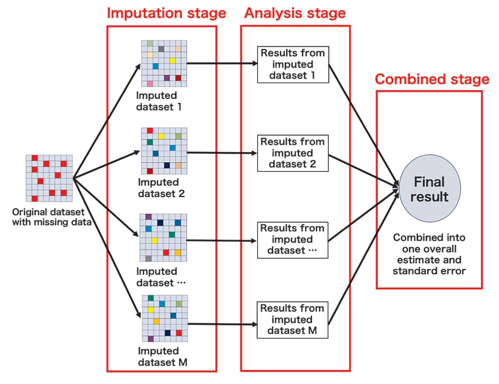
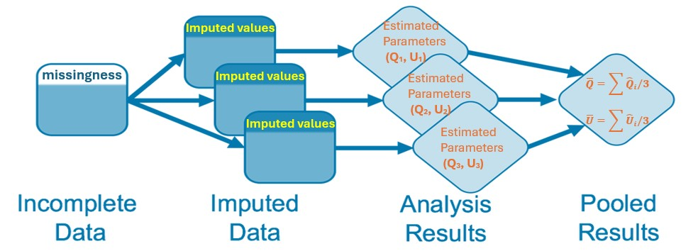
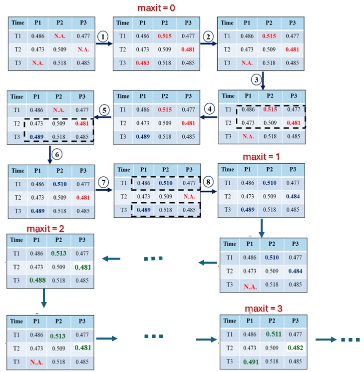

```{=html}

<style type="text/css">

/* Cascading Style Sheets (CSS) is a stylesheet language used to describe the presentation of a document written in HTML or XML. it is a simple mechanism for adding style (e.g., fonts, colors, spacing) to Web documents. */

h1.title {  /* Title - font specifications of the report title */
  font-size: 24px;
  font-weight: bold;
  color: navy;
  text-align: center;
  font-family: "Gill Sans", sans-serif;
}
h4.author { /* Header 4 - font specifications for authors  */
  font-size: 18px;
  font-family: system-ui;
  font-weight: bold;
  color: navy;
  text-align: center;
}
h4.date { /* Header 4 - font specifications for the date  */
  font-size: 18px;
  font-family: system-ui;
  color: DarkBlue;
  text-align: center;
  font-weight: bold;
}
h1 { /* Header 1 - font specifications for level 1 section title  */
    font-size: 20px;
    font-family: "Times New Roman", Times, serif;
    color: navy;
    text-align: center;
    font-weight: bold;
}
h2 { /* Header 2 - font specifications for level 2 section title */
    font-size: 18px;
    font-family: "Times New Roman", Times, serif;
    color: navy;
    text-align: left;
    font-weight: bold;
}

h3 { /* Header 3 - font specifications of level 3 section title  */
    font-size: 16px;
    font-family: "Times New Roman", Times, serif;
    color: navy;
    text-align: left;
}

h4 { /* Header 4 - font specifications of level 4 section title  */
    font-size: 14px;
    font-family: "Times New Roman", Times, serif;
    color: darkred;
    text-align: left;
}

body { background-color:white; }

.highlightme { background-color:yellow; }

p { background-color:white; }

</style>
```

```{r setup, include=FALSE}
# code chunk specifies whether the R code, warnings, and output 
# will be included in the output files.
if (!require("knitr")) {
   install.packages("knitr")
   library(knitr)
}
if (!require("tidyverse")) {
   install.packages("tidyverse")
library(tidyverse)
}
if (!require("kernlab")) { # SVM methodology
   install.packages("kernlab")
library(kernlab)
}
if (!require("e1071")) { # SVM methodology
   install.packages("e1071")
library(e1071)
}
if (!require("ISLR")) { # contains example data set "Khan"
   install.packages("ISLR")
library(ISLR)
}
if (!require("RColorBrewer")) { # customized coloring of plots
   install.packages("RColorBrewer")
library(RColorBrewer)
}
if (!require("VIM")) { # SVM methodology
   install.packages("VIM")
library(VIM)
}
if (!require("mice")) { # SVM methodology
   install.packages("mice")
library(mice)
}
if (!require("ggpubr")) { # SVM methodology
   install.packages("ggpubr")
library(ggpubr)
}
knitr::opts_chunk$set(echo = TRUE,       # include code chunk in the output file
                      warning = FALSE,   # sometimes, you code may produce warning messages,
                                         # you can choose to include the warning messages in
                                         # the output file. 
                      results = TRUE,    # you can also decide whether to include the output
                                         # in the output file.
                      message = FALSE,
                      comment = NA)  
```

# Introduction

Missing data arise in almost all serious statistical analyses. It is a distraction and a cause of potential erroneous analytic results. In this module we discuss a variety of methods to handle missing data, including some relatively simple approaches that can often yield reasonable results. 

Ignoring missingess in some situation may not impact the analytic results significantly, while in 
some other situation, this may cause misleading or even wrong results. In the subsequent sections, we will discuss the types of missingness and the ways of handling the missing values appropriately using software programs, particularly in the situation where the missing-data process must be modeled in order to perform imputations correctly (model-based imputation). We will use various data sets to illustrate the different remedies valid for filling missing values with plausible values.


# Missing Mechanisms

To decide how to handle missing data, it is helpful to know how they are missing and whether missing values following certain distributional patterns. We consider four general **missingness mechanisms** in this section.


## Missingness Completely at Random (MCAR)

A variable is missing completely at random if the probability of missingness is the same for all units. That is, the missing value does not depend on observed or unobserved data. 

$$
\text{P(Missing | Observed, Complete) = P(Missing)}
$$

For example,

* If each survey respondent decides whether to answer the “earnings” question by rolling a die and refusing to answer if a “6” shows up. 

* Lost data due to technical error such as miscalibration of MRI machine

* Data are missing for respondents for which their questionnaire was lost in the mail.


If data are missing completely at random, then throwing out cases with missing data does not bias inferences. The MCAR can be tested by separating the missing and the complete cases and examine the group characteristics. If characteristics are not equal for both groups, the MCAR assumption does not hold


## Missingness at Random (MAR) 

Most missingness is not completely at random, as can be seen from the data themselves. 

$$
\text{P(Missing | Complete) = P(Missing | Observed)}
$$


For example, the different nonresponse rates in a survey for whites and blacks indicate that the “earnings” question in the *Social Indicators Survey* is not missing completely at random.

A more general assumption, missing at random, is that the probability a variable is missing depends only on available information. Thus, if sex, race, education, and age are recorded for all the people in the survey, then “earnings” is missing at random if the probability of nonresponse to this question depends only on these other, fully recorded variables. It is often reasonable to model this process as a logistic regression, where the outcome variable equals 1 for observed cases and 0 for missing.

When an **outcome variable** is missing at random, it is acceptable to exclude the missing cases (that is, to treat them as NA’s), as long as the regression controls for all the variables that affect the probability of missingness. Thus, any model for earnings would have to include predictors for ethnicity, to avoid nonresponse bias.

This missing-at-random assumption (a more formal version of which is sometimes called the ignorability assumption) in the missing-data framework is the basically same sort of assumption as ignorability in the causal framework. Both require that sufficient information has been collected that we can “ignore” the assignment mechanism (assignment to treatment, assignment to nonresponse).

## Missingness Not at Random (MNAR)

Missingness is no longer “at random” if it depends on information that has not been recorded and this information also predicts the missing values. 

$$
\text{P(Missing | Complete)} \ne \text{P(Missing | Observed)}
$$

For example in medical studies,  if a particular treatment causes discomfort, a patient is more likely to drop out of the study. This missingness is not at random (unless “discomfort” is measured and observed for all patients).

If missingness is not at random, it must be explicitly modeled, or else you must accept some bias in your inferences.


## Censoring - Partial Missingness

A particularly difficult situation arises when the probability of missingness depends on the (potentially missing) variable itself. The following a few examples illustrating different types of special missingness, 

* In the **Social Indicators Survey**, respondents with higher earnings are less likely to reveal them. For example, assume that all persons earning more than \$100,000 refuse to respond, in this case, the missing values indicate the earnings are more than \$100,000. This is called **right censoring**. Since we know the censoring level (\$100,000), this is also called <font color = "red">**\color{red}type I right censoring**</font>.

* In monitoring environmental processes,trace-level environmental data typically include values near or below detection and quantitation thresholds where health effects may result from low-concentration exposures to one chemical over time or to multiple chemicals. This type of censoring is called **left censoring**.

* Interval-censored data are often found in longitudinal studies in which subjects are assessed only periodically for the response of interest. The time when the event of interest occurs is not directly observed but is known to take place within some time interval. For example, in a clinical trial subjects might visit a clinic for assessment at predetermined times.

Handling missing values due to censoring is not straightforward at all. Systematic approaches to handling censoring data is out of the scope of this course.

In the subsequent sections, we will introduce some of the conventional and model-based imputation methods to filling the missing values.


# Conventional Replacement Methods

Rather than removing variables or observations with missing data, another approach is to fill in or “impute” missing values. A variety of imputation approaches can be used that range from extremely simple to rather complex. These methods keep the full sample size, which can be advantageous for bias and precision; however, they can yield different kinds of bias.

## Mean Imputation

Perhaps the easiest way to impute is to replace each missing value with the mean of the observed values for that variable. Unfortunately, this strategy can severely distort the distribution for this variable, leading to complications with summary measures including, notably, underestimates of the standard deviation. Moreover, mean imputation distorts relationships between variables by
“pulling” estimates of the correlation toward zero.

## Random Imputation

When more than a trivial fraction of data are missing, however, we prefer to perform imputations more formally. In order to understand missing-data imputation, we start with the relatively simple setting in which missingness is confined to a single variable, $Y$, with a set of variables $X$ that are observed on all units.


### Simple Random Imputation

The simplest approach is to impute missing values of a variable based on the observed data for this variable. This is is essentially a simulation-based imputation. Taking a random sample from the complete observation is equivalent to the taking an random sample from the empirical distribution. 

This methods can be easily wrapped up using the following code.

```{}
random.imp = function (a){
# a is an imput variable with missing values to be imputed
missing.id = is.na(a)
n.missing = sum(missing)
a.obs = a[!missing]  # vector of complete observations
imputed = a    # make a copy of the imputed variable to avoid potential messing-up
imputed[missing] <- sample (a.obs, n.missing, replace=TRUE) # Random imptation!
return (imputed)
}
```


This approach does not make much sense if there are other auxiliary information available in other variabkes. However, these simple random imputations can be a convenient starting point. A better approach is to fit a regression to the observed cases and then use that to predict the missing cases, as we show next.

### Regression Imputation

A simple and general imputation procedure that uses individual-level information
uses a regression to the nonzero values of earnings. We begin by setting up a data
frame with all the variables we shall use in our analysis.

We use the following example to illustrate regression imputation

```{r}
## Simulate a data set
x = 1:10
y = c(11,12,18,14,17, NA,NA,19,NA,27)
z = sample(1:20, 10)
w = c(seq(1,10,3), 3,5,7,6,6,9)
dataSet = data.frame(x,y,z,w)
```

We use linear regression imputation method to impute the missing values in variable y in the following steps.

1. Using complete records in the data to build a linear regression using y as the response.

2. Using the above fitted model to predict the missing values of y using corresponding complete values in x and w. The `newdata` must be the subset of the original data frame of which y's values are missing. 

3. Replacing the missing values in y with the corresponding predicted values obtained in the previous steps.

```{r}
##
imp.model = lm(y ~ x + w, data = dataSet)  # records with missing y were 
                                           # automatically deleted
newdata = dataSet[is.na(dataSet$y),]       
pred.y = predict(imp.model,  newdata, type="response")
dataSet$y[is.na(dataSet$y)] = pred.y
## check the imputed data set
kable(dataSet)     # checking the data imputed data set
```

This methods can also be used for nonlinear regression and generalized linear regressions such as logistic regression.


### Random Regression Imputation

In linear regression model, the predicted response value should follow the the same distribution as that of response variable. The above linear regression imputation did not take the uncertainty into consideration. We can put the uncertainty back into the imputations by adding the prediction error into the regression. Note that prediction error should follow the same distribution of the residuals of the fitted models. For ease of comparison, we use the following small simulated data to explain the idea of random regression imputation.

```{r}
id = 1:50
## Simulate a data set
x = rnorm(50, 5, 3)
y = 2*rnorm(50, 10, 5) + rnorm(50, 0, 4)
z = 2.5*x + 1.5*y + rnorm(50, 0, 15)
y[sample(1:50, 15, replace = FALSE)] = NA  # create missing values at random
workSet = data.frame(id, x,y,z)
kable(head(workSet))  # look at the first few records
```

As an initial exploration, we make a pair-wise scatter plot based on the complete records and then decide what model is appropriate for imputation.

```{r  fig.align='center', fig.width=5, fig.height=5, fig.cap="Pairwise scatter plot for identifying correlated variables for regression imputation"}
pairs(workSet)
```

From the above pairwise plot, both x and z are correlated with y. We build a linear regression `y ~ z` and use it to predict the missing values in y.

```{r fig.align='center', fig.width=5, fig.height=5, fig.cap="Comparison between regression imputation and random regression imputation"}
pred.mdl = lm(y~z, data = workSet)
newdata = workSet[is.na(workSet$y),]
pred.y = predict(pred.mdl, newdata = newdata)
m0 = sum(is.na(workSet$y))      # total number of missing values
pred.resid = resid(pred.mdl)    # residual
pred.yrand = pred.y + sample(pred.resid, m0, replace = TRUE)
##
plot(z,y, main = "Z vs Y")
# plot a regression line 
abline(pred.mdl, col = "steelblue", lty = 2, lwd = 2)
points(newdata$z,pred.y, pch=19, col = "red")
points(newdata$z,pred.yrand, pch=19, col = "blue")
legend("topleft", c("regression imputation", "random regression imputation"),
       col=c("red", "blue"), pch=rep(19,2), bty="n", cex = 0.8)
```


The above plot shows that the regression-imputation-based points are on the regression line, the random-regression-imputation-based points are randomly scattered. The above imputation methods are also called model-based imputation methods. 


# Multiple Imputation (MI)

Multiple imputation is a strategy for handling missing data. While the default approach often involves case-wise deletion of observations with missing values on key variables, imputation replaces missing values with estimated or predicted values.

In single imputation, a missing value is estimated once, perhaps using the mean of observed values or a random sample from them. In multiple imputation, multiple plausible values are generated for each missing value, creating several data sets, each with a different set of imputed values. Various algorithms exist for generating these data sets, each employing different methods to estimate the missing data.


The goal of multiple imputation is to 

* Accurately reflect available information

* Avoid bias in estimates of quantities of interest

* Estimation could involve explicit or implicit model

* Accurately reflect uncertainty due to missingness

The main challenge of multiple imputation is not the analysis (it simply proceeds as usual on each imputed data set) but instead the aggregation of those separate analyses.


## Multiple Imputation (MI) Algorithm

I divide multiple imputation (MI) into two parts. The first part of the algorithm outlines the steps for generating an imputed dataset, which involves a model-based iterative procedure. The second part applies the well-known Rubin's rules for combining results.

```{}

Step 1: Choose an imputation model: Select an appropriate imputation model 
        based on the data and missingness mechanism (MCAR, MAR, or MNAR). 
        This could be a regression model, a Bayesian model, or other suitable 
        models depending on the context.
Step 2: Create initial imputed datasets
        2.1. For each missing value, generate an initial imputation using a 
             simple method, such as mean imputation, regression prediction, or 
             random sampling from observed values.
        2.2. Create an initial imputed dataset D1 using these values to replace 
             the missing data.
Step 3: Generate multiple imputed datasets
        3.1. Repeat Step 2 m times to generate m distinct imputed datasets 
             D1, D2, …, Dm.
Step 4: Analyze each imputed dataset
        4.1. Perform the analysis (e.g., regression, hypothesis testing) on 
             each of the m imputed datasets individually, producing results
             for each dataset.
Step 5: Combine the results using Rubin’s Rules
        5.1. Combine estimates of parameters (e.g., regression coefficients) by 
             averaging them.
        5.2. Combine the variance estimates, accounting for both within-dataset 
             and between-dataset variance.
        5.3. Compute the combined standard errors and confidence intervals.
Step 6: Report on the combined results
        6.1. Present the final, pooled results, including the combined estimates 
             and standard errors, after applying Rubin’s rules.

```

The above algorithm is graphically illustrated in the following

```{r fig.align='center', out.width="60%", fig.cap="Graphical representation of the general multiple imputation (MI)."}

```


### The Rubin Rule 

Rubin´s Rules (RR) that was used in the above MI algorithm are designed to pool parameter estimates, such as mean differences, regression coefficients, standard errors and to derive confidence intervals and p-values.

The MI algorithm summarized in the following.

1. For each missing value, randomly impute $m$ estimates (usually $m$ = 5)

2. Create $m$ complete data sets

3. Perform desired analysis on each of the $m$ complete data sets

4. **Pool** final estimates in a manner that accounts for the between, and within imputation variance. 


The last step is the Rubin rule. Next, we present a brief technical explanation of the Rubin rule.

Consider $m$ imputed data sets. For some quantity of interest $Q$ with squared $SE = U$, calculate $Q_{1}, Q_{2}, \ldots, Q_{m}$ and $U_{1}, U_{2}, \ldots, U_{m}$ (e.g., carry out $m$ regression analyses, obtain point estimates and SE from each). 

Then calculate the average estimate $\bar{Q}$, the average variance $\bar{U}$, and the variance of the averages $B$. 

$$ 
  \begin{aligned}
  \bar{Q} & = \sum^{m}_{i=1}Q_{i}/m \\
  \bar{U} & = \sum^{m}_{i=1}U_{i}/m \\
  B & = \frac{1}{m-1}\sum^{m}_{i=1}(Q_{i}-\bar{Q})^2
  \end{aligned}
$$

Then $T = \bar{U} + \frac{m+1}{m}B$ is the estimated total variance of $\bar{Q}$. 

The above Rubin rule is depicted in the following

```{r fig.align='center', out.width="60%", fig.cap="Illustration of Rubin rule."}

```


### A Simple Numerical Example

We use parental HIV data to illustrate the steps of MI and Rubin rule in the following.

1. Create $m$ imputed data sets using linear regression plus a small amount of random noise so all the imputed values are not identical. That is, the random imputation with linear regression.  

```{r}
hiv = read.csv("hiv.csv")
miss.dep.idx<- which(is.na(hiv$bsi_depress))
reg.model <- lm(bsi_depress ~ gender + siblings + age, hiv) 
rmse <- sqrt(summary(reg.model)$sigma)
##
set.seed(1061)
dep.imp1 <- dep.imp2 <- dep.imp3 <- regressionImp(bsi_depress ~ gender + siblings + age, hiv) 
dep.imp1$bsi_depress[miss.dep.idx] <- dep.imp1$bsi_depress[miss.dep.idx] +
  rnorm(length(miss.dep.idx), mean=0, sd=rmse/2)

dep.imp2$bsi_depress[miss.dep.idx] <- dep.imp2$bsi_depress[miss.dep.idx] + 
  rnorm(length(miss.dep.idx), mean=0, sd=rmse/2)

dep.imp3$bsi_depress[miss.dep.idx] <- dep.imp3$bsi_depress[miss.dep.idx] + 
  rnorm(length(miss.dep.idx), mean=0, sd=rmse/2)
```


To compare the completely observed records with the imputed data, we plot the empirical density distributions for the fully observed data set and the imputed data sets  $D_1, D_2, \cdots, D_m$. The three panels of density plots below illustrate the distributional differences across the imputed data sets.


```{r  fig.align='center', fig.width=4, fig.height=5, fig.cap="Comparison between imputed and completely observed data"}
dep.mi <- bind_rows(
  data.frame(value = dep.imp1$bsi_depress, imputed = dep.imp1$bsi_depress_imp, 
             imp = "dep.imp1"), 
  data.frame(value = dep.imp2$bsi_depress, imputed = dep.imp2$bsi_depress_imp, 
             imp ="dep.imp2"), 
  data.frame(value = dep.imp3$bsi_depress, imputed = dep.imp3$bsi_depress_imp, 
             imp ="dep.imp3"))

ggdensity(dep.mi, x = "value", color = "imputed", fill = "imputed", 
          add = "mean", rug=TRUE, palette = "jco") + 
  facet_wrap(~imp, ncol=1)
```

We observe discrepancies between the density curves of the fully observed data and those generated using linear regression-based random imputation. These discrepancies arise because the imputed dataset was created using a single-step imputation process. The quality of the imputed data depends on both the imputation model (linear regression, in this case) and the assumed distribution of random error (normal distribution in this case).   


2. Calculate the point estimate of the parameter (mean of `bsi_depress`), denoted by $Q$, and the variance of the estimated parameters (variance of `bsi_depress`) , denoted by $U$, from each imputation. 

```{r}
Q <- c(mean(dep.imp1$bsi_depress), 
        mean(dep.imp2$bsi_depress), 
        mean(dep.imp3$bsi_depress))
##
n.d <- length(dep.imp1$bsi_depress)
##
U <- c(sd(dep.imp1$bsi_depress)/sqrt(n.d), 
        sd(dep.imp2$bsi_depress)/sqrt(n.d), 
        sd(dep.imp3$bsi_depress)/sqrt(n.d))
##
list(Mean.Estimate = Q, Variance.Estimate=U)
```

3. Combining Results: We combine the **sample means** and **sample variance** (parameters of interest) of the imputed data sets by taking the means of $Q_i$ and $U_i$ as well as the between variance in the following.

```{r}
Q.bar = mean(Q)
U.bar = mean(U)
B.var = var(Q)
c(Q.bar = Q.bar, U.bar = U.bar, B.var = B.var)
```

\

**A Cautionary Note**: <font color = "red">*\color{red}The outcome of single imputation is a single imputed data set. In contrast, multiple imputation (MI) involves creating multiple imputed data sets (using random imputation) and pooling the results of analyses performed on each.*</font>

\

In the next section, we introduce an enhanced multiple imputation with chained equation (MICE) procedure. 

\


# Imputation with MICE

Multiple Imputation by Chained Equations (MICE) is a multiple imputation method used to replace missing data values in a data set under certain assumptions about the data missingness mechanism (e.g., **the data are missing at random, the data are missing completely at random**).


What sets MICE apart is its flexibility. It uses different imputation models depending on the type of variable (e.g., continuous, categorical, binary). By **iterating through each variable with missing data and refining estimates**, MICE ensures the imputed values align with the data set's structure. This iterative imputation process id outlined in the following steps:

```{}
Step 1: Initial Guess for Missing Values: For each variable with missing values, 
        perform an initial imputation (e.g., mean, median, or mode imputation) 
        to replace missing entries. (This creates a temporary complete dataset 
        to start the iterative process.)
Step 2: Iteratively Impute Missing Values for Each Variable: Repeat the following 
        steps for each variable   Vi with missing data:
        2.1. Set Vi as the target variable: Treat Vi as the response variable, 
             and the other  k-1 variables as predictors.
        2.2. Fit an Imputation Model: Use the observed (non-missing) values of  
             Vi to fit a regression model based on the predictors (other variables). 
             - The model choice depends on the type of  Vi (e.g., linear regression 
             for continuous data, logistic regression for binary data, etc.).
        2.3. Predict Missing Values for Vi: Use the fitted model to predict the 
             missing values for Vi. - Introduce randomness to these predictions 
             by adding noise drawn from the residual variance or posterior 
             distribution, ensuring stochasticity.
        2.4. Update Vi: Replace the missing values in Vi with the predicted values, 
             creating an updated imputed dataset.
Step 3: Iterate Over All Variables: Cycle through all variables with missing data, 
        updating each variable’s imputed values while using the most recent 
        imputations for other variables.
Step 4: Repeat Until Convergence: Repeat the above process for a predefined number 
        of iterations or until the imputations stabilize (i.e., changes between 
        iterations are negligible).

```

In the R library `mice()`, argument `maxit = m` indicates the number of cycles (iterations) of the iterative imputing process. To illustrate this iterative imputation process, we use the following toy data to show the logical process.


```{r fig.align='center', out.width="80%", fig.cap="Iterative imputation process in MI."}

```


Among many imputation algorithms,  MICE is easy to implement using software tools like the mice package in R. For example, consider a data set where some values are missing. MICE can be used to fill in these gaps while preserving relationships between variables based on various univariate imputation methods that are built-in the MICE library.


Built-in univariate imputation methods are:


| Method | Variable Types |   Model Type |
|:-------|:---------------|:-------------|
| `pmm`  |	any	 |Predictive mean matching|
| `midastouch	| any| 	Weighted predictive mean matching| 
| sample	| any| 	Random sample from observed values| 
| cart	| any| 	Classification and regression trees| 
| rf	| any| 	Random forest imputations| 
| mean	| numeric| 	Unconditional mean imputation| 
| norm	| numeric| 	Bayesian linear regression| 
| norm.nob	| numeric| 	Linear regression ignoring model error| 
| norm.boot	| numeric| 	Linear regression using bootstrap| 
| norm.predict	| numeric| 	Linear regression, predicted values| 
| lasso.norm	| numeric| 	Lasso linear regression| 
| lasso.select.norm	| numeric| 	Lasso select + linear regression| 
| quadratic	| numeric| 	Imputation of quadratic terms| 
| ri	| numeric| 	Random indicator for nonignorable data| 
| logreg	| binary| 	Logistic regression| 
| logreg.boot	| binary| 	Logistic regression with bootstrap| 
| lasso.logreg	| binary| 	Lasso logistic regression| 
| lasso.select.logreg	| binary| 	Lasso select + logistic regression| 
| polr	| ordered| 	Proportional odds model| 
| polyreg	| unordered| 	Polytomous logistic regression| 
| lda	| unordered| 	Linear discriminant analysis| 
| 2l.norm	| numeric| 	Level-1 normal heteroscedastic| 
| 2l.lmer	| numeric| 	Level-1 normal homoscedastic, lmer| 
| 2l.pan	| numeric| 	Level-1 normal homoscedastic, pan| 
| 2l.bin	| binary| 	Level-1 logistic, glmer| 
| 2lonly.mean	| numeric| 	Level-2 class mean| 
| 2lonly.norm	| numeric| 	Level-2 class normal| 
| 2lonly.pmm	| any| 	Level-2 class predictive mean matching| 


## The MICE Algorithm

The MICE process follows a systematic approach to iteratively impute missing data. It involves creating multiple versions of the data set with plausible estimates for missing values while preserving the relationships among variables. Below is an overview of the basic MICE process.


**MICE Algorithm**

```
Step 1: Initialize imputed values
        1.1. For each variable with missing values, impute initial values using 
             a simple imputation method (e.g., mean, median, or mode imputation, 
             or regression).
        1.2. These initial imputations will be used as starting values in the 
             iterative process.
Step 2: Set up the imputation model for each variable
        2.1. Define the imputation model for each variable with missing data. 
             The model can be different for each variable and can be based on a 
             regression model (e.g., linear regression, logistic regression) or 
             other models depending on the nature of the data.
        2.2. The variable to be imputed (dependent variable) will be regressed 
             on other variables in the dataset (predictor variables).
Step 3: Iterative imputation process
        3.1. For each iteration t, repeat the following process for each variable 
             with missing values:
             3.1.1. For each variable Vi with missing data, use the current values 
                    of the other variables (including previously imputed values) 
                    to predict the missing values for Vi.
             3.1.2. The model for imputation of Vi is fitted to the complete data 
                    (where no missing values exist for Vi).
             3.1.3. Impute missing values for Vi based on the model fit in step 
                    3.1.2, replacing the missing values with predicted values 
                    (this imputation is stochastic, introducing random variability 
                    to account for uncertainty).
        3.2. Repeat this process for all variables with missing data.
Step 4: Perform multiple imputations
        4.1. Repeat Step 3 m times (with m being the number of imputations) to 
             create m different imputed datasets. Each dataset will contain 
             imputed values for the missing data based on different imputations, 
             reflecting the uncertainty in the imputation process.
Step 5: Analyze each imputed dataset
         5.1. Perform the desired analysis (e.g., regression, hypothesis testing) 
              on each of the m imputed datasets, yielding m sets of results.
Step 6: Pool the results using Rubin's Rules
         6.1. Combine the results from the m datasets using Rubin’s rules:
              6.1.1. Combine the parameter estimates (e.g., regression coefficients) 
                     by averaging them across the m datasets.
              6.1.2. Combine the variance estimates, accounting for both the 
                     within-imputed dataset variance and the between-imputed 
                     dataset variance.
              6.1.3. Calculate the overall standard errors, confidence intervals, 
                     and p-values based on the combined estimates.
Step 7: Report on the combined results
        7.1. Present the final, pooled results, including the combined estimates, 
             standard errors, and confidence intervals.
```

The R `mice library` has several functions listed below to extract relevant information in the above algorithm. 


`mice()`	Impute the missing data *m* times

`with()`	Analyze completed data sets

`pool()`	Combine parameter estimates

`complete()`	Export imputed data

`ampute()`	Generate missing data

For ease of illustration, we use the built-in `airquality` data in the subsequently examples.  The first few records in the data is given below.


```{r}
library(mice)
data <- airquality  # Example dataset with missing values
data[1:10,]
```


**1. Initialization**

The process begins by assigning initial values to all missing entries in the data set. These initial values are often derived using simple imputation techniques, such as:

* Replacing missing numeric values with the mean or median.

* Filling missing categorical values with the mode.

This step provides a starting point for the iterative process.


```{r}
init <- mice(data, maxit = 0)  # Check initial imputation setup
init$method                    # View default imputation methods
```

**2. Imputation Models**

Each variable with missing data is assigned a specific imputation model tailored to its data type. Some commonly used models are listed below.

* **Predictive Mean Matching (pmm)**: For continuous variables.
* **Logistic Regression (logreg)**: For binary variables.
* **Polytomous Regression (polyreg)**: For categorical variables.
* **Proportional Odds Model (polr)**: For ordinal variables.

These models predict missing values based on other observed variables in the data set. As an example, we impute only one data (under the iterative imputing process illustrated early).

```{r}
library(mice)
dat <- airquality  # Example data set with missing values
## individual variable 
imp <- mice(dat, method = c("pmm","pmm", "pmm", "pmm",  "", ""), 
                 maxit = 10,  # iterating 10 cycles to complete each imputed data set
                 m = 1,       # generate 1 imputed data set
                 print=F)     # suppress printouts
## we use complete() tp view the complete data set.
complete(imp, action = 1L)[1:10,]  # The default *action = 1L* returns the first
                                   # imputed (complete) data set.
```

**3. Iterative Imputation**

The core of the MICE process is its iterative nature:

* Each variable with missing data is treated as a dependent variable, while all other variables act as predictors.

* Missing values for the target variable are imputed using the assigned model.

* This process cycles through all variables with missing data, iteratively refining the imputations.

The iterations continue until the imputed values stabilize, indicating convergence.


```{r}
data <- airquality  # Example data set with missing values
imp <- mice(data, method = "pmm", # using predictive mean matching (ppm)
                  maxit = 10,  # pre-specified cycles in the iterative process
                  m = 2,       # generate 2 imputed data sets
                  seed = 123,  # setting seed to keep reproducibility of the process
                  print=F)     # suppress printouts
complete(imp, action = "broad")[1:10,] # *action = "broad"* combines the two imputed 
                                # data sets in a wide table. There are other 
                                # options to lay out the imputed data sets.
```

**3. Multiple Imputations**

Multiple imputed data sets are created to capture the variability introduced by missing data.

```{r fig.align='center', fig.width=7, fig.height=5, fig.cap="Line plots of means and standard deviations of the two numerical variables with missing values in each imputed data sets."}
imp5 <- mice(data, method = "pmm", m = 5, maxit = 10, seed = 123, print=F)
plot(imp5)
```

Here, m = 5 specifies the number of imputations, and maxit = 10 defines the number of iterations.


**4. Analysis and Pooling**

Each imputed data set is analyzed independently, and the results are combined using Rubin’s Rules to produce final estimates and standard errors.


```{r}
model5 <- with(imp5, lm(Ozone ~ Wind + Temp))  # The statistical model to assess
                                             # the relationship between *Ozone*
                                             # and *Wind* and *Temp*.
summary.stats = summary(model5)               # display the regression results of 
                                             # individual imputed data set.
summary.stats 
```

To combine the results, we simply take average of the corresponding estimated regression coefficients.

```{r}
summary(pool(model5))
```

The above pooled results are calculated based on the formulas on $Q, U, B$ and $T$. The following code illustrates the calculation of the pooled standard error of the intercept.

```{r}
beta = summary.stats$estimate[seq(1,15,by=3)]  # explicit vector: c(1,4,7,10,13)
beta.var = (summary.stats$std.error[seq(1,15,by=3)])^2 
Q = mean(beta)
U = mean(beta.var)
B = var(beta)
T = U + (6/5)*B
pool.se = sqrt(T)
cbind(pool.se.intercept = pool.se)
```

## Advantages of MICE

MICE offers several benefits:

* **Flexibility**: It handles mixed data types (continuous, binary, categorical).
* **Preservation of Relationships**: Imputation respects the relationships between variables.
* **Uncertainty Representation**: Multiple imputations account for variability in missing data.

In R, the mice package simplifies MICE implementation, allowing users to customize imputation methods for each variable. The main function `mice()` can detect missingness of an individual variables. If a variable has no missing values, the imputing model will be automatically set to `""`.  


```{r}
imp6 <- mice(data, method = c("pmm", "pmm", "pmm", "pmm", "", ""), 
            maxit = 5,
            print=F, 
            seed = 123)
imp6$method  
## without mno specified imputing model
init <- mice(data,   
            maxit = 5,
            print=F, 
            seed = 123)
init$method
```


In this example, predictive mean matching (`pmm`) is used for continuous variables. If there is a binary categorical variable with missing values, logistic regression (`logreg`) will be used as the imputed model.


## Challenges of MICE

Despite its advantages, MICE comes with challenges:

* **Computational Intensity**: Large datasets and high missingness can increase computation time.
* **Model Specification**: Poorly chosen imputation models may lead to inaccurate results.
* **Dependence on Data Quality**: Errors in observed data can propagate through imputations.

In R, proper pre-processing, including outlier handling and transformation, can mitigate some challenges.


## Practical Applications of MICE

MICE is widely used in various fields, including healthcare, social sciences, and survey research. For instance:

In clinical trials, MICE imputes missing patient data to preserve the study’s integrity.

In surveys, it handles incomplete responses while maintaining representativeness.


```{r}
# Imputation for a survey dataset
survey_data <- data.frame(
  Age = c(25, 30, NA, 35, 40),
  Gender = c("Male", "Female", "Male", NA, "Female"),
  Income = c(50000, NA, 60000, 65000, 70000)
)
imp <- mice(survey_data, method = c("pmm", "logreg", "pmm"), maxit = 5, 
            print=F, seed = 123)
complete_data <- complete(imp)
print(complete_data)
```

Here, polyreg is used for categorical variables, showcasing MICE's versatility.


## Conclusion

MICE is a powerful and flexible tool for handling missing data, ensuring robust and unbiased statistical analyses. Its iterative process, reliance on tailored imputation models, and ability to account for uncertainty make it a cornerstone of modern data science. With tools like the mice package in R, implementing MICE has become more accessible, enabling analysts to address missing data challenges effectively. While it requires careful implementation, the benefits of using MICE far outweigh its challenges, making it an essential technique for high-quality data analysis.


