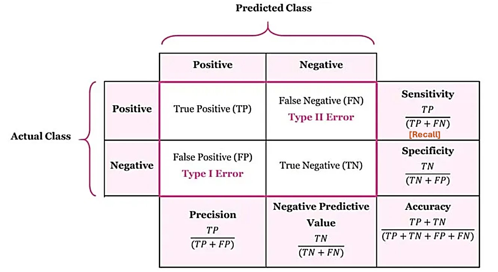
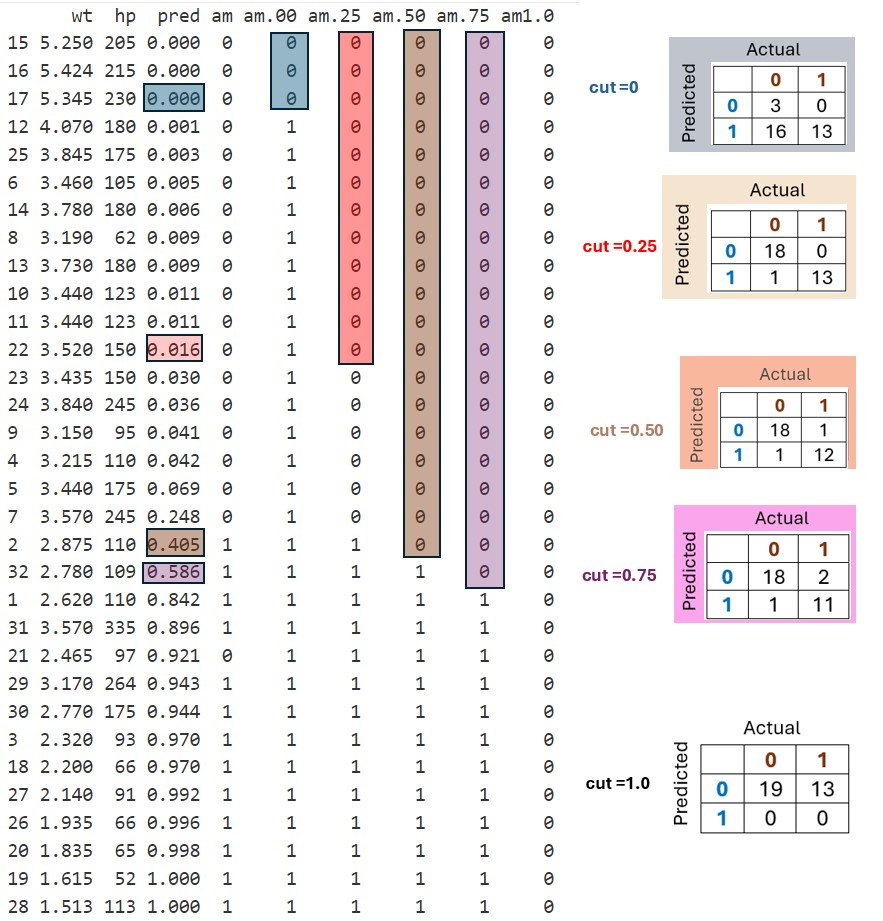
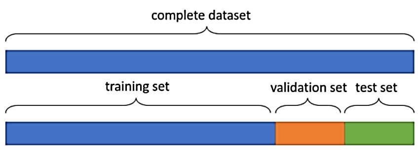
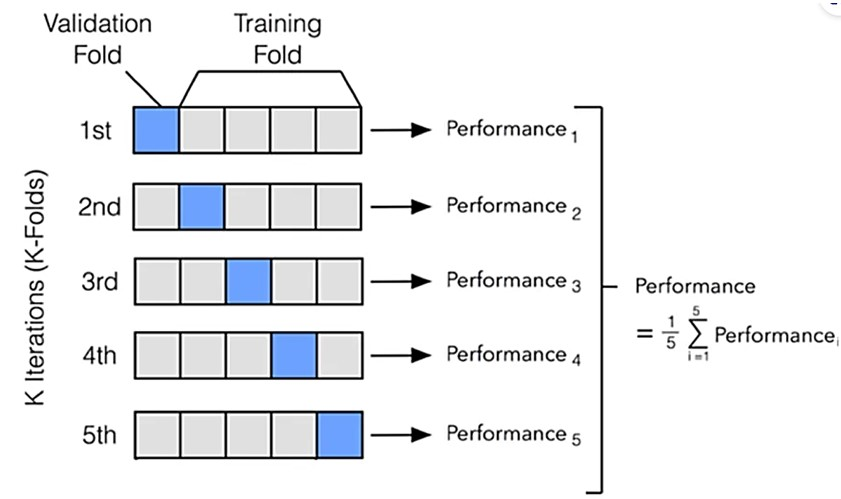

```{=html}

<style type="text/css">

/* Cascading Style Sheets (CSS) is a stylesheet language used to describe the presentation of a document written in HTML or XML. it is a simple mechanism for adding style (e.g., fonts, colors, spacing) to Web documents. */

h1.title {  /* Title - font specifications of the report title */
  font-size: 24px;
  font-weight: bold;
  color: navy;
  text-align: center;
  font-family: "Gill Sans", sans-serif;
}
h4.author { /* Header 4 - font specifications for authors  */
  font-size: 18px;
  font-family: system-ui;
  color: navy;
  font-weight: bold;
  text-align: center;
}
h4.date { /* Header 4 - font specifications for the date  */
  font-size: 14px;
  font-family: system-ui;
  color: DarkBlue;
  text-align: center;
  font-weight: bold;
}
h1 { /* Header 1 - font specifications for level 1 section title  */
    font-size: 20px;
    font-family: "Times New Roman", Times, serif;
    color: navy;
    text-align: center;
    font-weight: bold;
}
h2 { /* Header 2 - font specifications for level 2 section title */
    font-size: 18px;
    font-family: "Times New Roman", Times, serif;
    color: navy;
    text-align: left;
    font-weight: bold;
}

h3 { /* Header 3 - font specifications of level 3 section title  */
    font-size: 16px;
    font-family: "Times New Roman", Times, serif;
    color: navy;
    text-align: left;
    font-weight: bold;
}

h4 { /* Header 4 - font specifications of level 4 section title  */
    font-size: 14px;
    font-family: "Times New Roman", Times, serif;
    color: darkred;
    text-align: left;
    font-weight: bold;
}

body { background-color:white; }

.highlightme { background-color:yellow; }

p { background-color:white; }

</style>
```

```{r setup, include=FALSE}
# code chunk specifies whether the R code, warnings, and output 
# will be included in the output files.
if (!require("knitr")) {
   install.packages("knitr")
   library(knitr)
}
if (!require("tidyverse")) {
   install.packages("tidyverse")
library(tidyverse)
}
if (!require("GGally")) {
   install.packages("GGally")
library(GGally)
}
if (!require("caret")) {
   install.packages("caret")
library(caret)
}
if (!require("plotly")) {
   install.packages("plotly")
library(plotly)
}
if (!require("glmnet")) {
   install.packages("glmnet")
library(glmnet)
}
if (!require("MASS")) {
   install.packages("MASS")
library(MASS)
}
if (!require("caret")) {
   install.packages("caret")
library(caret)
}
if (!require("pROC")) {
   install.packages("pROC")
library(pROC)
}
#  
knitr::opts_chunk$set(echo = TRUE,    # include code chunk in the output file
                      warning = FALSE, # suppress warning messages,
                      results = TRUE,  # include the output in the output file.
                      message = FALSE,
                      comment = NA
                      )  
```
\

# Introduction

Machine learning (ML) has revolutionized various industries by enabling the development of systems capable of learning from data to make accurate predictions or decisions. However, the success of any ML model hinges on its ability to perform well not only on the data it was trained on but also on unseen data. This is where performance measures and cross-validation play crucial roles. Together, they provide a robust framework for assessing and validating machine learning models, ensuring their reliability and generalizability.


# Regression Modeling Basics

Regression modeling and machine learning algorithms are practically important because they enable data-driven decision-making, predictions, and insights across diverse industries. Their importance lies in their ability to process and analyze large volumes of data, uncover patterns, and optimize processes, leading to better outcomes in business, healthcare, technology, and more. Among many regression models, linear regression and logistic regression models are the two most important family models in both classical statistics for association analysis under relatively strong distributional assumptions and modern machine learning fields for prediction with fewer assumptions. 

The essence of regression modeling lies in understanding the relationship between a dependent variable and one or more independent variables, or in making predictions based on this relationship.

**Assessing the relationship**: In this case, regression helps identify how changes in the independent variables (predictors) influence the dependent variable. It is often used to quantify the strength, direction, and nature of the relationship.

**Prediction**: Regression models can also be used for predicting the value of the dependent variable given new or unseen data for the independent variables. Once the model is trained on historical data, it can be applied to make predictions for future data.

## Modeling Process

The process of regression modeling is an iterative process that includes several key stages, Each step involves feedback loops, enabling the modeler to refine assumptions, data, and model specifications for optimal performance and meaningful insights.

The iterative nature of regression modeling ensures that the model evolves to better fit the data and the problem to improve its performance and alignment with the problem at hand. Here's a breakdown of the steps 

* **Problem Definition**: Clearly define the objective of the regression model, including the target variable and predictors, and **revisit** problem assumptions based on data understanding or business feedback.

* **Data Collection and Preparation** Collect, clean, and preprocess data by handling missing values, outliers, and inconsistent entries. Transform features if necessary (e.g., logarithmic transformations for skewed data).
Split data into training, validation, and testing sets. **Refine** data preprocessing steps if initial results indicate poor data quality.

*  **Exploratory Data Analysis (EDA)**: Visualize data to understand relationships and distributions.
Identify potential correlations between predictors and the target variable. Check for multicollinearity and other issues. **Adjust** features or identify new ones based on insights.

* **Model Specification**: Choose the type of regression model (e.g., linear regression, polynomial regression) specify the form of the model, and include initial predictors.  **Test different forms** of the model (e.g., adding interaction terms, transforming variables) based on feedback from residual analysis.

* **Model Fitting**: Fit the model to the training data using appropriate estimation methods (e.g., Ordinary Least Squares, Maximum Likelihood Estimation). **Tune model parameters or adjust features** if the initial model does not perform well.

* **Model Evaluation**: Evaluate model performance on the training and validation sets using metrics like R-squared, Mean Squared Error (MSE), or Mean Absolute Error (MAE) and check diagnostic plots for residuals to ensure assumptions (linearity, independence, homoscedasticity, and normality) are met. **Modify** the model if diagnostic checks reveal violations of assumptions.

* **Feature Selection**: Use techniques like backward elimination, forward selection, or regularization (Lasso, Ridge) to identify the most important predictors. **Re-run** the model with selected features and reassess its performance.

* **Model Validation and Testing**: Validate the model on a separate validation set to test its ability to generalize to unseen data, perform cross-validation to assess model stability and robustness, and evaluate the model on the test set for final performance metrics. **Adjust** the model based on validation results to improve generalization.

* **Interpretation and Insight Generation**: Interpret the coefficients and their significance to draw actionable insights and ensure the model aligns with domain knowledge and business expectations. **Refine** the model to improve interpretability or accommodate new insights.

* **Deployment and Monitoring**: Deploy the model in production for predictions or decision-making and continuously monitor model performance over time to ensure it remains accurate and relevant. **Update or retrain** the model as new data becomes available or when performance degrades.

\

## Linear Regression Models

Linear regression modeling is a foundational technique in statistics and machine learning used to describe the relationship between one or more independent variables (predictors) and a dependent variable (response). Below are the fundamentals of linear regression modeling.


### **Objectives**

Linear regression aims to model the relationship between variables by fitting a linear equation to observed data. The goal is to either predict the dependent variable $y$ based on the values of independent variables $(x_1, x_2, \cdots, x_k)$ or assess the relationship between $y$ and predictor variables in the linear and nonlinear forms.
  
### **Structure**

The general form of the multiple linear regression model is given by
$$
y = f(x_1, x_2, \cdots, x_k) + \epsilon
$$

where $f(x_1, x_2, \cdots, x_k)$ is a deterministic expression of predictor variables $x_1, x_2, \cdots, x_k$ and some unknown parameters (coefficients). $\epsilon$ is a random variable that follows a certain probability distribution. If the $f(x)$ is a **linear function of unknown parameters** and $\epsilon \sim N(0, \sigma)$, the corresponding model is called **linear models**. Here are some examples

* $f(\cdot)$ is a linear combination of predictor feature variables in the following form   

$$
y = \beta_0 + \beta_1 x_1 + \beta_2 x_2 + \cdots + \beta_k x_k + \epsilon, \text{ where } \ \epsilon \sim N(0, \sigma).
$$

* $f(\cdot)$ is a polynomial function of predictor variables. For example,

$$
y = \beta_0 + \beta_1 x_1 + \beta_2 x_2 + \beta_{11}x_1^2 + \beta_{22} x_2^2 + \beta_{12} x_1x_2+ \epsilon, \text{ where } \ \epsilon \sim N(0, \sigma).
$$
is a polynomial regression model. <font color = "red">**\color{red}Caution**: *The above polynomial (i.e., quadratic) regression is a linear regression model.*</font>


### **Assumptions**

Every models and algorithms have some explicit and implicit assumptions to be checked and validated before reporting the model.

<ul>
* **Data Set**: the data must be IID.
* **Structure**: the function relationship between the response and the predictor variables must be correctly specified.
* **Distribution of Response Variable**: $Y\sim N[f(x_1, x_2, \cdots, x_k), \sigma]$ which is equivalent to $\epsilon\sim N(0,\sigma)$. The notation $N(\mu, \sigma)$ stands for normal distribution with mean $\mu$ and standard deviation $\sigma$. <font color = "red">**\color{red}These assumptions are crucial to estimate the regression coefficients, define valid p-values for significance tests of regression coefficients, and construct prediction intervals using t-distributions.**</font>

</ul>

\


## Logistic Regression Model

Logistic regression is a statistical method used to model the relationship between a dependent variable (binary or categorical) and one or more independent variables. It predicts the probability of the dependent variable belonging to a particular category (e.g., success/failure, 1/0) by using a logistic function (sigmoid curve), which maps predicted values to a range between 0 and 1.


### **Objectives**

Logistic regression aims to model the relationship between the **binary** response variable and other feature variables by fitting a nonlinear equation (of predictor features) to observed data. The goal is to either predict the dependent variable $y$ based on the values of independent variables $(x_1, x_2, \cdots, x_k)$ or assess the relationship between $y$ and predictor variables in the linear and nonlinear forms.


### **Structure**

Assume that the response variable takes character values `0` and `1` and $P(Y = "1")$ is the probability of observing the **bigger value of the response** (in alphabetical order). The general form of the logistic regression is given by

$$
P(Y=1) = \frac{e^{f(x_1, x_2, \cdots, x_k)}}{1+e^{f(x_1, x_2, \cdots, x_k)}}.
$$

The deterministic function $f(\cdot)$ can take either linear or polynomial expressions of predictor feature variables. For example, if $f(x_1, x_2, \cdots, x_k) = \beta_0 + \beta_1 x_1 + \beta_2 x_2 + \cdots + \beta_k x_k$, the explicit logistic model is given by

$$
P(Y=1) = \frac{e^{\beta_0 + \beta_1 x_1 + \beta_2 x_2 + \cdots + \beta_k x_k}}{1+e^{\beta_0 + \beta_1 x_1 + \beta_2 x_2 + \cdots + \beta_k x_k}}.
$$

or equivalently

$$
\log \frac{P(Y=1)}{1-P(Y=1)} = \beta_0 + \beta_1 x_1 + \beta_2 x_2 + \cdots + \beta_k x_k.
$$
The above formulation of the logistic regression model has important terms: **The odds of observing $Y=1$** is $P(Y=1)/[1-P(Y=1)]$. The left hand of the above formulation is called logarithmic odds of observing $Y=1$. That is,
$$
\text{log odds of (Y = 1)} = \log \frac{P(Y=1)}{1-P(Y=1)}.
$$

### **Assumptions**

Different models have different assumptions. Logistic regression models have the following assumptions.

<ul>
* **Data Set**: the data must be IID and the sample size must be large.

* **Structure**: the function relationship between $P(Y=1)$ and the predictor variables must be correctly specified. That is, $f(\cdot)$ **as a function of the predictor variables** must be correctly specified.

* **error Distribution**: $Y \sim Binom(p)$ where $p = P(Y=1)$ is a binomial distribution. <font color = "red">**\color{red}These assumptions are crucial to estimate the regression coefficients, define valid p-values for significance tests of regression coefficients, and construct prediction intervals using t-distributions.**</font>
</ul>


## Parameter Interpretation

In predictive analysis and classification applications, the interpretation of the regression coefficient is not the focus but the accuracy of the underlying model and algorithms. However, in association analysis, the interpretation of regression coefficients in the final model is critical for ensuring that models are not only correct but also reliable and responsible in their applications. 

The interpretability of regression coefficients is dependent on the structure of the underlying regression model which is also one of the criteria for assessing the goodness of a model. This subsection discusses the interpretation of regression coefficients of linear and logistic regression models.

### Linear Regression

We provide an interpretation of the regression coefficient in three different scenarios. 

* **First Order Linear Regression**

Recall that the first-order linear regression model with $k$ predictor feature variable has the following form.

$$
y = \beta_0 + \beta_1 x_1 + \beta_2 x_2 + \cdots + \beta_i x_i+ \cdots  + \beta_k x_k + \epsilon, \ \ \text{ where } \ \ \epsilon \sim N(0, \sigma).
$$
where $1 \le i \le k$ and $\epsilon \sim N(0, \sigma)$. Let

$$
y^{(i,0)} = \beta_0 + \beta_1 x_1 + \beta_2 x_2 + \cdots + \beta_i (x_i+0)+ \cdots  + \beta_k x_k ,
$$

and

$$
y^{(i,1)} = \beta_0 + \beta_1 x_1 + \beta_2 x_2 + \cdots + \beta_i (x_i+1)+ \cdots  + \beta_k x_k, 
$$

then

$$
\beta_i = y^{(i,1)}- y^{(i,0)}.
$$

The coefficient of $x_i$, represents the change in $y$ for a one-unit increase in $x_i$, holding all other variables constant. <font color="red">**\color{red}That is, under the same condition, if $x_i$ increases one-unit, the corresponding change in $y$ is the coefficient $\beta_i$.**</font>


* **Polynomial Regressions with no Interaction**

Without loss of generality, we consider the following polynomial regression with one predictor variable $x$.

$$
y = \alpha_0 + \alpha_1 x + \alpha_2 x^2 + \alpha_3 x^3 + \cdots + \alpha_k x^k + \epsilon, \ \ \text{ where } \ \ \epsilon \sim N(0, \sigma).
$$

Interpreting polynomial regression coefficients in a practical sense can be challenging. The coefficients in a polynomial regression model correspond to the terms of the polynomial equation and reflect the behavior of the change of the curvature of the (curve of the) polynomial function. 

From a practical perspective, we suggest, rather than interpreting coefficients directly, using plots to visualize the relationship between $x$ and $y$.

* **Regression with 2nd Order Interaction Only**

We will not discuss high-order interaction terms in any polynomial regression model. The following is an end-order polynomial regression model with an interaction term only.

$$
y = \gamma_0 + \gamma_1 x_1 + \gamma_2 x_2 + \gamma_{12}x_1x_2 + \epsilon, \ \ \text{ where } \ \ \epsilon \sim N(0, \sigma)
$$

We fix $x_2$ and increase $x_1$ by one unit, we evaluate the change of the response $y$ in the following.

$$
y^{(x_1+1,x_2)} - y^{(x_1,x_2)} = [\gamma_0 + \gamma_1 (x_1+1) + \gamma_2 x_2 + \gamma_{12}(x_1+1)x_2] -[\gamma_0 + \gamma_1 x_1 + \gamma_2 x_2 + \gamma_{12}x_1x_2]= \gamma_1 + \gamma_{12}x_2
$$
The coefficient $\gamma_{12}$ indicates the extent to which the effect of $x_1$ on $y$ depends on the value of $x_2$, and vice versa. A context-specific explanation of the interaction is given in the following agricultural example.

Consider a study examining the effects of fertilizer and water levels on crop yield.

* $y$: Crop yield (in tons per hectare).

* $x_1$: Amount of fertilizer applied (in kg per hectare).

* $x_2$: Amount of water supplied (in liters per hectare).

Assume the regression model is

$$
\text{crop} = \gamma_0 +\gamma_1 \text{water amount}+ \gamma_2\times \text{fertilizer} + \gamma_{12} \text{fertilizer}\times\text{water amount}.
$$

<font color = "red">**\color{red}The interpretation**</font>: when we increase fertilizer by one kg and keep the same amount of water supply, the increment of the crop yield is given by

$$
\text{The increment of crop yield} = \gamma_1  + \gamma_{12} \times \text{water amount (kg)} 
$$
A positive $\gamma_{12}$ suggests that the benefits of adding fertilizer ($x_1$) on crop yield are amplified when water supply $(x_2)$ is high. Similarly, an increased water supply is more beneficial when sufficient fertilizer is applied. That is, doubling water supply while fertilizer levels are already high may lead to more than a proportional increase in yield.

Here’s an example in R to view the interaction effect using a polynomial regression with one two-way interaction term.


```{r}
# Load necessary library
#library(ggplot2)
# Simulate data
set.seed(123)  # For reproducibility
n = 100
x1 = runif(n, 0, 10)
x2 = runif(n, 0, 10)
z = 3 + 2*x1 - 1.5*x2 + 0.5*x1^2 + 0.3*x1*x2 + rnorm(n, 0, 3)

# Combine into a data frame
data = data.frame(x1 = x1, x2 = x2, y = z)
data$x1x2 = x1*x2

# Fit a quadratic regression model with interaction term
model = lm(z ~ x1 + x2 + I(x1*x2), data = data)
# Summary of the model
#summary(model)
coef1 = coef(model)
data$z1 = coef1[1] + coef1[2]*x1 + coef1[3]*x2 + coef1[4]*data$x1x2 
##
model0 = lm(z~x1+x2, data = data)
coef0 = coef(model0)
data$z0 = coef0[1] + coef0[2]*x1 + coef0[3]*x2  
```

```{r}
# Visualizing the quadratic regression surface
quad = plot_ly(data, x= ~x1, y= ~x2, z= ~z1,
               type='mesh3d', 
               intensity = ~z1,
               text = "Interaction",
               colors= colorRamp(rainbow(5))
           )
lin.quad = add_trace(p = quad,
           z = data$z0,
           x = x1,
           y = x2,
           text = "No Interaction",
           type = "mesh3d") %>%
           hide_colorbar() %>%
           layout(title = 'Polynomial Regression Surface: No Interaction vs Interaction',
              margin = list(l = 5, r = 5, b = 50, t = 50, pad = 4))
lin.quad
```

### Logistic Regression

Unlike the linear regression model, the regression coefficients are directly related to the change in the response variable. In the logistic regression, the change of the values of predictor feature variables influences the probability of observing $Y=1$. If express logistic regression as the logarithm of odds of observing $(Y=1)$, that is,

$$
\log \text{O} =\log \frac{P(Y=1)}{1-P(Y=1)} = \alpha_0 + \alpha_1 x_1 + \alpha_2 x_2 + \cdots + \alpha_k x_k.
$$

$O = \text{Odds of oberserving Y=1}$. Then we can mimic the way of interpreting the coefficients in linear regression, the i-th regression coefficient in the above multiple logistic regression model is expressed as

$$
\alpha_i = \log \text{O}^{(x_i+1)} - \log \text{O}^{(x_i)} = \log \frac{\text{O}^{(x_i+1)}}{\text{O}^{(x_i)}}
$$

We exponentiate both sides of the above equation, and we have

$$
\frac{\text{O}^{(x_i+1)}}{\text{O}^{(x_i)}} = e^{\alpha_i }, \ \ \text{ which is equivalent to }\ \ \frac{\text{O}^{(x_i+1)}-\text{O}^{(x_i)}}{\text{O}^{(x_i)}} = e^{\alpha_i}-1.
$$
We re-write the last equation as the form of the percentage change in the following.

$$
100\times \frac{\text{O}^{(x_i+1)}-\text{O}^{(x_i)}}{\text{O}^{(x_i)}} = 100(e^{\alpha_i}-1).
$$
Therefore, we have the following interpretation of the $\alpha_i$: under the same condition, increasing $x_i$ by one unit leads to the change of odds of observing (Y=1) by $100(e^{\alpha_i}-1)\%$.

To illustrate the relationship between a predictor variable and the response variable with a 2-way interaction, we can use a graphical approach such as interaction plots or 3D surface plots. The following example uses a 3D surface plot to view the relationship in the logistic regression model with a 2nd order interaction in the following example based on simulated data.


```{r}
# Load necessary library
library(ggplot2)
# Simulate a working data set
set.seed(123)  # For reproducibility
n = 100
x1 = rnorm(n, 0.4,2)
x2 = rexp(n, 1.2)
l0 =.1 + .2*x1 - 1.5*x2  + 0.5*x1*x2
p = exp(l0)/(1+exp(l0))
z = ifelse(p>0.48, 1, 0)
# Combine into a data frame
data = data.frame(x1 = x1, x2 = x2, y = z)
# Fit a quadratic regression model with interaction term
logit0 = glm(y ~ x1 + x2, family = binomial(link=logit), data = data)
# Summary of the model
#summary(logit0)
coef0 = coef(logit0)
ln0 = coef0[1] + coef0[2]*x1 + coef0[3]*x2 
data$z0 = exp(ln0)/(1+exp(ln0))  
###
logit1 = lm(z~x1+x2+x1*x2,family = binomial(link=logit), data = data)
#summary(logit1)
coef1 = coef(logit1)
ln1 = coef1[1] + coef1[2]*x1 + coef1[3]*x2 + coef1[4]*data$x1*x2 
data$z1 = exp(ln1)/(1+exp(ln1))  
```


```{r}
# Visualizing the quadratic regression surface
#library(ggplot2)
#library(plot_ly)
quad = plot_ly(data,
               x= ~x1, 
               y= ~x2, 
               z= ~z1,
               type='mesh3d', 
               intensity = ~z1,
               text = "Interaction",
               colors= colorRamp(topo.colors(5, alpha=0.7, rev = TRUE))
           ) 
quad.ln = add_trace(
           p = quad,
           z = ~z0,
           x = ~x1,
           y = ~x2,
           text = "No Interaction",
           type = "mesh3d",
           intensity = ~z0,
           colors= colorRamp(rainbow(5))) %>%
           hide_colorbar() %>%
       layout(title = 'Logistic Surface: No Interaction vs Interaction',
              margin = list(l = 5, r = 5, b = 50, t = 50, pad = 4))
quad.ln
```

## Paremeter Estimation 

The regression coefficients in both (normal) linear and logistic regression models are estimated by maximizing the likelihood function of the parameters - Maximum Likelihood Estimation (MLE).

### Concepts of Likeliood <font color = "red">*\color{red}(Optional)*</font>

Fisher's Maximum Likelihood Estimation (MLE) is a method for estimating the parameters of a statistical model that maximizes the likelihood function. The likelihood function represents the probability of the observed data given the parameters of the model. Fisher's MLE is widely used because it has desirable properties under certain conditions, such as consistency, efficiency, and asymptotic normality.

In general, let $\{x_1, x_2, \cdots, x_n \} \stackrel{\text{i.i.d}}\sim f(x; \alpha, \beta)$, then <font color = "red">**\color{red}the likelihood of observing the random sample**</font> is defined to be

$$
\mathbb{L}(\alpha, \beta) = \prod_{i=1}^n f(x_i; \alpha, \beta).
$$
Fisher's proposal of estimating parameters $(\alpha, \beta)$ is to find the values for $\alpha$ and $\beta$, denoted by $(\hat{\alpha}, \hat{\beta})$, that maximize the likelihood $\mathbb{L}(\alpha, \beta)$. We can use the following notation to denote the above optimization 

$$
(\hat{\alpha}, \hat{\beta}) = \arg\max_{(\alpha, \beta)} \mathbb{L}(\alpha, \beta)
$$

For computational convenience, Instead of maximizing the likelihood function $\mathbb{L}(\alpha, \beta)$, we maximize the log-likelihood $\mathcal{l}(\alpha, \beta) = \log \mathbb{L}(\alpha, \beta)$. This converts the product of probabilities into a sum, simplifying calculations and reducing numerical instability. That is,

$$
(\hat{\alpha}, \hat{\beta}) = \arg\max_{(\alpha, \beta)} \mathbb{l}(\alpha, \beta)
$$
where

$$
\mathbb{l}(\alpha, \beta) = \sum_{i=1}^n \log f(x_i; \alpha, \beta).
$$

### Normal Linear Regression Likelihood <font color = "red">*\color{red}(Optional)*</font>

Without loss of generality, we consider the following normal linear regression model.

$$
Y = \alpha_0 + \alpha_1 x_1 + \alpha_2 x_2 + \cdots + \alpha_k x_k + \epsilon, \ \ \text{ where } \ \ \epsilon \sim N(0, \sigma)
$$
Which implies that 

$$
\mu = E[Y] = \alpha_0 + \alpha_1 x_1 + \alpha_2 x_2 + \cdots + \alpha_k x_k \ \ \text{ and } \ \ \text{var}(Y) = \sigma^2.
$$

Or equivalent to

$$
Y \sim N(\mu, \sigma).
$$

The predictor feature variables $x_1, x_2, \cdots, x_k$ are assumed to be non-random and the response variable $y$ is a random variable with the above distribution. The explicit density of $Y$ is given by

$$
f(y) = \frac{1}{\sqrt{2\pi}\sigma} e^{-\frac{[y-(\alpha_0 + \alpha_1 x_1 + \alpha_2 x_2 + \cdots + \alpha_k x_k)]^2}{2\sigma^2}}.
$$

Let $\{(y_1, x_{1i}, x_{2i}, \cdots, x_{ki})\}_{i=1}^n \stackrel{\text{i.i.d}}\sim  f(y)$, the likelihood of observing the `i.i.d` sample based on the above distributional assumption is given by

$$
\mathbb{L}(\alpha_0, \alpha_1, \cdots, \alpha_k) = (\sqrt{2\pi}\sigma)^{-n}e^{-\sum_{i=1}^n \frac{[y_i-(\alpha_0 + \alpha_{1} x_{1i} + \alpha_{2} x_{2i} + \cdots + \alpha_k x_{ki})]^2}{2\sigma^2}}
$$
The log-likelihood function is

$$
\mathbb{l}(\alpha_0, \alpha_1, \cdots, \alpha_k)=-n\log(\sqrt{2\pi}\sigma)-\frac{1}{2\sigma^2}\sum_{i=1}^n [y_i-(\alpha_0 + \alpha_{1} x_{1i} + \alpha_{2} x_{2i} + \cdots + \alpha_k x_{ki})]^2
$$

The MLE is the solution to the above optimization problem.


### Logistic Regression Likelihood <font color = "red">*\color{red}(Optional)*</font>

Note that the response variable in the binary logistic regression model is assumed to be a Bernoulli random variable with `success` probability $p$ that is defined as 

$$
p = \frac{\exp(\alpha_0 + \alpha_1 x_1 + \alpha_2 x_2 + \cdots + \alpha_k x_k)}{1 + \exp(\alpha_0 + \alpha_1 x_1 + \alpha_2 x_2 + \cdots + \alpha_k x_k)}
$$

with probability mass function

$$
P(Y = y) = p^y(1-p)^{1-y}, \ \ \text{ where } \ \ y = 0 \ \text{ or } \ 1.
$$

Let $\{(y_1, x_{1i}, x_{2i}, \cdots, x_{ki})\}_{i=1}^n \stackrel{\text{i.i.d}}\sim  f(y)$, the likelihood of observing the `i.i.d` sample based on the above distributional assumption is given by

$$
\mathbb{L}(\alpha_0, \alpha_1, \cdots, \alpha_k)=\prod_{i=1}^n p^{y_i}(1-p)^{1-y_i}.
$$

The corresponding log-likelihood function is given by

$$
\mathbb{l}(\alpha_0, \alpha_1, \cdots, \alpha_k)=\sum_{i=1}^n[y_i\log p +(1-y_i)\log (1-p)]
$$

$$
= \sum_{i=1}^n y_i\left[\frac{\exp(\alpha_0 + \alpha_{1} x_{1i} + \alpha_{2} x_{2i} + \cdots + \alpha_k x_{ki})}{1+\exp(\alpha_0 + \alpha_{1} x_{1i} + \alpha_{2} x_{2i} + \cdots + \alpha_k x_{ki})} \right]\left[1- \frac{\exp(\alpha_0 + \alpha_{1} x_{1i} + \alpha_{2} x_{2i} + \cdots + \alpha_k x_{ki})}{1+\exp(\alpha_0 + \alpha_{1} x_{1i} + \alpha_{2} x_{2i} + \cdots + \alpha_k x_{ki})}\right].
$$

The MLE of the regression coefficients maximizes the above log-likelihood. To be more specific,

$$
(\hat{\alpha}_0, \hat{\alpha}_1, \cdots, \hat{\alpha}_k) = \arg\max_{(\alpha_0, \alpha_1, \cdots, \alpha_k)} \mathbb{L}(\alpha_0, \alpha_1, \cdots, \alpha_k).
$$


### Finding MLE Using Software Programs 

In R, there are several libraries for performing linear and logistic regression, each with unique strengths for different use cases. We will use the popular R built-in data set that was extracted from the 1974 Motor Trend US magazine and comprises fuel consumption and 10 aspects of automobile design and performance for 32 automobiles (1973-74 models).

* **mpg**	Miles/(US) gallon
* **cyl**	Number of cylinders
* **disp** Displacement (cu.in.)
* **hp** Gross horsepower
* **drat** Rear axle ratio
* **wt**	Weight (1000 lbs)
* **qsec** 1/4 mile time
* **vs** Engine (0 = V-shaped, 1 = straight)
* **am** Transmission (0 = automatic, 1 = manual)
* **gear**	Number of forward gears

**1. Base R (stats package)**

* Linear Regression

```{r}
# Load the data


# Fit a linear regression model
model_lm <- lm(mpg ~ wt + hp, data = mtcars)

# Summary of the model
summary(model_lm)

# Predict new values
predict(model_lm, newdata = data.frame(wt = 3, hp = 100))
```

* Logistic Regression

```{r}
# Load the data
data(mtcars)
mtcars$am <- as.factor(mtcars$am) # Convert to factor for logistic regression

# Fit a logistic regression model
model_glm <- glm(am ~ wt + hp, family = binomial, data = mtcars)

# Summary of the model
summary(model_glm)

# Predict probabilities
predict(model_glm, newdata = data.frame(wt = 3, hp = 100), type = "response")
```


**2. MASS Package**: Robust Linear Regression


```{r}
#library(MASS)

# Robust linear regression
model_rlm <- rlm(mpg ~ wt + hp, data = mtcars)

# Summary
summary(model_rlm)
```


**3. glmnet Package**: Penalized Regression (Lasso and Ridge)

```{r}
#library(glmnet)

# Prepare data
X <- as.matrix(mtcars[, c("wt", "hp")])
y <- mtcars$mpg

# Fit a ridge regression model (alpha = 0)
model_ridge <- glmnet(X, y, alpha = 0)

# Fit a lasso regression model (alpha = 1)
model_lasso <- glmnet(X, y, alpha = 1)

# Cross-validation for lambda
cv_model <- cv.glmnet(X, y, alpha = 1)

# Best lambda
cv_model$lambda.min

# Predict using the lasso model
predict(model_lasso, newx = as.matrix(data.frame(wt = 3, hp = 100)), s = cv_model$lambda.min)
```

**4. caret Package**: Unified Interface for Training Models

```{r}
#library(caret)

# Linear regression
model_caret_lm <- train(mpg ~ wt + hp, data = mtcars, method = "lm")
summary(model_caret_lm)

# Logistic regression
model_caret_glm <- train(am ~ wt + hp, data = mtcars, method = "glm", family = binomial)
summary(model_caret_glm)
```


# Performance Measures

Performance measures are metrics used to assess the quality of statistics machine learning models. They quantify how well a model makes predictions, capturing its strengths and limitations. The choice of performance measures depends on the problem being addressed—classification, regression, clustering, etc.

As previously mentioned, modeling is an iterative process that includes feature engineering, model comparison, validation, and testing based on specific performance measures. We dedicate a standalone section to various metrics.

Next, we summarize different performance metrics based on the analytic tasks associated with various models and algorithms. Some examples from the last subsection of the previous section are used to illustrate the calculation of these performance metrics.


## Regression Performance Metrics

We list the following commonly used performance metrics for regression modeling.

* **Mean Absolute Error (MAE)**: Represents the average absolute difference between predicted and actual values for regression models with numerical response. The following example shows the calculation of MAE.


```{r}
# fit a linear regression
ln.model <- lm(mpg ~ wt + hp, data = mtcars)
# fitted/predicted values
fit.val <- fitted(ln.model)
# MAE
MAE = mean(abs(fit.val-mtcars$mpg))
MAE
```

* **Mean Squared Error (MSE) and Root Mean Squared Error (RMSE)**: MSE penalizes larger errors more heavily, while RMSE offers interpretability in the same units as the target variable. 

```{r}
# fit a linear regression
ln.model <- lm(mpg ~ wt + hp, data = mtcars)
# fitted/predicted values
fit.val <- fitted(ln.model)
# MSE
MSE = mean((fit.val-mtcars$mpg)^2)
MSE
```

* **R-squared**: Coefficient of determination - indicates the proportion of variance in the target variable explained by the model.

```{r}
# fit a linear regression
ln.model <- lm(mpg ~ wt + hp, data = mtcars)
#
summary.model = summary(ln.model)
# R.sq
r.sq <- summary.model$r.squared
cbind(R.squared = r.sq)
```

* **AIC and SBC**: The Akaike Information Criterion (AIC) and Schwarz Bayesian Criterion (SBC), also known as the Bayesian Information Criterion (BIC), are widely used metrics for model performance evaluation in statistical modeling. They assess the trade-off between model fit and complexity, helping in model selection.

```{r}
# fit a linear regression
ln.model <- lm(mpg ~ wt + hp, data = mtcars)
# Compute AIC and BIC
aic.value <- AIC(ln.model)
bic.value <- BIC(ln.model)
cbind(AIC=aic.value, SBC = bic.value)
```

R functions AIC and BIC are generic functions that can be used in `glm()`. The next example shows how to extract AIC and SBC from the logistic regression model.

```{r}
# Fit a logistic regression model
model.logit <- glm(am ~ wt + hp, family = binomial, data = mtcars)

# Compute AIC and BIC
aic.logit <- AIC(model.logit)
bic.logit <- BIC(model.logit)
cbind(aic.logit = aic.logit, bic.logit = bic.logit)
```


## Categorical Regression (Classification) Metrics

We first introduce a few concepts of the confusion matrix and related terms in classification models before introducing the performance metrics.

A confusion matrix is a table used to evaluate the performance of a classification model by comparing its predictions with the actual outcomes. It provides a detailed breakdown of how well the model distinguishes between different classes. The matrix typically consists of four key components:

**True Positives (TP)**: The model correctly predicted the positive class.

**True Negatives (TN)**: The model correctly predicted the negative class.

**False Positives (FP)**: The model incorrectly predicted the positive class (type I error).

**False Negatives (FN)**: The model incorrectly predicted the negative class (type II error).


```{r fig.align='center', out.width="90%", fig.cap="Illustration of the confusion matrix based on a binary classification model."}

```


* **Accuracy**: The ratio of correctly predicted instances to the total number of instances. While widely used, accuracy can be misleading in imbalanced data sets.

* **Precision**: Precision measures the proportion of correctly predicted positive instances. 

* **Recall**: while recall captures the proportion of actual positives identified by the model

* **F1-Score**: The F1-score provides a harmonic mean of precision and recall, balancing their trade-off.

$$
 \text{F1-Score = 2×(Precision×Recall)/(Precision+Recall) }
$$

## Logistic Regression Confusion Matrix

Different confusion matrices for a logistic regression model are entirely dependent on the choice of the threshold probability. The logistic regression model predicts probabilities for the positive class (rather than directly predicting class labels), and these probabilities must be converted into class labels using a threshold. By varying this threshold, we can influence the trade-off between the model's sensitivity (recall) and specificity. <font color = "red">*\color{red}In many software programs and libraries, the default threshold is set to 0.5.*</font>

We use the `mtcars` dataset and fit a logistic regression model using `am` (types of transmission: manual = 1, automatic = 0), `wt` (weight), and `hp` (horsepower) as predictors. The resulting model will predict the probability ( $P(\text{am} = 1)$ ). Using five threshold predicted probabilities (0.0, 0.25, 0.5, 0.75, 1.0), we produce the corresponding confusion matrices as follows.

```{r}
# library(caret)
# fit a logistic
model.logit <- glm(am ~ wt + hp, family = binomial, data = mtcars)
# predict probability of P(Y = "Yes")
probabilities <- round(as.vector(predict(model.logit, type = "response")),3)
#
thresholds <- c(0.0, 0.25, 0.5, 0.75, 1.0)

# Loop through thresholds and create confusion matrices
for (threshold in thresholds) {
  cat("\nConfusion Matrix for Threshold =", threshold, "\n")
  
  # Convert probabilities to predictions
  # am: 1 = manual transmission, 0 = automatic transmission
  predictions <- ifelse(probabilities > threshold, "1", "0")
    # Generate confusion matrix
  cm <- confusionMatrix(as.factor(predictions), mtcars$am, positive = "1")
  print(cm$table)
}

```

For convenience, we add 5 additional columns corresponding to the predicted `am` based on 5 thresholds: 0.0, 0.25, 0.50, 0.75, 1.0.

```{r}
pred0.00 <- ifelse(probabilities > 0, "1", "0")
pred0.25 <- ifelse(probabilities > 0.25, "1", "0")
pred0.50 <- ifelse(probabilities > 0.50, "1", "0")
pred0.75 <- ifelse(probabilities > 0.75, "1", "0")
pred1.00 <- ifelse(probabilities > 1, "1", "0")
#
Results=data.frame(wt =mtcars$wt, 
                   hp = mtcars$hp, 
                   pred = round(probabilities,3), 
                   am = mtcars$am,
                   am.00 =pred0.00,
                   am.25 =pred0.25,
                   am.50 =pred0.50,
                   am.75 =pred0.75,
                   am1.0 =pred1.00
                   )
## 
Results=Results[order(Results$pred),]
#print(Results)
```

```{r fig.align='center', out.width="75%", fig.cap="An illustrative example of creating confusion matrices based on a given set of threshold predicted probabilities"}

```

## ROC Analysis and AUC

ROC Analysis (Receiver Operating Characteristic Analysis) is a graphical technique used to evaluate the performance of a binary classification model. It plots the True Positive Rate (TPR) (also called sensitivity or recall) against the False Positive Rate (FPR) at various classification thresholds. 

*	**True Positive Rate (TPR)**: $\frac{\text{TP}}{\text{TP} + \text{FN}}$, measures the model's ability to correctly identify positive cases.

*	**False Positive Rate (FPR)**: $\frac{\text{FP}}{\text{FP} + \text{TN}}$, measures the proportion of negative cases incorrectly classified as positive.

The ROC curve helps visualize the trade-off between sensitivity and specificity across different thresholds, providing insight into the model's classification capability.

Using the confusion matrices and the definition of TPR and FPR from the above illustrative example to plot an ROC curve in the following.

```{r fig.align='center', fig.width=5, fig.height=5, fig.cap="The example of the ROC curve of a logistic regression as a predictive model."}
# using the above definition of TPR and FPR
# The first number in TPR and FPR representing the top right.
# This is because both TPR and FPR are probabilities
TPR = c(1,13/(13+0), 13/(13+0), 12/(12+1), 11/(2+11), 0/(13+0))
FPR = c(1,3/(16+3), 1/(18+1), 1/(18+1), 1/(1+18), 0/(10+0))
plot(FPR, TPR, type = "b", main = "An Illustrative ROC Curve", col ="blue",
     xlab="1 - Specifity (FPR)", ylab = "Sensitivity (TPR)")
# add a off-diagonal representing random guess algorithm in binary prediction
abline(0,1, lty = 2, col = "red")
# legend
legend("bottomright", c("Logistic Model", "Random Guess"),
       col=c("blue", "red"), lty = 1:2, bty="n", cex = 0.9)
```


**AUC (Area Under the Curve)**: The AUC quantifies the overall performance of the ROC curve into a single value, ranging from 0 to 1. There is no formula to calculate AUC unless there are specified parametric distributions of $P(Y=1)$ and $P(Y=0)$ respectively. The calculation is based on the approximation similar to the **Riemann Sum** approximation of the area under the curve in Calculus. We illustrate this using the above ROC curve.


```{r fig.cap="Illustration of approximating the area of the ROC curve."}
# using the above definition of TPR and FPR
# The first number in TPR and FPR represents the top right.
# This is because both TPR and FPR are probabilities
TPR = round(c(1,13/(13+0), 13/(13+0), 12/(12+1), 11/(2+11), 0/(13+0)),3)
FPR = round(c(1,3/(16+3), 1/(18+1), 1/(18+1), 1/(1+18), 0/(10+0)),3)
TPR0 = TPR[7:1]
FPR0 = FPR[7:1]
#plot(FPR0, TPR0, type = "b")
datSenSpe = data.frame(TPR0, FPR0)
ggROC = ggplot(data = datSenSpe, aes(x = FPR0, y=TPR0)) +
        geom_line(col = "steelblue") +
        geom_point(col = "red") +
        geom_segment(x = FPR0, y = 0, xend = FPR0, yend = TPR0, color = 4) +
        geom_segment(x = 0, y = 0, xend = FPR0[7], yend = 0, color = 6) +
        ggtitle("Approximating the AUC of Logistic Model") +
        xlab("1-specificity (FPR)") + 
        ylab("Sensitivity (TPR)") +
        annotate("text", x = 0.025, y = 0.125, label= "A") + 
        annotate("text", x = 0.105, y = 0.5, label = "B") +
        annotate("text", x = 0.605, y = 0.5, label = "C") +
        theme(plot.title = element_text(hjust = 0.5),
              legend.position = c(0.8, 0.2),
              plot.margin = unit(c(0.15, 0.15, 0.75, 0.15), "inches"),
              axis.line = element_line(size = 2, colour = "navy", linetype=1))
# partition the region under the ROC into trapezoids
ggplotly(ggROC)
```

In this particular example, the entire region is divided into three sub-regions: A (triangle), B, and C (both rectangles, in general, trapezoids). The three areas are:

* $A = (0.053\times 1) /2 = 0.0265$
* $B = [(0.158-0.053)\times 1] = 0.105$
* $C = [(1-0.158)\times 1] = 0.842$

The AUC (of the ROC curve) is $AUC = 0.0265 + 0.105 + 0.842 = 0.9735$.

The description of AUC is outlined in the following.
<ul>
*	An AUC of 1.0 indicates perfect classification (ideal model).

*	An AUC of 0.5 suggests no discriminative ability (random guessing).

*	An AUC below 0.5 implies the model performs worse than random guessing.
</ul>

In practice, a higher AUC indicates better model performance, as it reflects a higher probability that the classifier ranks a randomly chosen positive instance higher than a randomly chosen negative instance. 

**Remark**: Both ROC (as a visual aid) and AUC are primarily used to compare the performance of multiple models.


**ROC With R Libraries**

Several R libraries have functions for ROC analysis. One of the frequently used ones is `pROC`. Next, we use the R function `roc()` in the R library `pROC` to find sensitivity and specificity and the AUC we calculated in the above example.

```{r fig.cap="Illustration of approximating the area of the ROC curve using pROC library."}
#fig.align='center', fig.width=5, fig.height=5, 
model.logit <- glm(am ~ wt + hp, family = binomial, data = mtcars)
# predict probability of P(Y = "Yes")
probabilities <- round(as.vector(predict(model.logit, type = "response")),3)
##
#  category = ImputedFramingham$TenYearCHD == 1
  ROCobj <- roc(mtcars$am, probabilities)
  Sen <- ROCobj$sensitivities
  Spe <- ROCobj$specificities
  pROCdata <- data.frame(TPR=Sen, FPR = (1 - Spe))
  AUC <- ROCobj$auc
ggpROC = ggplot(data = pROCdata, aes(x = FPR, y=TPR)) +
        geom_line(col = "steelblue") +
        geom_point(col = "red") +
        ggtitle("ROC of Logistic Model Using pROC Library") +
        xlab("1-specificity (FPR)") + 
        ylab("Sensitivity (TPR)") +
        annotate("text", x = 0.605, y = 0.5, label = as,character(AUC)) +
        theme(plot.title = element_text(hjust = 0.5),
              legend.position = c(0.8, 0.2),
              plot.margin = unit(c(0.15, 0.15, 0.75, 0.15), "inches"),
              axis.line = element_line(size = 2, colour = "navy", linetype=1))
# partition the region under the ROC into trapezoids
ggplotly(ggpROC)
```  


\

## Clustering Metrics

Clustering metrics evaluate the performance of clustering algorithms by measuring the quality of the resulting clusters. These metrics provide insights into how well the clustering algorithm has grouped the data based on its structure or predefined criteria. There are different types of clustering performance measures. We introduce only one measure as an example in the following.

* **Silhouette Score**: Measures how similar an instance is to its own cluster compared to other clusters. Denote $a(i)$ is the mean distance to other points in the same cluster, and $b(i)$ is the mean distance to points in the nearest cluster. The *Silhouette Score* is defined as

$$
S(i) = \frac{b(i) - a(i)}{\max \{a(i), b(i)\}}
$$
\


# K-Fold Cross-Validation

Cross-validation is a **computational statistical technique** used to estimate the performance of a machine learning model on unseen data. Its essence lies in assessing how well a model generalizes to an independent data set, ensuring that the model isn't over-fitted to the training data.

Cross-validation in machine learning acts as a method to ensure modeling integrity by preventing a model from being both the "judge" (evaluator) and the "player" (learner) at the same time. 


By applying cross-validation, practitioners ensure that models are rigorously tested and refined, leading to better real-world performance and reliable decision-making. As data sets grow and models become more complex, cross-validation will continue to be a critical tool in the pursuit of predictive accuracy and reliability.

## Data Splitting

Data splitting is the process of dividing a data set into separate subsets to train, validate, and test a machine learning model. It ensures that a model is trained on one subset and evaluated on another to generalize well to unseen data. Proper data splitting helps relax statistical assumptions, prevents overfitting, and ensures robust performance evaluation.

Typical Data Splits involve three subsets for different purposes: Training, validation, and testing sets:

```{r fig.align='center', out.width="80%", fig.cap="Typical three-way data splitting for training, validating, and testing."}

```

### Training Set

**Purpose**: The training set is used to train the machine learning model or algorithm just like the regular model fitting process in statistics.

**Size**: The size of the training data generally consists of 60-80% of the entire data set. One 
Details: The model learns patterns, weights, and parameters using this subset.

### Validation Set (Optional)

Purpose: Used to tune hyperparameters and evaluate model performance during training.
Size: Typically 10-20% of the dataset.
Details: Helps in model selection and assessing performance without bias from the training data.

### Test Set

Purpose: Used to evaluate the final model's performance on unseen data.
Size: Typically 10-20% of the dataset.
Details: Provides an unbiased evaluation metric for the model's generalization ability.


## K-Fold Cross-Validation

In k-fold cross-validation, the data set is divided into k equally sized subsets or folds. The model is trained on k-1 folds and tested on the remaining folds. This process is repeated k times, with each fold serving as the test set once. The final performance metric is averaged over all k iterations, reducing bias and variance in the evaluation.

```{r fig.align='center', out.width="80%", fig.cap="Graphical representation of the cross-validation algorithm."}

```


### An Analogy

A *round-robin sports tournament* serves as a direct analogy to cross-validation in machine learning, particularly in its structure and goals.


**1. Teams as Data Subsets (Folds)**

* **Tournament**: Each team in the round-robin tournament represents a participant that competes with every other team.

* **Cross-Validation**: The dataset is split into subsets (or folds). Each fold takes turns acting as the "team" being tested while the others serve as "opponents" for training.


**2. Matches as Model Training and Validation**

* **Tournament**: When two teams play a match, one team's performance is assessed based on its gameplay against the other.

* **Cross-Validation**: In each iteration of cross-validation, one fold (team) is treated as the validation set (being evaluated), and the others are combined to form the training set (opponents).


**3. Rotational Fairness**

* **Tournament**: In a round-robin tournament, every team plays against all other teams, ensuring fairness and equal opportunity for assessment.

* **Cross-Validation**: Each fold gets the opportunity to serve as the validation set exactly once, ensuring that no data is overlooked during evaluation.


**4. Overall Performance as a Measure of Generalization**

* **Tournament**: A team's overall ranking is determined by its cumulative performance across all matches, not just a single game.

* **Cross-Validation**: The model’s overall performance (e.g., average accuracy or error across folds) is calculated to assess its ability to generalize across the entire dataset, not just on one specific split.


**5. Avoiding Overfitting and Bias**

* **Tournament**: If one team wins by focusing on a single opponent’s weakness but loses to others, its strategy isn't robust. Round-robin ensures that each team’s overall strategy is evaluated.

* **Cross-Validation**: By rotating validation sets, cross-validation ensures that the model is not overly tuned to specific subsets of the data, reducing the risk of overfitting and providing a fair evaluation.


### An Example

**1. Working Data Set and Practical Question**

Data from n = 113 hospitals in the United States are used to predict the risk of a hospital patient acquiring an infection during their stay, based on factors identified by domain experts. The data set includes 11 variables. Note that this is not a formal data analysis; we will not perform exploratory data analysis (EDA) or feature engineering. Below are a few variables used in this illustrative example.


*InfctRsk*: infection risk ($y$) 

*Stay*: average length of patient stay ($x_1$) 

*Age*: average patient age ($x_2$) 

*Xray*: the measure of how many X-rays are given in the hospital ($x_3$)

\

**2. Models to Address The Question**

Since the primary use of cross-validation is to compare performance among different models and assist optimal model selection, we will build the following two linear models and use the 5-fold cross-validation method to identify the optimal model.

$$
\text{Model 1: } \ \ \text{InfctRsk} = \alpha_0 + \alpha_1\times \text{Stay} + \alpha_2 \times \text{Age} + \alpha_3 \times \text{Xray}
$$

$$
\text{Model 2: } \ \ \text{InfctRsk} = \alpha_0 + \alpha_1\times \text{Stay} + \alpha_2 \times  \text{Xray}
$$

**3. Model Selection via 5-fold Cross-Validation**

We use 5-fold cross-validation to select the better one from `Model 1` and `Model 2` without using any inferential statistics such as testing procedures or likelihood-based metrics such as AIC or SBC (BIC).

* *Data Splitting*: Using random splitting to partition the data into training set (100) and testing set (31).

* *5-fold cross-validation*: splitting the training set into 5 folds with equal size to perform cross-validation. 

* *Choose Performance Measure*: The resulting model will be used to predict the infection risk. We use the mean square error to measure the predictive performance.

* *Computing and Coding*: We will code the CV algorithm directly without using any built-in function with CV capability to enhance technical understanding of the concept. The code can be generalized to other models.


```{r fig.cap="The line plot of folds MSEs for candidate models. "}
infection =read.table("https://pengdsci.github.io/STA552/datsets/hospital_infct.txt", header = TRUE)
# using sample() to perform random splitting
train.ID = sample(1:dim(infection)[1], 100, replace = FALSE)  # without replacement
# training set
train = infection[train.ID,]
test = infection[-train.ID,]
## splitting the train set into 5 folds to train and validate the candidate models
N = dim(train)[1]   # size of training data
k = 5               # number of folds
fld.n = ceiling(N/k)
MSE.m1 = NULL       # null vector to store MSE
MSE.m2 = NULL      
for (i in 1:k){
  valid.ID = ((i-1)*fld.n +1):(i*fld.n)  # observation ID for the i-th validation set 
  valid.set = train[valid.ID, ]
  train.set = train[-valid.ID,]
  ## fitting two candidate models with combined 4 folds of data set
  M01 = lm(InfctRsk ~  Stay + Age + Xray, data = train.set)
  M02 = lm(InfctRsk ~  Stay + Xray, data = train.set)
  ## Predicting InfectRsk using the two candidate models based on the validate set
  predM01 = predict(M01, newdata = valid.set)
  predM02 = predict(M02, newdata = valid.set)
  ## calculating the MSE associated with the two models
  MSE.m1[i] = mean((predM01 - valid.set$InfctRsk)^2)
  MSE.m2[i] = mean((predM02 - valid.set$InfctRsk)^2)
}
## define a data frame to store the MSE of the candidate models
## 
MSE = data.frame(fold = rep(1:k,2), MSE = c(MSE.m1, MSE.m2), type=c(rep("Model 1",k), rep("Model 2", k)))
## line plots of the 
cvplot = ggplot(data = MSE, aes(x=fold, y=MSE, color = type)) +
         geom_line() +
         geom_point() +
         coord_cartesian(xlim = c(0, 6),
                         ylim = c(0,2)) +
         geom_text(mapping = aes(x=1.0, y=0.25, 
                  label=paste("Model 1 Mean MSE: = ", round(mean(MSE.m1),3), "")), 
                   hjust=0) +
         geom_text(mapping = aes(x=1.0, y=0.15, 
                  label=paste("Model 2 Mean MSE: = ", round(mean(MSE.m2),3), "")), 
                   hjust=0) + 
         ggtitle("Line plots of MSE candidate Models across folds") +
         theme(plot.title = element_text(hjust = 0.5),
               plot.margin = unit(c(1,1,1,1), "cm"))
ggplotly(cvplot)
```

* *Reporting the performance of the final optimal model*: predict find MSE based on the hold-up test set. This MSE is supposed to be similar to the actual MSE when implementing the final model to unseen future data in two steps.
  + Fit the final model to the entire train set.
  + Use the fitted final model (i.e., regression coefficients are based on the entire train set) to predict `InfectRsk`
  + find the MSE using the predicted `InfectRsk` and corresponding true `InfecRsk` to report.
  
```{r fig.cap="The line plot of folds MSEs for candidate models as well as the testing MSE of the final model. "}
if (mean(MSE.m1) < mean(MSE.m2)){
  model.test = lm(InfctRsk ~  Stay + Age + Xray, data = train)
  pred.model.test = predict(model.test, newdata = test)
  test.MSE = round(mean((pred.model.test-test$InfctRsk)^2),3)
  final.test.plot = cvplot +
       geom_text(mapping = aes(x=5.0, y=0.2,
                  label=paste("Final Model Test MSE: = ", round(mean(test.MSE),3), "")), 
                   hjust=0, ) 
  ggplotly(final.test.plot)
} else{
  model.test = lm(InfctRsk ~  Stay + Xray, data = train)
  pred.model.test = predict(model.test, newdata = test)
  test.MSE = round(mean((pred.model.test-test$InfctRsk)^2),3)
  final.test.plot = cvplot +
       geom_text(mapping = aes(x=5.0, y=0.2,
                  label=paste("Final Model Test MSE: = ", round(mean(test.MSE),3), "")), 
                   hjust=0)
  ggplotly(final.test.plot)
}
```


* *Handing the final model for implementation/deployment*: The regression coefficients of the final working model for implementation/deployment should be updated based on the entire data set (i.e., combine the training and testing sets).


