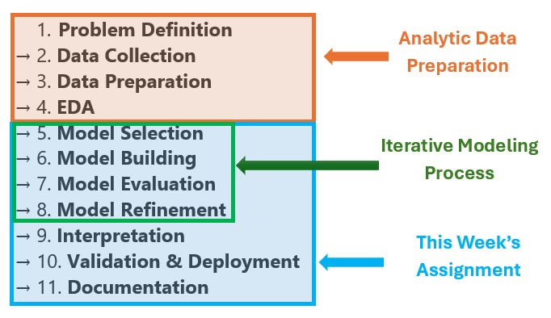

```{=html}

<style type="text/css">

/* Cascading Style Sheets (CSS) is a stylesheet language used to describe the presentation of a document written in HTML or XML. it is a simple mechanism for adding style (e.g., fonts, colors, spacing) to Web documents. */

h1.title {  /* Title - font specifications of the report title */
  font-size: 22px;
  font-weight: bold;
  color: DarkRed;
  text-align: center;
  font-family: "Gill Sans", sans-serif;
}
h4.author { /* Header 4 - font specifications for authors  */
  font-size: 18px;
  font-weight: bold;
  font-family: system-ui;
  color: navy;
  text-align: center;
}
h4.date { /* Header 4 - font specifications for the date  */
  font-size: 18px;
  font-family: system-ui;
  color: DarkBlue;
  text-align: center;
  font-weight: bold;
}
h1 { /* Header 1 - font specifications for level 1 section title  */
    font-size: 18px;
    font-family: "Gill Sans", sans-serif;
    color: navy;
    text-align: center;
    font-weight: bold;
}
h2 { /* Header 2 - font specifications for level 2 section title */
    font-size: 16px;
    font-family: "Gill Sans", sans-serif;
    color: navy;
    text-align: left;
    font-weight: bold;
}

h3 { /* Header 3 - font specifications of level 3 section title  */
    font-size: 14px;
    font-family: "Gill Sans", sans-serif;
    color: navy;
    text-align: left;
}

h4 { /* Header 4 - font specifications of level 4 section title  */
    font-size: 12px;
    font-family: "Gill Sans", sans-serif;
    color: darkred;
    text-align: left;
}

body { background-color:white; }

.highlightme { background-color:yellow; }

p { background-color:white; }

</style>
```

```{r setup, include=FALSE}
# code chunk specifies whether the R code, warnings, and output 
# will be included in the output files.
if (!require("knitr")) {
   install.packages("knitr")
   library(knitr)
}
if (!require("tidyverse")) {
   install.packages("tidyverse")
library(tidyverse)
}
if (!require("GGally")) {
   install.packages("GGally")
library(GGally)
}
knitr::opts_chunk$set(echo = TRUE,   # include code chunk in the output file
                      warning = FALSE,# sometimes, you code may produce warning messages,
                                      # you can choose to include the warning messages in
                                      # the output file. 
                      results = TRUE, # you can also decide whether to include the output
                                      # in the output file.
                      message = FALSE,
                      comment = NA
                      )  
```

\


<font color = "blue">*\color{blue}This is a comprehensive report on regression modeling that integrates previous assignments on exploratory data analysis (EDA), imputation, feature engineering, and this week's regression modeling with cross-validation.*</font>


\

<font color = "red"><b>Draft</b></font> a few sections based on the previous two reports to document the process and analyses that resulted in the analytic data set to be this week's **linear and logistic regression modeling using machine learning approaches**. 

Since statements of practical questions were not required in previous reports, you are now expected to formulate **two practical questions** based on the information available in the dataset. These questions should be designed to be addressed using **linear regression** and **logistic regression** models, respectively. The problem statement should be derived from these two practical questions.


**Regression Logical Process**: The following illustrates the logical process of any regression modeling.

```{r echo = FALSE, fig.align='center', out.width="40%"}

```

The previous two assignments covered the first few steps of the process that resulted in an analytic data set. We will use the analytic data to building regression model this week using machine approaches.

\

# New Contents 

You may want to open several sections and subsection to organize your analytic task on regression modeling in the final report. The data set should be the imputed data set through MICE procedure (the one generated in the first round).

**Some general requirements for regression modeling**

* **Model Selection**: Model selection must be based on cross-validation.

* **Performance Evaluation**: The performance of the logistic regression model must be evaluated using the optimal cut-off probability (i.e., it should not default to 0.5).

* **Report Outputs**: Only include the outputs of the final model that support your arguments in the report.

* **Formatting**: Avoid raw output tables. Instead, use `kable()` from the `knitr` library or `pander()` from the `pander` library for clean and professional formatting.


## 1. Linear Regression 

When performing linear regression analysis, consider the following key steps:

* **Develop meaningful and justifiable candidate linear models**: Construct multiple plausible models based on theoretical or empirical justification, ensuring they align with the research question and data structure.

* **Use cross-validation (CV) to select the final model**: Employ cross-validation techniques to evaluate and compare the candidate models, selecting the one with the best predictive performance and generalizability.

* **Report the performance of the final model on the hold-out test dataset**: Assess the final model's performance using metrics such as RMSE, MAE, or R² on an independent test set to ensure its reliability.

* **Present the final model explicitly**: Clearly define the final model, including its equation, coefficients, and any transformations or interactions used.

* **Provide discussions and recommendations**: Interpret the results, discuss their implications, and offer actionable recommendations based on the model's findings.

* **Use appropriate visuals to support your arguments**: Enhance your analysis with relevant visualizations, such as residual plots, coefficient plots, or performance comparison charts, to effectively communicate your results.


## 2. Logistic Regression 

Similar to the components in a linear regression model, you are expected to perform the following steps:

* **Develop Candidate Models**: Create several meaningful and justifiable candidate logistic regression models.

* **Model Selection**: Use cross-validation (CV) to select the final model.

* **Evaluate Models**: Generate ROC curves for the candidate models and calculate their corresponding areas under the ROC curve (AUCs).

* **Assess Performance**: Report the performance of the final model based on the hold-out test dataset.

* **Finalize the Model**: Present the final model explicitly, including identifying the optimal cut-off probability for future predictions.

* **Discussion and Recommendations**: Provide a detailed discussion of the results and offer actionable recommendations based on the findings.


## 3. Other Models (optional)

Some of you may have taken other modeling classes and might want to explore candidate models beyond the two indicated families of linear and logistic regression. I encourage you to consider additional models. If you decide to perform additional analyses, please pay attention to the following:

* **For Regression Models**: If your additional models are regression-based, ensure that the scale of the response variable is comparable to that used in the regression models you built earlier.

* **For Classification Models**: If your additional model is a classification model, you can follow the same logical process as you did for the logistic regression model.

* **Model Comparison**: The additional models must be compared with the models from the previous section using cross-validation (CV) and appropriate performance measures.


# Final Report Drafting and Submission

To ensure your comprehensive project report is polished and professional, follow these steps:

**1. Proofread for Consistency and Coherence**

* **Consistency**: Ensure that terminology, formatting, and style are uniform throughout the report. For example
  + Ensure consistent use of terms (e.g., if you use "regression analysis" in one section, don't switch to "statistical modeling" in another unless explicitly defined).
  + Check that figures, tables, and equations are labeled consistently (e.g., "Figure 1," "Table 2").

* **Coherence**: Verify that the ideas flow logically and that each section builds on the previous one. 
  + The introduction sets up the context and objectives clearly.
  + The analyses from the previous assignments are integrated seamlessly.
  + The regression analysis is explained in a way that connects to the broader project goals.
  + The conclusion summarizes key findings and ties everything together.

**2. Ensure Logical Progression**

Check the report template and project report rubrics posted in week #1.


**3. Submission**

Publish your report on GitHub, proofread the published report, ensure all figures are included, and verify that the layout remains unchanged before submitting the URL to D2L.


