```{=html}

<style type="text/css">

/* Cascading Style Sheets (CSS) is a stylesheet language used to describe the presentation of a document written in HTML or XML. it is a simple mechanism for adding style (e.g., fonts, colors, spacing) to Web documents. */

h1.title {  /* Title - font specifications of the report title */
  font-size: 24px;
  font-weight: bold;
  color: navy;
  text-align: center;
  font-family: "Gill Sans", sans-serif;
}
h4.author { /* Header 4 - font specifications for authors  */
  font-size: 18px;
  font-family: system-ui;
  color: navy;
  text-align: center;
  font-weight: bold;
}
h4.date { /* Header 4 - font specifications for the date  */
  font-size: 18px;
  font-family: system-ui;
  color: DarkBlue;
  text-align: center;
  font-weight: bold;
}
h1 { /* Header 1 - font specifications for level 1 section title  */
    font-size: 22px;
    font-family: "Times New Roman", Times, serif;
    color: navy;
    text-align: center;
    font-weight: bold;
}
h2 { /* Header 2 - font specifications for level 2 section title */
    font-size: 20px;
    font-family: "Times New Roman", Times, serif;
    color: navy;
    text-align: left;
    font-weight: bold;
}

h3 { /* Header 3 - font specifications of level 3 section title  */
    font-size: 18px;
    font-family: "Times New Roman", Times, serif;
    color: navy;
    text-align: left;
}

h4 { /* Header 4 - font specifications of level 4 section title  */
    font-size: 18px;
    font-family: "Times New Roman", Times, serif;
    color: darkred;
    text-align: left;
}

body { background-color:white; }

.highlightme { background-color:yellow; }

p { background-color:white; }

</style>
```

```{r setup, include=FALSE}
# code chunk specifies whether the R code, warnings, and output 
# will be included in the output files.
if (!require("knitr")) {
   install.packages("knitr")
   library(knitr)
}
if (!require("tidyverse")) {
   install.packages("tidyverse")
library(tidyverse)
}
if (!require("GGally")) {
   install.packages("GGally")
library(GGally)
}
if (!require("glmnet")) {
   install.packages("glmnet")
library(glmnet)
}
if (!require("caret")) {
   install.packages("caret")
library(caret)
}
if (!require("MASS")) {
   install.packages("MASS")
library(MASS)
}
if (!require("mlbench")) {
   install.packages("mlbench")
library(mlbench)
}
if (!require("pROC")) {
   install.packages("pROC")
library(pROC)
}
### 
knitr::opts_chunk$set(echo = TRUE,       
                      warning = FALSE,    
                      results = TRUE,    
                      message = FALSE,
                      comment = NA
                      )  
```

\

# Introduction

This note provides an overview of **statistical machine learning** and it's relation to **traditional machine learning**, **(traditional) statistics**, **data science**, **artificial intelligence**, and **computational mathematics**. The specific topics to be covered in this course will also be briefly described. There are many different machine learning algorithms running in practice for different tasks. To get a better big picture showing the landscape of machine learning, we will try to classify different algorithms into different categories according to different applications or learning approaches.


# What is Machine Learning?

Machine learning (ML) is the science (and art) of programming computers to learn from raw data using sophisticated algorithms and powerful computers and gradually improve the accuracy through large amount of data over time. It is classically considered as a branch of computer science.  


## ML Algorithm or Model?

In machine learning,  the **algorithm** and **model** are two slightly different concepts. <font color="red">**\color{red}The result of a machine learning algorithm is called a machine learning model**.</font>.

To be more specific, a **machine learning algorithm** is a <font color = "red">**\color{red}procedure**</font> that is run on data to create a **machine learning model**. The following examples explain the relationship between the two concepts.

* The linear regression algorithm (such as maximum likelihood or least square error estimation) results in a model comprised of a vector of regression coefficients with specific values. In other words, regression algorithms are used to estimate (learn) the unknown coefficients in the regression model.

* The decision tree algorithm (such as entropy minimization or information gain maximization) results in a model comprised of a tree of if-then statements with specific values of feature variables.

In practice, we use machine learning model and machine learning algorithm interchangeably. 


## ML Workflow

The Machine Learning workflow is roughly outline in the following.


```{r echo = FALSE, fig.align='center', out.width="90%", fig.cap="Machine learning algorithm workflow" }
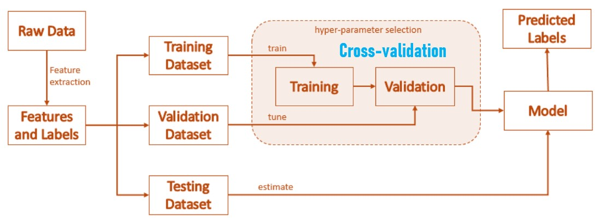
```

**Data Collection**:  The process begins with gathering data. This data can come from various sources like databases, sensors, or the internet.

**Data Preparation**: The collected data is cleaned and formatted to ensure it’s suitable for analysis. This step often involves handling missing values, removing duplicates, and normalizing data.

**Choosing a Model**: Depending on the problem, a suitable machine learning model is selected. Common models include linear regression, decision trees, and neural networks.

**Training the Model**: The model is trained using a subset of the data. During training, the model learns to recognize patterns by adjusting its parameters to minimize errors.

**Evaluation**: The model’s performance is evaluated using a separate set of data (validation set) to ensure it generalizes well to new, unseen data.

**Hyperparameter Tuning**: The model’s parameters are fine-tuned to improve its performance. This step involves adjusting settings like learning rate, number of layers in a neural network, etc.

**Prediction**: Once the model is trained and validated, it can make predictions or decisions based on new data.


## ML Glossary 

The following are the key terms in machine learning. Some the terms have analogous terms in traditional statistics.

**Training Example**: A row in the table representing the data set. Synonymous to an observation, training record, training instance, training sample (in some contexts, sample refers to a collection of training examples).

**Algorithm**: An algorithm is a set of well-defined instructions or rules that a computer follows to solve a problem or perform a task. In statistics and data science, algorithms are mathematical procedures or logical steps used to process data, identify patterns, and make predictions. Examples include Newton method, gradient descent, decision tree splitting rules, and backpropagation in neural networks, etc.


**Model**: A model is the result of applying an algorithm to a data set. It is the representation or encapsulation of the relationships identified in the data, typically used for making predictions or inferences. Examples include equations of regression models, piece-wise functions of a decision/regression trees, etc. 


**Hypothesis**: A hypothesis is a certain function that we believe (or hope) is similar to the true function, the target function that we want to model. Note that, in the machine learning field, the terms hypothesis and model are often used interchangeably.

**Classifier**: A classifier is a special case of a hypothesis (nowadays, often learned by a machine learning algorithm). A classifier is a hypothesis or discrete-valued function that is used to assign (categorical) class labels to particular data points.

**Training Data**: The data set used to *train* a machine learning model. The term *training a machine learning model* is equivalent to *estimating parameters* in the machine learning models.

**Test Data**: The data set used to evaluate the performance of a trained model. The model performance evaluated based on the test data is supposed to be close to the actual performance when the model is applied to the future new data.  

**Feature**: A feature in machine learning is an individual measurable property, variable, or characteristic of the data that is used as an input to a machine learning model.  

**Target**: ($y$) Synonymous to outcome, output, response variable, dependent variable,

**Label**: The output variable that the model is trying to predict. It is equivalent to response variable.

**Example**: In machine learning, an example refers to a single instance or data point in a data set. Each example contains input features and, optionally, a target output, depending on the type of problem being addressed. Examples are the building blocks of data sets and are used during training, validation, and testing of machine learning models.

**Loss function**: Often used synchronously with cost function; sometimes also called error function. In some contexts the loss for a single data point, whereas the cost function refers to the overall (average or summed) loss over the entire data set. Sometimes also called empirical risk

**Overfitting**: When a model learns the training data too well, including noise and outliers, and performs poorly on new data.

**Underfitting**: When a model is too simple to capture the underlying patterns in the data.


```{r echo = FALSE, fig.align='center', out.width="100%", fig.cap="Over-fitting vs under-fitting" }
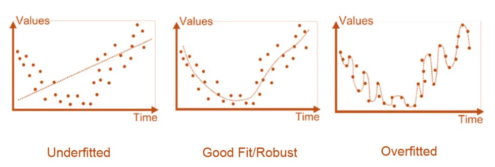
```


**Hyperparameters**: Parameters that are set before the learning process begins and control the behavior of the training algorithm.

**Cross-Validation**: A technique for assessing how the results of a statistical analysis will generalize to an independent data set.


# Categories of Machine Learning

Depending on the types of machine learning questions in specific applications, we can classify machine learning algorithms based on several criteria, such as the type of learning, the nature of the output, and the algorithm’s approach. 

## Machine Learning Styles and components

The style of a machine learning algorithm is determined based on the type of data used (labeled or unlabeled), the level of human supervision required during training, and the learning paradigm employed, which dictates how the algorithm learns patterns from the data to make predictions. Based on the learning style, machine learning can be classified into four categories.


**Supervised Learning**

Supervised Learning is a category of machine learning that uses labeled data sets to train algorithms to predict outcomes and recognize patterns. It is used primarily for the analytic task of regression, classification, and forecasting.  Supervised machine learning is compelling and provides excellent results when used in the right circumstances.

```{r echo = FALSE, fig.align='center', out.width="70%", fig.cap="Supervised learning: regression and classification" }
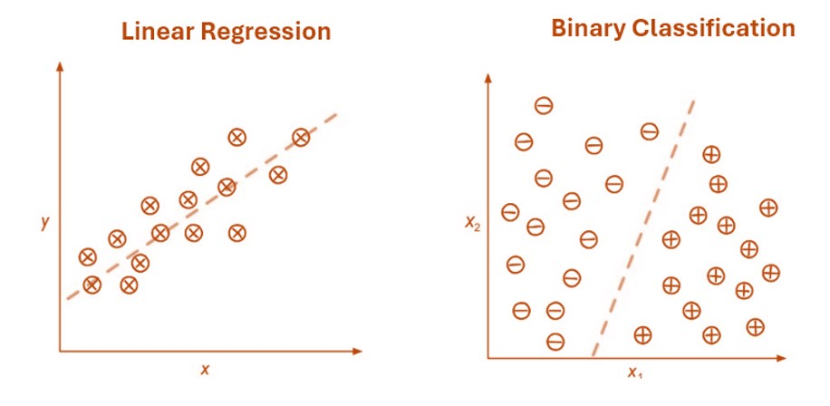
```


Statistical models such as linear, non-linear regression models, generalized linear regression models are under the umbrella of supervised learning methods. Some supervised learning methods that are not covered in the traditional statistics but can be considered as statistical methods include regression and classification tree, random forest, neural network, support vector machine, etc. 


**Unsupervised Learning**

Unsupervised Learning uses machine learning (ML) algorithms to analyze and cluster unlabeled data sets. The analytic tasks such as clustering and dimensionality reduction are under this umbrella. Traditional statistical methods such as principle component analysis, clustering method including mixture modeling are members of the family of unsupervised learning algorithms.

```{r echo = FALSE, fig.align='center', out.width="70%", fig.cap="Unsupervised learning: Clustering and model-based clustering" }
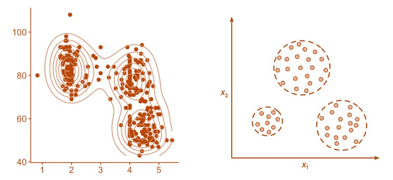
```


**Semi-supervised Learning**

Semi-supervised Learning combines supervised and unsupervised learning by using both labeled and unlabeled data to train algorithms and models for classification and regression tasks. The idea is to use predictive modeling approaches to predictive the examples (records) with no labels in the data and then perform the standard supervised analysis.

```{r echo = FALSE, fig.align='center', out.width="40%", fig.cap="Semisupervised learning illustration" }
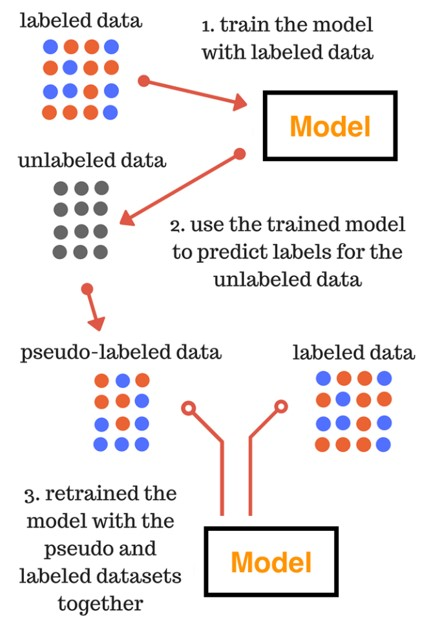
```


**Reinforcement Learning** 

Reinforcement Learning is a machine learning (ML) technique that trains software to make decisions to achieve the most optimal results. It mimics the trial-and-error learning process that humans use to achieve their goals. This learning style is not semi-supervised learning but between supervised and unsupervised learning. It is used mainly to perform sequential learning tasks such as automated robots, NLP, gaming, etc.

```{r echo = FALSE, fig.align='center', out.width="70%", fig.cap="Semisupervised learning illustration" }
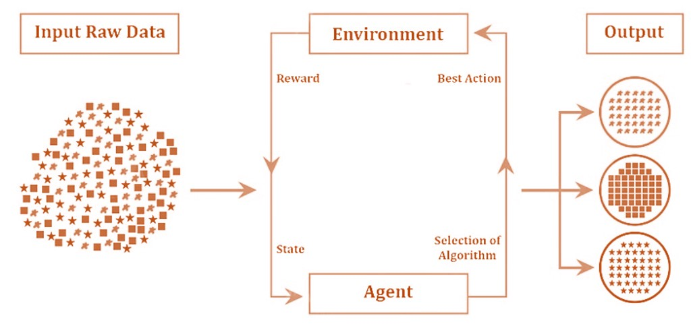
```


<font color = "red">*\color{red}Reinforcement learning is not widely used in statistical data analysis, we will not cover this topic in this applied statistical machine learning class.*</font>


 
## Generative and Discriminative Learning

A more technical classification of machine learning is based on the use of probability distribution of the underlying data.

**Generative Learning**

**Generative Models** learn the joint probability distribution of features and labels ($P(x, y)$), <font color = "red">*\color{red}allowing them to generate new data points*</font>. Some of the statistical generative models include Naive Bayes models and autoregressive models. 

**Discriminative Learning**

**Discriminative Models** directly learn the conditional probability of a label given features ($P(y|x)$), focusing solely on the decision boundary between classes to **classify** new data points. Most of the regression models are categorized into this category.


## Major Components of Machine Learning

The machine learning process involves several components: development, training, evaluation, and deployment of machine learning models. The next is brief description of these components

**Data Collection**: Gathering relevant and representative data to address the analytic problems formulated from practical questions using the machine learning model. The quality and quantity of data play a crucial role in any data analysis including machine learning process.

**Data Pre-processing**: Cleaning, transforming, and pre-processing the data to remove noise, <font color = "red">*\color{red}handle missing*</font> values, and converting it into a suitable format for training the model.

**Data Extraction**: Identifying the most important features or attributes in the data that helps to make accurate predictions. It is crucial for reducing the dimensionality of the data and focusing on the relevant information.

**Model Selection**: Choosing an appropriate machine learning algorithm or model that suits the specific problem. There are various types of models, such as linear regression, decision trees, support vector machines, neural networks, and more.

**Model Training**: Using the prepared data to train the selected model is done during the training phase. The model adjusts its structural parameters based on the input data and its corresponding correct output.

**Model Evaluation**: Assessing the performance of the trained model using evaluation metrics, such as accuracy, precision, recall, or F1-score, depending on the type of problem is carried out.

**Hyperparameter Tuning**: the model’s hyperparameters are modified (tuned, trial-and-error) to improve its performance. Hyperparameters are parameters set before training that control the learning process. Note that Hyperparameters are not estimated from loss function associated with the underlying machine learning algorithm.

**Model Deployment**: Once the model has demonstrated satisfactory performance on the evaluation set, it can make predictions on new, unseen data.

**Monitoring and Maintenance**: Continuously monitoring the model’s performance in the real-world scenario and updating it if needed to maintain accuracy and relevance.

\

# Statistical Machine Learning (SML)

Statistical machine learning (SML) is an interdisciplinary field that combines statistical modeling and machine learning techniques to analyze and infer patterns from data. It focuses on creating predictive models while maintaining a foundation in statistical theory to ensure interpretability and reliability. SML is particularly well-suited for applications where understanding uncertainty and making probabilistic predictions are crucial.

 

## Scopes and Applications

The scope of statistical machine learning is vast, encompassing theoretical advancements, practical applications, and interdisciplinary research. Key areas include:

**Supervised Learning** builds predictive models to estimate an output based on labeled data (i.e., with a clearly defined **response variable**). Supervised learning has been widely used in different industries such as *medical diagnosis* (predicting disease outcomes based on patient history) and *financial forecasting* (estimating stock prices or market trends). Examples of such models and algorithms include regression and classification.

**Unsupervised Learning** explores data without predefined labels (i.e., there is no response variable) to uncover hidden patterns. Application include *market segmentation* (identifying distinct customer groups), *image compression* (reducing dimensions in image data sets), *outlier detection* (detecting data points that significantly deviate from the majority of the data), etc. Commonly used models and algorithms include clustering, PCA, one-class SVM, etc.

**Regularization Techniques** are essential in machine learning to prevent overfitting, which occurs when a model learns the noise in the training data rather than the underlying pattern. It is a family of algorithms for feature selection without assuming the number of features to be retained in the final model. Such algorithms include Lasso, Ridge regression, elastic nets, etc.

**Bayesian Methods** incorporate **prior knowledge** and update beliefs with new data to improve the performance of inferences and predictions using probability distributions. This family of models and algorithms have been used in *spam filtering* (probabilistic filtering), *drug development* (Bayesian estimating treatment effects in clinical trials). The commonly used models and algorithms include Naive Bayes, Bayesian networks, Markov Chain Monte Carlo (MCMC), etc.

**Reinforcement Learning** learns optimal actions in dynamic environments. The applications can be found in robotics (enabling robots to adapt and learn tasks) and *gaming* (developing AI that outperforms humans in strategy games). *Reinforcement learning* is not commonly used in statistical modeling and data analysis.

**High-Dimensional Data Analysis** analyzes data with **more features than observations**, common in genomics and text analysis. The primary applications are in *gene expression* studies bioinformatics, natural language processing (NLP).


**Correlated Data and Time Series Analysis**  involve examining relationships between variables over time and understanding how they influence each other. These models and algorithms are widely used in fields such as finance, economics, healthcare, and environmental science. In addition to conventional models like autoregressive (AR) and moving average (MA) models, ARIMA (Autoregressive Integrated Moving Average, which combines AR and MA with differencing), and smoothing methods, recent years have seen the use of non-traditional methods such as neural networks (NN) algorithms for correlated and time series analysis.  


## SML for Modern Applied Statisticians

For statisticians looking to delve into machine learning, here are some fundamental methods that are particularly relevant. <font color = "red">*\color{red}These methods and algorithms will be covered in this course.*</font>

**1.	Single and Multiple Imputation**: Imputation involves filling in missing data within a data set. Missing values can significantly impact the performance of machine learning algorithms, so it’s essential to handle them appropriately. Probabilistic and model-based methods such as random placement, KNN, MI, and predictive modeling approach. We will focus on multiple imputation with an emphasis on the MICE (multiple imputation through chain equation) algorithm.

```{r echo = FALSE, fig.align='center', out.width="95%", fig.cap="Illustration of imputation of missing values" }
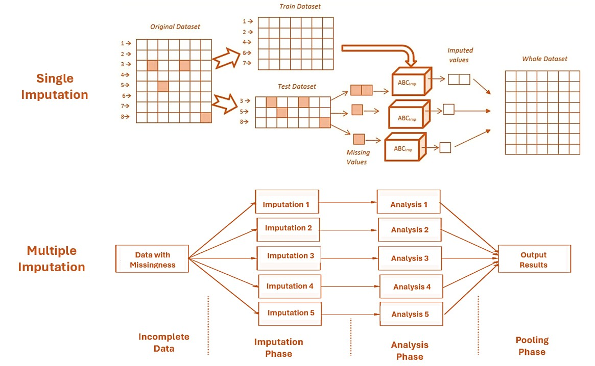
```


**2.	Methods of Feature Engineering**: Feature engineering involves engineering raw features into meaningful new features that improve the performance of machine learning models. Methods include encoding, imbalanced category regrouping, scaling, feature creation, and model-based transformation.

```{r echo = FALSE, fig.align='center', out.width="90%", fig.cap="Illustration of feature engineering" }
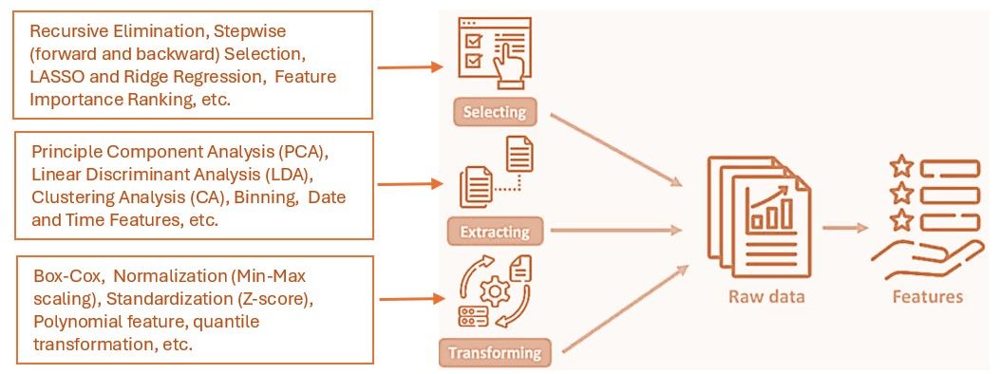
```


**3.	Methods of Cross-Validation**: A family of techniques for validating a pool of candidate models or algorithms that help to identify an optimal model/algorithm. It is commonly for model evaluation, selection and hyperparameter tuning.

```{r echo = FALSE, fig.align='center', out.width="99%", fig.cap="Illustration of cross validation" }
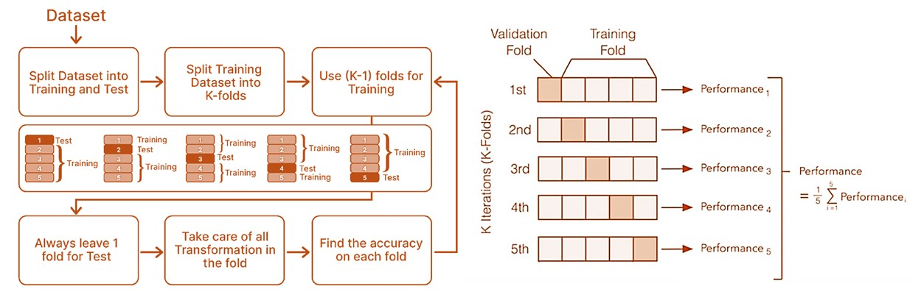
```


**4.	Linear and Nonlinear Regression**: In machine learning, linear and nonlinear regression models are primarily used for predicting continuous response based on a set of predictor variables without imposing restrictive distributional assumptions.


```{r echo = FALSE, fig.align='center', out.width="80%", fig.cap="Illustration of multiple linear regression modeling" }
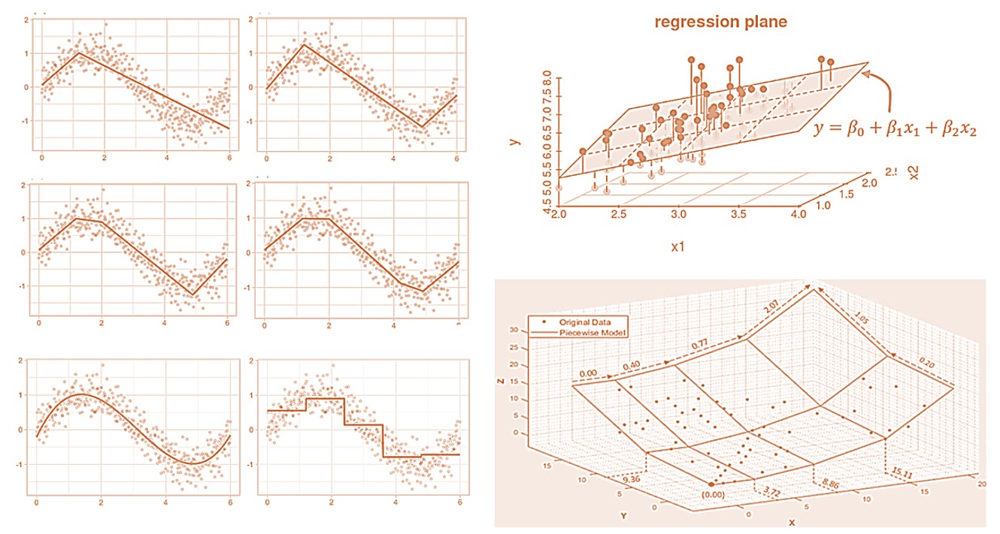
```


**5.	Generalized Linear Regression**: Used for classification problems. The most popular logistic regression models the probability of a binary outcome based on one or more predictor variables.

```{r echo = FALSE, fig.align='center', out.width="60%", fig.cap="Illustration of logistic regression modeling" }
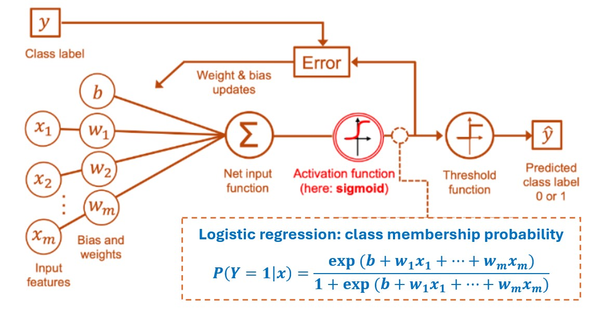
```


**6.	Decision Trees**: These are non-parametric models used for classification and regression. They split the data into subsets based on the value of input features, creating a tree-like model of decisions. The simple *piece-wise constant regression model* is considered as a special regression tree. 


```{r echo = FALSE, fig.align='center', out.width="80%", fig.cap="Illustration of decision tree model" }
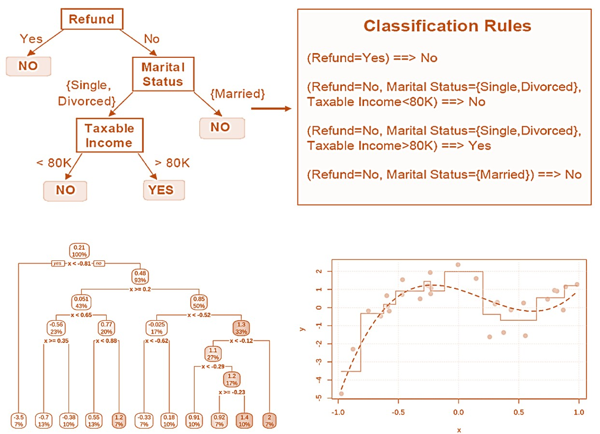
```

**7.	Bootstrap Aggregation (Bagging)**: An ensemble method that builds multiple decision trees and merges them to get a more accurate and stable prediction. It reduces overfitting and improves the model’s generalization.

```{r echo = FALSE, fig.align='center', out.width="80%", fig.cap="Illustration of bootstrap aggregation (BAGGING)" }
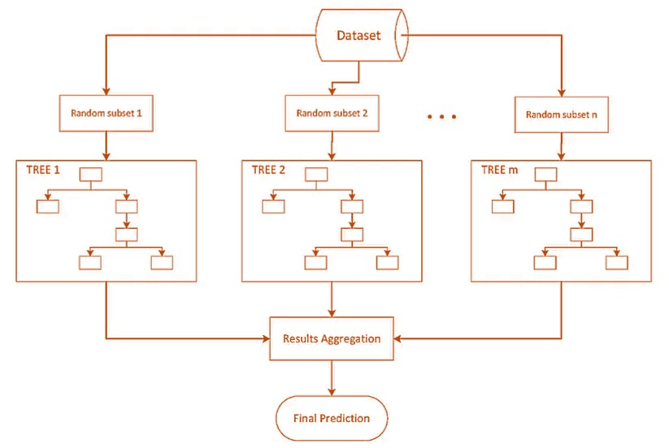
```

**8.	Support Vector Machines (SVM)**: SVMs are used for classification and regression tasks. They work by finding the hyperplane that best separates the data into different classes.

```{r echo = FALSE, fig.align='center', out.width="80%", fig.cap="Illustration of support vector machine (SVM)" }
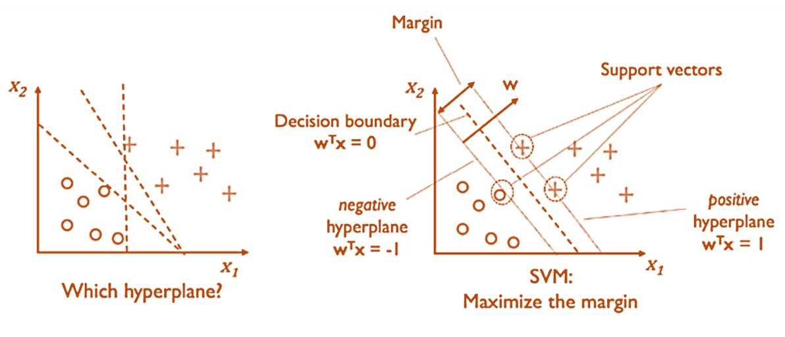
```

**9.	K-Means Clustering**: An unsupervised learning algorithm used to partition data into K clusters based on feature similarity. It helps in identifying patterns and grouping similar data points.

```{r echo = FALSE, fig.align='center', out.width="70%", fig.cap="Illustration of K-means clustering" }
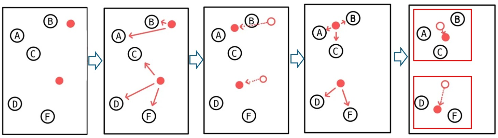
```

**10.	Principal Component Analysis (PCA)**: A dimensionality reduction technique that transforms data into a set of orthogonal components, capturing the most variance in the data. It’s useful for simplifying data sets and visualizing high-dimensional data.


```{r echo = FALSE, fig.align='center', out.width="100%", fig.cap="Illustration of principal component analysis" }
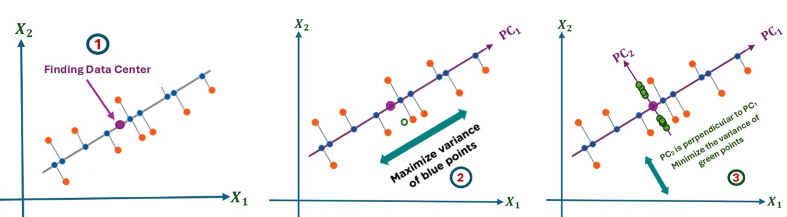
```


**11.	Neural Networks**: Inspired by the human brain, neural networks are used for a variety of tasks, including classification, regression, and pattern recognition. They consist of layers of interconnected nodes (neurons) that process data in a hierarchical manner.

```{r echo = FALSE, fig.align='center', out.width="60%", fig.cap="Illustration of single layer neural network: perceptron" }
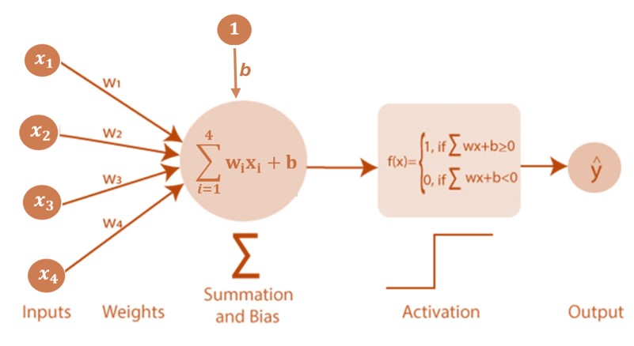
```


**12.	Bayesian Methods**: These methods apply Bayes’ theorem to update the probability of a hypothesis as more evidence or information becomes available. They are particularly useful for probabilistic modeling and inference.

```{r echo = FALSE, fig.align='center', out.width="70%", out.height="60%", fig.cap="Illustration of Bayes framework" }
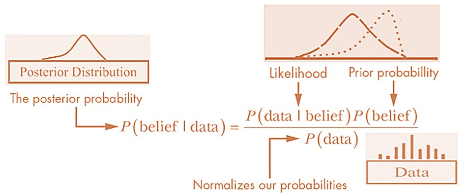
```


**13.	K-Nearest Neighbors (KNN)**: A simple, instance-based learning algorithm used for classification and regression. It predicts the output based on the closest training examples in the feature space. It can 

```{r echo = FALSE, fig.align='center', out.width="50%", out.height="35%", fig.cap="Illustration of K-earest neighborhood algorithm" }
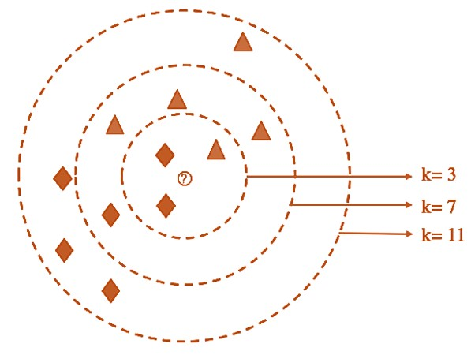
```


**14.	Ensemble Methods**: Techniques like bagging, boosting, and stacking combining multiple models to improve overall performance. Random forests and gradient boosting are examples of ensemble methods.

```{r echo = FALSE, fig.align='center', out.width="100%", fig.cap="Illustration of Ensemble learning methods" }
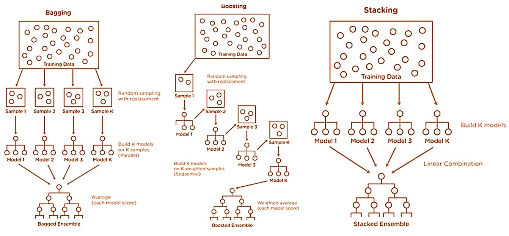
```

\

# R Resources for Machine Learning


Scikit-learn (often abbreviated as `sklearn`) is a popular Python library for machine learning, and it is **not natively available in R**. However, R has a rich ecosystem of packages for machine learning that can replicate most of Scikit-learn's functionality. Here are some key R packages and their Scikit-learn equivalents:


|     Scikit-learn Module	   |   R Equivalent    |
|:------------------------|:--------------------------------------------|
| Linear Models	| `glmnet` (Lasso, Ridge, Elastic Net), `lm` (linear regression)| 
| Classification	| `caret`, `e1071` (SVM), `randomForest`, `xgboost`, `rpart` (decision trees)| 
| Clustering	| `stats` (k-means, hierarchical clustering), `dbscan` (DBSCAN)| 
| Dimensionality Reduction	| `stats` (PCA), `Rtsne` (t-SNE), `umap` (UMAP)| 
| Model Selection	| `caret`, `mlr3` (cross-validation, hyperparameter tuning)| 
| Preprocessing	| `recipes` (feature scaling, encoding), `dplyr` (data manipulation)| 
| Metrics	| `Metrics` (e.g., RMSE, MAE, AUC), `caret` (confusion matrix, classification metrics)| 


Here are brief descriptions of various ML R libraries

* **caret**: A comprehensive package for training and evaluating machine learning models. It provides a unified interface for many algorithms (similar to Scikit-learn's fit/predict API).

* **mlr3**: A modern machine learning framework in R that supports a wide range of algorithms, preprocessing, and model evaluation.

* **glmnet**: For regularized linear models (Lasso, Ridge, Elastic Net).

* **randomForest**: For random forest models.

* **xgboost**: For gradient boosting (similar to Scikit-learn's XGBoost).

* **e1071**: For SVM and other statistical methods.

* **recipes**: For preprocessing and feature engineering (similar to Scikit-learn's Pipeline and ColumnTransformer).

* **reticulate**: If you need to use Scikit-learn specifically or have existing Python code, use the `reticulate` package to call Python from R.


\

# Some Interrelationships

Machine learning in on the intersection of several areas. This section describes interrelationship between machine learning and related areas involving data analysis and modeling.

## ML and Statistical Models

Machine learning (ML) and statistics are closely related fields, often overlapping in methods and applications.

* **Data Analysis**: Both fields involve analyzing data to uncover patterns and insights.

* **Modeling**: They use models to make predictions or inferences based on data.

* **Algorithms**: Many ML algorithms are based on statistical methods, such as linear regression and Bayesian inference1.


However, they have distinct goals and approaches. 

* **Statistics**:  Traditional statistics primarily focuses on drawing inferences about populations from sample data, emphasizing hypothesis testing and confidence intervals. It often relies on predefined models and assumptions about data distributions.

* **Machine Learning**: Traditional machine learning aims to create models that can make accurate predictions or decisions based on data, often prioritizing predictive accuracy over interpretability. It uses flexible, data-driven approaches, including neural networks and ensemble methods, which can handle large, complex data sets without strict assumptions.


|Feature|  Statistical Models |	Machine Learning Models |
|:-------|:--------------------|:------------------------|
|Purpose|Focus on relationships between variables and testing hypotheses.|Primarily concerned with making accurate predictions and uncovering patterns within the data.|
|Automation|Require more human effort in terms of programming and model specification.|Involve less manual intervention and more automation when learning from the data.|
|Assumptions|Rely on specific structural and distributional distributions to make inferences about population.|	Involve less assumptions and are more flexible.|
|scalability|lack of scalability and suitable for smaller and more manageable data sets.|Well-suited to large-scale and high-dimensional data environments.|


\

In essence, while statistics and machine learning have different philosophies and goals, they complement each other well. Statistics offers the tools for understanding and validating models, while machine learning provides advanced techniques for making accurate predictions and handling large data sets.


## ML and Data Science 

Data science and machine learning are closely related fields, often working hand-in-hand to analyze and interpret data. 

* **Data Science Uses Machine Learning**: Machine learning is one of the foundations of data science. Machine learning algorithms are used to build predictive models and uncover patterns in data. They also provide the tools for automating and enhancing data analysis.

* **Machine Learning Relies on Data Science**: **Machine learning models** require clean, well-prepared data to function effectively while **Data science** provides the methodologies for data pre-processing, feature engineering, and evaluation.

* **Complementary Goals**: While data science aims to extract actionable insights from data, machine learning focuses on creating models that can make accurate predictions. Together, they enable more informed decision-making and automation


|Feature	| Data Science	| Machine Learning |
|:----------|:----------------|:-----------------|
|Definition|using various techniques to extract insights and knowledge from data.|A subfield of AI and a foundation of data science|
|Purpose|	To uncover insights, patterns, and predictions from data.|To develop algorithms that enable computers to learn from and make decisions based on data.|
|Techniques| statistical analysis, machine learning, data visualization. |Supervised learning, unsupervised learning, reinforcement learning, etc.|


## ML and Data Analytics

**Data analytics** is a subset of data science that primarily deals with analyzing raw data in order to draw out meaningful, actionable insights, which are then used to inform and drive smart business decisions. It involves examining past data to understand what happened and why, what is likely to happen and  

**Common software tools** used in data analytics are Excel, SQL, data visualization software, and basic statistical techniques to analyze data.

The primary **data analytics tasks** typically focus on descriptive analytics and reporting, making them valuable for day-to-day business operations.


|Feature	| Data Analytics	| Machine Learning |
|:----------|:----------------|:-----------------|
|Purpose|Analyze historical data to make informed decisions.|Develop algorithms to enable computers to learn from and make decisions.|
|Techniques|Descriptive statistics, data visualization, business intelligence.|Supervised learning, unsupervised learning, reinforcement learning.|
|Skills Required|Analytical skills, statistical knowledge, data visualization.|	Programming, mathematics, statistics.|
|Applications|Business operations, market analysis, performance optimization.|Recommendation systems, fraud detection, predictive maintenance.|
|Software Tools|SQL, Tableau, Excel, etc.|	R, Python, SQL, etc.|
|Data Used|	Mostly structured data.|	Structured, semi-structured, unstructured data.|


## ML and Data Mining


**Data Mining** is the process of extracting new, accurate, useful patterns in the data and looking for meaning and relevant information for business decisions. It incorporates data management techniques and data analysis techniques. In other words, data mining needs machine learning but machine learning doesn’t necessarily need data mining. 


**Machine Learning** is the process of designing and developing algorithms for learning from data without human intervention making predictions or decisions. On the other hand, patterns and information uncovered in data mining will help design better machine learning algorithms.


**Common Ground**: Both data mining and machine learning fall under the umbrella of **Data Science**. Both processes are used for solving complex problems by employing the same critical algorithms for discovering data patterns. Consequently (and not surprisingly), many people (erroneously) use the two terms interchangeably. 

\


|      | Data Mining | Machine Learning|
|:-----|:------------|:----------------|
|Focus| Discovery of hidden patterns or knowledge from data | Development of algorithms that learn from data|
|Goal |Extract insights and information from existing data sets |Build models to make predictions or perform tasks|
|Usage |Identifying patterns, trends, and anomalies|Predictive modeling, classification, clustering, etc.|
|Input |Historical data or large data sets |Labeled or unlabeled data for training and testing |
|Output |Knowledge in the form of patterns or rules |Predictions, classifications, recommendations, etc. |
|Methods |Descriptive statistics, clustering, association rules |Decision trees, regression, neural networks, SVM, etc.|
|Scope |Broader in terms of analyzing various types of data |Focused on developing models for specific applications |


In summary, **data mining** focuses on the discovery of patterns in data sets or **gaining knowledge and insights** from data – often, this involves a heavy focus on computational techniques, working with databases, etc (nowadays, the term is more or less synonymous to “data science”). We can then think of machine learning algorithms as tools within a data mining project. **Data mining** is *not “just”* but also *emphasis* data processing, visualization, and tasks that are traditionally not categorized as **machine learning ** (for example, association rule mining).


# Choose Right ML Algorithms

We have briefly introduced a few most commonly used ML algorithms by applied statisticians. Although the algorithms that are not frequently used in data analysis are not covered in this course, there are still many algorithms being used in practice to solve various real-world problems. 

Identifying the right machine learning algorithm for particular applications is critical to produce good results. However, choosing appropriate algorithms from a collection of algorithms that can perform similar analytic tasks can be tricky. The following is a simple guide to help pick the right ML algorithms for specific tasks.


**Step 1: Problem Understanding**

It is crucial to have a clear and through understanding of the problem to be resolve before taking any analytic actions. There are three major types of analytic questions in real-world applications.

* **Classification**: Sorting items into categories e.g. disease severity: disease-free, mild disease, vs severe disease.

* **Regression**: Predicting numbers e.g. predicting insurance prices.

* **Clustering**: Grouping similar items together e.g. customer segments.

Knowing the problem types helps choose the right type of algorithms and improve the .


**Step 2: Data Size and Quality**

All algorithms and models are created based on certain (explicit and implicit) assumptions on the amount of information contains in the data. Knowing the data size and quality helps choose appropriate algorithms / models.

* **Small Data Sets**: Algorithms like k-Nearest Neighbors (k-NN) and Naive Bayes work well.

* **Large Data Sets**: Algorithms like Support Vector Machines (SVM) and neural networks are better but need more computing power.

* **High-Dimensional Data**: Algorithms like Principal Component Analysis (PCA) and Random Forests handle lots of features well.


**Step 3: Computational Resources**

Depending the structure of algorithms and models, some of them require model computational resources than the others. The availability computational resources is also a key consideration when choosing appropriate algorithms and models.

* **Limited Resources**: Simpler algorithms like Linear Regression, Logistic Regression, or Decision Trees use less computing power.

* **Ample Resources**: More complex algorithms like Gradient Boosting Machines (GBMs), Random Forests, and deep learning models can be used if you have powerful computers.


**Step 4: Algorithm/Model Interpretability**

Some algorithms and models are easier to interpret than the others. It is quite often to the reverse relationship between model interpretability and model performance. When selecting algorithms/models to perform an analytic task, we need to know whether the interpretability is more important than the accuracy of the underlying algorithms/models.

* **Need High Interpretability**: Algorithms like Linear Regression, Logistic Regression, and Decision Trees are easier to understand.

* **Need less Interpretability**: Algorithms like support vector machine (SVM), gradient boost machines (GBM), and deep learning models such as various deep neural networks are harder to interpret but might give better accuracy.


**Step 5: Test and Improve**

Finally, try different algorithms and refine them as per the results you get in your testing.

* **Benchmarking**: Start with a few simple models to set a performance baseline.

* **Hyperparameter Tuning**: Adjust the settings of your algorithms to get the best performance.

* **Cross-Validation**: Test your model on different data to ensure it works well.

* **Ensemble Methods**: Combine multiple algorithms to improve performance.


