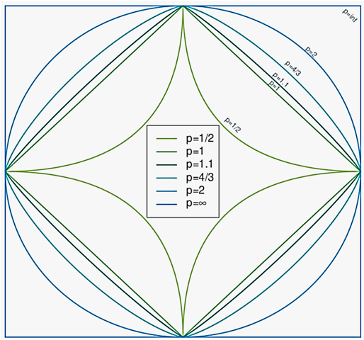
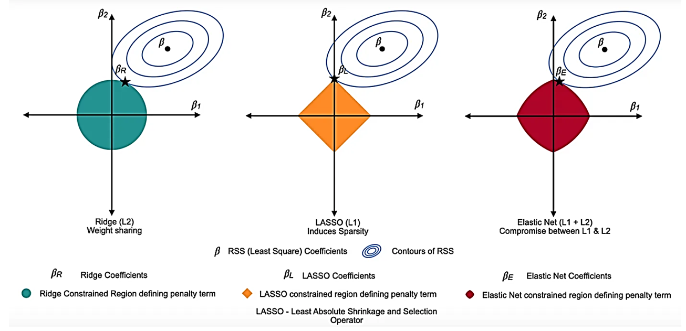

```{=html}

<style type="text/css">

/* Cascading Style Sheets (CSS) is a stylesheet language used to describe the presentation of a document written in HTML or XML. it is a simple mechanism for adding style (e.g., fonts, colors, spacing) to Web documents. */

h1.title {  /* Title - font specifications of the report title */
  font-size: 24px;
  font-weight: bold;
  color: navy;
  text-align: center;
  font-family: "Gill Sans", sans-serif;
}
h4.author { /* Header 4 - font specifications for authors  */
  font-size: 18px;
  font-family: system-ui;
  color: navy;
  text-align: center;
  font-weight: bold;
}
h4.date { /* Header 4 - font specifications for the date  */
  font-size: 18px;
  font-family: system-ui;
  color: DarkBlue;
  text-align: center;
  font-weight: bold;
}
h1 { /* Header 1 - font specifications for level 1 section title  */
    font-size: 22px;
    font-family: "Times New Roman", Times, serif;
    color: navy;
    text-align: center;
    font-weight: bold;
}
h2 { /* Header 2 - font specifications for level 2 section title */
    font-size: 20px;
    font-family: "Times New Roman", Times, serif;
    color: navy;
    text-align: left;
    font-weight: bold;
}

h3 { /* Header 3 - font specifications of level 3 section title  */
    font-size: 18px;
    font-family: "Times New Roman", Times, serif;
    color: navy;
    text-align: left;
}

h4 { /* Header 4 - font specifications of level 4 section title  */
    font-size: 18px;
    font-family: "Times New Roman", Times, serif;
    color: darkred;
    text-align: left;
}

body { background-color:white; }

.highlightme { background-color:yellow; }

p { background-color:white; }

</style>
```

```{r setup, include=FALSE}
# code chunk specifies whether the R code, warnings, and output 
# will be included in the output files.
if (!require("knitr")) {
   install.packages("knitr")
   library(knitr)
}
if (!require("tidyverse")) {
   install.packages("tidyverse")
library(tidyverse)
}
if (!require("GGally")) {
   install.packages("GGally")
library(GGally)
}
if (!require("glmnet")) {
   install.packages("glmnet")
library(glmnet)
}
if (!require("caret")) {
   install.packages("caret")
library(caret)
}
if (!require("MASS")) {
   install.packages("MASS")
library(MASS)
}
if (!require("mlbench")) {
   install.packages("mlbench")
library(mlbench)
}
if (!require("pROC")) {
   install.packages("pROC")
library(pROC)
}
if (!require("plotly")) {
   install.packages("plotly")
library(plotly)
}
if (!require("pander")) {
   install.packages("pander")
library(pander)
}
### 
knitr::opts_chunk$set(echo = TRUE,       
                      warning = FALSE,    
                      results = TRUE,    
                      message = FALSE,
                      comment = NA
                      )  
```

\

# Introduction

Regularized regression modeling is a sophisticated approach that extends traditional regression techniques by incorporating a penalty term into the loss function. This penalty term constrains the magnitude of the regression coefficients, thereby controlling the complexity of the model and mitigating the risk of overfitting. The most common forms of regularized regression include Ridge Regression, which applies an $L_2$ penalty to the sum of squared coefficients; LASSO, which uses an $L_1$ penalty to encourage sparsity by shrinking some coefficients to zero; and Elastic Net, which combines both $L_1$ and $L_2$ penalties to balance their respective advantages. These methods are particularly useful in scenarios where traditional regression models struggle, such as when dealing with high-dimensional data or multicollinearity among predictors.


The primary objectives of regularized regression are multifaceted. First and foremost, it aims to improve the generalization ability of regression models by reducing overfitting. This is achieved by penalizing large coefficients, which helps the model focus on the most important patterns in the data. Second, regularized regression seeks to handle multicollinearity by stabilizing coefficient estimates, making them more reliable even when predictors are correlated. Third, it facilitates feature selection, particularly with LASSO, by shrinking less important coefficients to zero, thereby simplifying the model and improving interpretability. Finally, regularized regression strikes a balance between bias and variance, introducing a controlled amount of bias to reduce variance and enhance the robustness of the model.

This note is dedicated to regularized regression modeling methods, which have been recently developed by statisticians and are now widely adopted in the machine learning community. The mathematical content will be kept to a minimum to facilitate a high-level technical understanding of these methods.


# $L_p$ Norm


One of the key mathematical terms used in regularized regression methods is the $L_p$ norm which defined as a **distance** between to points, $\mathbf{x}$ and $\mathbf{y}$ in a $d-$dimensional vector space with the following expression

$$
L_p(\mathbf{x} - \mathbf{y}) = \left[ \sum_{j=1}^d (x_j - y_j)^p\right]^{1/p} \stackrel{\text{defined}}{\equiv} ||\mathbf{x} - \mathbf{y}||_p.
$$
In the two dimensional vector space, $\mathbf{x} = (x_1, x_2)$ and $\mathbf{y} = (y_1, y_2)$, the the $L_2$ norm is simply the following Euclidean distance

$$
||\mathbf{x} - \mathbf{y}||_2 = \left[ (x_1-y_1)^2 + (x_2-y_2)^2\right]^{1/2} = \sqrt{(x_1-y_1)^2 + (x_2-y_2)^2}
$$

Similarly, $L_1$ norm of the above two points are given by

$$
||\mathbf{x} - \mathbf{y}||_1 = \left[ (x_1-y_1)^1 + (x_2-y_2)^1\right]^{1/1} = |x_1-y_1| + |x_2-y_2|
$$
The corresponding $L_{1/2}$ norm is given by

$$
||\mathbf{x} - \mathbf{y}||_{1/2} = \left[ (x_1-y_1)^{1/2} + (x_2-y_2)^{1/2}\right]^{2} = \left( \sqrt{x_1-y_1} + \sqrt{x_2-y_2}\right)^2,
$$

The following figure shows the geometry of various $L_p$ norms including the above the

```{r echo = FALSE, fig.align='center', out.width="40%", fig.cap = "The geometry of $L_p$ norm"}

```


\

# General Framework of Regularization

Recall that the equations for linear and logistic regression models with $k$ feature variables are given by, respectively

$$
y = \alpha_0 + \alpha_1 x_1 + \alpha_2 x_2 + \cdots + \alpha+k x_k
$$
and 

$$
P(Y=1) = \frac{\exp(\beta_0 + \beta_1 x_1 + \cdots + \beta_k x_k)}{1 + \exp(\beta_0 + \beta_1 x_1 + \cdots + \beta_k x_k)} \stackrel{\text{defined}}{\equiv} p
$$

The **loss function** (i.e., likelihood function) used to estimate the regression coefficients of linear and logistic regression models are given by respectively

$$
\text{LOSS}_{\text{linear}} = \sum_{i=1}^n (y_i - \hat{y}_i)^2
$$

and

$$
\text{LOSS}_{\text{logistic}} = \sum_{i=1}^n (y_i - \hat{y}_i)^2 -\frac{1}{n}\sum_{i=1}^n \left[  y_i\log(\hat{p}_i) + (1-y_i)\log(1-\hat{p}_i) \right].
$$

The **working loss functions** of commonly used regularized regression models are given by

* **L1 Regularization (Lasso Regression)**: Adds the absolute value of the coefficients as a penalty term to the loss function that <font color = "red">**shrinks some coefficients to zero**</font>, effectively performing feature selection. The actual loss function of the corresponding $L_1$-regularized linear and logistic regression models are given by respectively

$$
\text{LASSO}_{\text{linear}} = \text{LOSS}_{\text{linear}} + \lambda\sum_{j=1}^k |\alpha_j| \ \ \ \text{and} \ \ \ \text{LASSO}_{\text{logistic}} = \text{LOSS}_{\text{logistic}} + \gamma\sum_{j=1}^k |\beta_j| 
$$

The following geometry of the LASSO explains why it reduces dimension of the feature space (i.e., it drops feature variables mathematically)


* **L2 Regularization (Ridge Regression)**: Adds the squared magnitude of the coefficients as a penalty term to the loss function that Shrinks all coefficients <font color = "red"> **but does not set them to zero**</font>, reducing their impact. The loss functions of the regularized linear and logistic models are given by

$$
\text{LASSO}_{\text{linear}} = \text{LOSS}_{\text{linear}} + \lambda\sum_{j=1}^k |\alpha_j|^2 \ \ \ \text{and} \ \ \ \text{LASSO}_{\text{logistic}} = \text{LOSS}_{\text{logistic}} + \gamma\sum_{j=1}^k |\beta_j|^2 
$$

* **Lp Regularization ($1< p <2$) Elastic Net**: Combines L1 and L2 regularization. The loss functions of the regularized linear and logistic models are given by respectively

$$
\text{LASSO}_{\text{linear}} = \text{LOSS}_{\text{linear}}+ \lambda_1\sum_{j=1}^k |\alpha_j| + \lambda_2\sum_{j=1}^k |\alpha_j|^2 
$$

and

$$
\text{LASSO}_{\text{logistic}} = \text{LOSS}_{\text{logistic}} + \gamma_1\sum_{j=1}^k |\beta_j|  + \gamma_2\sum_{j=1}^k |\beta_j|^2 
$$

The geometry of the above regularized regression is depicted in a 2-dimensional feature space.

```{r echo = FALSE, fig.align='center', out.width="99%", fig.cap="The geometry of regularized regression in 2-dimensional feature space."}

```

The above contour plots (shown in blue) represent the surface of the original loss functions, which does have the regularization penalty term. The coordinates of the center points correspond to the estimates of the regression coefficients. The coordinates of the intersection between the contours of the original loss function and the regularized loss function represent the estimated coefficients of the underlying regularized regression model.


<font color = "red">**Important Remark**</font> **Regularization Techniques** such as `LASSO`, `Ridge`, and `Elasticnet` are only  different methods for estimating the regression coefficients (some of the regression coefficients original model may be dropped after performed some regularization techniques). In the next section, we use show the resulting regularized models with estimated regression coefficients  


\

# Regularization with R `glmnet`


The R library `glmnet` is primarily designed for implementing regularization techniques. It is often used in conjunction with the `caret` library to build and evaluate various regularized regression models. From a mathematical perspective, the optimization problem associated with regularized loss functions, which yield estimates of regression coefficients, can be viewed as a constrained maximization problem involving a Lagrange multiplier, denoted as $\lambda$. This Lagrange multiplier $\lambda$ acts as a hyperparameter and must be carefully tuned, typically through cross-validation, to achieve optimal model performance.


`glmnet` introduces a mixing parameter $\alpha$ to formulate a unified framework in the following form

$$
\text{LOSS}_{\text{regularization}} = \text{LOSS}_{\text{original}} + \lambda \left[ \frac{(1-\alpha)}{2}||\beta||_2^2 + \alpha ||\beta||_1.\right]
$$

That is, $\alpha = 1$ yields the LASSO regression and $\alpha = 0$ yields the ridge regression. All other values of $0 \le \alpha \le 1$ represents the **elastic net** regularized regression.


# Regularized Linear Regression

This section utilizes the widely-used Boston Housing data set (available in the R library `MASS`) to demonstrate how regularization linear regression can be applied to predict house prices in R. 

This dataset contains information collected by the U.S Census Service concerning housing in the area of Boston Mass. It was obtained from the StatLib archive (http://lib.stat.cmu.edu/datasets/boston), and has been used extensively throughout the literature to benchmark algorithms. However, these comparisons were primarily done outside of Delve and are thus somewhat suspect. The dataset is small in size with only 506 cases. A copy of the data set can be found at: <https://pengdsci.github.io/STA552/w07/BostonHousing.csv>

* CRIM - per capita crime rate by town
* ZN - proportion of residential land zoned for lots over 25,000 sq.ft.
* INDUS - proportion of non-retail business acres per town.
* CHAS - Charles River dummy variable (1 if tract bounds river; 0 otherwise)
* NOX - nitric oxides concentration (parts per 10 million)
* RM - average number of rooms per dwelling
* AGE - proportion of owner-occupied units built prior to 1940
* DIS - weighted distances to five Boston employment centres
* RAD - index of accessibility to radial highways
* TAX - full-value property-tax rate per $10,000
* PTRATIO - pupil-teacher ratio by town
* B - 1000(Bk - 0.63)^2 where Bk is the proportion of blacks by town
* LSTAT - % lower status of the population
* MEDV - Median value of owner-occupied homes in $1000's


For simplicity, we leverage functions from two popular R libraries, `glmnet` and `caret`, to implement the regularization techniques.


## Modeling Steps

The following are the basic steps in in the implementation

* Setting seed to guarantee reproducibility
* Random Data Splitting for training, cross-validation, and testing
* Standardizing feature variables <font color = "red">- this is extremely important in regularization!</font>
* building regularized linear regression models
* Predicting the response with the testing data set
* Evaluate the performance measure: root-mean-squared-error (RMSE)
* finding the optimal Lagrange multipliers through cross-validation
* reporting the final resulting regularized regression models (with estimated regression coefficients)

In next few subsections, we introduce the major steps to be considered in building regularized regression models.

### Coefficient Path Analysis

$\lambda$ is the regularization parameter in `glmnet()` that controls the strength of the penalty applied to the coefficients. A larger $\lambda$ shrinks the coefficients more aggressively, potentially reducing overfitting but increasing bias. A smaller $\lambda$ allows the model to fit the data more closely but may lead to overfitting.

We first examine how the hyperparameter $\lambda$ penalizes the regression coefficients and affects model fit. Coefficient path analysis and the plot of the goodness-of-fit measure (RMSE) are commonly used visual tools for model selection.


```{r}
set.seed(112233)    # remove the seed by using  set.seed(NULL)

# Load the dataset
data("Boston")
X <- as.matrix(Boston[, -14])  # Features (all columns except the target)
y <- Boston$medv  # Target variable (median house value)

# Split the data into training and testing sets
train_index <- createDataPartition(y, p = 0.8, list = FALSE)
X_train <- X[train_index, ]
X_test <- X[-train_index, ]
y_train <- y[train_index]
y_test <- y[-train_index]

# Standardize the data (important for regularization)
preprocess_params <- preProcess(X_train, method = c("center", "scale"))
X_train <- predict(preprocess_params, X_train)
X_test <- predict(preprocess_params, X_test)

## fitting the model
fit_lasso<- glmnet(X_train, 
                      y_train, 
                      alpha = 1)        # lasso regression 
fit_ridge <- glmnet(X_train, 
                    y_train, 
                    alpha = 0)          # Ridge regression
fit_elastic_net <- glmnet(X_train, 
                          y_train, 
                          alpha = 0.5)  # elastic net

## cross-validation
cv_lasso <- cv.glmnet(X_train, y_train, alpha = 1)   # lasso regression
cv_ridge <- cv.glmnet(X_train, y_train, alpha = 0)   # Ridge regression
cv_elastic_net <- cv.glmnet(X_train, y_train, alpha = 0.5)  # elastic net
```

```{r fig.align='center', fig.width=7, fig.height=6}
par(mar=c(5,4,6,3))
# Plot coefficient path
plot(fit_lasso, xvar = "lambda", label = TRUE,
     lwd = 1.5,
     main = "Coefficient Path Analysis: LASSO",
     cex.main = 0.9,
     col = rainbow(10))
abline(v = 1, col = "purple", lty = 4, lwd = 2)
abline(v = -1, col = "steelblue", lty = 2, lwd = 2)
```


The coefficient path plot illustrates how the value of $\lambda$ affects the degree of shrinkage applied to individual coefficients. The numbers at the top of the plot indicate the number of feature variables retained in the model for a given choice of $\lambda$. For instance, when $\log(\lambda)=1$, three variables remain in the model. By tracing the paths, we can identify the IDs of these three feature variables (i.e., 6, 11, and 13). The names of these variables can be retrieved using the R command `colnames(X_train)[c(6,11,13)]`, which yields `rm`, `ptratio`, and `lstat`.

Similarly, when $log(\lambda)= -1$, nine feature variables are retained in the model, with variable IDs: 6, 12, 4, 3, 1, 5, 8, 11, and 13. The corresponding variable names can be found using the command `colnames(X_train)[c(6,12,4,3,1,5,8,11,13)]`, which returns `rm`, `black`, `chas`, `indus`, `crim`, `nox`, `dis`, `ptratio`, and `lstat`.

Additionally, the plot demonstrates that as $\lambda$ increases, the regression coefficients shrink, and some of them converge to zero. This indicates that certain feature variables are dropped from the model as $\lambda$ becomes larger.


```{r fig.align='center', fig.width=7, fig.height=4}
par(mar=c(5,4,6,3))
##
plot(cv_lasso, main = "RMSE Plot: LASSO",
     cex.main = 0.9)
```

The above performance plot shows that as $\lambda$ increases, the MSE increases. The two vertical lines give the reference of the choice of $\lambda$. For avoid overfitting and underfitting, $\log(\lambda)$ should be between the two vertical lines.   

The performance plot above shows that as $\lambda$ increases, the MSE also increases. The two vertical lines indicate reference points for selecting $\lambda$. To avoid overfitting and underfitting, $\log(\lambda)$ should lie between these two lines.


## Tuning Regularization Parameter

The two values of $\lambda$ corresponding to the two vertical lines on the above plot of goodness-of-fit measure was calculated based on the cross validation. In `glmnet()`, 10-fold cross-validation was used to tune $\lambda$ in `cv.glmnet()`. This process is repeated for each fold, and the average prediction error (e.g., mean squared error for regression or deviance for classification) is computed for each lambda. With the 10-cross-validation, `cv.glmnet()` returns

* `lambda`: The sequence of lambda values tested.

* `cvm`: The mean cross-validated error for each lambda.

* `cvsd`: The standard error of the cross-validated error.

* `lambda.min`: The value of lambda that gives the minimum cross-validated error.

* `lambda.1se`: The largest value of lambda such that the error is within 1 standard error of the minimum. This is often used to select a more parsimonious model.

The two vertical lines on the above performance plot correspond to `lambda.min` and `lambda.1se`, respectively.


```{r}
# Cross-validation to find the best lambda
cv_lasso <- cv.glmnet(X_train, y_train, alpha = 1)
cv_ridge <- cv.glmnet(X_train, y_train, alpha = 0)
cv_elastic_net <- cv.glmnet(X_train, y_train, alpha = 0.5)
##
# Extract coefficients for the best lambda
best.lasso.lambda <- cv_lasso$lambda.min
best.ridge.lambda <- cv_ridge$lambda.min
best.elastic.net.lambda <- cv_elastic_net$lambda.min
##
# Lasso Regression (L1 Regularization): 
# CAUTION: model formula differs from the regular regression formula 
lasso_model.opt <- glmnet(X_train, 
                      y_train, 
                      alpha = 1,      # lasso regression 
                      lambda = best.lasso.lambda)   # useser selected alpha, optimal lambda
                                      # can be obtained through CV (see below)
lasso_predictions.opt <- predict(lasso_model.opt, 
                             s = best.lasso.lambda, # user selected lambda value 
                                      # (regularization paremeter)
                             newx = X_test)  # test data set 
# The following RMSE of prediction serves as a validation - one step validation
lasso_rmse.opt <- sqrt(mean((y_test - lasso_predictions.opt)^2))   
                                          
# Ridge Regression (L2 Regularization)
ridge_model.opt <- glmnet(X_train, y_train, alpha = 0, lambda = best.ridge.lambda)
ridge_predictions.opt <- predict(ridge_model.opt, s = best.ridge.lambda, newx = X_test)
ridge_rmse.opt <- sqrt(mean((y_test - ridge_predictions.opt)^2))

# Elastic Net (Combination of L1 and L2)
elastic_net_model.opt <- glmnet(X_train, y_train, alpha = 0.5, lambda = 0.1)
elastic_net_predictions.opt <- predict(elastic_net_model.opt, s = 0.1, newx = X_test)
elastic_net_rmse.opt <- sqrt(mean((y_test - elastic_net_predictions.opt)^2))

RMSE.opt = cbind(LASSO.opt = lasso_rmse.opt, 
                 Ridge.opt =  ridge_rmse.opt, 
                 Elasticnet.opt = elastic_net_rmse.opt)
pander(RMSE.opt)

```


## Extracting Final Model

Recall that the objective of regularized regression is to use the regularization techniques to estimate the regression coefficients. The outcome is the explicit regression equation for practical application. This subsection extracts the regression coefficients and write the regression function explicitly.

<font color = "blue">Note that the final model in regularized regression is dependent on the choice of the regularization parameter $\lambda$. The following final models are based on the value of $\lambda$ that gives the minimum cross-validated error, `lambda.min` trunded from `cv.glmnet()`.</font>


**LASSO Regression Equation**

The resulting LASSO regression equation is given by


```{r}
##lasso
# Extract coefficients for the best lambda
best_lambda.lasso <- cv_lasso$lambda.min
coefficients.lasso <- coef(cv_lasso, s = best_lambda.lasso)
# Reconstruct the model equation
intercept.lasso <- coefficients.lasso[1]
betas.lasso <- coefficients.lasso[-1]
#cat("Model equation: y =", round(intercept.lasso,4), "+", 
#paste(round(betas.lasso,4), colnames(X), sep = "*", collapse = " + "), "\n")
```

$$
\text{ Price} = 22.3381  -0.9642\times \text{crim} + 1.0654\times \text{zn}  -0.2763\times \text{indus} + 0.6528\times \text{chas} -1.7685\times \text{nox} 
$$
$$
+ 2.3679\times \text{rm} -0.0072\times \text{age} -2.9794\times \text{dis} + 2.3692\times \text{rad} -1.7409\times \text{tax} 
$$
$$
-1.9246\times \text{ptratio} + 0.9447\times \text{black} -3.5858\times \text{lstat} 
$$


**Ridge Regression Equation**


The resulting Ridge regression equation is given by

```{r}
##ridge
# Extract coefficients for the best lambda
best_lambda.ridge <- cv_ridge$lambda.min
coefficients.ridge <- coef(cv_ridge, s = best_lambda.ridge)
# Reconstruct the model equation
intercept.ridge <- coefficients.ridge[1]
betas.ridge <- coefficients.ridge[-1]
#cat("Model equation: y =", round(intercept.ridge,4), "+", 
#paste(round(betas.ridge,4), colnames(X), sep = "*", collapse = " + "), "\n")
```


$$
\text{price} = 22.3381  -0.8402\times \text{crim} + 0.8157\times \text{zn}  -0.5426\times \text{indus} + 0.7197\times \text{chas} -1.247\times \text{nox} $$
$$
+ 2.5183\times \text{rm} -0.1387\times \text{age} -2.3727\times \text{dis} + 1.3862\times \text{rad} -0.9517\times \text{tax} 
$$
$$
-1.7439\times \text{ptratio} + 0.9391\times \text{black} -3.2138\times \text{lstat}
$$


**ElasticNet Regression Equation**


The resulting ElasticNet regression equation is given by

```{r}
##ridge
# Extract coefficients for the best lambda
best_lambda.net <- cv_elastic_net$lambda.min
coefficients.net <- coef(cv_elastic_net, s = best_lambda.net)
# Reconstruct the model equation
intercept.net <- coefficients.net[1]
betas.net<- coefficients.net[-1]
#cat("Model equation: y =", round(intercept.net,4), "+", 
# paste(round(betas.net,4), colnames(X), sep = "*", collapse = " + "), "\n")
```

$$
\text{price} = 22.3381 -1.0027\times \text{crim} + 1.1069\times \text{zn} -0.2632\times \text{indus} + 0.6585\times \text{chas} -1.8166\times \text{nox} 
$$
$$
+ 2.3552\times \text{rm}  -0.0369\times \text{age}  -3.0683\times \text{dis} + 2.5507\times \text{rad}  -1.8915\times \text{tax} 
$$
$$
-1.9414\times \text{ptratio} + 0.9562\times \text{black}  -3.5733\times \text{lstat} 
$$


## Interaction and Polymoial 

Since `glmnet` defines the model using two components: design matrix and response matrix (vector), this means that we have to define interaction terms and high order polynomials of feature variables directly in the design matrix. The following example demonstrates how to include interaction term in regularized regression model using a built-in data set `mtcars`.

```{r}
data(mtcars)

# Prepare data
X <- as.matrix(mtcars[, c("hp", "wt")])  # Predictors
y <- mtcars$mpg  # Response

# Create interaction term
interaction_term <- X[, "hp"] * X[, "wt"]
X_with_interactions <- cbind(X, interaction_term)

# Fit glmnet model
fit <- glmnet(X_with_interactions, y, alpha = 1)  # this fits LASSO regression
# Extracts coefficients at lambda = 0.1
# 
#coef(fit, s = 0.1)    
# Cross-validation
cv_fit <- cv.glmnet(X_with_interactions, y, alpha = 1)

# Plot the cross-validation results for manually select the value of lambda
#plot(cv_fit)

# Best lambda value: automatically selected optimal lambda
best_lambda <- cv_fit$lambda.min
#print(best_lambda)

# Refit the model with the best lambda
final_model <- glmnet(X_with_interactions, y, alpha = 1, lambda = best_lambda)
coef(final_model, s = best_lambda)
```


\

# Regularized Logistic Regression

Implementing regularized logistic regression (LASSO, Ridge, and Elastic Net) using the `glmnet` package in R involves several steps.

* Setting seed to guarantee reproducibility
* Random Data Splitting for training, cross-validation, and testing
* Standardizing feature variables <font color = "red">- this is extremely important in regularization!</font>
* building regularized logistic regression models including cross-validation for $\lambda$
* Predicting the response with the testing data set using the default cut-off probability
* Evaluate the performance measure: confusion matrix
* Comparing candiate models and visualizing results
* Reporting the final resulting regularized regression models (with estimated regression coefficients)


Next, we us the popular **Pima Indian Diabetes** data set in R library `mlbench` to demonstrate the implementation of regularized logistic regression. The dataset is originally from the National Institute of Diabetes and Digestive and Kidney Diseases. The objective of the dataset is to diagnostically predict whether or not a patient has diabetes, based on certain diagnostic measurements included in the dataset. Several constraints were placed on the selection of these instances from a larger database. In particular, all patients here are females at least 21 years old of Pima Indian heritage.

The data sets consists of several medical predictor variables and one target variable, Outcome with 768 observations.

`pregnant` Number of times pregnant.

`glucose` Plasma glucose concentration (glucose tolerance test).

`pressure` Diastolic blood pressure (mm Hg).

`triceps` Triceps skin fold thickness (mm).

`insulin` 2-Hour serum insulin (mu U/ml).

`mass` Body mass index (weight in kg/(height in m)^2).

`pedigree` Diabetes pedigree function.

`age` Age (years).

`diabetes` Factor indicating the diabetes test result (neg/pos = 0/1).

The data set is also available at <https://pengdsci.github.io/STA552/w07/diabetes.csv>


The objective of performing logistic modeling is to predict diabetes based on variable risk factors. We will follow the above steps to perform three regularized logistic regression models. 


## Coefficient Path Analysis

In regularized regression, the coefficient path and measures of fit are essential tools for understanding model performance and selecting the optimal regularization parameter. 


```{r}
# loading related packages
# library(mlbench)
# library(glmnet)
# library(caret)
data("PimaIndiansDiabetes")
df <- PimaIndiansDiabetes

# Convert the response variable to a binary numeric variable
df$diabetes <- ifelse(df$diabetes == "pos", 1, 0)

# Split the data into predictors (X) and response (y)
X <- model.matrix(diabetes ~ ., df)[,-1]  # Remove the intercept column
y <- df$diabetes

# Split the data into training and testing sets
set.seed(123)
trainIndex <- createDataPartition(y, p = 0.8, list = FALSE)
X_train <- X[trainIndex, ]
X_test <- X[-trainIndex, ]
y_train <- y[trainIndex]
y_test <- y[-trainIndex]

####################
# Fit LASSO model
####################
lasso_model <- glmnet(X_train, y_train, family = "binomial", alpha = 1)

# Cross-validation to find the optimal lambda
cv_lasso <- cv.glmnet(X_train, y_train, family = "binomial", alpha = 1)

# Optimal lambda
lambda_lasso <- cv_lasso$lambda.min

# Refit the model with the optimal lambda
lasso_model_opt <- glmnet(X_train, y_train, 
                          family = "binomial", 
                          alpha = 1, 
                          lambda = lambda_lasso)
```

```{r fig.align='center', fig.width=8, fig.height=4}
## Visualize the impact of lambda on shrinking coefficients
# Plot coefficient paths
par(mar=c(5,4,6,2), mfrow=c(1,2)) # 
plot(lasso_model, xvar = "lambda", label = TRUE,
     col = rainbow(8),
     lwd = 1,
     main = "Coefficient Path Plot: LASSO",
     cex.main = 0.8)
text(-6, 0.4, "minimum CV error", col="red", cex = 0.6 )
abline(v = log(cv_fit$lambda.min), col = "red", lty = 4, lwd = 1)
abline(v = log(cv_fit$lambda.1se), col = "blue", lty = 4, lwd = 1)

plot(cv_lasso, main="Measure of Model Fit: LASSO", cex.main = 0.8)

```


First, since $\lambda$ in regularized regression models is typically a small positive number, a logarithmic scale was used for the coefficient path and performance fit plots. As $\lambda$ increases, we observe that the magnitude of the coefficients decreases (left panel), while the deviance (error) increases (right panel). The two vertical reference lines serve as guides for selecting an appropriate value of $\lambda$ in practical applications.


* A larger value of $\lambda$ can lead to potential underfitting, as more coefficients are shrunk toward zero (left panel), resulting in a larger error (right panel).

* A smaller value of $\lambda$ can lead to potential overfitting, as fewer coefficients are shrunk, allowing more to remain in the model, which results in a smaller error.


## Regularization Parameter Determination

To avoid potential issues of overfitting and underfitting, a cross-validation was used in `glmnet` to provide a range of suggested value for the regularization parameter $\lambda$: the minimum $\lambda$ to avoid overfitting and biggest $\lambda$ to avoid underfitting of the model.


```{r}
####################
# Fit Ridge model
####################
ridge_model <- glmnet(X_train, y_train, family = "binomial", alpha = 0)

# Cross-validation to find the optimal lambda
cv_ridge <- cv.glmnet(X_train, y_train, family = "binomial", alpha = 0)

# Optimal lambda
lambda_ridge <- cv_ridge$lambda.min

# Refit the model with the optimal lambda
ridge_model_opt <- glmnet(X_train, y_train, 
                          family = "binomial", 
                          alpha = 0, 
                          lambda = lambda_ridge)
```


```{r}
############################################
# Fit Elastic Net model (e.g., alpha = 0.5)
############################################
elastic_model <- glmnet(X_train, y_train, family = "binomial", alpha = 0.5)

# Cross-validation to find the optimal lambda
cv_elastic <- cv.glmnet(X_train, y_train, family = "binomial", alpha = 0.5)

# Optimal lambda
lambda_elastic <- cv_elastic$lambda.min

# Refit the model with the optimal lambda
elastic_model_opt <- glmnet(X_train, y_train, 
                            family = "binomial", 
                            alpha = 0.5, 
                            lambda = lambda_elastic)
```

```{r}
lasso.coef <- as.matrix(coef(lasso_model_opt))
ridge.coef <- as.matrix(coef(ridge_model_opt))
elastic.coef <- as.matrix(coef(elastic_model_opt))
regularized.coef <- data.frame(lasso = lasso.coef[,1],
                               ridge = ridge.coef[,1],
                          elasticnet = elastic.coef[,1])
pander(regularized.coef)
```


## Optimal Cut0ff Probability Determination


**Optimal Cut-off Probability Determination**

In order use the fitted model for predicting the label or classification, we need to identify the optimal cut-off probability instead of using the default cut-off probability of 0.5.


```{r}
#############################
# Predict on the test set: type = "class" uses the default 
# cut-off probability to be 0.5.
predict_lasso <- predict(lasso_model_opt, newx = X_test, type = "response")
predict_ridge <- predict(ridge_model_opt, newx = X_test, type = "response")
predict_elastic <- predict(elastic_model_opt, newx = X_test, type = "response")

###########################################
## Optimal cutoff probability determination
seq.cut <- seq(0,1, length=50)
# y is a vector of 0 and 1
acc.lasso <- NULL
acc.ridge <- NULL
acc.elastic <- NULL
for (i in 1:length(seq.cut)){
   predy.lasso <- ifelse(predict_lasso >seq.cut[i], 1, 0)
   predy.ridge<- ifelse(predict_ridge >seq.cut[i], 1, 0)
   predy.elastic<- ifelse(predict_elastic >seq.cut[i], 1, 0)
   ##
   acc.lasso[i] <- mean(y_test  == predy.lasso)
   acc.ridge[i] <- mean(y_test == predy.ridge)
   acc.elastic[i] <- mean(y_test  == predy.elastic)
}
## optimal cut-off: if the maximum accuracy occurs at multiple
## cut-off probabilities, the average of these cutoff probabilities
## will be defined as the optimal cutoff probability
opt.cut.lasso <- mean(seq.cut[which(acc.lasso==max(acc.lasso))])
opt.cut.ridge<- mean(seq.cut[which(acc.ridge==max(acc.ridge))])
opt.cut.elastic <- mean(seq.cut[which(acc.elastic==max(acc.elastic))])
##
acc.data <- data.frame(prob = rep(seq.cut,3), 
                       acc=c(acc.lasso, acc.ridge, acc.elastic), 
                       group = c(rep("lasso",50), rep("ridge",50), rep("elastic",50)))
```

```{r fig.align='center'}
##
gg.acc <- ggplot(data = acc.data, aes(x=prob, y = acc, color = group)) +
  geom_line() +
  annotate("text", x = 0.6, y = 0.45, 
           label = paste("LASSO cutoff: ", round(opt.cut.lasso,5), "Accuracy: ", round(max(acc.lasso),5), 
                         "\nRidge cutoff: ", round(opt.cut.ridge,5), "Accuracy: ", round(max(acc.ridge),5), 
                         "\nElastic cutoff: ", round(opt.cut.elastic,5), "Accuracy: ", round(max(acc.elastic),5)), 
           size = 3, 
           color = "navy") +
  ggtitle("Cut-off Probability vs Accuracy") +
  labs(x = "cut-off Probability", 
       y = "accuracy", color = "Group") +
  theme(plot.title = element_text(hjust = 0.5))

##
ggplotly(gg.acc)
```

The figure shows the optimal cutoff probabilities of the three regularized regression models.


**Local Performance Measures**

With the optimal cut-off probabilities of the corresponding three regularized logistic regression models, we now calculate the local performance measures based on their confusion matrices.


|                |Ref. Positive  | Ref. Negative  |
|:---------------|:--------------|:---------------|
|Pred. Positive  |   A        |     B     |
|Pred. Negative  |   C        |     D     |


Various local measures are summarized in the following

* Sensitivity  $\text{sen} = A/(A + C)$
* Specificity  $\text{spe} = D/(B + D)$
* Prevalence $\text{Prevalence} =(A + C)/(A + B + C + D)$
* Positive Predictive Value 

$$
\text{PPV} = \frac{\text{sen}\times \text{prevalence}}{\text{sen}\times \text{prevalence} + (1-\text{sen})\times (1-\text{prevalence})}
$$

* Negative Predicted Value

$$
\text{PPV} = \frac{\text{spe}\times (1-\text{prevalence})}{(1-\text{spe})\times \text{prevalence} + \text{spe}\times (1-\text{prevalence})}
$$

* Detection Rate $\text{DetectionRate = A/(A + B + C + D)}$

* Detection Prevalence $\text{DetectionPrevalence}=(A + B)/ (A + B + C + D)$

* Balanced Accuracy $\text{BalancedAccuracy} = (\text{sen} + \text{spe})/2$

* Precision $\text{Precision} = A/(A + B)$

* Recall $\text{Recall} = A/(A + C)$

* F1 Score $F1 = (1+\beta^2)\times \text{Precision}\times \text{Recall}(\beta^2\times \text{Precision} + \text{Recall})$

R function `confusionMatrix()` in library `caret` calculates the above local measures. 


```{r}
#######################################
## using the optimal cutoff probability to predict labels
## 
pred.lab.lasso <- ifelse(predict_lasso >opt.cut.lasso, 1, 0)
pred.lab.ridge<- ifelse(predict_ridge >opt.cut.ridge, 1, 0)
pred.lab.elastic<- ifelse(predict_elastic >opt.cut.elastic, 1, 0)


#################################
# Convert predictions to factors
pred.lab.lasso.fct <- as.factor(pred.lab.lasso)
pred.lab.ridge.fct <- as.factor(pred.lab.ridge)
pred.lab.elastic.fct <- as.factor(pred.lab.elastic)

# Convert actual values to factors
y_test <- as.factor(y_test)

# Confusion Matrix and Metrics
confusion.lasso <- confusionMatrix(pred.lab.lasso.fct, y_test)
confusion.ridge<- confusionMatrix(pred.lab.ridge.fct, y_test)
confusion.elastic <- confusionMatrix(pred.lab.elastic.fct, y_test)

## Commonly used performance measured
PerfMeasures <- cbind(lasso = confusion.lasso$byClass, 
                     ridge = confusion.ridge$byClass, 
                     elastic = confusion.elastic$byClass)
pander(PerfMeasures)
```


## ROC Analysis

To compare the performance of the three regularized logistic regression models (LASSO, Ridge, and Elastic Net) using ROC analysis, we can calculate the Area Under the Curve (AUC) and plot the ROC curves. The `pROC` package in R is particularly useful for this purpose.


```{r}
# library(pROC)
# Predicted probabilities for each model: type = "response"
prob_lasso <- predict(lasso_model_opt, newx = X_test, type = "response")
prob_ridge <- predict(ridge_model_opt, newx = X_test, type = "response")
prob_elastic <- predict(elastic_model_opt, newx = X_test, type = "response")

# Compute ROC curves: roc object contains a lot information including
# sensitivity, specificity, AUC, etc.
roc_lasso <- roc(y_test, prob_lasso)
roc_ridge <- roc(y_test, prob_ridge)
roc_elastic <- roc(y_test, prob_elastic)

# Compute AUC values
auc_lasso <- auc(roc_lasso)
auc_ridge <- auc(roc_ridge)
auc_elastic <- auc(roc_elastic)

## LASSO
sen.lasso <- roc_lasso$sensitivities
spe.lasso <- roc_lasso$specificities
auc.lasso <- roc_lasso$auc

## Ridge
sen.ridge <- roc_ridge$sensitivities
spe.ridge <- roc_ridge$specificities
auc.ridge <- roc_ridge$auc

## Elastic Net
sen.elastic <- roc_elastic$sensitivities
spe.elastic <- roc_elastic$specificities
auc.elastic <- roc_elastic$auc

## Plotting the ROC curves: three colors - green, orange, and purple

plot(1-spe.lasso, sen.lasso, 
     type = "l",
     col = "green", 
     xlim=c(0,1),
     xlab = "1 - specificity",
     ylab = "sensitivity",
     main = "ROC Curves for LASSO, Ridge, and Elastic Net")
lines(1-spe.ridge, sen.ridge, col = "orange")
lines(1-spe.elastic, sen.elastic, col = "purple")
abline(0,1, type = "l", lty = 2, col = "steelblue", lwd = 1)

# Add legend
legend("bottomright", legend = c(paste("LASSO (AUC =", round(auc_lasso, 3), ")"),
                                paste("Ridge (AUC =", round(auc_ridge, 3), ")"),
                                paste("Elastic Net (AUC =", round(auc_elastic, 3), ")")),
       col = c("green", "orange", "purple"), lty = 1, cex = 0.8, bty = "n")
```

The above ROC curves and the corresponding AUCs are similar to each other. That is, the three regularized regression performed equally well.


# Model Selection of Regularized Regression

If the candidate regularized regression models are equally well-performed, the following practical considerations are recommended when selecting the final model.

**Implementation**: If you are deploying the model in a production environment, consider the ease of implementation and maintenance. Lasso models are often easier to interpret and explain to stakeholders.

**Scalability**: For very large datasets, Lasso might be more scalable due to its sparsity.

**Regularization Path**: If you want to explore the entire regularization path (e.g., for visualization or analysis), all three methods (Lasso, Ridge, Elastic Net) support this, but Lasso and Elastic Net provide more interpretable paths due to feature selection.

The following table summarized some of the criteria to be considered in selecting the final working model from the equally well-performed regularized regression models.


|   Criterion   |	Lasso	     |   Ridge	  |    Elastic Net  |
|:-------------|:--------------|:------------------|:-------------------|
|	Feature Selection	|	Yes (sparse models)	|	No (retains all predictors)	|	Yes (sparse, but less than Lasso)|	
|	Multicollinearity	|	Handles moderately	|	Handles well	|	Handles well|	
|	Interpretability	|	High (fewer predictors)	|	Lower (all predictors retained)	|	Moderate|	
|	Computational |	Cost	|	Low	Low	|	Moderate|	
|	Use Case	|	High-dimensional data, feature selection	|	Multicollinearity, small datasets	|	Balanced approach, grouped predictors|	


# About Inference of Regularized Regression

Regularized regression is a technique used to prevent overfitting in statistical models, particularly in the context of linear regression. Overfitting occurs when a model learns the noise in the training data rather than the underlying pattern, leading to poor generalization on unseen data. Regularization introduces a penalty term to the loss function, which constrains the magnitude of the model's coefficients, thereby controlling the model's complexity.


**About the Inference of Regularized Regression**

Inference in regularized regression involves understanding the properties of the estimated coefficients and making statistical inferences about them. However, traditional methods of inference (e.g., p-values, confidence intervals) are not directly applicable due to the bias introduced by the regularization penalty.


* **Bias-Variance Tradeoff**:  Regularization introduces bias into the model to reduce variance, leading to better generalization. This tradeoff is crucial for model performance. 

* **Choice of Regularization Parameter ($\lambda$)**: The regularization parameter $\lambda$ controls the strength of the penalty. It is typically chosen via cross-validation to balance bias and variance.

* **Degrees of Freedom**: The effective degrees of freedom in regularized models are reduced due to the constraints imposed by the penalty term. This affects the model's complexity and the interpretation of results.

* **Post-Selection Inference**: After selecting variables using Lasso, traditional inference methods can be biased. Techniques like selective inference or bootstrap methods are used to make valid inferences.

* **Bayesian Interpretation**: Regularized regression can be viewed through a Bayesian lens, where the penalty term corresponds to a prior distribution on the coefficients. For example, Ridge regression corresponds to a Gaussian prior, and Lasso corresponds to a Laplace prior.


**Some Practical Considerations**

* **Standardization**: It is essential to standardize the predictors before applying regularization, as the penalty term is sensitive to the scale of the coefficients.

* **Computational Efficiency**: Efficient algorithms like coordinate descent are often used to solve the optimization problems in regularized regression.

* **Interpretability**: Regularized models, especially Lasso, can enhance interpretability by selecting a subset of relevant features.


In summary, regularized regression is a powerful tool for improving model performance and interpretability, but it requires careful consideration of the tradeoffs and appropriate methods for inference.


