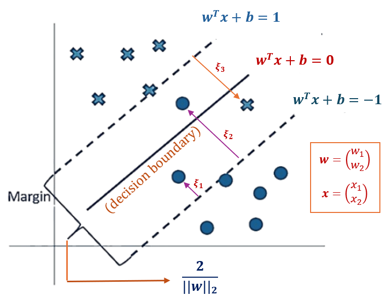

```{=html}

<style type="text/css">

/* Cascading Style Sheets (CSS) is a stylesheet language used to describe the presentation of a document written in HTML or XML. it is a simple mechanism for adding style (e.g., fonts, colors, spacing) to Web documents. */

h1.title {  /* Title - font specifications of the report title */
  font-size: 22px;
  font-weight: bold;
  color: DarkRed;
  text-align: center;
  font-family: "Gill Sans", sans-serif;
}
h4.author { /* Header 4 - font specifications for authors  */
  font-size: 18px;
  font-weight: bold;
  font-family: system-ui;
  color: navy;
  text-align: center;
}
h4.date { /* Header 4 - font specifications for the date  */
  font-size: 18px;
  font-family: system-ui;
  color: DarkBlue;
  text-align: center;
  font-weight: bold;
}
h1 { /* Header 1 - font specifications for level 1 section title  */
    font-size: 22px;
    font-family: "Times New Roman", Times, serif;
    color: navy;
    text-align: center;
    font-weight: bold;
}
h2 { /* Header 2 - font specifications for level 2 section title */
    font-size: 20px;
    font-family: "Times New Roman", Times, serif;
    color: navy;
    text-align: left;
    font-weight: bold;
}

h3 { /* Header 3 - font specifications of level 3 section title  */
    font-size: 18px;
    font-family: "Times New Roman", Times, serif;
    color: navy;
    text-align: left;
}

h4 { /* Header 4 - font specifications of level 4 section title  */
    font-size: 18px;
    font-family: "Times New Roman", Times, serif;
    color: darkred;
    text-align: left;
}

body { background-color:white; }

.highlightme { background-color:yellow; }

p { background-color:white; }

</style>
```

```{r setup, include=FALSE}
# code chunk specifies whether the R code, warnings, and output 
# will be included in the output files.
if (!require("knitr")) {
   install.packages("knitr")
   library(knitr)
}
if (!require("tidyverse")) {
   install.packages("tidyverse")
library(tidyverse)
}
if (!require("palmerpenguins")) {
   install.packages("palmerpenguins")
library(palmerpenguins)
}
if (!require("plotly")) {
   install.packages("plotly")
library(plotly)
}
if (!require("e1071")) {
   install.packages("e1071")
library(e1071)
}
if (!require("mmeln")) {
   install.packages("mmeln")
library(mmeln)
}
if (!require("MASS")) {
   install.packages("MASS")
library(MASS)
}
if (!require("ggplot2")) {
   install.packages("ggplot2")
library(ggplot2)
}
if (!require("plotly")) {
   install.packages("plotly")
library(plotly)
}
if (!require("caret")) {
   install.packages("caret")
library(caret)
}
##   # For data preprocessing
knitr::opts_chunk$set(echo = TRUE,   
                      warning = FALSE, 
                      results = TRUE, 
                      message = FALSE,
                      comment = NA
                      )  
```

\

# Introduction

Support Vector Machines (SVM) are a powerful and versatile set of supervised learning algorithms widely used for classification, regression, and outlier detection tasks. It is particularly well-suited for problems involving complex, high-dimensional data and is robust against overfitting.


**Binary Classification**: SVM is widely used to classify data into two distinct classes by finding the best decision boundary (hyperplane) that separates the classes with the maximum margin.

**Multi-class Classification**: SVM can handle multi-class problems by combining multiple binary classifiers using techniques like one-vs-one or one-vs-all.

**Regression (SVR - Support Vector Regression)**:  SVM can predict continuous outputs by finding a hyperplane that approximates the target variable within a margin of tolerance.

**Outlier Detection**: SVM can detect anomalies by identifying data points that deviate significantly from the main distribution.

SVM is a distribution-free method for both classification and regression. Linear support vector machines are commonly used in practice. However, depending on the complexity of the practical problems, non-linear SVMs are also frequently used.

This module focuses on linear SVM and its applications in regression and classification. The kernel SVM will also be introduced to handle nonlinear classification and regression problems.


# How SVM Works?   

To help gain an intuitive understanding of SVM, we consider the binary classification task of SVVM in two-dimensional feature space using a subset of the well-known iris data set.


```{r fig.align='center', fig.width=6, fig.height=6}
# iris data
iris0 <- iris[c(1:50, 101:150), c("Sepal.Length", "Sepal.Width","Species" )]
iris0 <-iris0[which(iris0$Sepal.Length> 5 & iris0$Sepal.Width>2.5),]
## support vectors
cvData = data.frame(xx=c(5.5,5.4,5.6,6.2), 
                    yy=c(3.5,3.4,2.8,3.4), 
                    pt=c("A", "B", "C", "D"))
##
svmgg <- ggplot(data = iris0, aes(x = Sepal.Length, y = Sepal.Width, color = Species)) +
         geom_point(shape=19,  size=3) + 
         geom_point(data =cvData, aes(x=xx, y=yy), shape =19, size=2, color = "darkred") +
         annotate("text", 
                  x = c(5.5,5.4,5.6,6.2)+0.04, 
                  y = c(3.5,3.4,2.8,3.4)-0.04, 
                  label = c("A", "B", "C", "D"),
                  size = 3.3,
                  color = "darkred") +
         scale_x_continuous(minor_breaks = seq(5, 8, 0.1)) +
         scale_y_continuous(minor_breaks = seq(2.5, 4.5, 0.1)) +
         geom_abline(intercept = 1, 
                     slope = 0.4, 
                     color="lightseagreen", 
                     linetype=1, 
                     size=0.5) +
         geom_abline(intercept = -6, 
                     slope = 1.7, 
                     color="indianred3", 
                     linetype=1, 
                     size=0.5) +
         geom_abline(intercept = -2.8, 
                     slope = 1, 
                     color="blue", 
                     linetype=2, 
                     size=0.75) +
         geom_label( label="L1: y = x - 2.8", 
                     x=7.3,
                     y=4.4,
                     label.padding = unit(0.25, "lines"), # Rectangle size around label
                     label.size = 0.15,
                     color = "blue",
                     fill="white" ) +
         geom_abline(intercept = -2, 
                     slope = 1, 
                     color="blue", 
                     linetype=2, 
                     size=0.75) +
         geom_label( label="L2: y = x - 2", 
                     x=6.1,
                     y=4.1,
                     label.padding = unit(0.25, "lines"), # Rectangle size around label
                     label.size = 0.15,
                     color = "blue",
                     fill="white" ) +
         # margin
         geom_segment(x = 5.9, y = 3.9, xend = 6.3, yend = 3.5,
                     arrow = arrow(length = unit(0.02, "npc"), ends = "both"),
                     color = "darkgreen", size = 0.85)  +
         # linear decision boundary
         geom_abline(intercept = -2.4, 
                     slope = 1, 
                     color="darkred", 
                     linetype=1, 
                     size=0.75) +
         geom_label( label="L3: y = x - 2.4", 
                     x=6.6,
                     y=4.25,
                     label.padding = unit(0.25, "lines"), # Rectangle size around label
                     label.size = 0.15,
                     color = "darkred",
                     fill="white" ) +  
         # annotation
         annotate(geom = "text", x = 6.05, y = 3.85, 
                  label = "Margin", 
                  color = "darkgreen",
                  size = 3.1,
                  angle = -42) +
         #
         geom_label( label="L4: y = 0.4x + 1", 
                     x=7.5,
                     y=4,
                     label.padding = unit(0.25, "lines"), # Rectangle size around label
                     label.size = 0.1,
                     color = "lightseagreen",
                     fill="white" ) +
          geom_label( label="L5: y = 1.7x - 6", 
                     x=6.1,
                     y=4.4,
                     label.padding = unit(0.25, "lines"), # Rectangle size around label
                     label.size = 0.05,
                     color = "indianred3",
                     fill="white" ) +
         ggtitle("Key Terms in SVM") + 
         theme( axis.line = element_line(size = .5, color = "red"),
                panel.grid.major = element_line(color = "gray", size = (.2)),
                panel.grid.minor = element_line(size = (0.2), color = "gray"),
                panel.background = element_blank(),
                plot.margin = unit(c(1,0,1,1), "cm"),
                plot.title = element_text(hjust=0.5,
                                          vjust = 5,
                                          family = "sans", 
                                          size = 16),
                legend.position = c(0.9, 0.45),
                legend.background = element_rect(fill="white",
                                                 size=0.5, 
                                                 linetype="solid", 
                                                 colour ="darkblue"),
                aspect.ratio=0.55)
svmgg
#ggplotly(svmgg)
```

**Feature Space**: A feature space is spanned by a set of feature variables (independent variable, predictor variable). In the above figure. The `dependent variable` (not considered as a feature variable) is `Species`. `Sepal.Length` and `Sepal.Width` are the two feature variables. The two-dimensional coordinate system shown in the above figure is called two-dimensional feature space. **The dimension of feature space is equal to the number of (uncorrelated) feature variables.** 

**Hyperplane**: The **hyperplane** is a decision boundary that separates classes in the feature space. In the above 2D figure, the `hyperplane` is any **straight line** that separates the two `Species`. In general, the dimension of a `hyperplane` in an n-dimensional `feature space` is $n-1$. 


**Margin**: The margin is the distance between the two **parallel** hyper-planes that separate the two classes of the response variable. In the above figure, the parallel hyperplanes $L1$ and $L2$ completely separate the two classes.

**Support Vectors**: Support vectors are the points **closest** to the decision boundary, <font color = "red">**not on it**</font>. These points are located on the margins that define the **maximum-margin hyperplane**. The decision boundary itself is positioned equidistant between these margins, and the support vectors are the data points that determine the margin width.

**SVM Algorithm**: Maximize the margin while minimizing misclassification errors.


# The Kernel Trick

**Kernels** are a fundamental concept in machine learning, particularly in algorithms like **Support Vector Machines (SVMs)**, **Kernel PCA**, and **Gaussian Processes**. They allow us to implicitly map data into a higher-dimensional space, enabling the modeling of complex, nonlinear relationships without explicitly computing the transformation.


## Kernel Function

A kernel is a function $K(x,y)$ that computes the similarity between two data points $x$ and $y$ in a high-dimensional space. The key idea is to avoid explicitly transforming the data into that high-dimensional space, which can be computationally expensive. Instead, kernels compute the **inner product** in that space directly. 


### Inner Product

For two vectors u and v in an inner product space, their inner product is denoted as:

$$
\langle \mathbf{u},\mathbf{v}\rangle
$$

The inner product must satisfy the following properties:

* Linearity: $\langle a\mathbf{u} + b\mathbf{v},\mathbf{w}\rangle=a\langle \mathbf{u},\mathbf{w} \rangle + b\langle \mathbf{v}, \mathbf{w}\rangle$

* Conjugate Symmetry: $\langle \mathbf{u},\mathbf{v}\rangle=\overline{\langle \mathbf{v},\mathbf{u}\rangle}$ 

* Positivity: $\langle \mathbf{u},\mathbf{u}\rangle \ge 0$, and $\langle \mathbf{u},\mathbf{v}\rangle=0$ if and only if $\mathbf{u}=\mathbf{0}.$


As an example, **dot product** in $\mathbb{R}^n$ is an inner product:

$$
\mathbf{u} = (u_1, u_2, \cdots, u_k), \  \  \mathbf{v} = (v_1, v_2, \cdots, v_k).
$$
The inner product (dot product) of $mathbf{u}$ and $\mathbf{v}$ is

$$
z = \langle \mathbf{u}, \mathbf{v} \rangle = u_1v_1 + u_2v_2 + \cdots + u_kv_k.
$$
Numerical example, $\mathbf{u} = (1,2)$ and $\mathbf{v} = (4,-5)$, then 

$$
z = \langle \mathbf{u}, \mathbf{v} \rangle = 1\times 4 + 2\times(-5)  = 4-10  = -6.
$$

### SVM Default RBF Kernel <font color = "red"><b>[Optional]</b></font>

Among the many available kernels, the RBF Kernel (Radial Basis Function), also known as the Gaussian kernel, is the most commonly used in practice. This kernel is highly popular because it can effectively handle both linear and non-linear decision boundaries in the original input space. The decision function $f(x)$, when evaluated over a grid of points in the input space, is mapped into a higher-dimensional feature space. This mapping creates a lifted surface, which represents the decision boundary in the transformed space.


Here, we derive the mathematical expression for the RBF-lifted surface and explain its components.

**1. RBF Kernel Function**

The RBF kernel is defined as

$$
K(\mathbf{x}_i, \mathbf{x}_j) = \exp\left( -\gamma ||\mathbf{x}_i - \mathbf{x}_j ||^2\right)
$$

where 

* $\mathbf{x}_i, \mathbf{x}_j$  are input feature vectors.
* $\gamma$ is the hyperparameter controlling the influence of each training sample.
* $||\mathbf{x}_i - \mathbf{x}_j ||^2$ is the squared Euclidean distance between $\mathbf{x}_i$ and $\mathbf{x}_j$. 


**2. SVM Decision Boundary**

The decision function for an SVM with the RBF kernel is:

$$
f(\mathbf{x}) = \sum_{i=1}^K\alpha_i y_i K(\mathbf{x}_i, \mathbf{x}) + b
$$

where

* $N$ is the number of support vectors (i.e., the points on the decision boundary).
* $\alpha_i$ are the **Lagrange multipliers** (<font color = "red">non-zero only for support vectors</font>).
* $y_i$ are class labels ($+1$, or $-1$).
* $b$ is the bias term.

Substituting the RBF kernel into the decision function, we get

$$
f(\mathbf{x}) = \sum_{i=1}^K\alpha_i y_i \exp\left(-\gamma ||\mathbf{x}_i - \mathbf{x}||^2\right) + b
$$

**3. RBF Lifted Surface**

The RBF lifted surface is the evaluation of the decision function $f(x)$ over a grid of points in the input space. For a 2D input space ($x=[x_1,x_2]$), the lifted surface is a 3D surface where:

* The $x_1$ and $x_2$ axes represent the input feature space.
* The z-axis represents the value of the decision function $f(x)$.

The mathematical expression of the lifted surface is

$$
z = f(x_1, x_2) = \sum_{i=1}^N \alpha_i y_i \exp\left(-\gamma [(x_1-x_{i1})^2+(x_2-x_{i2})^2]\right) + b.
$$

where

* $(x_{i1}, x_{i2})$ are the coordinates of the i-th support vector.
* $(x_{1}, x_{2})$ are the coordinates of a point in the input space.
* $\alpha_i$ are the **Lagrange multipliers** (<font color = "red">non-zero only for support vectors</font>).
* $y_i$ are class labels ($+1$, or $-1$).
* $b$ is the bias term.


**4. Visualizing the Lifted Surface**

To visualize the lifted surface

* Create a grid of points $(x_1, x_2)$ in the input space.
* Evaluate $f(x_1, x_2)$ at each grid point.
* Plot the surface $z=f(x_1, x_2)$ in 3D.

Graphical representation of RBF with 2D input feature space.

```{r echo = FALSE, fig.align='center', out.width="90%"}

```


### Other Common Kernel Functions

* **Linear Kernel**: This is the simplest kernel, which computes the dot product of the input vectors. It is used when the data is already linearly separable. The explicit form is given by

$$
K(x,y)=\mathbf{x}^T\mathbf{y}
$$

* **Polynomial Kernel**: This kernel computes the similarity between vectors using a polynomial function. The degree $d$ and the constant  $c$ are parameters that control the shape of the decision boundary. Its function is given by

$$
K(x,y)=(\mathbf{x}^T\mathbf{y}+c)^d
$$

* **Radial Basis Function (RBF) Kernel (Gaussian Kernel)**: This kernel is one of the most popular and is used when the decision boundary is expected to be highly nonlinear. The parameter $\sigma$ controls the width of the Gaussian.

$$
K(x,y)=\exp \left(-\frac{||\mathbf{x}-\mathbf{y}||^2}{2\sigma^2}\right) 
$$


* **Sigmoid Kernel**: This kernel is similar to the activation function used in neural networks and can be used in SVMs to create a decision boundary that resembles a neural network.

$$
K(x,y)=\text{tanh}(\alpha \mathbf{x}^T\mathbf{y}+c)
$$


## Applications of Kernel Functions

Kernel functions have been used in various applications in machine learning algorithms such as SVMs and PCAs. Here are a few benefits: 

* **Handling Nonlinearity**:  Kernels allow algorithms to learn complex, nonlinear relationships in the data by **implicitly** mapping the data to a higher-dimensional space where linear separation is possible. We will use an example to illustrate these applications in the next subsection.

* **Computational Efficiency**: Kernels enable the computation of inner products in high-dimensional spaces without explicitly computing the coordinates in that space, which can be computationally expensive.

* **Flexibility**: Different kernels can be chosen based on the specific problem and the nature of the data, allowing for a high degree of customization.


## A Simulated Demonstrative Example

We use an example to illustrate how to utilize a kernel function to lift a low-dimensional problem into a high-dimensional space in R. We'll use a simple example of classifying non-linearly separable data using a Support Vector Machine (SVM) with a kernel function.

### Visual Illustration

Suppose we have a dataset in 2D space that is not linearly separable. We can use a kernel function to map this data into a higher-dimensional space where it becomes linearly separable.

**Generate Non-linearly Separable Data**

We first generate 300 non-linearly separable data in 2D space using a bivariate normal distribution with mean vector $\mathbf{\mu}=c(10, 20)$ and variance-covariance matrix 

$$
\mathbf{\Sigma} = \begin{bmatrix} 
                        5  &  3 \\
                        3  &  6
                  \end{bmatrix}
                = \begin{bmatrix} 
                        (\sqrt{5})^2  &  \rho \sqrt{5}\sqrt{6} \\
                        \rho \sqrt{5}\sqrt{6}  &  (\sqrt{6})^2
                  \end{bmatrix},
$$

where $\rho = \sqrt{0.3}$. The corresponding density surface is given below.


```{r fig.align='center', fig.width=5, fig.height=5}
#library(MASS)
set.seed(123)
###
bvnData <- mvrnorm(
  n = 300,                      # sample size
  mu = c(10, 20),               # local mean vector
  Sigma = matrix(c(5, 3, 3, 6), ncol = 2)      # local covariate matrix
  )
#####
cols <- hcl.colors(10, "viridis")
#####
x10 <- bvnData[,1]
x20 <- bvnData[,2]
###
mu <- c(10, 20)                # global mean vector
sigma <- matrix(c(5, 3, 3, 6), ncol = 2)      # global covariate matrix   
ff <- function(x1, x2) dmnorm(cbind(x1, x2), mu, sigma)   # Density function
ff0 <- function(x1, x2) {0.025 + 0*x1 + 0*x2}   # Density function
###
### plot the points in the 2D feature space
y <- ifelse(ff(x10,x20) > 0.025, 1, 0)     # define the label of the 2D points
data <- data.frame(x1 = x10, x2 = x20, y = as.factor(y))  # y label
data0 <- data[data$y == 0, ]   # data with label 0
data1 <-data[data$y == 1, ]    # data with label 1
## Preparing plots of data points with label 0 and label 1 separately
x1.0 <- data0$x1   
x2.0 <- data0$x2   
x1.1 <- data1$x1
x2.1 <- data1$x2
### plot the bivariate surface
# Create a grid of points covering the feature space
grid_resolution <- 0.1          # grid size
x1_range <- seq(min(data$x1), max(data$x1), by = grid_resolution)
x2_range <- seq(min(data$x2), max(data$x2), by = grid_resolution)
# Convert to a matrix for plotly surface
z_matrix <- outer(x1_range,x2_range, ff)   # height of grid point on the surface
z0 <- outer(x1_range, x2_range, ff0)       # intersecting plane for obtaining curve 
                                           # decision boundary
# 3D Surface Plot
plot_ly(x = x1_range, 
        y = x2_range, 
        z = ~z_matrix, 
        type = "surface",
        contours = list( z = list(show = TRUE, 
                                   color = "white",       # set contour color
                                   width = 2,             # set contour thickness
                                  start = min(z_matrix ), 
                                  end = max(z_matrix ), 
                                  size = 0.0125)))   %>%
       layout(title = "Bivariate Scatter Plot",
              scene = list(xaxis = list(title = "x1"),
              yaxis = list(title = "x2"),
              zaxis = list(title = "Density")),
              showlegend = FALSE
         ) %>% hide_colorbar() 
```


The 2D scatter plot with points colored according to the labels is given below. 

```{r  fig.align='center', fig.width=5, fig.height=5}
###
plot(data$x1, data$x2, col = ifelse(data$y == 1, cols[10], cols[1]), pch = 19, main = "Original Data")
```

The yellow points in the middle cannot be separated by a straight line in the original two-dimensional feature space. However, by projecting the data into a three-dimensional space, they can be separated using a two-dimensional plane, forming a linear decision boundary, as illustrated in the following figure.


```{r fig.align='center', fig.width=5, fig.height=5}
#library(MASS)
#set.seed(123)
#######
## function to calculate the third coordinates of the bivariate density surface
ff <- function(x1, x2) dmnorm(cbind(x1, x2), mu, sigma) # Density function
### function to calculate the third coordinates of the intersecting plane
ff0 <- function(x1, x2) {0.025 + 0*x1 + 0*x2}   # Density function
#######
### plot the points in the 2D feature space
y <- ifelse(ff(x10,x20) > 0.025, 1, 0)     # define the label of the 2D points
### working data set
bn.data <- data.frame(x1 = x10, x2 = x20, y = as.factor(y))   # y is response label
### points with label y = 0
bn.data0 <- bn.data[bn.data$y == 0, ]
bn.x1.0 <- bn.data0$x1 
bn.x2.0 <- bn.data0$x2
### points with label y = 1
bn.data1 <-bn.data[bn.data$y == 1, ]
bn.x1.1 <- bn.data1$x1
bn.x2.1 <- bn.data1$x2
### plot the bivariate surface
# Create a grid of points covering the feature space
grid_resolution <- 0.1          # grid size
x1_range <- seq(min(bn.data$x1), max(bn.data$x1), by = grid_resolution)
x2_range <- seq(min(bn.data$x2), max(bn.data$x2), by = grid_resolution)
# Convert to matrix for plotly surface
## third coordinates of the bivariate normal density surface
z_matrix <- outer(x1_range,x2_range, ff)   # height of grid point on the surface
z0 <- outer(x1_range, x2_range, ff0)       # intersecting plane for obtaining curve 
##                                           # decision boundary
## 3D Surface Plot
plot_ly()    %>%
         # adding intersecting plane
         add_trace(x =  x1_range,    
                   y =  x2_range, 
                   z =  z0,
                   colors = "skyblue",
                   type="surface",
                   opacity = 0.5)   %>%
         # adding points with label y = 0
         add_trace(x = bn.x1.0,    
                   y = bn.x2.0, 
                   z = ff(bn.x1.0, bn.x2.0), 
                   mode = "markers", 
                   type = "scatter3d",#"scatter3d", 
                   marker = list(size = 3, 
                                 color = cols[1], 
                                 symbol = 104)) %>%
         # adding points with label y =1
         add_trace(x = bn.x1.1, 
                   y = bn.x2.1, 
                   z = ff(bn.x1.1, bn.x2.1),
                   mode = "markers", 
                   type = "scatter3d", 
                   marker = list(size = 3, 
                                 color = cols[10], 
                                 symbol = 104)) %>%
       layout(title = "Bivariate Scatter Plot",
              scene = list(xaxis = list(title = "x1"),
              yaxis = list(title = "x2"),
              zaxis = list(title = "Density")),
              showlegend = FALSE
         )%>% hide_colorbar() 
```

The nonlinear curve formed by the intersection of the 3D surface and the 2D plane represents the decision boundary. Its projection onto the original 2D feature space defines the nonlinear separation boundary.


### Kernel Density Estimation Approach

For the separation problem in a two-dimensional feature space, nonparametric density estimation methods can be used to estimate the density surface. The optimal nonlinear separation boundary can then be identified using the contours of the estimated density surface. Below is an example based on the same simulated data from the previous subsection.


```{r  fig.align='center', fig.width=5, fig.height=5}
surface = kde2d(bn.data$x1, bn.data$x2, n = 100)
plot_ly(x = surface$x, 
        y = surface$y,
        z = surface$z,
        type = "surface",
        contours = list( z = list(show = TRUE, 
                                   color = "white",       # set contour color
                                   width = 2,             # set contour thickness
                                  start = min(z_matrix ), 
                                  end = max(z_matrix ), 
                                  size = 0.0125)))   %>%
         # adding intersecting plane
         add_trace(x =  x1_range,    
                   y =  x2_range, 
                   z =  z0,
                   colors = "skyblue",
                   type="surface",
                   opacity = 0.5)  %>% hide_colorbar() 
```


We can see that the estimated density surface is slightly different from the true density surface of the bivariate normal distribution in the previous subsection. The following contour plot shows the potential nonlinear separation boundary.


```{r  fig.align='center', fig.width=5, fig.height=5}
#library(MASS)
####
#par(mfrow=c(1,2))
cols <- hcl.colors(10, "viridis")
plot(bn.data$x1, bn.data$x2, col = ifelse(bn.data$y == 1, cols[10], cols[1]), pch = 19,
     xlab = "x1", ylab = "x2", main = "Bivariate Kernel Density Estimated Surface with Contours")

contour(kde2d(bn.data$x1, bn.data$x2, n = 100), add = TRUE,
        level = 0.0125, lwd = 2, col = "purple4", cex = 2)
contour(kde2d(bn.data$x1, bn.data$x2, n = 100), add = TRUE,
        level = 0.025, lwd = 2, col = "gold", cex = 2)
```

The nonparametric approach offers flexible estimation but is subject to potential misspecification. <font color = "red">**In this illustrative example, a bivariate normal (Gaussian) kernel was used as a weighting function to compute the weighted average of all points, defining the density (moving average) in three-dimensional space**</font>. <font color = "blue">**However, in support vector machines (SVM), the Gaussian kernel serves a different purpose: it maps a lower-dimensional feature space to a higher-dimensional space, enabling the transformation of a nonlinear separation problem into a linear one.**</font>

\

### SVM with RBF Kernel 

We now use R `svm()` in the R library `e1071` to find the decision (separation) boundary of the above simulated data set.  

```{r  fig.align='center', fig.width=5, fig.height=5}
#library(e1071)
#library(ggplot2)

# Train SVM with RBF kernel
svm_model <- svm(y ~ ., data = bn.data, kernel = "radial", gamma = 1)
##
# Define a grid over the feature space
x1_range <- seq(min(bn.data$x1), max(bn.data$x1), length = 55)
x2_range <- seq(min(bn.data$x2), max(bn.data$x2), length = 55)
grid0 <- expand.grid(x1 = x1_range, x2 = x2_range)
####
#### Predict decision values
svm.pred <- predict(svm_model, grid0, decision.values = TRUE)
# turn over the surface for easier reading. add a negative sign to the pred values.
decision_values <- - attributes(svm.pred)$decision.values   
grid0$decision_values <- decision_values
zz_matrix <- matrix(grid0$decision_values, byrow = TRUE, ncol= length(x1_range))
#############
#############
### 3D data points plotting 
fitted.svm <- predict(svm_model, bn.data[,-3], decision.values = TRUE)
# reverse predicted z for data points
fitted.y.val <- - attributes(fitted.svm)$decision.values   
# data$fitted.y.val <- fitted.y.val
data.points <- data.frame(x1 = bn.data$x1, x2 = bn.data$x2, pred.y =fitted.y.val )

### plot the points in the 2D feature space
y <- ifelse(fitted.y.val  > 0, 1, 0)     # define the label of the 2D points
### working data set # y is response label
svm.data <- data.frame(x1 = x10, x2 = x20, zz = fitted.y.val, y = as.factor(y))   
### points with label y = 0
svm.data0 <- svm.data[svm.data$y == 0, ]
svm.x1.0 <- svm.data0$x1 
svm.x2.0 <- svm.data0$x2
svm.z.0 <- svm.data0$X0.1
### points with label y = 1
svm.data1 <-svm.data[svm.data$y == 1, ]
svm.x1.1 <- svm.data1$x1
svm.x2.1 <- svm.data1$x2
svm.z.1 <- svm.data1$X0.1
#############
### Separating plane
ff0 <- function(x1, x2) {0 + 0*x1 + 0*x2}   # Density function
z0 <- outer(x1_range, x2_range, ff0) 

###
# Extract specific contour (e.g., at level z = 0.5)
contour_data <- contourLines(x1_range, x2_range, zz_matrix, levels = 0)

# Convert contour data to a data frame
contour_df <- do.call(rbind, lapply(contour_data, function(cl) {
  data.frame(x = cl$x, y = cl$y, z = rep(0.5, length(cl$x))) # Constant z level
}))
############

## 3D Surface Plot
plot_ly(x = x1_range, 
        y = x2_range,
        z = zz_matrix, 
        type = "surface",
        contours = list( z = list(show = TRUE, 
                                  color = "brown",       # set contour color
                                  width = 4,             # set contour thickness
                                  #start = min(zz_matrix ), 
                                  #end = max(zz_matrix ), 
                                  levels = 0)))   %>%
#)    %>%
         # adding intersecting plane
         add_trace(x =  x1_range,    
                   y =  x2_range, 
                   z =  z0,
                   colors = "steelblue",
                   type="surface",
                   opacity = 0.5)   %>%
         # adding points with label y = 0
         add_trace(x = svm.x1.0,    
                   y = svm.x2.0, 
                   z = svm.z.0, 
                   mode = "markers", 
                   type = "scatter3d",#"scatter3d", 
                   marker = list(size = 3, 
                                 color = cols[1], 
                                 symbol = 104)) %>%
         # adding points with label y =1
         add_trace(x = svm.x1.1, 
                   y = svm.x2.1, 
                   z = svm.z.1,
                   mode = "markers", 
                   type = "scatter3d", 
                   marker = list(size = 3, 
                                 color = cols[10], 
                                 symbol = 104)) %>%
       layout(title = "SVM Predicted 3D Scatter Plot",
              scene = list(xaxis = list(title = "x1"),
              yaxis = list(title = "x2"),
              zaxis = list(title = "Density")),
              showlegend = FALSE
         ) %>% hide_colorbar() 

```


The nonlinear decision boundary is depicted in the following figure.


```{r  fig.align='center', fig.width=5, fig.height=5}
ggsvm <- ggplot(data, aes(x1, x2, color = y)) +
  geom_point(size = 2) +
  scale_color_manual(values = c("0" = cols[1], "1" = cols[10])) +
  labs(title = "SVM Classification with RBF",
       x = "X-axis",
       y = "Y-axis",
       color = "Category") +
  geom_contour(data = grid0, aes(x = x1, y = x2, z = as.numeric(decision_values)), 
               breaks = 0, color = "purple4") +
  theme_minimal()
ggplotly(ggsvm)
```


# Handing Categorical Features

The examples and illustrations of SVM discussed earlier are based on numerical features. When dealing with categorical features, we need to convert them into numerical representations. Below are some common techniques for handling categorical features in SVM.


## One-Hot Encoding
One-hot encoding converts each categorical feature into a binary vector, where each category is represented as a binary column.

An illustrative example in R:

```{r  echo = TRUE}
# Load necessary library
#library(e1071)  # For SVM
#library(caret)  # For data preprocessing

# Example dataset
data <- data.frame(
  feature1 = c("A", "B", "A", "C"),
  feature2 = c("X", "Y", "X", "Z"),
  target = c(1, 0, 1, 0)
)

# One-hot encoding
dummy <- dummyVars(" ~ .", data = data)
data_encoded <- data.frame(predict(dummy, newdata = data))
# View encoded data
print(data_encoded)
# Train SVM
#svm_model <- svm(target ~ ., data = data_encoded, kernel = "linear")
#summary(svm_model)
```

One-hot encoding is the most common method but can lead to high dimensionality for features with many categories.


## Label Encoding

Label encoding assigns a unique integer to each category. This is useful for ordinal categorical features.

An illustrative example in R:

```{r  echo = TRUE}
# Example dataset
data <- data.frame(
  feature1 = c("Low", "Medium", "High", "Low"),
  feature2 = c("Small", "Large", "Medium", "Small"),
  target = c(1, 0, 1, 0)
)

# Label encoding
data$feature1 <- as.numeric(factor(data$feature1, levels = c("Low", "Medium", "High")))
data$feature2 <- as.numeric(factor(data$feature2, levels = c("Small", "Medium", "Large")))

# View encoded data
print(data)

# Train SVM
#svm_model <- svm(target ~ ., data = data, kernel = "linear")
#summary(svm_model)
```

Label encoding is suitable for ordinal data but may introduce unintended ordinality for nominal data.


## Frequency Encoding

Frequency encoding replaces each category with its frequency in the dataset.

An illustrative example in R:

```{r  echo = TRUE}
# Example dataset
data <- data.frame(
  feature1 = c("A", "B", "A", "C"),
  feature2 = c("X", "Y", "X", "Z"),
  target = c(1, 0, 1, 0)
)

# Frequency encoding
freq_encoding <- function(column) {
  freq <- table(column)
  return(as.numeric(freq[column]))
}

data$feature1 <- freq_encoding(data$feature1)
data$feature2 <- freq_encoding(data$feature2)

# View encoded data
print(data)

# Train SVM
#svm_model <- svm(target ~ ., data = data, kernel = "linear")
#summary(svm_model)
```

Frequency encoding and target encoding are useful for reducing dimensionality but may lead to overfitting if not regularized.


## Target Encoding
Target encoding replaces each category with the mean of the target variable for that category. This is useful for supervised learning tasks.

An illustrative example in R:

```{r echo = TRUE}
# Example dataset
data <- data.frame(
  feature1 = c("A", "B", "A", "C"),
  feature2 = c("X", "Y", "X", "Z"),
  target = c(1, 0, 1, 0)
)

# Target encoding
target_encoding <- function(column, target) {
  mean_target <- tapply(target, column, mean)
  return(mean_target[column])
}

data$feature1 <- target_encoding(data$feature1, data$target)
data$feature2 <- target_encoding(data$feature2, data$target)

# View encoded data
print(data)

# Train SVM
#svm_model <- svm(target ~ ., data = data, kernel = "linear")
#summary(svm_model)
```


# SVM Classification Algorithms


Hard margin and soft margin are indeed core concepts in Support Vector Machines (SVM), and they determine how strictly the model enforces the separation of data points into their respective classes. They are central to understanding how SVMs handle linearly separable and non-linearly separable data. 


For ease of presentation, we use the linear SVM for classification as an example to explain the concept of soft and hard margins and the formulation of SVM.  Note that the distance between two parallel hyperplanes in a k-dimensional space, denoted by

$$
L_1: \  a_1 x_1 +a_2 x_2 + \cdots + a_k x_k + d_1 = 0
$$
and

$$
L_2: \  a_1 x_1 +a_2 x_2 + \cdots + a_k x_k + d_2 = 0,
$$

is given by

$$
|L_1L_2| = \frac{|d_2-d_1|}{\sqrt{a_1^2 + a_2^2 + \cdots + a_k^2}}
$$


##  Hard Margin SVM

Without loss of generality, we consider the linear separation problem in 2 dimensional feature space.

The goal is to find the hyperplane that maximizes the margin (the distance between the two **parallel hyperplanes** and the nearest data points from each class) while ensuring that all data points are correctly classified.  In the two dimensional feature space, the two **parallel hyperplanes** are denoted by respectively

$$
w_1x_1 + w_2 x_2 + b = +1  \  \  \text{and} \ \  w_1x_1 + w_2x_2 + b = -1.
$$

The coefficients of $x_1$ and $x_2$ of two expressions are identical because they are parallel. With the above *non-standard notation*,  `the hyperplane` $w_1x_1 + w_2 x_2 + b = +1$ is closer to the group with label **$y = +1$**, while $w_1x_1 + w_2 x_2 + b = -1$ is closer to the group with label **$y = -1$**. Consequently, $w_1x_1 + w_2 x_2 + b = +1$ is referred to as the **Positive Margin Hyperplane** and $w_1x_1 + w_2 x_2 + b = -1$ as the **Negative Margin Hyperplane**.


If we introduce the following column vector notations

$$
\mathbf{w} = \begin{bmatrix} 
                        w_1   \\
                        w_2  
                  \end{bmatrix}  \ \ \text{and} \ \ 
\mathbf{x}  = \begin{bmatrix} 
                        x_1 \\
                        x_2
                  \end{bmatrix},
$$

we can re-express in the following vector form

$$
 \mathbf{w^Tx} + b = 1  \  \  \text{and} \ \  \mathbf{w^Tx} + b = -1.
$$


Using the above notations, we summarize the positive and negative hyperplanes in the following figure.

```{r fig.align='center', out.width="60%"}

```

Based on the formula of distance between two parallel lines (i.e., the 2D hyperplanes), the problem of maximizing the margin $2/||\mathbf{w}||_2$ is expressed in the following equivalent expressions

$$
\max_{\mathbf{w},b}\frac{2}{||\mathbf{w}||^2_2} \rightarrow \max_{\mathbf{w},b}\frac{1}{||\mathbf{w}||^2_2} \rightarrow \min_{\mathbf{w},b}||\mathbf{w}||^2_2.
$$

That is, the above optimization problem is to estimate $\mathbf{w} = (w_1, w_2)$ and $b$ that **maximize** the margin $2/||\mathbf{w}||_2$ or **minimize** $||\mathbf{w}||_2$. This optimization will be performed using software programs such as R function `svm()` in R library `MASS`. 

Once $\mathbf{w} = (w_1, w_2)$ and $b$ are estimated from the data, the **center hyperplane** between the two parallel hyperplanes, **the desired decision boundary - $\mathbf{w^Tx} + b = 0$ **, is uniquely determined.


Finally, the objective function of maximizing hard-margin in SVM is given by

$$
\min_{\mathbf{w},b} ||\mathbf{w}||^2
$$

subjecting to the constraint that all data points are correctly classified

$$
y_i(\mathbf{w}^T\mathbf{x}_i + b) \ge 1 \ \ \text{for any} \ \ i. 
$$

where $y_i$ is the label of $i$-th data point taking values $+1$ or $-1$. 


\

## Soft Margin: C-classification


Soft margin SVM is used when the data is **not linearly separable** or contains noise. <font color = "red">It allows for some misclassification by introducing **slack variables ($\xi_i$)** that measure the degree of misclassification for each data point</font>. The goal is to maximize the margin while minimizing the sum of these slack variables.

```{r fig.align='center', out.width="60%"}

```

We can see from the above figure that $0 < \xi_1 < 1$ and $\xi_2, \xi_3 > 1$.


The estimation of the unknown parameters in the SVM algorithm is the following optimization.

$$
\min_{\mathbf{w},b} \left( ||\mathbf{w}||^2 + C\sum_{i=1}^n \xi_i\right)
$$

Subject to the constraint that all data points are correctly classified

$$
y_i(\mathbf{w}^T\mathbf{x}_i + b) \ge 1 - \xi_i \ \ \text{for any} \ \ i. 
$$

where $\xi_i \ge 0$ and  $y_i$ is the label of $i$-th data point taking values $+1$ or $-1$. $C$ is a regularization parameter that controls the trade-off between maximizing the margin and minimizing the classification error.


The **slack variable $xi_i$** is a measure of how much a point violates the hard margin constraint. 

* Correctly classified points outside the margin will have $\xi_i = 0$.

* Correctly classified points within the margin will have $0 < \xi_i < 1$.

* Misclassified points will have $\xi_i >1$.

The support vector machine based on maximizing soft margin is also called **C-Classification** to highlight the importance of the regularization parameter $C$.  


The regularization parameter $C$ in SVM is indeed a **hyperparameter** that needs to be tuned to achieve the best performance for a specific dataset. It is not something that is learned during training but rather set before training begins. 


* <font color = "blue">$C$ controls the penalty for misclassified or margin-violating data points in soft margin SVM.</font>
* <font color = "blue">A larger $C$ imposes a higher penalty for misclassifications, leading to a narrower margin and stricter classification (closer to hard margin SVM).</font>
* <font color = "blue">A smaller $C$ allows more misclassifications, resulting in a wider margin and a more flexible model.</font>


Proper tuning of $C$ is crucial because it directly influences the trade-off between maximizing the margin and minimizing classification errors.


## $\nu$ - Classification

Unlike C-classification SVM in which the trade-off between maximizing the margin and minimizing misclassification errors is controlled by the regularization parameter $C$, In $\nu$-SVM, the trade-off is controlled by the parameter $\nu$. The objective function is defined as

$$
\min_{\mathbf{w}, b, \mathbf{\xi}, \rho} \left( ||\mathbf{w}||^2 - \nu \rho +\frac{1}{N}\sum_{i=1}^N \xi_i\right)
$$
subjects constraints

$$
y_i(\mathbf{w}^T \mathbf{x}_i + b) \ge \rho - \mathbf{\xi}_i, \ \ \mathbf{\xi}_i \ge 0, \ \ \text{and} \ \ \rho > 0,
$$

where 

* $||\mathbf{w}||^2$ reflect the margin as in C-SVM,
* $-\nu \rho$ adjusts the margin  width $\rho$,
* $-\sum_{i=1}^N\xi_i/N$ penalizes misclassifications (slack variables $\xi_i$).

$\nu$ is the hyperparameter in $\nu$-classification SVM that needs to be tuned through various methods including cross-validation. It controls the fraction of margin errors and support vectors.

* $\nu \in (0,1]$
* A **small $\nu$** results in a wider margin but allows more misclassifications.
* A **large $\nu$** results in a narrower margin but allows fewer misclassifications.


## C-SVM v.s. $\nu$-SVM

There is a theoretical relationship between $C$-SVM and $\nu$-SVM. For a given dataset, there exists a mapping between $C$ and $\nu$ such that the solutions of C-SVM and $\nu$-SVM are equivalent. However, this mapping depends on the dataset and is not straightforward to compute.

C-SVM and $\nu$-SVM can produce the same result if:

* The parameters C and $\nu$ are chosen such that they correspond to the same trade-off between margin size and classification errors.

* The dataset and kernel are the same.

* The optimization algorithm converges to the same solution.

In practice, this equivalence is rarely exploited because $\nu$-SVM provides a more intuitive way to control the fraction of support vectors and errors, while C-SVM requires tuning C through cross-validation or other methods.


For the convenience of comparison, we make the following table to show the difference between the two support vector machines.


| 	| C-Classification	| $\nu$-Classification |
|:-------------|:---------------------|:----------------------|
|Hyperparameter	| Uses $C$ (cost parameter).	| Uses $\nu$ (nu parameter).|
|Interpretation	| $C$ controls the penalty for miss-classifications. | $\nu$ controls the fraction of support vectors and margin errors.|
|Range	| C can take any positive value (typically $C>0$). |	$\nu$ ranges between 0 and 1 ($0<\nu \le 1$).
|Focus	| Focuses on minimizing classification errors. |	Focuses on controlling the fraction of support vectors and margin errors.|
| Margin Control |	Fixed margin| 	Adaptive margin ($\rho$) |
|Interpretability |	Less intuitive |	More intuitive |
|Ease of Tuning |	Requires careful tuning of C to balance bias and variance.|	Easier to interpret, as $\nu$ directly relates to the fraction of support vectors.|
| Use Case |	General-purpose |	Tasks requiring control over support vectors |


$\nu$-SVM is a powerful and interpretable variant of SVM that provides explicit control over the fraction of support vectors and margin errors. Its intuitive parameterization and adaptive margin make it a valuable tool for classification, regression, and outlier detection tasks. 


\

## SVM with R

Support Vector Machines (SVM) are a popular set of machine learning algorithms used for classification, regression, and outlier detection. In R, several libraries provide implementations of SVM, each with its own features and capabilities. We will use two of the most commonly used libraries: `e1071` and `kernlab`.  A recently developed R library `caret` includes some of the R functions in the aforementioned libraries with some additional convenient functions for performing machine learning tasks. 

* **e1071**: General-purpose SVM for classification and regression tasks. It is one of the most widely used packages for SVM in R that Supports various kernel functions (linear, polynomial, radial basis, sigmoid) and provides tools for model tuning and cross-validation.
  + `svm()`: Fits an SVM model for classification, regression, or novelty detection.
  + `tune.svm()`: Performs hyperparameter tuning (e.g., cost, gamma) using grid search.


* **kernlab**: Advanced SVM tasks with custom kernels or specialized requirements. It is a comprehensive package for kernel-based machine learning, including SVM. It offers a wide range of kernel functions and is highly flexible.
  + `ksvm()`: Fits an SVM model with support for multiple kernel types.
  + `kernelMatrix()`: Computes the kernel matrix for custom kernels.

* **caret**: Streamlined SVM modeling with automated tuning and evaluation. It is a meta-package for machine learning that provides a unified interface for various models, including SVM. It uses `e1071` or `kernlab` under the hood and simplifies model training and evaluation and integrates with other machine learning workflows.
  + `train()`: Fits an SVM model with hyperparameter tuning and cross-validation.


