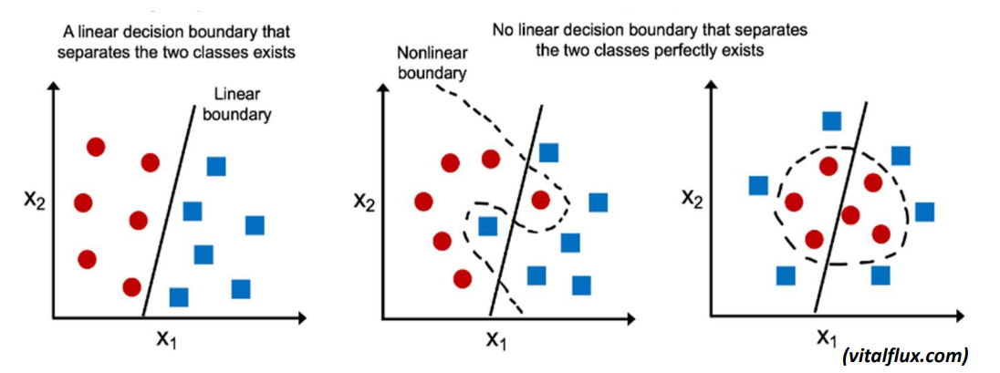
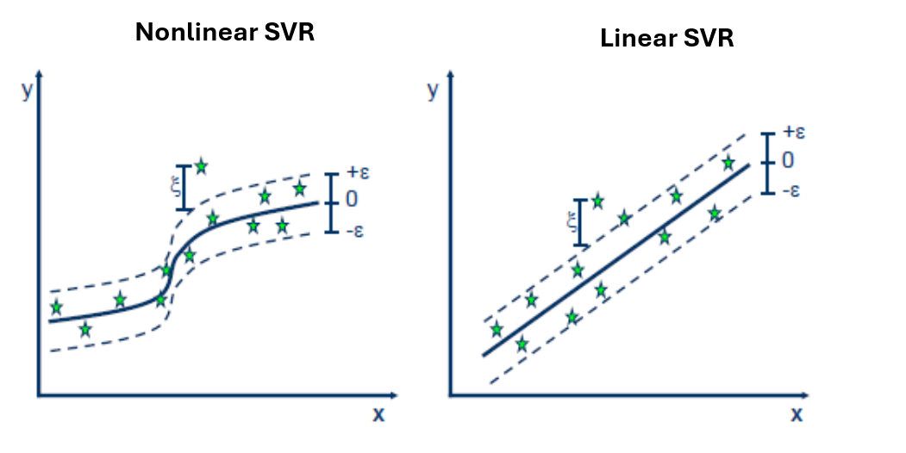
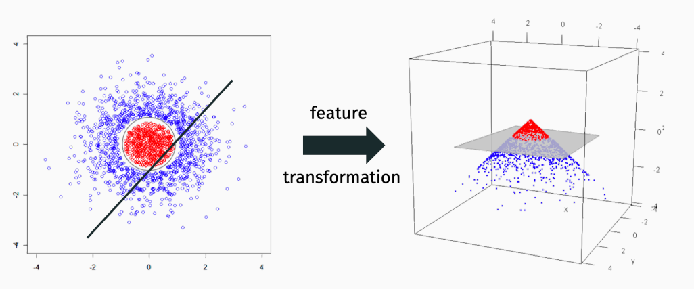
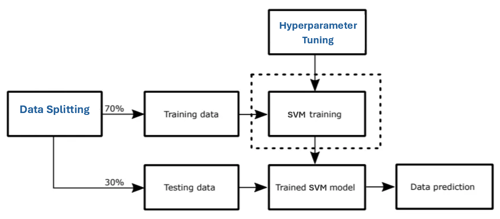
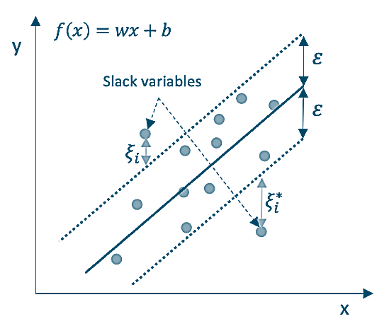
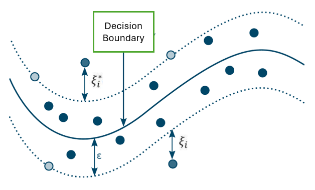

```{=html}

<style type="text/css">

/* Cascading Style Sheets (CSS) is a stylesheet language used to describe the presentation of a document written in HTML or XML. it is a simple mechanism for adding style (e.g., fonts, colors, spacing) to Web documents. */

h1.title {  /* Title - font specifications of the report title */
  font-size: 22px;
  font-weight: bold;
  color: DarkRed;
  text-align: center;
  font-family: "Gill Sans", sans-serif;
}
h4.author { /* Header 4 - font specifications for authors  */
  font-size: 18px;
  font-weight: bold;
  font-family: system-ui;
  color: navy;
  text-align: center;
}
h4.date { /* Header 4 - font specifications for the date  */
  font-size: 18px;
  font-family: system-ui;
  color: DarkBlue;
  text-align: center;
  font-weight: bold;
}
h1 { /* Header 1 - font specifications for level 1 section title  */
    font-size: 22px;
    font-family: "Times New Roman", Times, serif;
    color: navy;
    text-align: center;
    font-weight: bold;
}
h2 { /* Header 2 - font specifications for level 2 section title */
    font-size: 20px;
    font-family: "Times New Roman", Times, serif;
    color: navy;
    text-align: left;
    font-weight: bold;
}

h3 { /* Header 3 - font specifications of level 3 section title  */
    font-size: 18px;
    font-family: "Times New Roman", Times, serif;
    color: navy;
    text-align: left;
}

h4 { /* Header 4 - font specifications of level 4 section title  */
    font-size: 18px;
    font-family: "Times New Roman", Times, serif;
    color: darkred;
    text-align: left;
}

body { background-color:white; }

.highlightme { background-color:yellow; }

p { background-color:white; }

</style>
```

```{r setup, include=FALSE}
# code chunk specifies whether the R code, warnings, and output 
# will be included in the output files.
if (!require("knitr")) {
   install.packages("knitr")
   library(knitr)
}
if (!require("tidyverse")) {
   install.packages("tidyverse")
library(tidyverse)
}
if (!require("palmerpenguins")) {
   install.packages("palmerpenguins")
library(palmerpenguins)
}
if (!require("plotly")) {
   install.packages("plotly")
library(plotly)
}
if (!require("e1071")) {
   install.packages("e1071")
library(e1071)
}
if (!require("mmeln")) {
   install.packages("mmeln")
library(mmeln)
}
if (!require("MASS")) {
   install.packages("MASS")
library(MASS)
}
if (!require("ggplot2")) {
   install.packages("ggplot2")
library(ggplot2)
}
if (!require("plotly")) {
   install.packages("plotly")
library(plotly)
}
if (!require("caret")) {
   install.packages("caret")
library(caret)
}
if (!require("pROC")) {
   install.packages("pROC")
library(pROC)
}
if (!require("pander")) {
   install.packages("pander")
library(pander)
}
##   
knitr::opts_chunk$set(echo = TRUE,   
                      warning = FALSE, 
                      results = TRUE, 
                      message = FALSE,
                      comment = NA
                      )  
```

\


# Introduction

This note systematically introduces the SVM classification and regression. In the previous note, we introduced concepts of hard and soft margins, kernel trick, and illustrations of linear and nonlinear SVMs. 

The **SVM Classification** is used to classify data points into different categories by finding the optimal hyperplane that best separates the classes by <font color="darkred"> **maximizing**</font> the margin (distance) between the closest data points (support vectors) and the separating hyperplane. SVM can efficiently handle non-linear data using **kernel functions** such as radial basis function (RBF), polynomial, and linear kernels.

```{r fig.align='center', out.width="90%"}

```


The **SVM Regression** aims to predict continuous values by fitting a model **within a specified margin** of tolerance ($\epsilon$-tube) while <font color="darkred">**minimizing**</font> errors outside this margin. The algorithm focuses on fitting the most accurate model while ignoring deviations within the $\epsilon$-margin to reduce noise sensitivity. Like SVC, SVR can use kernels to capture complex, non-linear patterns.

```{r fig.align='center', out.width="90%"}

```
 
 The **kernel trick** is a method used in machine learning to enable algorithms to operate in a high-dimensional, implicit feature space **without** explicitly computing the coordinates of the data in that space. This is particularly useful for algorithms that rely on the dot/inner product between pairs of data points, such as Support Vector Machines (SVMs).

By using a kernel function, the algorithm can compute the dot product in the high-dimensional space directly from the original data points in the input space. This allows for the efficient handling of non-linear relationships and complex data structures without the computational cost of explicitly transforming the data into a higher-dimensional space.

```{r fig.align='center', out.width="90%"}

```


In the following sections, we will recap the kernel trick and explore various SVM classification and regression algorithms. Using numerical examples, we will demonstrate how to implement these algorithms in R according to the SVM workflow.

```{r  fig.align='center', out.width="70%"}

```


\

\


# Kernel Trick Revisited <font color="darkred">(Optional)</font>

We have informally introduced the concept of the kernel trick in SVM and provided graphical representations to illustrate how kernel functions address problems of nonlinear separation in SVM classification.

## Kernel Function 


A *kernel function* is a function $K(\mathbf{x}, \mathbf{y})$ that for all $\mathbf{x}, \mathbf{y} \in \mathbf{X}$, the input feature space, that satisfies

$$
K(\mathbf{x}, \mathbf{y}) = \langle \Phi(\mathbf{x}), \Phi(\mathbf{y})\rangle
$$
where $\Phi(\cdot)$ is a mapping from the original feature space $\mathbf{X}$ to an inner product feature space $\mathbf{F}$

$$
\Phi: \mathbf{x} \rightarrow \Phi(\mathbf{x}) \in \mathbf{F}.
$$

The dimension of inner product feature space $\mathbf{F}$ is equal to or higher than the dimensions of the input feature space $\mathbf{X}$, $\dim (\mathbf{F}) \ge \dim(\mathbf{X})$. 


With the above definition of the kernel function, the decision boundary of a kernel Support Vector Machine (SVM) is determined by the solution to the optimization problem that arises from the use of a kernel function to map the input data into a higher-dimensional (inner product) feature space. The decision function for a kernel SVM can be expressed as:

$$
f(\mathbf{x}) = \text{sign}\left[ \sum_{i=1}^n  \alpha_i y_i K(\mathbf{x}, \mathbf{x}_i)+b\right]
$$
where

* $\mathbf{x}$ is the input data point for which we want to make a prediction.
* $\mathbf{x}_i$ is the $i$-support vector (a data point from the training data set that lies on the margin or is misclassified)
* $y_i$ is the label of the $i$-th support vector ($-1$ or $+1$).
* $\alpha_i$ is the Lagranger multiplier associated with the $i$-th support vector, obtained through the process of optimization.
* $K(\mathbf{x}_i, \mathbf{x})$ is the kernel function defined above.


## Kernel Transformation

To gain a better understanding of how a kernel function lifts an input feature space to an inner product feature space, we will derive the kernel transformation, $\Phi(\cdot)$ of the commonly used kernel function in the following. Without loss of generality, assuming that the input feature space is two-dimensional. Assume that 

$$
\mathbf{x}=\begin{bmatrix}
x_1 \\
x_2 \\
\end{bmatrix}  \  \  \  \text{and} \  \  \  
\mathbf{y}=\begin{bmatrix}
y_1 \\
y_2 \\
\end{bmatrix} 
$$

are two data points (also called examples) in the input feature space.


**1. Linear Kernel**

The linear function is defined as

$$
K(\mathbf{x}, \mathbf{y}) = \mathbf{x}^T\mathbf{y} = \langle \mathbf{x}, \mathbf{y} \rangle
$$

The transformation function of the above linear kernel is $\Phi(\mathbf{x})= \mathbf{x}$.


**2. Polynomial Kernel - Special Case: quadratic Kernel**

The general polynomial kernel is defined to be

$$
K(\mathbf{x}, \mathbf{y}) = (\mathbf{x}^T\mathbf{y} + c)^d. 
$$

As a special polynomial, we consider the following quadratic kernel. 

$$
K(\mathbf{x}, \mathbf{y}) = (\mathbf{x}^T\mathbf{y} + 1)^2.
$$
Note that

$$
 (\mathbf{x}^T\mathbf{y} + 1)^2 = (x_1y_1 + x_2y_2 + 1 )^2 
$$
 
$$
 = 1 + x_i^2y_1^2 + x_2^2y_2^2 + 2x_1y_1 + 2x_2y_2 + 2x_1x_2y_1y_1
$$
$$
=(1, x_1^2, x_2^2, \sqrt{2}x_1, \sqrt{2}x_2, \sqrt{2}x_1x_2) \cdot(1, y_1^2, y_2^2, \sqrt{2}y_1, \sqrt{2}y_2, \sqrt{2}y_1y_2)^T 
$$
Let $\Phi(\mathbf{x}) = (1, x_1^2, x_2^2, \sqrt{2}x_1, \sqrt{2}x_2, \sqrt{2}x_1x_2)^T$ be the transformation function that maps the input feature space (2-dimensional space) to the inner product space (6-dimensional space), then the quadratic kernel can be re-expressed as

$$
K(\mathbf{x}, \mathbf{y}) = (\mathbf{x}^T\mathbf{y} + 1)^2 = \langle \Phi(\mathbf{x}), \Phi(\mathbf{y})\rangle. =\Phi(\mathbf{x})^T\Phi(\mathbf{y})
$$

**3. Radial Basis Function Kernel (RBF) Kernel**

RBF kernel is the most commonly used in SVM. It is defined as

$$
K(\mathbf{x}, \mathbf{y}) = \exp(-\gamma ||\mathbf{x} -\mathbf{y}||_2^2).
$$

As a special kernel, the Gaussian kernel is defined as

$$
K(\mathbf{x}, \mathbf{y}) = \exp\left[ -\frac{||\mathbf{x} -\mathbf{y}||_2^2}{2\sigma^2}\right].
$$

For convenience, we next derive the kernel mapping function $\Phi(\cdot)$ based on the following special RBF kernel

$$
K(\mathbf{x}, \mathbf{y}) = \exp\left[ -||\mathbf{x} -\mathbf{y}||_2^2\right]=\exp (-||\mathbf{x}||_2) \times \exp (-||\mathbf{y}||_2) \exp\left[2\langle\mathbf{x},\mathbf{y}\rangle\right].
$$

Let $C_{\mathbf{x}}= \exp (-||\mathbf{x}||^2_2)$ and  $C_{\mathbf{y}}= \exp (-||\mathbf{y}||^2_2)$. Note that, by Taylor expansion,

$$
\exp[2\langle\mathbf{x}\mathbf{y}\rangle] = \sum_{i=0}^\infty \frac{\left[2\langle\mathbf{x},\mathbf{y}\rangle\right]^i}{i!}=1+2 \langle\mathbf{x},\mathbf{y}\rangle +2^2 [\langle\mathbf{x},\mathbf{y}\rangle]^2 + \cdots
$$

Each term of the above expansion is a polynomial kernel. Using the same process, for each i, there exists $\Phi_i(\cdot)$ such that 

$$
2^i [\langle\mathbf{x},\mathbf{y}\rangle]^i = \Phi_i(\mathbf{x})^T\Phi_i(\mathbf{y})
$$

Therefore, we can re-express the above RBF kernel in the following.

$$
K(\mathbf{x}, \mathbf{y}) = C_{\mathbf{x}}C_{\mathbf{x}}\sum_{i=0}^\infty \Phi_i(\mathbf{x})^T\Phi_i(\mathbf{y}) = \sum_{i=0}^\infty [C_{\mathbf{x}} \Phi_i(\mathbf{x})]^T\times[C_{\mathbf{y}}\Phi_i(\mathbf{y})]
$$

Therefore, the corresponding RBF kernel transformation function can be written as

$$
\Phi(\mathbf{x}) = C_{\mathbf{x}}\times(\Phi_0(\mathbf{x})^T, \Phi_1(\mathbf{x})^T, \Phi_2(\mathbf{x})^T, \cdots, \Phi_i(\mathbf{x})^T, \cdots)^T.
$$

<font color = "darkred">**The above RBF kernel transformation is infinite-dimensional!**</font> With the above infinite-dimensional transformation function, we can re-express the RBF kernel in its final form in the following

$$
K(\mathbf{x}, \mathbf{y}) = \exp\left[ -||\mathbf{x} -\mathbf{y}||_2^2\right] = \langle \Phi(\mathbf{x}), \Phi(\mathbf{y}) \rangle = \Phi(\mathbf{x})^T\Phi(\mathbf{y}).
$$

There are other kernels used in practice. One can use the same process to find the kernel transformation function to lift the lower input feature space to a higher dimensional inner product feature space. 


## Why Called Kernel Trick?

There are two major issues with the kernel transformation function:

* While $\Phi(\mathbf{x})$ is sometimes simple and explicit. More often, it is not. 
* The dimension of the transformed inner product feature space is often very large even for a degree 2 polynomial kernel. For many kernels (e.g. the Gaussian kernel), the dimension is actually infinite.

So doing the feature transformation explicitly can be very computationally expensive. However, the **trick** is, in practical application, <font color = "darkred">**we never need to actually compute $\Phi(x_1), \cdots , \Phi(x_n)$ explicitly!**</font> That is, we only need to work with the kernel function!


\


# SVM for Binary Classification

**Support Vector Machines (SVMs)** are versatile and powerful algorithms that can handle both binary and multicategory classification problems, as well as linear and nonlinear decision boundaries. However, binary classification problems (especially nonlinear ones) are very common in practice. This section focuses on binary classification problems, both linear and nonlinear, using SVM in R.

**Binary Classification**

* The target variable has two classes (e.g., 0/1, -1/1).

* SVM finds a hyperplane that maximizes the margin between the two classes.

**Linear Classification**

* The decision boundary is a straight line (in 2D) or a hyperplane (in higher dimensions).

* Suitable for datasets where classes are linearly separable.

**Nonlinear Classification**

* The decision boundary is a curve or a complex surface.

* Achieved using kernel functions (e.g., Radial Basis Function (RBF), polynomial) to map data into a higher-dimensional space.


## SVM Process and Performance

There are several steps to follow in SVM modeling

**Data Preparation**: Split the data into training and testing sets.

**Model Training**: Use the training data to train the SVM model.

**Model Tuning**: Optimize hyperparameters (e.g., cost, gamma, kernel type) using cross-validation.

**Prediction**: Use the trained model to predict the class labels for the test data. Once the SVM model is trained, it can be used to predict the class labels for new data. The predicted class is based on which side of the hyperplane the data point lies.

**Evaluation**: Assess model performance using metrics like accuracy, confusion matrix, and ROC analysis.


Common performance metrics for binary classification include:

**Accuracy**: Proportion of correctly classified instances.

**Confusion Matrix**: A table showing true positives (TP), true negatives (TN), false positives (FP), and false negatives (FN).

**Precision**: Proportion of true positives among predicted positives (TP / (TP + FP)).

**Recall (Sensitivity)**: Proportion of true positives among actual positives (TP / (TP + FN)).

**F1-Score**: Harmonic mean of precision and recall.

**ROC Curve**: A plot of the true positive rate (TPR) against the false positive rate (FPR) at various thresholds.

Once the SVM model is trained, it can predict the class of new data points by determining which side of the hyperplane they lie on.


##  A Numerical Example SVM

This subsection uses the well-known **Idian Pima Diabetes Data**  as an example to demonstrate how to use the R library to implement the binary classification using SVM and the above-indicated process. We have introduced two SVM classification algorithms based on two different penalized terms: C-classification and $\nu$-classification. Both algorithms produce similar results. We will use the general-purpose C-classification algorithm using R library `e1071`


We use a two-way random splitting mechanism to create training and testing data sets. Recall that the SVM C-classification is the solution of the following optimization

$$
\min_{\mathbf{w},b} \left( ||\mathbf{w}||^2 + C\sum_{i=1}^n \xi_i\right)
$$
Subject to the constraint that all data points are correctly classified

$$
y_i(\mathbf{w}^T\mathbf{x}_i + b) \ge 1 - \xi_i \ \ \text{for any} \ \ i. 
$$

where $\xi_i \ge 0$ and  $y_i$ is the label of $i$-th data point taking values $+1$ or $-1$. $C$ is a regularization parameter that controls the trade-off between maximizing the margin and minimizing the classification error. <font color = "darkred">**C is also called the cost of misclassification.**</font>

In $\nu$-SVM, the trade-off is controlled by the parameter $\nu$. The objective function is defined as

$$
\min_{\mathbf{w}, b, \mathbf{\xi}, \rho} \left( ||\mathbf{w}||^2 - \nu \rho +\frac{1}{N}\sum_{i=1}^N \xi_i\right)
$$

subjects constraints

$$
y_i(\mathbf{w}^T \mathbf{x}_i + b) \ge \rho - \mathbf{\xi}_i, \ \ \mathbf{\xi}_i \ge 0, \ \ \text{and} \ \ \rho > 0,
$$

where 

* $||\mathbf{w}||^2$ reflect the margin as in C-SVM,
* $-\nu \rho$ adjusts the margin  width $\rho$,
* $-\sum_{i=1}^N\xi_i/N$ penalizes misclassifications (slack variables $\xi_i$).

$\nu$ is the hyperparameter in $\nu$-classification SVM that needs to be tuned through various methods including cross-validation. It controls the fraction of margin errors and support vectors.

* $\nu \in (0,1]$
* A **small $\nu$** results in a wider margin but allows more misclassifications.
* A **large $\nu$** results in a narrower margin but allows fewer misclassifications.

Clearly, the hyperparameter $\nu$ plays the same role $C$ does in the C-classification.


**The library of `e1071`**


By default, the R library `e1071` uses RBF kernel in the two primary functions for training/validating classification: `svm()` and `tune()`


|       Feature	       |   `svm()`    |  	`tune()`   |
|:----------|:------------------|:--------------------|
| Purpose	| Trains an SVM model with fixed hyperparameters.	| Finds the best hyperparameters for an SVM model.|
| Hyperparameter | Tuning	Does not perform hyperparameter tuning.	| Performs hyperparameter tuning.| 
| Input	| Requires manual specification of hyperparameters.	| Requires a range of hyperparameters to search.| 
| Output	| A trained SVM model.	| The best hyperparameters and their performance.| 
| Cross-Validation	| Does not perform cross-validation.	| Uses cross-validation to evaluate hyperparameters.|
| Usage	| Used for training a final model.	| Used for optimizing hyperparameters before training the final model.| 


The `tune()` function is typically used to find the best hyperparameters, and then the `svm()` function is used to train the final model with those optimized hyperparameters.  That is, the normal Workflow should be 

* Use `tune()` to search for the best hyperparameters.

* Extract the best hyperparameters from the `tune()` output.

* Use `svm()` to train the final model with the best hyperparameters.

In the following implementation, we use the R function `tune.control()` to customize the number of cross-validation and sampling methods.


```{r}
# Install and load the e1071 package
# library(e1071)
# Load the Pima Indians Diabetes dataset
data("PimaIndiansDiabetes", package = "mlbench")
##
## two-way data splitting
set.seed(123)    # For reproducibility
index <- sample(1:nrow(PimaIndiansDiabetes), 0.7 * nrow(PimaIndiansDiabetes))
train.data <- PimaIndiansDiabetes[index, ]
test.data <- PimaIndiansDiabetes[-index, ]
##
## Set up custom cross-validation control
tune_control <- tune.control(
  cross = 5,  # Use 5-fold cross-validation, the default is 10-fold cross-validation
  nrepeat = 1 # Number of repetitions (for repeated cross-validation)
)
## 
## Perform a grid search for the best hyperparameters
tune.RBF <- tune(
  svm,          # using the primary svm() algorithm to tune parameter
  diabetes ~ ., # model formula
  data = train.data,
  kernel = "radial",    # You can change the kernel if needed
  ranges = list(
    cost = 10^(-1:2),   # tune the hyperparameter C in the loss function
    gamma = c(0.1, 0.5, 1, 2)  # the hyper parameter in the RBF kernel
  ),
  tunecontrol = tune_control  # Use custom cross-validation settings
)
# Print the tuning results for inspection
# print(tune_result)
##
## Extract the best model and hyperparameters
best.RBF <- tune.RBF$best.model
best.cost.RBF <- best.RBF$cost
best.gamma.RBF <- best.RBF$gamma

# Print the best hyperparameters onor inspection
# cat("Best Cost:", best_cost, "\n")
# cat("Best Gamma:", best_gamma, "\n")
##
## Train the final SVM model with the best hyperparameters
final.RBF.class <- svm(
  diabetes ~ .,
  data = train.data,
  kernel = "radial",
  cost = best.cost.RBF,
  gamma = best.gamma.RBF
)

# Print the final model - for inspection
# print(final_model)
##
## Make predictions on the test set: type = "class"
pred.RBF.class <- predict(final.RBF.class, test.data, type = "class")

# Evaluate the predictions (e.g., using a confusion matrix)-Using default cutoff 0.5
confusion.matrix.RBF <- table(Predicted = pred.RBF.class, Actual = test.data$diabetes)
print(confusion.matrix.RBF)

# Calculate accuracy
accuracy <- sum(diag(confusion.matrix.RBF)) / sum(confusion.matrix.RBF)
cat("\n\n Accuracy:", accuracy, "\n")
```

The above confusion matrix and accuracy are based on the default cut-off probability of 0.5. In practice, we can use the R function `predict()` to return probabilities and then search for the optimal cutoff probability for prediction.

Next, we assess the global performance through ROC analysis. Since ROC analysis is usually used to compare two or more binary classification models, we will build two SVM models with linear and RBF kernels respectively, and the standard binary logistic regression models and then compare the three candidate classification models using ROC and AUC.

```{r fig.align='center', fig.width=6, fig.height=6}
##
## Set up custom cross-validation control
tune.control <- tune.control(
  cross = 5,  # Use 5-fold cross-validation, the default is 10-fold cross-validation
  nrepeat = 1 # Number of repetitions (for repeated cross-validation)
)
## 
## Perform a grid search for the best hyperparameters
tune.lin <- tune(
  svm,          # using the primary svm() algorithm to tune parameter
  diabetes ~ ., # model formula
  data = train.data,
  kernel = "linear",    # You can change the kernel if needed
  ranges = list(
    cost = 10^(-1:2)   # tune the hyperparameter C in the loss function
  ),
  tunecontrol = tune.control  # Use custom cross-validation settings
)
# Print the tuning results for inspection
# print(tune_result)
##
## Extract the best model and hyperparameters
best.lin <- tune.lin$best.model
best.cost.lin <- best.lin$cost
# Print the best hyperparameters for inspection
# cat("Best Cost:", best_cost, "\n")
# cat("Best Gamma:", best_gamma, "\n")
##
## Train the final SVM model with the best hyperparameters
final.lin <- svm(
  diabetes ~ .,
  data = train.data,
  kernel = "linear",
  cost = best.cost.lin,
  probability = TRUE
)

## Request to return probabilities in final.RBF

final.RBF <- svm(
  diabetes ~ .,
  data = train.data,
  kernel = "radial",
  cost = best.cost.RBF,
  gamma = best.gamma.RBF,
  probability = TRUE
)
########################
###  logistic regression
logit.fit <- glm(diabetes ~ ., data = train.data, family = binomial)
AIC.logit <- step(logit.fit, direction = "both", trace = 0)
pred.logit <- predict(AIC.logit, test.data, type = "response")

###
####################
# ROC Curve and AUC
pred.prob.lin <- predict(final.lin, test.data, probability = TRUE)
pred.prob.RBF <- predict(final.RBF, test.data, probability = TRUE)
##
## extracting probabilities
prob.linear <- attr(pred.prob.lin, "probabilities")[, 2]
prob.radial <- attr(pred.prob.RBF, "probabilities")[, 2]
###
roc_lin <- roc(test.data$diabetes, prob.linear)
roc_RBF <- roc(test.data$diabetes, prob.radial)
roc_logit <- roc(test.data$diabetes, pred.logit)
### Sen-Spe
lin.sen <- roc_lin$sensitivities
lin.spe <- roc_lin$specificities
rad.sen <- roc_RBF$sensitivities
rad.spe <- roc_RBF$specificities
logit.sen <- roc_logit$sensitivities
logit.spe <- roc_logit$specificities
## AUC
auc.lin <- roc_lin$auc
auc.rad <- roc_RBF$auc
auc.logit <- roc_logit$auc
## Plotting ROC curves

plot(1-lin.spe, lin.sen,  
     xlab = "1 - specificity",
     ylab = "sensitivity",
     col = "darkred",
     type = "l",
     lty = 1,
     lwd = 1,
     main = "ROC Curves of SVM")
lines(1-rad.spe, rad.sen, 
      col = "blue",
      lty = 1,
      lwd = 1)
lines(1-logit.spe, logit.sen,      
      col = "orange",
      lty = 1,
      lwd = 1)
abline(0,1, col = "skyblue3", lty = 2, lwd = 2)
abline(v=c(0.049,0.151), lty = 3, col = "darkgreen")
legend("bottomright", c("Linear Kernel", "Radial Kernel", "Logistic Regression"),
       lty = c(1,1,1), lwd = rep(1,3),
       col = c("red", "blue", "orange"),
       bty="n",cex = 0.8)
## annotation - AUC
text(0.8, 0.46, paste("Linear AUC: ", round(auc.lin,4)), cex = 0.8)
text(0.8, 0.4, paste("Radial AUC: ", round(auc.rad,4)), cex = 0.8)
text(0.8, 0.34, paste("Logistic AUC: ", round(auc.logit,4)), cex = 0.8)
```


The ROC curve above indicates that the linear SVM, RBF SVM, and standard linear logistic regression models perform nearly equally well on a global scale. However, one notable observation from the ROC curve is that the sensitivity of both the linear SVM and logistic regression models is consistently higher than that of the RBF SVM when the specificity level is between 85% and 95%. 


**Practical Recommendations**

When using the final model to predict class labels, we need to determine the **optimal cut-off probabilities** for linear SVM, radial SVM, and logistic regression models, respectively. If **accuracy** is the sole performance measure of importance, we can select the model with the highest accuracy. However, if **sensitivity and specificity** are the primary considerations, we can fix one performance measure (e.g., sensitivity) and identify the optimal cut-off probability to maximize the other (e.g., specificity).


#  Support Vector Regression (SVR)

The goal of Support Vector Machine Regression (SVR) is not to minimize the margin but rather to fit the data within a **specified margin of error (denoted by $\epsilon$, or epsilon) while minimizing the model's complexity**. To be more specific, 

* SVR aims to find a function $f(x)$ that approximates the relationship between input features $\mathbf{x}$ and target values $y$ while allowing a tolerance margin $\epsilon$ **around** the predicted values.

* The model penalizes predictions that deviate more than $\epsilon$ from the actual target values, but it does not penalize errors within this margin.

## Mathematical Formulation

Based on the above description, SVR is also a constrained optimization problem. It involves two steps

* **Minimize the model complexity**: This is achieved by minimizing the norm of the weight vector $||w||^2$ (also called regression of SVR), which controls the flatness of the regression function.

* **Control errors**: Ensure that the absolute difference between the predicted and actual values is within the $\epsilon$-margin. Errors outside this margin are penalized using slack variables $\mathbf{\xi}$ and $\mathbf{\xi}^*$.

The optimization problem can be formulated as:

$$
\min_{\mathbf{w, \xi, \xi^*}} \left[\frac{||\mathbf{w}||^2}{2}  + C\sum_{i=1}^n (\xi_i + \xi_i^*) \right]
$$

subject to the following constraints

$$
y_i-f(x_i) \le \epsilon + \xi_i, \ \ f(x_i) - y_i \le \epsilon + \xi_i^* ,\ \ \text{and} \ \  \  \xi_i,  \ \xi^*_i \ge 0.
$$

Where 

* $C$ is a regularization parameter that balances model complexity and error tolerance.

* $\mathbf{\xi}_i$ and $\mathbf{\xi}_i^*$ are slack variables that allow for errors outside the $\epsilon$-margin.

* <font color = "red">The slack variables $\xi_i$ and $\xi_i^*$ are zero for data points that lie within the $\epsilon$-tube in SVR. These points do not contribute to the loss function, as their deviations are within the acceptable margin $\epsilon$. </font>


```{r fig.align='center', out.width="50%"}

```


For nonlinear regression, the loss function for nonlinear support vector machine regression has the same general form as the linear SVR except for the regression function $f(x)$ that has the following form.

$$
f(x_i) = \sum_{j=1}^n (\alpha_j - \alpha_j^*) K(x_j, x_i) + b
$$
where $K(x_j, x_i)$ is the kernel function. $\alpha_j$ and $\alpha_j^*$ are the Lagrange multipliers and $b$ is the bias as usual.

```{r fig.align='center', out.width="50%"}

```


## A Case Study - Predicting House Prices

The data set used in this case study is the popular Boston Housing Data. This data was originally a part of the UCI Machine Learning Repository and has been removed now. This data also ships with the scikit-learn library. There are 506 samples and 13 feature variables in this data set. The objective is to predict the value of the prices of the house using the given features.

The description of all the features is given below:

**CRIM**: Per capita crime rate by town

**ZN**: Proportion of residential land zoned for lots over 25,000 sq. ft

**INDUS**: Proportion of non-retail business acres per town

**CHAS**: Charles River dummy variable (= 1 if tract bounds river; 0 otherwise)

**NOX**: Nitric oxide concentration (parts per 10 million)

**RM**: Average number of rooms per dwelling

**AGE**: Proportion of owner-occupied units built prior to 1940

**DIS**: Weighted distances to five Boston employment centers

**RAD**: Index of accessibility to radial highways

**TAX**: Full-value property tax rate per $10,000

**B**: 1000(Bk - 0.63)², where Bk is the proportion of [people of African American descent] by town

**LSTAT**: Percentage of lower status of the population

**MEDV**: Median value of owner-occupied homes in $1000s


The objective is to predict housing prices from features.


We will follow the same workflow used for SVM classification by tuning the relevant hyperparameters through cross-validation. The final predictive model will be trained on the training data using the identified optimal hyperparameters through tuning a process.

To demonstrate how to compare candidate models, we will fit Support Vector Regression (SVR) models with both linear and radial basis function (RBF) kernels, as well as an ordinary least squares (OLS) regression model (with step-wise variable selection). The performance of these three regression models will be evaluated using mean squared error (MSE) and mean absolute error (MAE).


```{r}
# Load dataset
#library(e1071)
#library(MASS)
data(Boston)  # Boston housing data set
#####
# Split data into features (X) and target (y)
X <- Boston[, -14]  # All columns except the target variable
y <- Boston[, 14]   # Target variable (median house value)
#####
# Split data into training and testing sets
set.seed(123)
train.index <- sample(1:nrow(Boston), 0.8 * nrow(Boston))
X.train <- X[train.index, ]
y.train <- y[train.index]
X.test <- X[-train.index, ]
y.test <- y[-train.index]
#####
Boston.train <- Boston[train.index, ]
Boston.test <- Boston[-train.index, ]
#####
## Set up custom cross-validation control
tune.control <- tune.control(
  cross = 5,  # Use 5-fold cross-validation, the default is 10-fold cross-validation
  nrepeat = 1 # Number of repetitions (for repeated cross-validation)
)
#####
# Perform grid search for hyperparameter tuning: RBF kernel is used
tune.RBF <- tune(svm, train.x = X.train, train.y = y.train, 
                    ranges = list(epsilon = seq(0.1, 0.5, 0.1), 
                                  cost = c(1, 10, 100), 
                                  gamma = c(0.01, 0.1, 1)), # Hyperpar in RBF
                    tunecontrol = tune.control(sampling = "cross", 
                                               cross = 5) # 5-fold cross-validation
                    )
####
# Display the best parameters
#print(tune.result$best.parameters)
#####
# Train the final model using the best parameters
final.RBF<- svm(X.train, y.train, 
                   type = "eps-regression",  # Use "nu-regression" for nu-SVR
                   kernel = "radial", 
                   epsilon = tune.RBF$best.parameters$epsilon, 
                   cost = tune.RBF$best.parameters$cost, 
                   gamma = tune.RBF$best.parameters$gamma)
#####
# Make predictions on the test set
pred.RBF <- predict(final.RBF, X.test)

# Evaluate performance
mse.RBF <- mean((y.test - pred.RBF)^2)    # mean square error
mae.RBF <- mean(abs(y.test - pred.RBF))   # mean absolute error

#### linear kernel

# Perform grid search for hyperparameter tuning: RBF kernel is used
tune.lin <- tune(svm, train.x = X.train, train.y = y.train, 
                    ranges = list(epsilon = seq(0.1, 0.5, 0.1), 
                                  cost = c(1, 10, 100)), 
                    tunecontrol = tune.control(sampling = "cross", 
                                               cross = 5) # 5-fold cross-validation
                    )
####
# Display the best parameters
#print(tune.result$best.parameters)
#####
# Train the final model using the best parameters
final.lin<- svm(X.train, y.train, 
                   type = "eps-regression",  # Use "nu-regression" for nu-SVR
                   kernel = "linear", 
                   epsilon = tune.lin$best.parameters$epsilon, 
                   cost = tune.lin$best.parameters$cost)
#####
# Make predictions on the test set
pred.lin <- predict(final.lin, X.test)

# Evaluate performance
mse.lin <- mean((y.test - pred.lin)^2)    # mean square error
mae.lin <- mean(abs(y.test - pred.lin))   # mean absolute error
```

```{r fig.align='center', fig.width=5, fig.height=5}
## ordinary LSE regression model with stepwise variable selection
lse.fit <- lm(medv~.,data=Boston.train)
AIC.fit <- stepAIC(lse.fit,direction="both", trace = FALSE)
pred.lse <- predict(AIC.fit, X.test)
mse.lse <- mean((y.test - pred.lse)^2)    # mean square error
mae.lse <- mean(abs(y.test - pred.lse))   # mean absolute error
###
par(mfrow=c(2,2), mar=c(2,2,2,2))
plot(AIC.fit)
```

The residual plot (top left panel) shows some curve patterns. After some inspections, we found that `lstat` and the response variable `medv` have a nonlinear regression. Next, we take logarithmic transformation on `lstat` and refit the regression.

```{r fig.align='center', fig.width=5, fig.height=5}
Boston.train.log <- Boston.train
Boston.train.log$loglstat <- log(Boston.train.log$lstat)
Boston.train.log <- Boston.train.log[,-13]
##
X.test$loglstat <- log(X.test$lstat)
## ordinary LSE regression model with stepwiae variable selection
lse.fit.log <- lm(medv~.,data = Boston.train.log)
AIC.fit.log  <- stepAIC(lse.fit.log, direction="both", trace = FALSE)
pred.lse.log  <- predict(AIC.fit.log, X.test)
mse.lse.log  <- mean((y.test - pred.lse.log)^2)    # mean square error
mae.lse.log  <- mean(abs(y.test - pred.lse.log))   # mean absolute error
###
par(mfrow=c(2,2), mar=c(2,2,2,2))
plot(AIC.fit.log)
```


The above residual plots show that the log transformation of `lstat` improves the model. Next, we calculate the predictive errors of four candidate models in the following table.


```{r}
###
Performance <- data.frame(RBF.SVR=c(mse.RBF, mae.RBF),
                          Linear.SVR = c(mse.lin, mae.lin),
                          LSE.Reg =c(mse.lse, mae.lse),
                          LSE.Reg.log = c(mse.lse.log, mae.lse.log))
row.names(Performance) <- c("MSE", "MAE")
##
pander(Performance)
``` 

The above predictive errors show that the nonlinear support vector machine outperforms linear kernel based SVR and the ordinary least square regression models.


# Concluding Remarks

## Explicit Decision Function?

Extracting the explicit expression of the decision boundary for a kernel SVM (e.g., using the e1071 package in R) is generally **not feasible** because the decision boundary in a kernel SVM is implicitly defined by the support vectors and the kernel function. However, we can **numerically compute and visualize the decision boundary** for a given data set, such as the penguins' data set.

The decision function of a kernel SVM is given by

$$
f(x) = \sum_{i=1}^n \alpha_iy_iK(x_i, x) + b
$$

Where $\alpha_i$ is Lagrange multipliers (non-zero only for support vectors), $y_i$ is the class labels of the support vectors, $K(x_i, x)$ is the kernel which can also be expressed as an inner product of kernel feature transformation $\Phi(x)$ - $K(x_i, x) = \langle \Phi(x_i), \Phi(x)\rangle$. $b$ is the bias and $f(x) = 0$ is the theoretical decision boundary,


**Kernel Trick**: For non-linear kernels (e.g., RBF, polynomial), the decision boundary cannot be expressed as a simple explicit equation because it depends on the kernel function and support vectors.

**No Explicit Equation**: For non-linear kernels (e.g., RBF, polynomial), the decision boundary cannot be expressed as a simple explicit equation because it depends on the kernel function and support vectors.

**Numerical Approximation**: The decision boundary is approximated numerically by evaluating the decision function over a grid of points.


## Default Hyperparameter Values in SVM

The `svm()` function in the e1071 package (which interfaces with LIBSVM) uses the following default hyperparameters for training an SVM model. These defaults vary slightly depending on whether we're performing classification or regression, and whether we're using a linear, polynomial, radial basis function (RBF), or sigmoid kernel.


|  Hyperparameter	|  Default Value	|  Description  |
|:-------------|:---------------------|:-------------------------------|
|  type	|  "C-classification"	|  Type of SVM (C-classification, nu-classification, eps-regression, nu-regression).|  
|  kernel	|  "radial"	|  Kernel type (linear, polynomial, radial, sigmoid).|  
|  cost (C)	|  1	|  Regularization parameter (larger = stricter margin).|  
|  gamma	|  1/(n_features)|  	Kernel coefficient for radial, polynomial, and sigmoid kernels.|  
|  coef0	|  0	|  Independent term in polynomial and sigmoid kernels.|  
|  degree	|  3	|  Degree of the polynomial kernel.|  
|  nu	|  0.5	|  Used in nu-classification and nu-regression (controls the number of support vectors).|  
|  epsilon ($\epsilon$)	|  0.1	|  Used in eps-regression (width of the $\epsilon$-insensitive tube).|  
|  tolerance (tol)	|  0.001	|  Tolerance for stopping criteria.|  
|  shrinking	|  TRUE	|  Whether to use the shrinking heuristic (speeds up training).|  
| probability	| FALSE	| Whether to enable probability estimates. |


## Optimal Hyperparameters

The `svm()` function uses default hyperparameter values when none are specified. However, these defaults typically do not produce optimal results for most real-world data sets. In practice, we must employ systematic hyperparameter tuning methods to identify the best-performing values before training the final support vector machine model. This approach has been consistently applied in all the case studies presented above.


## Advantages and Limitations

All models and algorithms have advantages and limitations.

* Advantages of SVM

  + Effective in high-dimensional spaces.

  + Robust to overfitting when properly regularized.

  + Flexible through the use of kernel functions.

* Limitations

  + Computationally intensive for large datasets.

  + Sensitivity to choice of kernel and hyperparameters.


In summary, Support Vector Machines (SVM) is a robust tool for binary regression, classification, and continuous regression tasks. Their ability to handle non-linear data and high-dimensional spaces makes them indispensable in a variety of applications. By leveraging R’s e1071 package, SVMs can be implemented effectively with fine-tuned parameters for optimal performance.
