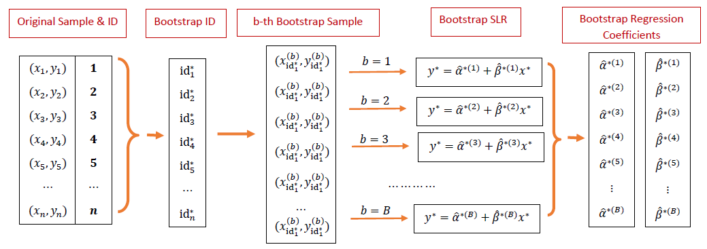
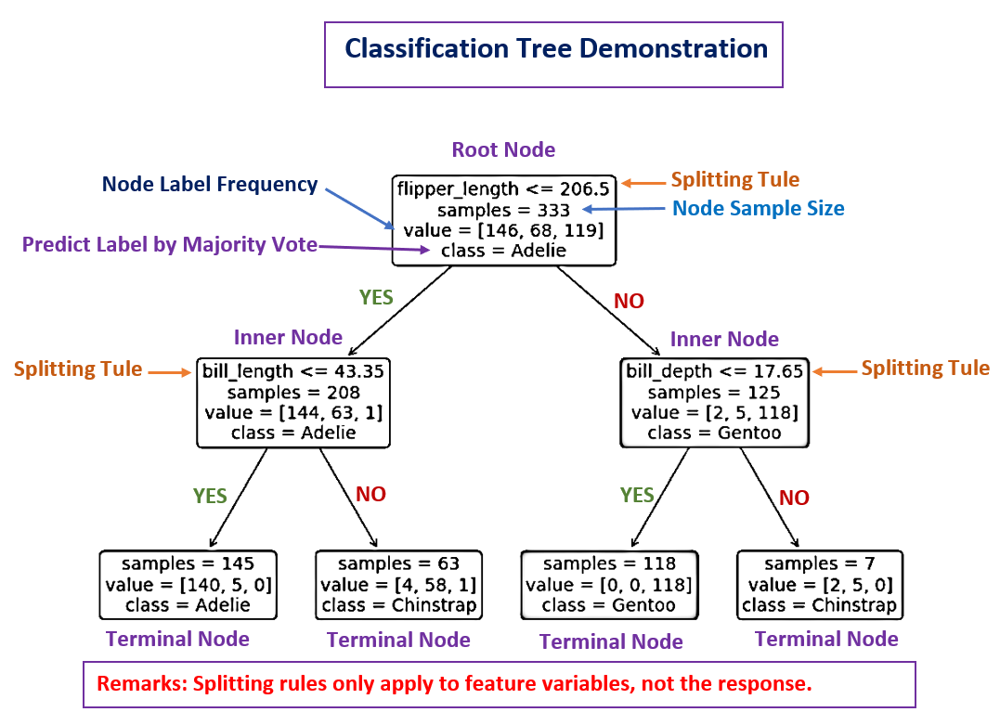
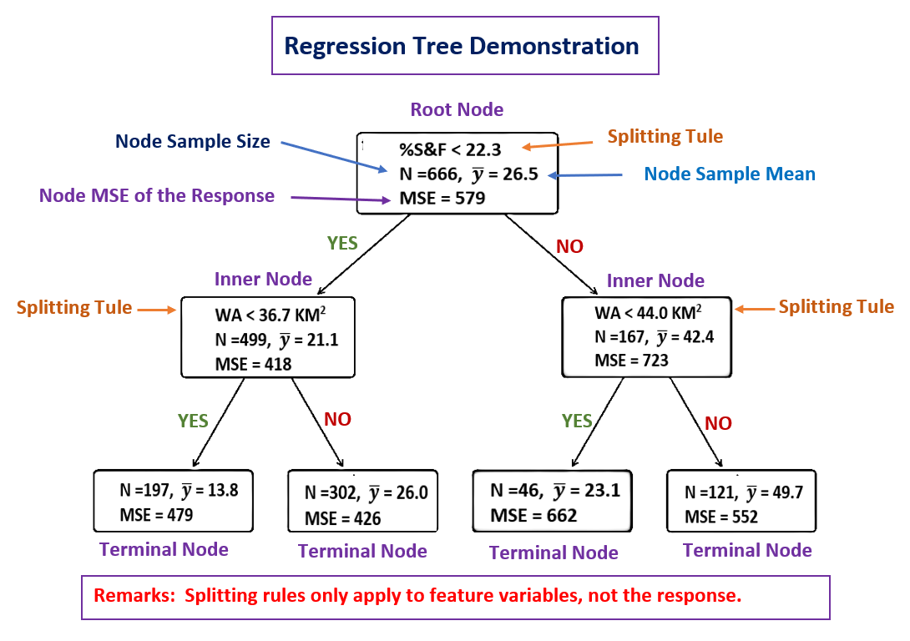
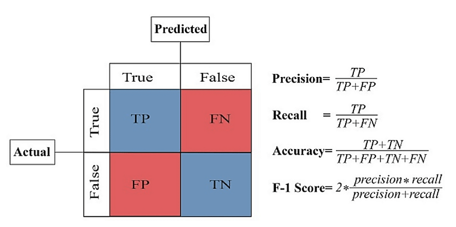

```{=html}

<style type="text/css">

/* Cascading Style Sheets (CSS) is a stylesheet language used to describe the presentation of a document written in HTML or XML. it is a simple mechanism for adding style (e.g., fonts, colors, spacing) to Web documents. */

h1.title {  /* Title - font specifications of the report title */
  font-size: 22px;
  font-weight: bold;
  color: DarkRed;
  text-align: center;
  font-family: "Gill Sans", sans-serif;
}
h4.author { /* Header 4 - font specifications for authors  */
  font-size: 18px;
  font-weight: bold;
  font-family: system-ui;
  color: navy;
  text-align: center;
}
h4.date { /* Header 4 - font specifications for the date  */
  font-size: 18px;
  font-family: system-ui;
  color: DarkBlue;
  text-align: center;
  font-weight: bold;
}
h1 { /* Header 1 - font specifications for level 1 section title  */
    font-size: 22px;
    font-family: "Times New Roman", Times, serif;
    color: navy;
    text-align: center;
    font-weight: bold;
}
h2 { /* Header 2 - font specifications for level 2 section title */
    font-size: 20px;
    font-family: "Times New Roman", Times, serif;
    color: navy;
    text-align: left;
    font-weight: bold;
}

h3 { /* Header 3 - font specifications of level 3 section title  */
    font-size: 18px;
    font-family: "Times New Roman", Times, serif;
    color: navy;
    text-align: left;
}

h4 { /* Header 4 - font specifications of level 4 section title  */
    font-size: 18px;
    font-family: "Times New Roman", Times, serif;
    color: darkred;
    text-align: left;
}

body { background-color:white; }

.highlightme { background-color:yellow; }

p { background-color:white; }

</style>
```

```{r setup, include=FALSE}
# code chunk specifies whether the R code, warnings, and output 
# will be included in the output files.
if (!require("knitr")) {
   install.packages("knitr")
   library(knitr)
}
if (!require("tidyverse")) {
   install.packages("tidyverse")
library(tidyverse)
}
if (!require("palmerpenguins")) {
   install.packages("palmerpenguins")
library(palmerpenguins)
}
if (!require("plotly")) {
   install.packages("plotly")
library(plotly)
}
if (!require("e1071")) {
   install.packages("e1071")
library(e1071)
}
if (!require("mmeln")) {
   install.packages("mmeln")
library(mmeln)
}
if (!require("MASS")) {
   install.packages("MASS")
library(MASS)
}
if (!require("ggplot2")) {
   install.packages("ggplot2")
library(ggplot2)
}
if (!require("plotly")) {
   install.packages("plotly")
library(plotly)
}
if (!require("caret")) {
   install.packages("caret")
library(caret)
}
if (!require("pander")) {
   install.packages("pander")
library(pander)
}
if (!require("randomForest")) {
   install.packages("randomForest")
library(randomForest)
}
if (!require("rpart")) {
   install.packages("rpart")
library(rpart)
}
if (!require("rpart.plot")) {
   install.packages("rpart.plot")
library(rpart.plot)
}
if (!require("pROC")) {
   install.packages("pROC")
library(pROC)
}
##
knitr::opts_chunk$set(echo = TRUE,   
                      warning = FALSE, 
                      results = TRUE, 
                      message = FALSE,
                      comment = NA
                      )  
```

\


# Introduction

Random Forest (RF) is a powerful and versatile machine-learning algorithm that has gained widespread popularity due to its robustness, accuracy, and ease of use. It is an ensemble learning method that combines multiple decision trees to improve predictive performance and reduce overfitting. The algorithm is particularly useful in scenarios where the data is complex, noisy, or contains a large number of features. Random Forest is widely used in various fields, including finance, banking, healthcare, and bioinformatics, due to its ability to handle both classification and regression tasks.

For example, Random Forest (RF) has numerous applications in the financial and banking industries. The following is a list of applications.

*	Credit Scoring: Predicting the likelihood of a borrower defaulting on a loan.
*	Fraud Detection: Identifying fraudulent transactions based on historical data.
*	Portfolio Management: Predicting stock prices or identifying optimal asset allocations.
*	Risk Management: Assessing the risk associated with various financial instruments.

RF is built based on classification and regression tree (CART) using bootstrap methods. We will first briefly introduce the CART and bootstrap methods first before discussing  RF and its relationship with other machine learning models and algorithms.


# Bootstrap Regression

Bootstrap methods are a class of resampling techniques used for statistical inference, particularly when theoretical distributions are complex or unknown. The bootstrap estimates the sampling distribution of a statistic by repeatedly resampling with replacement from the observed data and recalculating the statistic for each resample. The key features are

* **Non-parametric**: Makes no assumptions about the underlying population distribution.

* **Resampling with replacement**: Each bootstrap sample is the same size as the original dataset, but observations may be repeated.

* **Estimates uncertainty**: Provides standard errors, confidence intervals, and bias corrections.

\

## Bootstrap Sampling Distribution

The bootstrap sampling distribution of sample means is an empirical approximation of the true sampling distribution of the mean, constructed by:

* Repeatedly resampling the original data with replacement.
* Calculating the mean for each resample.
* Analyzing the distribution of these bootstrap means.

Consider the sampling distribution of sample means. According to the Central Limit Theorem (CLT), the sampling distribution of the sample mean is approximately normally distributed when the sample size is sufficiently large. Using this distribution, we can construct a confidence interval (CI) for the population mean 
$\mu$.

However, if the CLT assumptions are not satisfied (e.g., small sample size, heavy skewness, or outliers), we cannot rely on the asymptotic normality of the sample mean to construct valid confidence intervals. In such cases, the bootstrap sampling distribution provides a flexible alternative for inference, as it does not require strict distributional assumptions and can adapt to the underlying data structure.


```{r echo = FALSE, fig.align='center', out.width="90%"}
include_graphics("img/w09-BootSamplingDist.jpg")
```

As an example, we estimate the median value of owner-occupied homes in the Boston Housing Data.

```{r fig.align='center', fig.width=6, fig.height=5}
#library(MASS)
data(Boston)
medv <- Boston$medv  # Median home values

# Set seed for reproducibility
set.seed(123)

# Generate B = 1000 bootstrap samples
B <- 1000
boot_means <- replicate(B, mean(sample(medv, replace = TRUE)))

# Compare bootstrap vs. theoretical results
original_mean <- mean(medv)
bootstrap_mean <- mean(boot_means)
bootstrap_se <- sd(boot_means)
CI <- quantile(boot_means, c(0.025, 0.975))
###
hist(boot_means, main = "Bootstrap Distribution Mean Median Prices", xlab="median home prices")
text(23.5, 150, paste("BT Mean:", round(bootstrap_mean,1)), cex = 0.8)
text(23.5, 135, paste("BT STDEV", round(bootstrap_se,1)), cex = 0.8)
text(23.5, 90, paste("95% CI: (", round(CI[1],1), ", ", round(CI[2],1), ")"), cex = 0.8)
text(CI[1], 15, paste(round(CI[1],4)), cex = 0.8, col = "red")
text(CI[2], 15, paste(round(CI[2],4)), cex = 0.8, col = "red")

points(quantile(boot_means, c(0.025, 0.975)), c(0,0),
       pch=19, cex = 2, col = "red")
```


## Bootstrap Regression

Imagine we’ve collected some data and fit a regression model, but we are unsure whether the standard errors and confidence intervals from classical theory (which rely on normality assumptions) are trustworthy. What if the sample is small, residuals are skewed, or data violates regression assumptions?

This is where **bootstrap regression** comes in—a powerful, flexible method that lets you estimate uncertainty empirically by treating your original data set as a **miniature population** and repeatedly resampling from it.


```{r echo = FALSE, fig.align='center', out.width="90%"}

```

To illustrate, next, we will build a multiple linear regression with two variables using the Boston Housing Data.

$$
\text{medv} = \beta_0 + \beta_1 \text{lstat} + \beta_2\text{rm}
$$

The objective is to construct confidence intervals of regression coefficients based on the sample without assuming the normality of the residuals.


```{r}
#library(MASS)
data(Boston)

# Fit original model
lin.model <- lm(medv ~ lstat + rm, data = Boston)

# Generate 1000 bootstrap coefficient estimates
set.seed(123)
coef.mtx <- matrix(rep(0,3*1000), ncol=3, nrow=1000)
for (i in 1:1000){
  resample_rows <- sample(nrow(Boston), replace = TRUE)
  coef.mtx[i,] <- coef(lm(medv ~ lstat + rm, data = Boston[resample_rows, ]))
}
colnames(coef.mtx) <- c("intercept", "lstat", "rm")
ceof.mtx.data.frame <- as.data.frame(coef.mtx)
# 95% CI for 'lstat' coefficient
#quantile(boot_coefs["lstat",], c(0.025, 0.975))
```

Following the bootstrap regression workflow outlined earlier, we generate 1,000 bootstrap samples to construct $95\%$ confidence intervals for the regression coefficients presented below.


```{r}
pander(t(apply(coef.mtx, 2, function(x) quantile(x, c(0.025, 0.975)))))
```

For comparison, we also report conventional inferential statistics derived under the assumptions of normality and homoscedasticity.


```{r}
pander(summary(lin.model)$coef)
```

As demonstrated in the above two tables, both bootstrap regression and conventional linear regression produce consistent results regarding the statistical significance of the regression coefficients.


#  CART Algorithms

The CART algorithm is an intuitive but powerful machine learning algorithm that can be used to perform both regression and classification. It is also the base algorithm used to define several other ensemble machine learning algorithms.

## Logic and Technical Explanation

Decision trees are a type of supervised learning algorithm that can be used for both classification and regression tasks. The algorithm works by recursively splitting the data into subsets based on the value of a feature, with the goal of creating subsets that are as homogeneous as possible with respect to the target variable.

* **Classification Trees**

Used for predicting categorical outcomes. The splits are chosen to maximize the homogeneity of the resulting subsets, often measured using metrics like **Gini impurity** (Gini index) or **entropy**. 

The following illustrative chart gives a rough idea of the classification tree algorithm using the penguin data set. The tree predicts a penguin’s species - Adelie, Gentoo, or Chinstrap - based on flipper length and bill measurements.

The root node displays the distribution of the 333 training observations: 146 Adelie, 68 Gentoo, and 119 Chinstrap. The first split occurs based on flipper length: if a penguin’s flipper is $\le$ 206.5 mm, it branches to the left; otherwise, it branches to the right. This splitting process continues recursively for each subsequent node, further refining the classification.

```{r echo = FALSE, fig.align='center', out.width="90%"}

```


* **Regression Trees**

Used for predicting continuous outcomes. The splits are chosen to minimize the variance or MSE of the target variable within each subset.

A tree diagram for the relative abundance of lithophilous fish (i.e., fish that broadcast spawn on gravel beds) with respect to % sand and fines (% S&F, a measure of fine bedded sediment) and watershed area (WA). Branches are annotated showing the decision rules (e.g. % sand and fines < 22.3). Nodes are annotated showing the mean of the dependent variable (N = number of observations, $\bar{y}$ = mean value, MSE = mean squared error). 

```{r echo = FALSE, fig.align='center', out.width="90%"}

```


## Model Building Process

The process of building a decision tree involves the following steps:

### Optimal Feature and Split Point

At each node, both regression and classification trees use splitting criteria to determine the optimal feature and split point at each node, but they differ in how they measure impurity or homogeneity. 

**Regression Trees**

For regression trees (continuous target response variables), the primary splitting criteria are

* **Variance Reduction**: Selects splits that minimize the weighted variance of child nodes
  
$$
\Delta V = \text{var}(S) - (n_L/n)\times \text{var}(S_L) - (n_R/n)\times \text{var}(S_R)
$$
Where $\text{var}(S)$ is the variance of the parent node, $n_L$, and $n_R$ are sample sizes in left and right child nodes respectively.

* **Mean Squared Error (MSE) Reduction**: Similar to variance reduction but emphasizes larger errors

$$
MSE =\frac{\sum_{i=1}^n(y_i - \bar{y})^2}{n}
$$

* **Least Absolute Deviation (LAD)** is more robust to outliers

$$
MSE =\frac{\sum_{i=1}^n|y_i - \text{median}|}{n}
$$

**Classification Trees**

For classification trees (categorical target response variables), the primary splitting criteria are

* **Gini Impurity(Default in CART)** measures probability of incorrect classification which is defined as

$$
\text{Gini} = 1 - \sum_{i=1}^k p_i^2 \ \ \text{ where } \  p_i \text{  is proportion of class } \ i.
$$
  Split chosen to maximize Gini gain.

$$
\Delta G = \text{Gini}(S) - (n_L/n)\times \text{Gini}(S_L) - (n_R/n)\text{Gini}\times(S_R)
$$
* **Information Gain** is defined based on the following **entropy**

$$
H = -\sum_{i=1}^k \left[ p_i \times \log_2(p_i)\right], \ \text{ where } \ p_i \ \text{ is the proportion of i-th child node}.
$$
  Split chosen to maximize the following information gain (IG)
  
$$
\text{IG} = H(S) - (n_L/n)\times H(S_L)-( n_R/n)\times H(S_R)
$$

### Stopping Criteria

Tree-based algorithms use stopping criteria to determine when to stop growing the tree, preventing overfitting and ensuring generalizability. Here are the key stopping criteria for both regression and classification trees.

**Common Stopping Criteria (Both Regression and Classification)**

* *Tree Depth Constraints*
  + Maximum depth (`max_depth`): Limits how deep the tree can grow
  + Minimum samples to split (`min_samples_split`): Minimum number of samples required to consider splitting a node (typical default: 2)
  + Minimum samples per leaf (`min_samples_leaf`): Minimum number of samples required to be in a leaf node (typical default: 1)

* *Impurity-Based Criteria*
  + Minimum impurity decrease (`min_impurity_decrease`): Split must decrease impurity by at least this value
  + Pure nodes: Stop when all samples in a node belong to the same class (classification) or have identical values (regression)

* *Resource Constraints*
  + Maximum number of leaf nodes (`max_leaf_nodes`)
  + Time or memory limits

**Regression-Specific Stopping Criteria**

* *Variance threshold*: Stop if the variance in a node falls below a specified threshold
* *MSE improvement*: Stop if further splits don't improve MSE significantly

**Classification-Specific Stopping Criteria**

* *Purity threshold*: Stop if node purity (Gini/Entropy) reaches a certain level
* *Class dominance*: Stop if one class dominates beyond a specified proportion


### Pruning

Pruning is a critical technique used to simplify decision trees by removing sections that provide little predictive power, thereby reducing overfitting and improving generalization to unseen data. 

**Types of Pruning**

* *Pre-Pruning (Early Stopping)*
  + Stops tree growth before it becomes too complex
  + Uses stopping criteria during tree construction: *Maximum depth*, *Minimum samples per leaf*, and *Minimum impurity decrease*.


* *Post-Pruning (Cost-Complexity Pruning)*
  + Grows full tree first, then prunes back
  + More effective than pre-pruning in practice
  + Primary method used in CART algorithm


**Key Parameters for Pruning in R**

* *Complexity Parameter (`cp`)*
  + Any split that doesn't improve fit by cp is not attempted
  + Default is 0.01, but set to 0 for full tree growth before pruning

* *Cross-Validation (`xval`)*
  + Number of cross-validation folds (typically 10)
  + Used to estimate prediction error for different cp values

* *Other Important Controls*
  + `minsplit`: Minimum number of observations in the node before splitting (default 20)
  + `minbucket`: Minimum number in terminal nodes (default round(minsplit/3))
  + `maxdepth`: Maximum tree depth (default 30)


**Practical Tips for Effective Pruning**

* *Use the 1-SE Rule*: Select the simplest tree within one standard error of the minimum error for more robust pruning.
* *Visual Inspection*: Always plot the tree to ensure it makes logical sense after pruning.
* *Multiple Metrics*: For classification, consider both accuracy and AUC when evaluating pruned trees.
* *Feature Importance*: Check variable importance before and after pruning to ensure key features remain.
* *Domain Knowledge*: Incorporate business/domain knowledge when evaluating if pruned trees make sense.

\

<font color = "red">**It is important to note that feature scaling (standardization or transformation) is not required in decision and regression.**</font>

\

# Regression Trees Case Study

This section presents a mini case study on regression tree algorithm using the popular Boston Housing Data to train an algorithm for predicting the median house value.

## Regression Tree Induction

Recall the basic logical process in regression tree implementation:

* *Tree Induction*
  + Start with the entire dataset at the root node
  + Recursively partition the data into subsets
  + Create child nodes for each partition

* *Splitting Criteria*
  + Feature selection: Evaluate all possible features for splitting
  + Splitting point: For continuous features, find the optimal value to split
  + Common criteria:
    - Minimize sum of squared errors (SSE)
    - Reduction in variance

* *Stopping Rule* - Stop recursion when:
  + Node contains fewer than the minimum number of observations
  + Depth reaches maximum limit
  + Improvement in model fit is below the threshold
  + All observations in the node have the same target value

* *Pruning Process*
  + Grow an overly complex tree first
  + Use cost-complexity pruning to avoid overfitting
  + Select optimal subtree using cross-validation

* *Prediction*
  + Traverse tree with new observation
  + Reach terminal node (leaf)
  + Use mean value of training observations **in that node** as prediction


Some Primary Stopping Criteria Parameters are specified in the rpart.control() function:

* **minsplit**
  + Minimum number of observations required in a node to attempt a split
  + Default: 20
  + Example: minsplit = 30 means nodes with < 30 observations won't split

* **minbucket**
  + Minimum number of observations allowed in any terminal (leaf) node
  + Default: round(minsplit/3)
  + Example: minbucket = 10 ensures each leaf has $\ge$ 10 observations

* **cp (Complexity Parameter)**
  + Minimum improvement in model fit required to attempt a split
  + Default: 0.01
  + Lower values grow larger trees
  + Used for both stopping growth and pruning

* **maxdepth**
  + Maximum depth of any node in the final tree
  + Default: 30 (effectively no limit)
  + Root node is depth 0
  + Example: maxdepth = 5 limits tree to 5 levels

* **maxcompete**
  + Number of competitor splits retained in output
  + Doesn't affect tree growth, just output display
  + Default: 4

* **maxsurrogate**
  + Number of surrogate splits retained in output
  + Useful for handling missing data
  + Default: 5

* **usesurrogate**
  + How to use surrogates for handling missing data
  + 0 = no, 1 = yes (default), 2 = strict


**How do These Controls Work Together?**

* The algorithm first checks `minsplit` - if a node has fewer observations, it won't split

* Then checks potential splits to ensure both child nodes would meet `minbucket`

* Evaluate whether any split improves the model fit by at least `cp`

* Verifies the split wouldn't exceed `maxdepth`

* Only proceeds with the split if all criteria are satisfied

\

## Case Study - Boston Housing Data

Next, we follows the above suggested logical steps to build a regressions (see the comments in the R code)


```{r fig.align='center', fig.width=5, fig.height=5}
# Load required packages and data
#library(rpart)          # For regression trees
#library(rpart.plot)     # For visualizing trees
#library(MASS)           # Contains Boston dataset
data(Boston)

# Set seed for reproducibility
set.seed(123)

# Split data into training (70%) and test (30%) sets
train.index <- sample(1:nrow(Boston), size = 0.7 * nrow(Boston))
train.data <- Boston[train.index, ]
test.data <- Boston[-train.index, ]

# 1. Tree Induction & 2. Splitting Criteria
# Build the initial regression tree using rpart
tree.model <- rpart(medv ~ ., 
                    data = train.data,
                    method = "anova",     # For regression
                    control = rpart.control(
                      minsplit = 20,    # 3. Stopping rule: min observations to split
                      minbucket = 7,    # Min observations in terminal node
                      cp = seq(0, 0.05, 20), # Complexity parameter
                      maxdepth = 5      # Maximum tree depth
                    ))

# Visualize the unpruned tree
rpart.plot(tree.model, main = "Initial Regression Tree")
```

The above tree is based on some default stopping rule without post-pruning. The model object **tree.model** contains a long list of different pieces of information that can be used to improve the initial tree model. 

Next, we look at the model complexity parameter `cp` and related errors and appropriately prune the initial tree. More detailed information about the model object can be printed out using `summary(tree.model)`. The following is a

```{r}
# 4. Pruning Process
# Examine cross-validation results
pander(tree.model$cptable)
```

The above cp table contains the following information based on cross-validation:

* **CP**: Complexity parameter values. 
  + Penalty term that balances tree complexity with fit quality
  + Higher CP values produce simpler trees (fewer splits)
  + Represents the minimum improvement needed to justify adding another split
  + Formula: $CP = [R(parent) - R(children)] / R(root)$ where `R` is the risk (error)
  
* **nsplit**: Number of splits in the tree (tree size)
  + Count of splits in the tree (0 = root node only)
  + Corresponds to tree size (number of splits + 1 = number of terminal nodes)

* **rel error**: Relative error (compared to root node)
  + Error relative to the root node (always starts at 1)
  + Calculated as: `Error(current_tree)/Error(root_node)`
  + Decreases as the tree grows more complex

* **xerror**: Cross-validated error
  + Cross-validated relative error (most important for pruning)
  + Estimated via 10-fold cross-validation by default
  + Often decreases initially then increases (indicating overfitting)

* **xstd**: Standard error of the cross-validated error
  + Standard error of the cross-validated error estimate
  + Provides a measure of uncertainty in `xerror`

\

<font col = "red", size = 4>**Suggested Steps for Selecting the Optimal Tree Size**</font>

1. Locate the row with minimum `xerror`

2. Find the simplest tree (smallest `nsplit`) whose `xerror` is within 1 standard error (`xstd`) of this minimum. That is, <font color = "red">**select the largest `cp` where `xerror` is within 1 standard error of the minimum (to balance simplicity and accuracy).**</font>

3. This is the **1-SE rule** for pruning (the dashed line indicates **1-SE rule** threshold above the minimum error in the following `cp` plot).


```{r fig.align='center', fig.width=5, fig.height=5}
plotcp(tree.model)
```

As mentioned earlier, in practice, <font color = "red">**select the largest `cp` where `xerror` is within 1 standard error of the minimum (to balance simplicity and accuracy).**</font>

To be more specific,

* Identify the minimum `xerror` and its `cp`.
* Get the standard error (`xstd`) of the minimum `xerror`.
* Find the simplest tree (`cp`) Where `xerror $\le$ Threshold`.
* Prune the tree using `best_cp` (best and simplest tree).


```{r fig.align='center', fig.width=5, fig.height=5}
cp.table <- tree.model$cptable

## Identify the minimum `xerror` and its `cp`.
min.xerror <- min(cp.table[, "xerror"])
min.cp.row <- which.min(cp.table[, "xerror"])
min.cp <- cp.table[min.cp.row, "CP"]

## Get the standard error (`xstd`) of the minimum `xerror`
xerror.std <- cp.table[min.cp.row, "xstd"]
threshold <- min.xerror + xerror.std  # Upper bound (1 SE rule)

## Find the simplest tree (`cp`) Where `xerror less than or equal to Threshold`.
best.cp.row <- which(cp.table[, "xerror"] <= threshold)[1]  # First row meeting criteria
best.cp <- cp.table[best.cp.row, "CP"]

## Two different trees: best CP vs minimum CP
pruned.tree.best.cp <- prune(tree.model, cp = best.cp)
pruned.tree.min.cp <- prune(tree.model, cp = min.cp)

# Visualize the pruned tree: best CP
rpart.plot(pruned.tree.best.cp, main = paste("Pruned Tree (Best CP): cp = ", round(best.cp,4)))
```

The above regression tree uses the best CP value based on the 1-SE


```{r fig.align='center', fig.width=5, fig.height=5}
# Visualize the pruned tree: minimum CP
rpart.plot(pruned.tree.min.cp, main = paste("Pruned Tree (Minimum CP): cp = ", round(min.cp,4)))
```

Using the practical approach to selecting `cp`, the final regression tree algorithm is graphically depicted in the above tree diagram. The value of `cp` corresponding to the smallest `xerror` is 0.01 which is the same as the default `cp` value.

Next, we use the final pruned regression tree to make predictions. Since only four features `age`, `lstat`, `rm`, and `tax` were used in the algorithm. We also fit two linear regression models and compare the performance of the three models.

**LSE01**: including `age`, `lstat`, `rm`, and `tax`.

**LSE02**: including all features through step-wise variable selection.

```{r}
# 5. Prediction
# Make predictions on test data
pred.best.cp <- predict(pruned.tree.best.cp, newdata = test.data)
pred.min.cp <- predict(pruned.tree.min.cp, newdata = test.data)


# Evaluate model performance: best.cp
mse.tree.best.cp <- mean((test.data$medv - pred.best.cp)^2)
rmse.tree.best.cp <- sqrt(mse.tree.best.cp)
r.squared.tree.best.cp <- cor(test.data$medv, pred.best.cp)^2
# min.cp
mse.tree.min.cp <- mean((test.data$medv - pred.min.cp)^2)
rmse.tree.min.cp <- sqrt(mse.tree.min.cp)
r.squared.tree.min.cp <- cor(test.data$medv, pred.min.cp)^2

##
# fit ordinary least square regression 
LSE01 <- lm(medv ~ age + lstat + rm + tax, data = train.data)
pred.lse01 <-  predict(LSE01, newdata = test.data)
mse.lse01 <- mean((test.data$medv - pred.lse01)^2)
rmse.lse01 <- sqrt(mse.lse01)
r.squared.lse01 <- cor(test.data$medv, pred.lse01)^2

##
## ordinary LSE regression model with step-wise variable selection
lse02.fit <- lm(medv~.,data = train.data)
AIC.fit <- stepAIC(lse02.fit, direction="both", trace = FALSE)
pred.lse02 <- predict(AIC.fit, test.data)
mse.lse02 <- mean((test.data$medv - pred.lse02)^2)    # mean square error
rmse.lse02 <- sqrt(mse.lse02)                       # root mean square error
r.squared.lse02 <- (cor(test.data$medv, pred.lse02))^2 # r-squared

###
Errors <- cbind(MSE = c(mse.tree.best.cp, mse.tree.min.cp, mse.lse01, mse.lse02),
                RMSE = c(rmse.tree.best.cp, rmse.tree.min.cp, rmse.lse01, rmse.lse02),
                r.squared = c(r.squared.tree.best.cp, r.squared.tree.min.cp, r.squared.lse01, r.squared.lse02))
rownames(Errors) = c("tree.best.cp", "tree.min.cp", "lse01", "lse02")
pander(Errors)
```
The pruned tree with CP corresponding minimum cross-validation error outperformed all models. The above errors show that the regression tree model and step-wise-based linear regression model performed equally well.

**Variable importance** in regression trees identifies which predictors have the strongest influence on the target variable's predictions. In `rpart`, for each variable, 

* Sum all improvements in squared error (RSS reduction) resulting from splits using that variable
* Scales the values so the most important variable gets 100
* All others are expressed relative to this maximum

The CP plots of the two pruned trees are given below. 

```{r fig.align='center', fig.width=5, fig.height=5}
# Variable importance
importance <- pruned.tree.best.cp$variable.importance
barplot(sort(importance, decreasing = TRUE), 
        main = "Variable Importance: Best CP",
        las = 2)
```


```{r fig.align='center', fig.width=5, fig.height=5}
# Variable importance
importance <- pruned.tree.min.cp$variable.importance
barplot(sort(importance, decreasing = TRUE), 
        main = "Variable Importance: Minimum CP",
        las = 2)
```


For comparison, we also print out the inferential table of the step-wise linear regression model in the following.

```{r}
pander(summary(AIC.fit)$coef)
```

**Several different concepts of feature variables**

* In feature selection and splitting (e.g., decision trees), **importance** is measured by performance gain (e.g., reduction in MSE/Gini impurity).

* This captures how much a variable improves model accuracy but does not imply statistical significance.

* Statistical Significance (AIC-based Selection):
  + Variables retained through stepwise selection (e.g., AIC) indirectly reflect statistical significance, as AIC penalizes model complexity while rewarding fit.
  + AIC does not account for effect size or practical relevance.

* Practical Importance (Magnitude of Coefficients):
  + In the least squares regression, the magnitude (absolute value) of standardized coefficients reflects practical importance, assuming predictors are on comparable scales.
  + Larger coefficients indicate stronger associations with the outcome, though correlation does not imply causation.


## Comments on Variable Importance

It is not uncommon that some variables in the variable importance list but not shown in the final regression and classification trees. When important variables are not included in the final regression tree (e.g., when using methods like `rpart` in R), several possible reasons could explain this behavior. 

* **Variable Importance vs. Splitting Criteria**

  + *Statistical Significance*: The tree algorithm (e.g., CART) selects splits based on criteria like Gini impurity (classification) or variance reduction (regression). If a variable doesn't significantly improve these metrics, it may be excluded.

  + *Competition with Other Variables*: A variable might be important in isolation but gets overshadowed by other variables that explain similar variance more efficiently.


* **Collinearity** (High Correlation with Included Variables)

  + If two variables are highly correlated, the tree might use only one of them, leaving the other out even if both are important.


* **Pre-Pruning Parameters** (in `rpart.control`)

  + Parameters like `minsplit`, `minbucket`, `maxdepth`, or `cp` (complexity parameter) can restrict tree growth, preventing certain variables from being included.

  + A high `cp` value prunes splits that don't improve model fit sufficiently, potentially excluding important variables.


* **Data Partitioning Randomness** (if using `randomForest` or other ensemble methods)

  + In random forests, variables may not appear in every tree due to random subset selection (`mtry` parameter).


* **Insufficient Variability or Missing Splits**

  + If a variable has low variability or its values don't create meaningful splits, it may be ignored.

  + Categorical variables with too many levels might be penalized.


* **Manual Feature Selection or Preprocessing**

  + If you manually excluded variables or applied preprocessing (e.g., PCA, filtering), they won’t appear in the final tree.


* **Insufficient Data**

  + With small data sets, the algorithm might not detect the importance of certain variables due to limited splits.


\


# Classification Trees Case Study

Classification trees are a type of supervised learning algorithm that recursively partitions the feature space to predict categorical target variables. The algorithm follows a greedy top-down approach (also called recursive partitioning) to build a decision tree.


## Logical Steps

The logical process of implementing a classification algorithm is similar to that of regression trees. Next, we outline these basic steps.

* **Tree Induction** - The process of building the tree by recursively partitioning the data:
  + Start with the entire dataset at the root node
  + Recursively split the data into purer subsets
  + Continue until stopping criteria are met

* **Splitting Criteria (Feature Selection and Splitting)** - Determining how to split nodes:
  + For categorical targets: Typically use Gini impurity or information gain (entropy)
  + For each possible split, calculate the improvement in purity
  + Select the split that provides maximum improvement
  + <font color = "red">**Optimal Tree Size**: Typically where `xerror` is minimized.</font>

* **Stopping Rule** - Conditions to terminate tree growth:
  + Minimum number of observations in a node
  + Maximum tree depth
  + Minimum improvement in purity required for a split
  + All observations in a node belong to one class

* **Pruning Process** - Reducing tree size to prevent overfitting:
  + Grow the tree to a maximum depth
  + Use cost-complexity pruning to remove less important branches
  + Select optimal tree size using cross-validation

* **Prediction**
  + Using the final tree to make predictions:
  + Traverse the tree with new observations
  + Assign the majority class of the terminal node
  + Can output class probabilities

\

## Some Practical Recommendations

Since CART algorithms allow too many hyperparameters, tuning hyperparameters can be challenging. Here are some recommendations.

* **Start with Defaults**: `minsplit=20`, `minbucket=7`, `cp=0.01`.

* **Adjust Based on Data Size**
  + For small datasets, reduce `minsplit` and `minbucket`.
  + For large datasets, increase `maxdepth`.

* **Use Pruning (cp) to avoid overfitting**
  + Higher `cp` leads to a simpler tree.
  + Lower `cp`  leads to more complex tree (risk of overfitting).

* Cross-validation (`xval=10`) to select the best `cp`.

* **Optimal Tree Size**: Typically where `xerror` is minimized.


## Case Study - Predicting Diabetes

We will use the **Pima Indian Diabetes data** to illustrate the process of building a classification tree model and will compare its predictive performance with that of logistic regression through ROC analysis.

The data set contains diagnostic measurements for 768 female patients of Pima Indian heritage, with the target variable indicating whether the patient has diabetes (1) or not (0).

### Grown An Initial Tree

The initial tree size is controlled by some default hyperparameters `rpart.control()`. It tends to be over-fitted.

In classification, one particularly challenging problem is that the classes (categories) are not equally represented. This is a common issue in real-world applications, such as fraud detection, medical diagnosis, and spam filtering, where one class (the minority class) is significantly underrepresented compared to the other(s) (the majority class). To improve the predictive performance of the classification tree algorithm with the imbalanced categorical response, `rpart()` allows to inclusion of a loss matrix to penalize the misclassification (false positives and false negatives).

$$
\text{loss.matrix} = \begin{pmatrix} 0 & C_{FP} \\ C_{FN} & 0 \end{pmatrix}
$$
Where $C_{FP}$ and $C_{FN}$ are penalized weights for false positive and false negative respectively. This penalized matrix can be added to the parameter list `parms = list(loss = ...)`.


```{r}
# Load necessary libraries
# library(rpart)        # For decision trees
# library(rpart.plot)   # For visualizing trees
# library(caret)        # For model evaluation
# library(pROC)         # For ROC analysis

# Load the dataset
data("PimaIndiansDiabetes", package = "mlbench")
diabetes.data <- PimaIndiansDiabetes

# Split data into training (70%) and test (30%) sets
set.seed(123)
train.index <- createDataPartition(diabetes.data$diabetes, p = 0.7, list = FALSE)
train.data <- diabetes.data[train.index, ]
test.data <- diabetes.data[-train.index, ]

# Build the initial classification tree
tree.model <- rpart(diabetes ~ ., 
                    data = train.data,
                    method = "class",   # classification tree
                    parms = list(split = "gini",  # Using Gini index
                                 # FN cost = 1, FP cost = 0.5
                                 loss = matrix(c(0, 0.5, 1, 0), nrow = 2)  
                                 ),
                    control = rpart.control(minsplit = 15,  # Min 15 obs to split
                                           minbucket = 5,   # Min 7 obs in leaf
                                           # Complexity parameter
                                           cp = 0.001, # complex parameter
                                           maxdepth = 5))   # Max tree depth
```


In addition to the basic default setting of hyperparameters and performance measures for feature selection and splitting using `gini` index, we also include a loss matrix to penalize false positives and negatives respectively. 


```{r fig.align='center', fig.width=5, fig.height=5}
rpart.plot(tree.model, 
           extra = 104, # check the help document for more information
           # color palette is a sequential color scheme that blends green (G) to blue (Bu)
           box.palette = "GnBu",  
           branch.lty = 1, 
           shadow.col = "gray", 
           nn = TRUE)
```

The above tree diagram represents the initial settings in parameters and hyperparameters in arguments `parms=` and `rpart.control`. 


### Pruning Tree

To prevent overfitting in decision trees, we employ both pre-pruning and post-pruning strategies. Pre-pruning is implemented through hyperparameters in `rpart.control` and `parms` within the `rpart()` function, which restrict tree growth during construction. Post-pruning, performed after tree development, uses cross-validation to select an optimal complexity parameter (`cp`), with two recommended approaches: (1) choosing the `cp` value that minimizes cross-validation error (`xerror`), or (2) applying the `1-SE rule` - selecting the largest `cp` where `xerror` $\le$ (min `xerror` + 1 standard error) to balance model complexity and predictive performance.


The following `cp` table below is used to identify the value of `cp` to build the final tree. 

```{r}
# Print the complexity parameter table
pander(tree.model$cptable)
```

The following cp-plot gives the reference line (broken line) for 1-SE rule. The numbers on the top of the plot represent the leaf nodes in the final tree diagram.

```{r fig.align='center', fig.width=5, fig.height=5}
# Plot the cross-validation results
plotcp(tree.model)
```


For clarity in the analysis, we introduce two notations: `min.cp` represents the `cp` value yielding the minimum cross-validation error, while `1SE.cp` denotes the `cp` value selected by the more conservative `1-SE` rule (minimal error plus one standard error).


```{r fig.align='center', fig.width=5, fig.height=5}
# Find the optimal cp value that minimizes cross-validated error
min.cp <- tree.model$cptable[which.min(tree.model$cptable[,"xerror"]),"CP"]

# Prune the tree using the optimal cp
pruned.tree.1SE <- prune(tree.model, cp = 0.017)  
pruned.tree.min <- prune(tree.model, cp = min.cp)

# Visualize the pruned tree
rpart.plot(pruned.tree.1SE, 
           extra = 104, # check the help document for more information
           # color palette is a sequential color scheme that blends green (G) to blue (Bu)
           box.palette = "GnBu",  
           branch.lty = 1, 
           shadow.col = "gray", 
           nn = TRUE)
```

The above-pruned tree diagram is based on the `1-SE` rule. Next, we plot the tree diagram based on the minimum cross-validation error.


```{r fig.align='center', fig.width=5, fig.height=5}
# Visualize the pruned tree
rpart.plot(pruned.tree.min, 
           extra = 104, # check the help document for more information
           # color palette is a sequential color scheme that blends green (G) to blue (Bu)
           box.palette = "GnBu",  
           branch.lty = 1, 
           shadow.col = "gray", 
           nn = TRUE)
```

### Global Performance with ROC

Classification trees make predictions by routing observations through a series of hierarchical splits, starting at the root node and ending at a terminal leaf node. Each split applies a decision rule based on feature values. In R, predictions can be generated as class labels (`type = "class"`) or probabilities (`type = "prob"`), offering flexibility for different use cases—such as hard classifications for decision-making or probabilities for risk scoring. 


```{r fig.align='center', fig.width=6, fig.height=6}
# Make predictions on the test set
pred.label.1SE <- predict(pruned.tree.1SE, test.data, type = "class") # default cutoff 0.5
pred.prob.1SE <- predict(pruned.tree.1SE, test.data, type = "prob")[,2]
##
pred.label.min <- predict(pruned.tree.min, test.data, type = "class") # default cutoff 0.5
pred.prob.min <- predict(pruned.tree.min, test.data, type = "prob")[,2]

# Confusion matrix
#conf.matrix <- confusionMatrix(pred.label, test.data$diabetes, positive = "pos")
#print(conf.matrix)

########################
###  logistic regression
logit.fit <- glm(diabetes ~ ., data = train.data, family = binomial)
AIC.logit <- step(logit.fit, direction = "both", trace = 0)
pred.logit <- predict(AIC.logit, test.data, type = "response")

# ROC curve and AUC
roc.tree.1SE <- roc(test.data$diabetes, pred.prob.1SE)
roc.tree.min <- roc(test.data$diabetes, pred.prob.min)
roc.logit <- roc(test.data$diabetes, pred.logit)

##
### Sen-Spe
tree.1SE.sen <- roc.tree.1SE$sensitivities
tree.1SE.spe <- roc.tree.1SE$specificities
#
tree.min.sen <- roc.tree.min$sensitivities
tree.min.spe <- roc.tree.min$specificities
#
logit.sen <- roc.logit$sensitivities
logit.spe <- roc.logit$specificities
## AUC
auc.tree.1SE <- roc.tree.1SE$auc
auc.tree.min <- roc.tree.min$auc
auc.logit <- roc.logit$auc
###
plot(1-logit.spe, logit.sen,  
     xlab = "1 - specificity",
     ylab = "sensitivity",
     col = "darkred",
     type = "l",
     lty = 1,
     lwd = 1,
     main = "ROC: CART and Logistic Regressopm")
lines(1-tree.1SE.spe, tree.1SE.sen, 
      col = "blue",
      lty = 1,
      lwd = 1)
lines(1-tree.min.spe, tree.min.sen,      
      col = "orange",
      lty = 1,
      lwd = 1)
abline(0,1, col = "skyblue3", lty = 2, lwd = 2)
legend("bottomright", c("Logistic", "Tree 1SE", "Tree Min"),
       lty = c(1,1,1), lwd = rep(1,3),
       col = c("red", "blue", "orange"),
       bty="n",cex = 0.8)
## annotation - AUC
text(0.8, 0.46, paste("Logistic AUC: ", round(auc.logit,4)), cex = 0.8)
text(0.8, 0.4, paste("Tree 1SE AUC: ", round(auc.tree.1SE,4)), cex = 0.8)
text(0.8, 0.34, paste("Tree Min AUC: ", round(auc.tree.min,4)), cex = 0.8)
```

The ROC curves and corresponding AUC values demonstrate that the logistic regression model achieves superior performance compared to both pruned tree models, with the more complex tree (pruned using minimum cross-validation error) showing slightly better predictive ability than the simpler tree pruned according to the 1-SE rule.


### Optimal Cut-off Probability

In binary classification, predicted probabilities must be converted into class labels (e.g., 0 or 1) by applying a cut-off threshold. The choice of this threshold significantly impacts model performance, as it balances accuracy, sensitivity (recall), and specificity. Depending on the particular application, below are key approaches to determine the optimal cut-off. 

**I. Trade-off Between Sensitivity and Specificity**

Sensitivity (True Positive Rate) measures how well a test identifies true positives, such as correctly detecting diseases, while specificity (True Negative Rate) assesses its ability to correctly rule out negatives, like avoiding false alarms. These metrics often trade off against each other, so choosing the optimal threshold depends on the costs of false positives versus false negatives. For instance, medical diagnostics prioritize high sensitivity to minimize missed cases, whereas spam filters favor high specificity to reduce false blocking of legitimate emails. A common approach to balancing these metrics is maximizing Youden’s J statistic, which optimizes the trade-off between sensitivity and specificity.

$$
J = \text{Sensitivity} + \text{Specificity} - 1
$$

The threshold that maximizes J balances both metrics.

**II. Accuracy-Driven Cut-off**

Accuracy is maximized when the threshold matches the class distribution, with a default of 0.5 for balanced data, but a higher threshold may improve accuracy in imbalanced datasets (e.g., 90% negatives) by reducing false positives. However, accuracy can be misleading in imbalanced scenarios (e.g., 99% accuracy from always predicting the majority class), making alternatives like the geometric mean (G-Mean) a better metric for evaluating model performance.

$$
G = \text{Sensitivity} \times \text{Specificity}
$$

This penalizes thresholds that sacrifice one metric for the other.

**III. Cost-Sensitive Thresholding**

When misclassification costs are known (e.g., FN costs 10× more than FP), the threshold can be optimized to minimize total cost:

$$
\text{Cost} = \text{FP}\times C_{\text{FP}} + \text{FN}\times C_{\text{FN}}
$$

are predefined costs.

*Example*: In fraud detection, if missing fraud (FN) costs $1000 and false alarms (FP) costs $10, the threshold should favor sensitivity.


**IV. ROC and Precision-Recall Curves**

The **ROC curve** plots the **True Positive Rate (TPR)** against the **False Positive Rate (FPR)**, helping to identify the optimal threshold by targeting the top-left corner for the best balance between sensitivity and specificity. In contrast, the **Precision-Recall** curve is more suitable for imbalanced data sets, focusing on the trade-off between precision and recall, with thresholds often selected to maximize metrics like the **F1-score**. Each curve serves a distinct purpose depending on the data distribution and classification goals.


**V. Practical Considerations**

* *Class Imbalance*: Use metrics like F1-score or Matthews Correlation Coefficient (MCC) instead of accuracy.

* *Business Constraints*: Align thresholds with operational requirements (e.g., legal thresholds in credit scoring).

* *Dynamic Thresholding*: Update thresholds as data distributions shift over time.


**VI. An Illustrative Example**

We employ the pruned tree with the `cp` value corresponding to the minimum cross-validation error, using **Cost-Sensitive Thresholding** as the criterion to identify the optimal cut-off probability for prediction implementation. Recall that the cost function for **Cost-Sensitive Thresholding** is given by

$$
\text{Cost} = \text{FP}\times C_{\text{FP}} + \text{FN}\times C_{\text{FN}}
$$

**Note**: While **false positives (FP)** and **false positive rate (FPR)** are related concepts, they represent distinct measures - FP is a raw count, whereas FPR is a normalized proportion. Similarly, **false negatives (FN)** and **false negative rate (FNR)** follow the same distinction: **FN** is an absolute count, while **FNR** is the fraction of missed positives relative to all actual positives. See the following confusion matrix and the definitions of related concepts.


```{r echo = FALSE, fig.align='center', out.width="80%"}

```

However, since **FPR = 1 - Specificity** and **FNR = 1 - Sensitivity**, it is not straightforward to directly use the information from the pROC object. To address this, we calculate the number of **false negatives (FN)** and **false positives (FP)** at each cut-off point. Then, assuming—for illustrative purposes—that the cost of a **false positive (FP)** is 5 and the cost of a **false negative (FN)** is 20, we evaluate a cost function to determine the optimal probability threshold. This cost-based approach helps identify the cut-off that minimizes overall misclassification costs.


$$
\text{cost} = 5\times FP + 20 \times FN.
$$

We consider the pruned tree `tree.min` in the following. *Note the cut-off probability should be identified using the training data.* 

```{r fig.align='center', fig.width=5, fig.height=4}
# preditive probabilities of tree.min model.
pred.prob.min <- predict(pruned.tree.min, train.data, type = "prob")[,2]
##
cost <- NULL
cutoff <-seq(0,1, length = 10)
##
for (i in 1:10){
  pred.label <- ifelse(pred.prob.min > cutoff[i], "pos", "neg")
  FN <- sum(pred.label == "neg" & train.data$diabetes == "pos")
  FP <- sum(pred.label == "pos" & train.data$diabetes == "neg")
  cost[i] = 5*FP + 20*FN
}
## identify optimal cut-off
min.ID <- which(cost == min(cost))   # could have multiple minimum
optim.prob <- mean(cutoff[min.ID])   # take the average of the cut-offs
##
plot(cutoff, cost, type = "b", col = "navy",
     main = "Cutoff vs Misclassification Cost")
##
text(0.2, 3500, paste("Optimal cutoff:", round(optim.prob,4)), cex = 0.8)
```

The resulting optimal cut-off probability, displayed on the plot above, will be used to make predictions on the test dataset, and the corresponding accuracy will be reported. *We emphasize once again that this optimal threshold is chosen specifically to minimize the total cost of misclassification.*


