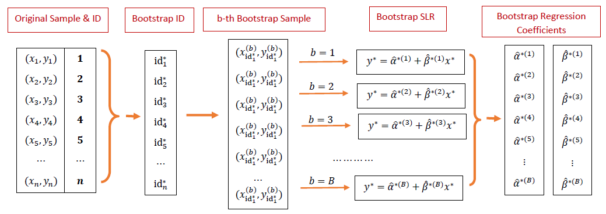
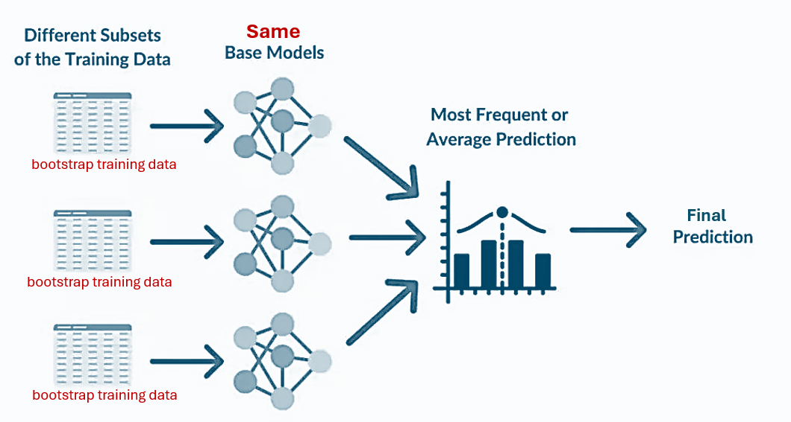
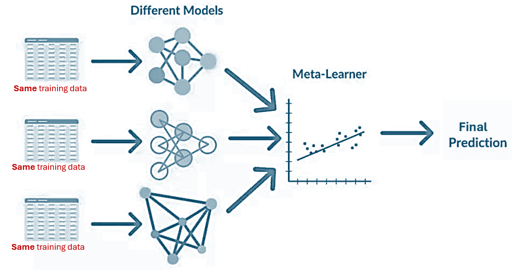
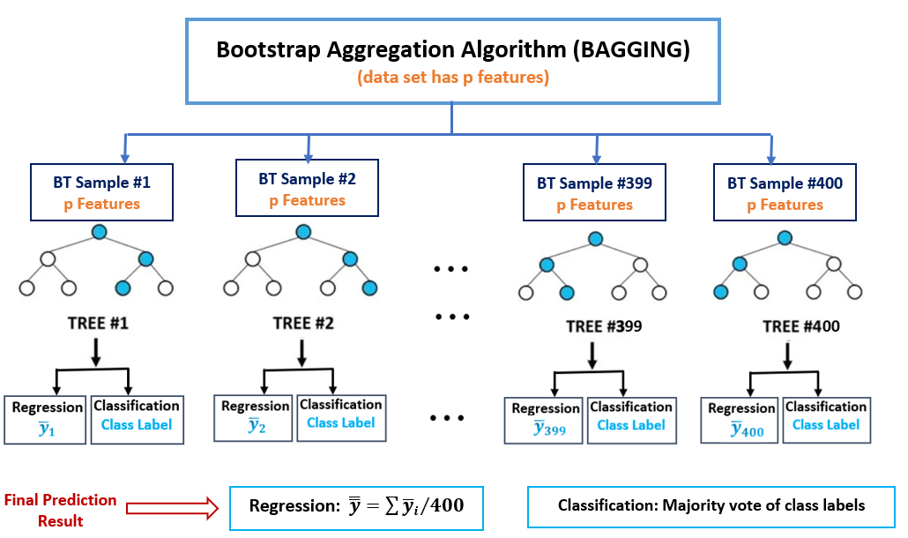

```{=html}

<style type="text/css">

/* Cascading Style Sheets (CSS) is a stylesheet language used to describe the presentation of a document written in HTML or XML. it is a simple mechanism for adding style (e.g., fonts, colors, spacing) to Web documents. */

h1.title {  /* Title - font specifications of the report title */
  font-size: 22px;
  font-weight: bold;
  color: DarkRed;
  text-align: center;
  font-family: "Gill Sans", sans-serif;
}
h4.author { /* Header 4 - font specifications for authors  */
  font-size: 18px;
  font-weight: bold;
  font-family: system-ui;
  color: navy;
  text-align: center;
}
h4.date { /* Header 4 - font specifications for the date  */
  font-size: 18px;
  font-family: system-ui;
  color: DarkBlue;
  text-align: center;
  font-weight: bold;
}
h1 { /* Header 1 - font specifications for level 1 section title  */
    font-size: 22px;
    font-family: "Times New Roman", Times, serif;
    color: navy;
    text-align: center;
    font-weight: bold;
}
h2 { /* Header 2 - font specifications for level 2 section title */
    font-size: 20px;
    font-family: "Times New Roman", Times, serif;
    color: navy;
    text-align: left;
    font-weight: bold;
}

h3 { /* Header 3 - font specifications of level 3 section title  */
    font-size: 18px;
    font-family: "Times New Roman", Times, serif;
    color: navy;
    text-align: left;
}

h4 { /* Header 4 - font specifications of level 4 section title  */
    font-size: 18px;
    font-family: "Times New Roman", Times, serif;
    color: darkred;
    text-align: left;
}

body { background-color:white; }

.highlightme { background-color:yellow; }

p { background-color:white; }

</style>
```

```{r setup, include=FALSE}
# code chunk specifies whether the R code, warnings, and output 
# will be included in the output files.
if (!require("knitr")) {
   install.packages("knitr")
   library(knitr)
}
if (!require("tidyverse")) {
   install.packages("tidyverse")
library(tidyverse)
}
if (!require("palmerpenguins")) {
   install.packages("palmerpenguins")
library(palmerpenguins)
}
if (!require("plotly")) {
   install.packages("plotly")
library(plotly)
}
if (!require("e1071")) {
   install.packages("e1071")
library(e1071)
}
if (!require("mmeln")) {
   install.packages("mmeln")
library(mmeln)
}
if (!require("MASS")) {
   install.packages("MASS")
library(MASS)
}
if (!require("ggplot2")) {
   install.packages("ggplot2")
library(ggplot2)
}
if (!require("plotly")) {
   install.packages("plotly")
library(plotly)
}
if (!require("caret")) {
   install.packages("caret")
library(caret)
}
if (!require("pander")) {
   install.packages("pander")
library(pander)
}
if (!require("randomForest")) {
   install.packages("randomForest")
library(randomForest)
}
if (!require("rpart")) {
   install.packages("rpart")
library(rpart)
}
if (!require("rpart.plot")) {
   install.packages("rpart.plot")
library(rpart.plot)
}
if (!require("ipred")) {
   install.packages("ipred")
library(ipred)
}
if (!require("mlbench")) {
   install.packages("mlbench")
library(mlbench)
}
if (!require("pROC")) {
   install.packages("pROC")
library(pROC)
}
## 
knitr::opts_chunk$set(echo = TRUE,   
                      warning = FALSE, 
                      results = TRUE, 
                      message = FALSE,
                      comment = NA
                      )  
```

\

# Introduction

Random Forest (RF) is a powerful and versatile machine-learning algorithm that has gained widespread popularity due to its robustness, accuracy, and ease of use. It is an ensemble learning method that combines multiple decision trees to improve predictive performance and reduce overfitting. The algorithm is particularly useful in scenarios where the data is complex, noisy, or contains a large number of features. Random Forest is widely used in various fields, including finance, banking, healthcare, and bioinformatics, due to its ability to handle both classification and regression tasks.

For example, Random Forest (RF) has numerous applications in the financial and banking industries. The following is a list of applications.

*	Credit Scoring: Predicting the likelihood of a borrower defaulting on a loan.
*	Fraud Detection: Identifying fraudulent transactions based on historical data.
*	Portfolio Management: Predicting stock prices or identifying optimal asset allocations.
*	Risk Management: Assessing the risk associated with various financial instruments.

RF is built based on classification and regression tree (CART) using bootstrap methods. We will first briefly introduce the CART and bootstrap methods before discussing  RF and its relationship with other machine learning models and algorithms.


# Bootstrap Regression

Bootstrap methods are a class of resampling techniques used for statistical inference, particularly when theoretical distributions are complex or unknown. The bootstrap estimates the sampling distribution of a statistic by repeatedly resampling with replacement from the observed data and recalculating the statistic for each resample. The key features are

* **Non-parametric**: Makes no assumptions about the underlying population distribution.

* **Resampling with replacement**: Each bootstrap sample is the same size as the original dataset, but observations may be repeated.

* **Estimates uncertainty**: Provides standard errors, confidence intervals, and bias corrections.

\

## Bootstrap Sampling Distribution

The bootstrap sampling distribution of sample means is an empirical approximation of the true sampling distribution of the mean, constructed by:

* Repeatedly resampling the original data with replacement.
* Calculating the mean for each resample.
* Analyzing the distribution of these bootstrap means.

Consider the sampling distribution of sample means. According to the Central Limit Theorem (CLT), the sampling distribution of the sample mean is approximately normally distributed when the sample size is sufficiently large. Using this distribution, we can construct a confidence interval (CI) for the population mean 
$\mu$.

However, if the CLT assumptions are not satisfied (e.g., small sample size, heavy skewness, or outliers), we cannot rely on the asymptotic normality of the sample mean to construct valid confidence intervals. In such cases, the bootstrap sampling distribution provides a flexible alternative for inference, as it does not require strict distributional assumptions and can adapt to the underlying data structure.


```{r fig.align='center', out.width="90%"}
include_graphics("img/w09-BootSamplingDist.jpg")
```

As an example, we estimate the median value of owner-occupied homes in the Boston Housing Data.

```{r fig.align='center', fig.width=7, fig.height=5}
#library(MASS)
data(Boston)
medv <- Boston$medv  # Median home values

# Set seed for reproducibility
set.seed(123)

# Generate B = 1000 bootstrap samples
B <- 1000
boot_means <- replicate(B, mean(sample(medv, replace = TRUE)))

# Compare bootstrap vs. theoretical results
original_mean <- mean(medv)
bootstrap_mean <- mean(boot_means)
bootstrap_se <- sd(boot_means)
CI <- quantile(boot_means, c(0.025, 0.975))
###
hist(boot_means, main = "Bootstrap Distribution Mean Median Prices", xlab="median home prices")
text(23.5, 150, paste("Bootstrap Mean:", round(bootstrap_mean,4)), cex = 0.8)
text(23.5, 135, paste("Bootstrap standar error:", round(bootstrap_se,4)), cex = 0.8)
text(23.5, 90, paste("95% CI: (", round(CI[1],4), ", ", round(CI[2],4), ")"), cex = 0.8)
text(CI[1], 15, paste(round(CI[1],4)), cex = 0.8, col = "red")
text(CI[2], 15, paste(round(CI[2],4)), cex = 0.8, col = "red")

points(quantile(boot_means, c(0.025, 0.975)), c(0,0),
       pch=19, cex = 2, col = "red")
```


## Bootstrap Regression

Imagine we’ve collected some data and fit a regression model, but we are unsure whether the standard errors and confidence intervals from classical theory (which rely on normality assumptions) are trustworthy. What if the sample is small, residuals are skewed, or data violates regression assumptions?

This is where **bootstrap regression** comes in—a powerful, flexible method that lets you estimate uncertainty empirically by treating your original data set as a **miniature population** and repeatedly resampling from it.


```{r fig.align='center', out.width="90%"}

```

To illustrate, next, we will build a multiple linear regression with two variables using the Boston Housing Data.

$$
\text{medv} = \beta_0 + \beta_1 \text{lstat} + \beta_2\text{rm}
$$

The objective is to construct confidence intervals of regression coefficients based on the sample without assuming the normality of the residuals.


```{r}
#library(MASS)
data(Boston)

# Fit original model
lin.model <- lm(medv ~ lstat + rm, data = Boston)

# Generate 1000 bootstrap coefficient estimates
set.seed(123)
coef.mtx <- matrix(rep(0,3*1000), ncol=3, nrow=1000)
for (i in 1:1000){
  resample_rows <- sample(nrow(Boston), replace = TRUE)
  coef.mtx[i,] <- coef(lm(medv ~ lstat + rm, data = Boston[resample_rows, ]))
}
colnames(coef.mtx) <- c("intercept", "lstat", "rm")
ceof.mtx.data.frame <- as.data.frame(coef.mtx)
# 95% CI for 'lstat' coefficient
#quantile(boot_coefs["lstat",], c(0.025, 0.975))
```

Following the bootstrap regression workflow outlined earlier, we generate 1,000 bootstrap samples to construct $95\%$ confidence intervals for the regression coefficients presented below.


```{r}
pander(t(apply(coef.mtx, 2, function(x) quantile(x, c(0.025, 0.975)))))
```

For comparison, we also report conventional inferential statistics derived under the assumptions of normality and homoscedasticity.


```{r}
pander(summary(lin.model)$coef)
```

As demonstrated in the above two tables, both bootstrap regression and conventional linear regression produce consistent results regarding the statistical significance of the regression coefficients.

\


# Concepts of Ensemble Learning

Ensemble learning is a technique that **combines the predictions of multiple models to improve overall performance**. The idea is that by combining the strengths of **different models**, the ensemble can achieve better predictive accuracy than any single model. 


Bagging, boosting, and stacking are three key ensemble learning techniques designed to improve machine learning model performance. 

**Bagging (Bootstrap Aggregating)** trains multiple instances of a base model on different random subsets of the training data (sampled with replacement) and combines their predictions through averaging or voting to reduce variance and overfitting - exemplified by the **Random Forest** algorithm, which builds numerous decision trees on varied data samples. 

```{r fig.align='center', out.width="90%"}

```


**Boosting** iteratively trains weak learners, adjusting for errors in previous models to create a strong ensemble, as seen in algorithms like **AdaBoost** and **Gradient Boosting**. 

```{r fig.align='center', out.width="90%"}
include_graphics("img/boosting-idea.png")
```


**Stacking**, on the other hand, blends predictions from diverse base models using a meta-model to learn optimal combinations, further enhancing predictive accuracy. 

```{r fig.align='center', out.width="90%"}

```


In ensemble learning, each method leverages model diversity to improve robustness and generalization beyond what a single model could achieve.

The following two sections focus on **Random Forests** that, as mentioned earlier, is an ensemble learning method that constructs a multitude of decision trees at training time and outputs **the mode of the classes** (<font color = "blue">*for classification*</font>) or **the mean prediction** (<font color = "blue">*for regression*</font>) of the individual trees. The key idea is to introduce randomness in the tree-building process to ensure that the trees are diverse, which helps to reduce overfitting. We consider **BAGGING (Bootstrap Aggregation with CART)** as a simplified version of **random forests**.


# Bootstrap Aggregation

**Bootstrap Aggregation**, commonly known as **BAGGING**, is an ensemble learning technique designed to improve the stability and accuracy of machine learning algorithms, particularly those that exhibit high variance, such as decision trees. Proposed by [Leo Breiman](https://en.wikipedia.org/wiki/Leo_Breiman) in 1996, BAGGING operates on the principle of reducing variance by **averaging** (for regression) or **voting over** (for classification) multiple models trained on different bootstrap samples of the data set.

```{r fig.align='center', out.width="90%"}

```


The bootstrap aggregation (BAGGING) is built based on the following methods.

**Bootstrap Sampling**: Given a data set of size n, BAGGING generates B bootstrap samples, each of size n, by randomly selecting observations **with replacement**. This means some observations may appear multiple times in a sample, while others may be left out - out-of-bag (OOB) observations.

**Model Aggregation**: For regression, predictions from the B models are averaged to produce the final prediction. For classification, the majority vote across the B models determines the final class label.

**Variance Reduction**: By averaging multiple models, BAGGING reduces the variance without increasing bias, leading to better generalization performance compared to a single model.

The BAGGING process is similar to the tree models introduced in the previous note. The same set of performance measures used in tree models will be used to assess the goodness of the BAGGING method.


## BAGGING Regression

This subsection explores Bagging regression using regression trees as the base learners. Since we have already covered the logical steps for training a single regression tree, we will apply the same principles to fit bagging trees. The process involves generating multiple bootstrap samples from the training data, training individual regression trees on each subset, and aggregating their predictions—typically through averaging—to produce a more robust and stable regression model. This ensemble approach reduces variance and enhances generalization compared to a single regression tree.


**Hyperparameter Tuning**

In the CART examples from the previous note, four key hyperparameters - `cp` (complexity parameter), `maxdepth` (maximum tree depth), `minsplit` (minimum split size), and `minbucket` (minimum leaf size) - were tuned to regulate tree growth and prevent overfitting. For simplicity, this demonstration focuses on tuning only `cp` and `maxdepth`, while the remaining parameters retain their default values as specified below:

  + `minsplit` = 20, 
  + `minbucket` = round(`minsplit`/3), 
  + `maxcompete` = 4, 
  + `maxsurrogate` = 5, 
  + `usesurrogate` = 2, 
  + `xval` = 10,
  + `surrogatestyle` = 0, 

The dataset is partitioned into 80% training and 20% testing subsets, with hyperparameter optimization conducted via **5-fold cross-validation** on the training partition to balance bias-variance trade-offs.


```{r}
# Load required packages
#library(mlbench)
#library(caret)
#library(ipred)
#library(rpart)

# Load the Boston Housing dataset
data(Boston)
data <- Boston

# Split the data
set.seed(123)
train.index <- createDataPartition(data$medv, p = 0.8, list = FALSE)
train.data <- data[train.index, ]
test.data <- data[-train.index, ]

# Set up train control for cross-validation
ctrl <- trainControl(
  method = "cv",
  number = 5,
  verboseIter = TRUE
)

# Define parameter combinations to test
nbagg.values <- c(10, 25, 50)     # number bagged trees
cp.values <- c(0.01, 0.05, 0.1)   # candidate cp values
maxdepth.values <- c(5, 10, 20)   # maximum depth of the candidate tree

# Create an empty data frame to store results
results <- data.frame()
######## Model tuning
# Manual tuning loop
for (nbagg in nbagg.values) {
  for (cp in cp.values) {
    for (maxdepth in maxdepth.values) {
      set.seed(123)
      model <- bagging(
        medv ~ .,
        data = train.data,
        nbagg = nbagg,
        coob = TRUE,
        trControl = ctrl,
        control = rpart.control(cp = cp, 
                                maxdepth = maxdepth)
       )
      # Get OOB error from each iteration
      oob.error <- model$err
      # Store results
      results <- rbind(results, 
                       data.frame( nbagg = nbagg,
                                   cp = cp,
                                   maxdepth = maxdepth,
                                   oob.error = oob.error))
    }
  }
}
# Find the best combination that yields the minimum out-of-bag's error
best.params <- results[which.min(results$oob.error), ]
pander(best.params)
```

The above table gives the values of the tuned hyperparameters.


**Final Model Identification**

We employ the `bagging()` function from the R package `ipred` to train the final bagging regression model. The model's predictive performance is evaluated on the test set using standard error metrics, which are then compared against both the base regression tree and ordinary least squares (OLS) regression. The following table summarizes the `bagging` model's out-of-sample performance on the Boston Housing dataset.

```{r}
# Train the final model with the best parameters
final.model <- bagging(
  medv ~ .,
  data = train.data,
  nbagg = best.params$nbagg,
  coob = TRUE,
  trControl = ctrl,
  control = rpart.control(cp = best.params$cp, 
                          maxdepth = best.params$maxdepth),
  
  importance = TRUE
)

# Evaluate on test set
predictions <- predict(final.model, newdata = test.data)
## Using the caret function to calculate errors across re-samples
baggedError <- postResample(pred = predictions, obs = test.data$medv)
pander(baggedError)
```

**Variable Importance**

Following the same approach as in the regression tree model, we extract the bagging model's variable importance rankings from `bagging()` using a custom R function. The relative importance scores - derived via permutation-based scoring from the bagging ensemble - are then visualized in the bar chart below. 

While the interpretation of variable importance remains the same as the discussion in previous notes, we will not reiterate it here.


```{r}
##
var.imp <- varImp(final.model)
# Extract variable importance (requires a custom function)
get.bagging.importance <- function(model) {
  # Get all the trees from the bagging model
  trees <- model$mtrees
  
  # Initialize importance vector
  imp <- numeric(length(trees[[1]]$btree$variable.importance))
  names(imp) <- names(trees[[1]]$btree$variable.importance)
  
  # Sum importance across all trees
  for(tree in trees) {
    imp[names(tree$btree$variable.importance)] <- 
      imp[names(tree$btree$variable.importance)] + 
      tree$btree$variable.importance
  }
  
  # Average importance
  imp <- imp/length(trees)
  return(imp)
}
```

```{r fig.align='center', fig.width=4, fig.height=5}
# Get importance
importance.scores <- get.bagging.importance(final.model)

# Sort and plot
importance.scores <- sort(importance.scores, decreasing = TRUE)
barplot(importance.scores, horiz = TRUE, las = 1,
        main = "Variable Importance - Bagging (ipred)",
        xlab = "Importance Score")
```


**Performance Comparison**

We now evaluate the performance of the bagged tree model against two benchmark models: (1) an optimized base regression tree (pruned using the complexity parameter cp that minimized cross-validation error) and (2) a standard Gaussian linear regression model. The following comparison assesses their predictive accuracy on the test set.


```{r}
##
## ordinary LSE regression model with step-wise variable selection
lse.fit <- lm(medv~.,data = train.data)
AIC.fit <- stepAIC(lse.fit, direction="both", trace = FALSE)
##
pred.lse <- predict(AIC.fit, test.data)
mae.lse <- mean(abs(test.data$medv - pred.lse)) # mean absolutesquare error
mse.lse <- mean((test.data$medv - pred.lse)^2)  # mean square error
rmse.lse <- sqrt(mse.lse)                       # root mean square error
r.squared.lse <- (cor(test.data$medv, pred.lse))^2 # r-squared
##
# Base regression tree
tree.model <- rpart(medv ~ ., 
                    data = train.data,
                    method = "anova",     # For regression
                    control = rpart.control(
                      minsplit = 20,    # 3. Stopping rule: min observations to split
                      minbucket = 7,    # Min observations in terminal node
                      cp = seq(0, 0.05, 20), # Complexity parameter
                      maxdepth = 5      # Maximum tree depth
                    ))
# cp table
cp.table <- tree.model$cptable
##
## Identify the minimum `xerror` and its `cp`.
min.xerror <- min(cp.table[, "xerror"])
min.cp.row <- which.min(cp.table[, "xerror"])
min.cp <- cp.table[min.cp.row, "CP"]
##
pruned.tree.min.cp <- prune(tree.model, cp = min.cp)
pred.min.cp <- predict(pruned.tree.min.cp, newdata = test.data)
##
# min.cp
mae.tree.min.cp <- mean(abs(test.data$medv - pred.min.cp))
mse.tree.min.cp <- mean((test.data$medv - pred.min.cp)^2)
rmse.tree.min.cp <- sqrt(mse.tree.min.cp)
r.squared.tree.min.cp <- cor(test.data$medv, pred.min.cp)^2
##
###
Errors <- cbind(MAE = c(baggedError[1], mae.tree.min.cp, mae.lse),
          RMSE = c(baggedError[3], rmse.tree.min.cp, rmse.lse),
          r.squared = c(baggedError[2], r.squared.tree.min.cp, r.squared.lse))
rownames(Errors) = c("bagged Tree", "tree.min.cp", "lse")
pander(Errors)
```

The above comparison table shows that the bagging tree model performs significantly better than the base regression and the ordinary least square regression models.


## BAGGING Classification

The implementation of bagging classification follows a structured workflow involving data splitting, model training, hyperparameter tuning, final model selection, and performance evaluation. We will continue to use the  Pima Indian Diabetes Data to demonstrate the implementation of BAGGING classification.

**Hyperparameter Tuning**

The hyperparameters to be tuned in BAGGING classification algorithms are

* **nbagg**: Number of bootstrap samples (trees)
* **control**: Parameters for the base learner (rpart in this case)
* **minsplit**: Minimum number of observations in a node before splitting
* **maxdepth**: Maximum depth of the tree
* **cp**: Complexity parameter

We will use `expand.grid` in base R to create a data frame from all combinations of the supplied vectors or factors so that we tune multiple hyperparameters in a single loop.

```{r}
# Load necessary libraries
# library(caret)     # For machine learning functions
# library(ipred)     # For bagging implementation
# library(rpart)     # For decision trees (default base learner)
# library(mlbench)   # Contains the Pima Indians Diabetes dataset

# Load the dataset
data("PimaIndiansDiabetes", package = "mlbench")
diabetes <- PimaIndiansDiabetes
#
# Set seed for reproducibility
set.seed(123)

# Split data into training and testing sets
trainIndex <- createDataPartition(diabetes$diabetes, p = 0.7, list = FALSE)
trainData <- diabetes[trainIndex, ]
testData <- diabetes[-trainIndex, ]

# Create a grid of hyperparameter combinations
hyper.grid <- expand.grid(
  nbagg = c(25, 50, 100),
  minsplit = c(5, 10, 20),
  maxdepth = c(5, 10, 20),
  cp = c(0.01, 0.001)
)
# Initialize a results data frame
results <- data.frame() # store values of tuned hyperparameters
best.accuracy <- 0      # store accuracy
best.params <- list()   # store best values of hyperparameter

# Loop through each hyperparameter combination
for(i in 1:nrow(hyper.grid)) {
  # Get current hyperparameters
  params <- hyper.grid[i, ]
  
  # Set rpart control parameters
  rpart.control <- rpart.control(
    minsplit = params$minsplit,
    maxdepth = params$maxdepth,
    cp = params$cp
  )
  
  # Train bagging model
  bag.model <- bagging(
    diabetes ~ .,
    data = trainData,
    nbagg = params$nbagg,
    coob = TRUE,
    control = rpart.control
  )
  
  # Make predictions: default cut-off 0.5
  preds <- predict(bag.model, newdata = testData)
  
  # Calculate accuracy
  cm <- confusionMatrix(preds, testData$diabetes)
  accuracy <- cm$overall["Accuracy"]
  
  # Store results
  results <- rbind(results, data.frame(
    nbagg = params$nbagg,
    minsplit = params$minsplit,
    maxdepth = params$maxdepth,
    cp = params$cp,
    Accuracy = accuracy
  ))
  
  # Update best parameters if current model is better
  if(accuracy > best.accuracy) {
    best.accuracy <- accuracy
    best.params <- params
  }
  
  # Print progress
  #cat("Completed", i, "of", nrow(hyper.grid), "combinations\n")
}
pander(best.params)
```

The above-tuned values of hyperparameters will be used to fit the final BAGGING classification model.


**Train Final Model With Best Hyperparameters**

The R function `bagging()`


```{r}
# Set rpart control with best parameters
best.control <- rpart.control(
  minsplit = best.params$minsplit,
  maxdepth = best.params$maxdepth,
  cp = best.params$cp
)

# Train final model
final.bag.model <- bagging(
  diabetes ~ .,
  data = trainData,
  nbagg = best.params$nbagg,
  coob = TRUE,
  control = best.control
)

# Evaluate on test set
final.preds <- predict(final.bag.model, newdata = testData)
final.cm <- confusionMatrix(final.preds, testData$diabetes)
final.cm$table
```

The apply the resulting BAGGING classification tree to the test data to predict diabetes status with the default cut-off probability, we have the above confusion matrix. With the confusion matrix, we can calculate variable performance measures.


**Global Measures and Comparisons**

We will compare the BAGGING classification model with the base classification tree as well as the logistic regression model using ROC analysis and the area under the corresponding curves.

```{r fig.align='center', fig.width=6, fig.height=6}
########################
###  logistic regression
logit.fit <- glm(diabetes ~ ., data = trainData, family = binomial)
AIC.logit <- step(logit.fit, direction = "both", trace = 0)
pred.logit <- predict(AIC.logit, testData, type = "response")
##
# Build the initial classification tree
tree.model <- rpart(diabetes ~ ., 
                    data = trainData,
                    method = "class",   # classification tree
                    parms = list(split = "gini",  # Using Gini index
                                 # FN cost = 1, FP cost = 0.5
                                 loss = matrix(c(0, 0.5, 1, 0), nrow = 2)  
                                 ),
                    control = rpart.control(minsplit = 15,  # Min 15 obs to split
                                           minbucket = 5,   # Min 7 obs in leaf
                                           # Complexity parameter
                                           cp = 0.001, # complex parameter
                                           maxdepth = 5))   # Max tree depth
###
min.cp <- tree.model$cptable[which.min(tree.model$cptable[,"xerror"]),"CP"]

# Prediction with three candidate models
pruned.tree.min <- prune(tree.model, cp = min.cp)
pred.prob.min <- predict(pruned.tree.min, testData, type = "prob")[,2]
pred.prob.bagg <- predict(final.bag.model, newdata = testData, type = "prob")[,2]
##
# ROC object
roc.tree.min <- roc(testData$diabetes, pred.prob.min)
roc.logit <- roc(testData$diabetes, pred.logit)
roc.bagg <- roc(testData$diabetes, pred.prob.bagg)
##
##
### Sen-Spe
bagg.sen <- roc.bagg$sensitivities
bagg.spe <- roc.bagg$specificities
#
tree.min.sen <- roc.tree.min$sensitivities
tree.min.spe <- roc.tree.min$specificities
#
logit.sen <- roc.logit$sensitivities
logit.spe <- roc.logit$specificities
## AUC
auc.bagg <- roc.bagg$auc
auc.tree.min <- roc.tree.min$auc
auc.logit <- roc.logit$auc
###
plot(1-logit.spe, logit.sen,  
     xlab = "1 - specificity",
     ylab = "sensitivity",
     col = "darkred",
     type = "l",
     lty = 1,
     lwd = 1,
     main = "ROC: Classification Models")
lines(1-bagg.spe, bagg.sen, 
      col = "blue",
      lty = 1,
      lwd = 1)
lines(1-tree.min.spe, tree.min.sen,      
      col = "orange",
      lty = 1,
      lwd = 1)
abline(0,1, col = "skyblue3", lty = 2, lwd = 2)
legend("bottomright", c("Logistic", "bagg", "Tree Min"),
       lty = c(1,1,1), lwd = rep(1,3),
       col = c("red", "blue", "orange"),
       bty="n",cex = 0.8)
## annotation - AUC
text(0.8, 0.46, paste("Logistic AUC: ", round(auc.logit,4)), cex = 0.8)
text(0.8, 0.4, paste("Bagg AUC: ", round(auc.bagg,4)), cex = 0.8)
text(0.8, 0.34, paste("Tree Min AUC: ", round(auc.tree.min,4)), cex = 0.8)
```


In terms of model performance ranking, the logistic regression model is the best. BAGGING is marginally better than the base tree model.

\


# Random Forest

Random Forest (RF) is an ensemble learning method that constructs multiple decision or regression trees during training and outputs the mode of the classes (for classification) or the mean prediction (for regression) of the individual trees. The method was introduced in 2001 and is built upon the principles of bagging (Bootstrap Aggregating) and random feature selection, which enhance model accuracy and control overfitting.

Unlike a single regression/classification tree, which can overfit noisy data, a Random Forest introduces randomness in two key ways:

* **Bootstrap Sampling** (Random Sampling with Replacement): Each tree is trained on a different random subset of the training data (i.e., bootstrap data sets).

* **Feature Randomness**: At each split in a decision tree, only a **random subset of features** is considered, reducing correlation among trees and enhancing diversity.

The final prediction is obtained by averaging (for regression) or majority voting (for classification) the predictions of all individual trees, leading to a more stable and accurate model compared to a single decision tree. Random Forests are particularly effective in handling high-dimensional data, nonlinear relationships, and interactions between predictors without requiring extensive feature engineering.


## Random Forest Regression

**Random Forest Regression** combines multiple **regression trees** to produce a robust and accurate predictive model. It operates on the principle of bootstrap aggregation (bagging), where numerous regression trees are trained on **different bootstrap data sets** with **different subsets of randomly selected feature variables**, and their predictions are averaged to reduce variance and improve generalization.

### Regression Process

The same modeling process of BAGGING regression applies to the **random forest** regression. It begins by splitting the dataset into training and testing sets to evaluate the model’s performance on unseen data. During training, each regression tree is built using a **bootstrap sample** and **random feature subsets**, with splits optimized to minimize Mean Squared Error (MSE), achieving reduced overfitting. **Hyperparameter tuning** - such as adjusting the number of trees, tree depth, and minimum samples per leaf - is performed using cross-validation to optimize model accuracy. The best configuration is then retrained on the full training set, with final predictions derived by averaging the outputs of all trees. Performance is assessed using metrics like MSE, RMSE, and $R^2$ to assess prediction accuracy and variance explanation.

### Random Forest Implementation

This subsection demonstrates the basic steps in the implementation of random forest using Boston Housing Data. The objective is to predict the median house prices and then compare them with related competitors.


**I. Data Splitting**
  
As usual, we use the two-way random splitting mechanism to define training and testing data sets. The training data set will be split further for cross-validation when tuning hyperparameters.

```{r}
# Load required packages
# library(randomForest)
# library(MASS)  # Contains Boston Housing dataset
# library(ggplot2)
# library(caret)

# Load the Boston Housing dataset
data(Boston)

# 
set.seed(123)  # For reproducibility
train.index <- sample(1:nrow(Boston), 0.7 * nrow(Boston))
train.data <- Boston[train.index, ]
test.data <- Boston[-train.index, ]
```


**II. Hyperparameter Tuning**

Among many hyperparameters, the following are four key ones. 

* **ntree**: Number of trees in the forest. 
* **mtry**: Number of feature variables randomly sampled as candidates at each split. The default is $\sqrt{p}$, $p$ -s the number of feature variables in the data set. <font color = "blue"> `mtry = p` induces BAGGING regression trees. </font>
* **nodesize**: Minimum size of terminal nodes.
* **maxnodes**: Maximum number of terminal nodes.

Next, we will tune these hyperparameters through an explicit 5-fold cross-validation. From a coding perspective, we will define a data frame to store all possible combinations of hyperparameters and then use a single loop to complete the tuning step and report the **optimal** hyperparameters. 


<font color = "darkred"> **Note**:  The complexity parameter (`cp`) is actually **not** a parameter used in **Random Forest** models - it's a parameter specific to decision trees (like those created with `rpart` in R). Random Forest, being an ensemble of decision trees, has different tuning parameters. </font>


```{r}
# Create a grid (data frame) of hyperparameter combinations to test
hyper.grid <- expand.grid(
  ntree = c(100, 300, 500),    
  mtry = c(3, 5, 7), # Dependent on the total number features available in the data
  nodesize = c(1, 3, 5), 
  maxnodes = c(5, 10, 20, NULL)
)
##
# Initialize results storage
results <- data.frame()  # combination of hyperparameters and corresponding RMSE
best.rmse <- Inf         # place-holder of RMSE with initial value inf
best.params <- list()    # update the hyperparameter list according to the best rmse

# Set up k-fold cross-validation
k <- 5                   # 5-fold cross-validation
n0 <- dim(train.data)[1] # size of the training data 
fold.size <- floor(n0/k) # fold size. Caution: floor() should be used. 
                         # round( ,0) should be used. why?

# Loop through each hyperparameter combination
for(i in 1:nrow(hyper.grid)) {           
  current.params <- hyper.grid[i, ]   # vector of hyperparameters for cross validation
  cv.errors <- numeric(k)             # store RMSE from cross-validation
  
  # Perform k-fold cross-validation
  for(j in 1:k) {
    # Split into training and validation folds
    valid.indices <- (1 + fold.size*(j-1)):(fold.size*j)  # CV observation ID vector
    cv.train <- train.data[-valid.indices, ]   # training data in cross-validation
    cv.valid <- train.data[valid.indices, ]    # testing data in cross-validation
    
    # Train model with current parameters
    rf.model <- randomForest(
      medv ~ .,
      data = cv.train,
      ntree = current.params$ntree,
      mtry = current.params$mtry,
      nodesize = current.params$nodesize,
      maxnodes = current.params$maxnodes,
      importance = TRUE
    )
    
    # Make predictions on validation set
    preds <- predict(rf.model, newdata = cv.valid)    
    
    # Calculate RMSE
    cv.errors[j] <- sqrt(mean((preds - cv.valid$medv)^2))
  }
  
  # Average RMSE across folds
  avg.rmse <- mean(cv.errors)    
  
  # Store results: the data frame defined to store combinations of hyperparameters
  # and the resulting mean RMSEs from cross-validation
  results <- rbind(results, data.frame(
    ntree = current.params$ntree,
    mtry = current.params$mtry,
    nodesize = current.params$nodesize,
    maxnodes = ifelse(is.null(current.params$maxnodes), "NULL", current.params$maxnodes),
    rmse = avg.rmse
  ))
  
  # Update best parameters if current model is better
  if(avg.rmse < best.rmse) {
    best.rmse <- avg.rmse
    best.params <- current.params
  }
  # Print progress: It is always a good idea to print something out in loops
  # cat(paste0("Completed ", i, "/", nrow(hyper.grid), " - RMSE: ", round(avg.rmse, 4), "\n"))
}  
pander(data.frame(cbind(current.params,best.rmse)))    # resulting tuned hyperparameters
```

**III. Final Model Retaining and Evaluation**

The final predictive mode needs to be retained using the training data and the tuned hyperparameters obtained in the above step.

```{r fig.align='center', fig.width=5, fig.height=5}
# Train final model with best parameters on full training set
final.rf <- randomForest(
  medv ~ .,
  data = train.data,
  ntree = best.params$ntree,
  mtry = best.params$mtry,
  nodesize = best.params$nodesize,
  maxnodes = best.params$maxnodes,
  importance = TRUE
)

# View model summary
# print(final.rf)
# Make predictions on test set
test.preds <- predict(final.rf, newdata = test.data)

# Calculate test RMAE
test.mae <- mean(abs(test.preds - test.data$medv))
# Calculate test RMSE
test.rmse <- sqrt(mean((test.preds - test.data$medv)^2))
# Calculate R-squared
test.r2 <- 1 - sum((test.data$medv - test.preds)^2) / sum((test.data$medv - mean(test.data$medv))^2)
# cat("Test R-squared:", test.r2, "\n")

### Performance vector
RF.performance = c(test.mae, test.rmse, test.r2)

# Plot actual vs predicted values
plot.data <- data.frame(Actual = test.data$medv, Predicted = test.preds)
ggplot(plot.data, aes(x = Actual, y = Predicted)) +
  geom_point() +
  geom_abline(intercept = 0, slope = 1, color = "red") +
  labs(title = "Actual vs Predicted Values",
       x = "Actual Median Value ($1000s)",
       y = "Predicted Median Value ($1000s)") +
  theme_minimal()
```

**IV. Performance Comparisons Among Competitors**

Next, we compare the performance of random forest regression with least square linear regression, base regression tree, and BAGGING regression for predicting the median house value using the Boston Housing Data.

```{r}
## ordinary LSE regression model with step-wise variable selection
lse.fit <- lm(medv~.,data = train.data)
AIC.fit <- stepAIC(lse.fit, direction="both", trace = FALSE)
pred.lse <- predict(AIC.fit, test.data)
mae.lse <- mean(abs(test.data$medv - pred.lse))      # mean absolute error
mse.lse <- mean((test.data$medv - pred.lse)^2)       # mean square error
rmse.lse <- sqrt(mse.lse)                            # root mean square error
r.squared.lse <- (cor(test.data$medv, pred.lse))^2 # r-squared

### base regression tree
tree.model <- rpart(medv ~ ., 
                    data = train.data,
                    method = "anova",     # For regression
                    control = rpart.control(
                      minsplit = 20,    # 3. Stopping rule: min observations to split
                      minbucket = 7,    # Min observations in terminal node
                      cp = seq(0, 0.05, 20), # Complexity parameter
                      maxdepth = 5      # Maximum tree depth
                    ))
cp.table <- tree.model$cptable
min.xerror <- min(cp.table[, "xerror"])
min.cp.row <- which.min(cp.table[, "xerror"])
min.cp <- cp.table[min.cp.row, "CP"]
## 
pruned.tree.min.cp <- prune(tree.model, cp = min.cp)
pred.min.cp <- predict(pruned.tree.min.cp, newdata = test.data)
# performance measures
mae.tree.min.cp <- mean(abs(test.data$medv - pred.min.cp))   # MAD
mse.tree.min.cp <- mean((test.data$medv - pred.min.cp)^2)
rmse.tree.min.cp <- sqrt(mse.tree.min.cp)                    # MSE
r.squared.tree.min.cp <- cor(test.data$medv, pred.min.cp)^2  # R.sq

### bagging regression: from the previous section
BaggPerf <- baggedError 

### Performance Comparison Table
Errors <- cbind(MAE = c(mae.lse, mae.tree.min.cp, BaggPerf[3], RF.performance[1]),
                RMSE = c(rmse.lse, rmse.tree.min.cp, BaggPerf[1], RF.performance[2]),
                r.squared = c(r.squared.lse, r.squared.tree.min.cp, BaggPerf[2],RF.performance[3]))
rownames(Errors) = c("LS Regression", "Regression Tree", "BAGGING", "Random Forest")
pander(Errors)

```

The performance table above demonstrates that tree-based models consistently outperform the least squares linear regression model. Among the tree-based algorithms, random forest regression performs slightly better than bagging regression, though both surpass the single regression tree in accuracy.

**V. Variable Importance**

The following variable importance plots are based on the MSE and node impurity. The use and interpretation of variable importance plots have been outlined previously. 


```{r fig.align='center', fig.width=5, fig.height=5}
# View variable importance
varImpPlot(final.rf, pch = 19, main = "Variable Importance")
```


\

## Random Forest Classification

Implementing a random forest classification model begins with splitting the dataset into training and testing sets. Once the data is prepared, an initial random forest model is trained using default hyperparameters, such as the number of decision trees, maximum tree depth, and minimum samples required to split a node. The out-of-bag (OOB) error or cross-validation metrics like accuracy, precision, recall, and F1-score are used to assess the baseline performance. Feature importance analysis can also be conducted to identify the most influential predictors in the model.

In this subsection, we will manually tune a Random Forest model using custom loops in R, evaluating different hyperparameter combinations on the **Pima Indians Diabetes** data set. This approach provides full control over the tuning process and helps understand how each parameter affects model performance.


### Implementation Process

Hyperparameter tuning is then performed to optimize model performance using techniques like grid search. Key hyperparameters will be tuned through 5-fold cross-validation is used to stabilize the AUCs and ensure to identification of the best hyperparameters the final random forest model is retrained on the full training set. The model’s performance is evaluated on the test set using metrics like accuracy, ROC-AUC, and a confusion matrix to assess classification effectiveness.


**Multiple Hyperparameter Tuning**

We perform hyperparameter tuning through 5-fold cross-validation. As mentioned earlier, the key hyperparameters in random forest models are 

* **mtry**: Number of variables randomly sampled as candidates at each split
* **ntree**: Number of trees to grow
* **nodesize**: Minimum size of terminal nodes
* **maxnodes**: Maximum number of terminal nodes trees can have

The performance metric used in the 5-fold cross-validation is the area under the ROC curve (AUC). For each combination of candidate hyperparameters, the model's performance will be evaluated based on the average AUC across all folds.


```{r}
# library(randomForest)
# library(caret)
# library(pROC)

data("PimaIndiansDiabetes2", package = "mlbench")
data <- na.omit(PimaIndiansDiabetes2)

set.seed(123)
train.idx <- createDataPartition(data$diabetes, p = 0.7, list = FALSE)
train.data <- data[train.idx, ]
test.data <- data[-train.idx, ]

# cross-validation setting
k = 5
train.size <- dim(train.data)[1]  # training data size
fold.size <- floor(train.size/k)  # fold size

##
tune.grid <- expand.grid(
  mtry = c(2, 3, 4, 5),
  ntree = c(100, 300, 500),
  nodesize = c(1, 3, 5, 10),
  maxnodes = c(5, 10, 20, NULL)
)
### store hyperparameters and avg of cv AUC
results <- data.frame()
best.auc <- 0.5         # place-holder of AUC, 0.5 = random guess
best.hyp.params <- list()   # update the hyperparameter list according to the best auc

##
for (i in 1:nrow(tune.grid)){
  current.tune.params <- tune.grid[i, ]  # subset of DATA FRAME!! 
  cv.auc <- rep(0,k)
  ##
  for (j in 1:k){
      cv.id <- (1 + (j-1)*fold.size):(j*fold.size)
      cv.train <- train.data[-cv.id, ]
      cv.valid <- train.data[cv.id, ]
      ##
       rf.cv <- randomForest(
                   diabetes ~ .,
                   data = cv.train,
                   mtry = current.tune.params$mtry,
                   ntree = current.tune.params$ntree,
                   nodesize = current.tune.params$nodesize,
                   maxnodes = current.tune.params$maxnodes)
       ##
       prob.cv <- predict(rf.cv, cv.valid, type = "prob")[, "pos"]
       cv.auc[j] <- auc(roc(cv.valid$diabetes, prob.cv))
      }
      ##
      # Average RMSE across folds
      avg.auc <- mean(cv.auc)  
      ##
      # Store results: the data frame defined to store combinations of hyperparameters
      # and the resulting mean RMSEs from cross-validation
      results <- rbind(results, data.frame(
                   mtry = current.tune.params$mtry,
                   ntree = current.tune.params$ntree,
                   nodesize = current.tune.params$nodesize,
                   maxnodes = current.tune.params$maxnodes,
                   auc = avg.auc))
  
     # Update best parameters if current model is better
     if(avg.auc > best.auc) {
           best.auc <- avg.auc
           best.hyp.params <- current.tune.params }
    
}
pander(data.frame(cbind(best.hyp.params,best.auc)))    # resulting tuned hyperparameters

```


\

**Final Model Training and Evaluation**

With the above-tuned hyperparameters, we train the following random forest model. The variable importance is reflected in the 


```{r}
##
final.rf.cls <- randomForest(
      diabetes ~ .,
      data = train.data,
      ntree = best.hyp.params$ntree,
      mtry = best.hyp.params$mtry,
      nodesize = best.hyp.params$nodesize,
      maxnodes = current.tune.params$maxnodes,
      importance = TRUE
     )

test.pred <- predict(final.rf.cls, test.data)
test.prob <- predict(final.rf.cls, test.data, type = "prob")
rf.roc <- roc(test.data$diabetes, test.prob[, "pos"])
test.auc <- auc(rf.roc)
#confusionMatrix(test.pred, test.data$diabetes)
test.auc
```

```{r}
# Variable Importance
varImpPlot(final.rf.cls, pch = 19, main = "Variable Importance of RF Classification" )
```


**Comparison to Competitors**

We now compare the random forest classification model with competitors including BAGGING, classification tree, and logistic regression models using global performance metric AUC.

```{r fig.align='center', fig.width=5, fig.height=5}
########################
###  logistic regression
logit.fit <- glm(diabetes ~ ., data = train.data, family = binomial)
AIC.logit <- step(logit.fit, direction = "both", trace = 0)
pred.logit <- predict(AIC.logit, test.data, type = "response")

# Build the initial classification tree
tree.model <- rpart(diabetes ~ ., 
                    data = train.data,
                    method = "class",   # classification tree
                    parms = list(split = "gini",  # Using Gini index
                                 # FN cost = 1, FP cost = 0.5
                                 loss = matrix(c(0, 0.5, 1, 0), nrow = 2)  
                                 ),
                    control = rpart.control(minsplit = 15,  # Min 15 obs to split
                                           minbucket = 5,   # Min 7 obs in leaf
                                           # Complexity parameter
                                           cp = 0.001, # complex parameter
                                           maxdepth = 5))   # Max tree depth
# Find the optimal cp value that minimizes cross-validated error
min.cp <- tree.model$cptable[which.min(tree.model$cptable[,"xerror"]),"CP"]
pruned.tree.min <- prune(tree.model, cp = min.cp)


# BAGGING
# Create a grid of hyperparameter combinations
hyper.grid <- expand.grid(
  nbagg = c(25, 50, 100),
  minsplit = c(5, 10, 20),
  maxdepth = c(5, 10, 20),
  cp = c(0.01, 0.001)
)
# Initialize a results dataframe
results <- data.frame() # store values of tuned hyperparameters
best.accuracy <- 0      # store accuracy
best.params <- list()   # store best values of hyperparameter

# Loop through each hyperparameter combination
for(i in 1:nrow(hyper.grid)) {
  # Get current hyperparameters
  params <- hyper.grid[i, ]
  
  # Set rpart control parameters
  rpart.control <- rpart.control(
    minsplit = params$minsplit,
    maxdepth = params$maxdepth,
    cp = params$cp
  )
  
  # Train bagging model
  bag.model <- bagging(
    diabetes ~ .,
    data = train.data,
    nbagg = params$nbagg,
    coob = TRUE,
    control = rpart.control
  )
  
  # Make predictions: default cut-off 0.5
  preds <- predict(bag.model, newdata = test.data)
  
  # Calculate accuracy
  cm <- confusionMatrix(preds, test.data$diabetes)
  accuracy <- cm$overall["Accuracy"]
  
  # Store results
  results <- rbind(results, data.frame(
    nbagg = params$nbagg,
    minsplit = params$minsplit,
    maxdepth = params$maxdepth,
    cp = params$cp,
    Accuracy = accuracy
  ))
  
  # Update best parameters if current model is better
  if(accuracy > best.accuracy) {
    best.accuracy <- accuracy
    best.params <- params
  }
}
# Set rpart control with best parameters
best.control <- rpart.control(
  minsplit = best.params$minsplit,
  maxdepth = best.params$maxdepth,
  cp = best.params$cp
)

# Train final model
final.bag.model <- bagging(
  diabetes ~ .,
  data = train.data,
  nbagg = best.params$nbagg,
  coob = TRUE,
  control = best.control
)
#pred.prob.bagg <- predict(final.bag.model, newdata = test.data, type = "prob")[,2]
###
# Prediction with three candidate models
pruned.tree.min <- prune(tree.model, cp = min.cp)
pred.prob.min <- predict(pruned.tree.min, test.data, type = "prob")[,2]
pred.prob.bagg <- predict(final.bag.model, newdata = test.data, type = "prob")[,2]
##
# ROC object
roc.tree.min <- roc(test.data$diabetes, pred.prob.min)
roc.logit <- roc(test.data$diabetes, pred.logit)
roc.bagg <- roc(test.data$diabetes, pred.prob.bagg)
roc.rf <- roc(test.data$diabetes, test.prob[, "pos"])

##
##
### Sen-Spe
bagg.sen <- roc.bagg$sensitivities
bagg.spe <- roc.bagg$specificities
#
tree.min.sen <- roc.tree.min$sensitivities
tree.min.spe <- roc.tree.min$specificities
#
logit.sen <- roc.logit$sensitivities
logit.spe <- roc.logit$specificities
#
rf.sen <- roc.rf$sensitivities
rf.spe <- roc.rf$specificities

## AUC
auc.bagg <- roc.bagg$auc
auc.tree.min <- roc.tree.min$auc
auc.logit <- roc.logit$auc
auc.rf <- roc.rf$auc
###
###
plot(1-logit.spe, logit.sen,  
     xlab = "1 - specificity",
     ylab = "sensitivity",
     col = "darkred",
     type = "l",
     lty = 1,
     lwd = 1,
     main = "ROC: Classification Models")
lines(1-bagg.spe, bagg.sen, 
      col = "blue",
      lty = 1,
      lwd = 1)
lines(1-tree.min.spe, tree.min.sen,      
      col = "orange",
      lty = 1,
      lwd = 1)
lines(1-rf.spe, rf.sen,      
      col = "purple4",
      lty = 1,
      lwd = 1)
abline(0,1, col = "skyblue3", lty = 2, lwd = 2)
legend("bottomright", c("Logistic", "bagg", "Tree Min", "Random Forest"),
       lty = c(1,1,1), lwd = rep(1,3),
       col = c("red", "blue", "orange", "purple4"),
       bty="n",cex = 0.8)
## annotation - AUC
text(0.8, 0.46, paste("Logistic AUC: ", round(auc.logit,4)), cex = 0.8)
text(0.8, 0.4, paste("Bagg AUC: ", round(auc.bagg,4)), cex = 0.8)
text(0.8, 0.34, paste("Tree Min AUC: ", round(auc.tree.min,4)), cex = 0.8)
text(0.8, 0.28, paste("Forest AUC: ", round(auc.rf,4)), cex = 0.8)

```


We can see from the above ROC analysis that the logistic regression model has better predictive power than tree-based classification models. Among tree-based classification models, BAGGING and random forest have similar predictive power and both are better than the single classification tree model.


