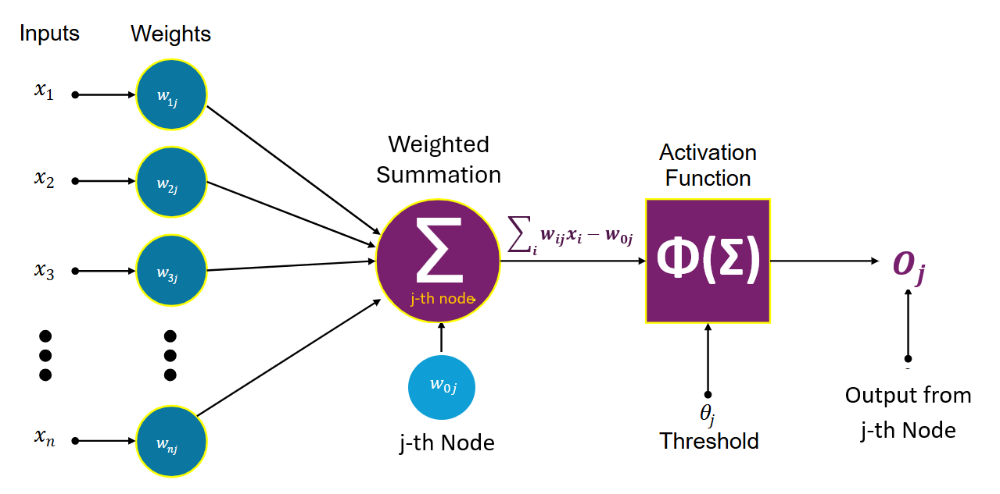
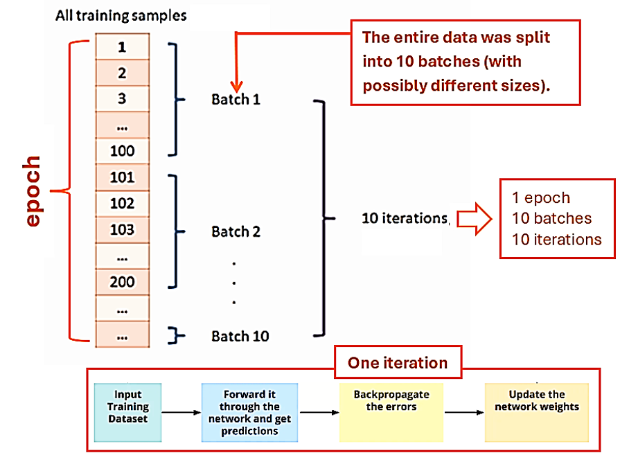

```{=html}

<style type="text/css">

/* Cascading Style Sheets (CSS) is a stylesheet language used to describe the presentation of a document written in HTML or XML. it is a simple mechanism for adding style (e.g., fonts, colors, spacing) to Web documents. */

h1.title {  /* Title - font specifications of the report title */
  font-size: 22px;
  font-weight: bold;
  color: DarkRed;
  text-align: center;
  font-family: "Gill Sans", sans-serif;
}
h4.author { /* Header 4 - font specifications for authors  */
  font-size: 18px;
  font-weight: bold;
  font-family: system-ui;
  color: navy;
  text-align: center;
}
h4.date { /* Header 4 - font specifications for the date  */
  font-size: 18px;
  font-family: system-ui;
  color: DarkBlue;
  text-align: center;
  font-weight: bold;
}
h1 { /* Header 1 - font specifications for level 1 section title  */
    font-size: 22px;
    font-family: "Times New Roman", Times, serif;
    color: navy;
    text-align: center;
    font-weight: bold;
}
h2 { /* Header 2 - font specifications for level 2 section title */
    font-size: 20px;
    font-family: "Times New Roman", Times, serif;
    color: navy;
    text-align: left;
    font-weight: bold;
}

h3 { /* Header 3 - font specifications of level 3 section title  */
    font-size: 18px;
    font-family: "Times New Roman", Times, serif;
    color: navy;
    text-align: left;
}

h4 { /* Header 4 - font specifications of level 4 section title  */
    font-size: 18px;
    font-family: "Times New Roman", Times, serif;
    color: darkred;
    text-align: left;
}

body { background-color:white; }

.highlightme { background-color:yellow; }

p { background-color:white; }

</style>
```

```{r setup, include=FALSE}
# code chunk specifies whether the R code, warnings, and output 
# will be included in the output files.
if (!require("knitr")) {
   install.packages("knitr")
   library(knitr)
}
if (!require("tidyverse")) {
   install.packages("tidyverse")
library(tidyverse)
}
if (!require("palmerpenguins")) {
   install.packages("palmerpenguins")
library(palmerpenguins)
}
if (!require("plotly")) {
   install.packages("plotly")
library(plotly)
}
if (!require("e1071")) {
   install.packages("e1071")
library(e1071)
}
if (!require("mmeln")) {
   install.packages("mmeln")
library(mmeln)
}
if (!require("MASS")) {
   install.packages("MASS")
library(MASS)
}
if (!require("ggplot2")) {
   install.packages("ggplot2")
library(ggplot2)
}
if (!require("plotly")) {
   install.packages("plotly")
library(plotly)
}
if (!require("caret")) {
   install.packages("caret")
library(caret)
}
if (!require("pander")) {
   install.packages("pander")
library(pander)
}
if (!require("randomForest")) {
   install.packages("randomForest")
library(randomForest)
}
if (!require("rpart")) {
   install.packages("rpart")
library(rpart)
}
if (!require("rpart.plot")) {
   install.packages("rpart.plot")
library(rpart.plot)
}
if (!require("ipred")) {
   install.packages("ipred")
library(ipred)
}
if (!require("mlbench")) {
   install.packages("mlbench")
library(mlbench)
}
if (!require("pROC")) {
   install.packages("pROC")
library(pROC)
}
if (!require("neuralnet")) {
   install.packages("neuralnet")
library(neuralnet)
}
if (!require("neuralnet")) {
   install.packages("neuralnet")
library(neuralnet)
}
if (!require("NeuralNetTools")) {
   install.packages("NeuralNetTools")
library(NeuralNetTools)
}
## 
knitr::opts_chunk$set(echo = TRUE,   
                      warning = FALSE, 
                      results = TRUE, 
                      message = FALSE,
                      comment = NA,
                      fig.align='center'
                      )  
```


\

# Introduction

**Neural networks (NN)** are a class of machine learning models inspired by the structure and function of biological neurons in the human brain. These models are designed to recognize patterns, make predictions, and solve complex problems by learning from data. A neural network consists of interconnected layers of **nodes (neurons)**, where each connection has an associated **weight** that adjusts during training to minimize prediction errors.

Neural networks can be used to perform tasks such as classification, regression, clustering, and feature extraction. They are widely used in image recognition, natural language processing, financial forecasting, and many other domains. The key advantage of neural networks is their ability to approximate highly **nonlinear relationships** in data, making them more flexible than traditional statistical models.


# Architecture and Building Blocks

The **perceptron** is the **building block** and simplest form of a neural network. Introduced by Frank Rosenblatt in 1957, it is a **single-layer neural network** originally designed for binary classification. The perceptron model takes multiple input features, computes their weighted sum, and passes the result through an activation function to generate an output.

```{r echo = FALSE, out.width="95%"}

```

## Some Key Terms

The above illustrative figure uses some of the terms in the perceptron. Next, we list some of the key terms, their roles, and mathematical representations that are frequently used in neural networks.


* **Weight (w)**: A parameter that scales the input signal. It determines the strength of the connection between neurons. For input $x_i$, the weighted contribution is $w_i\times x_i$.


* **Bias (b)**: An additive constant to the weighted sum. It shifts the activation function left/right to improve fit. It is Added to $\sum w_ix_i$ before activation: $z = \sum w_ix_i +b$.


* **Activation Function ($\sigma$)**: A nonlinear function applied to the weighted sum. It introduces nonlinearity, enabling complex pattern learning. Without it, the network reduces to linear regression. The common types of activation are
  + **Step Function**: is used in classic perceptron for classification 
  
    $$\sigma(z) = \left\{
     \begin{array}{ll}
         1 & z \ge 0 \\
         0 & z < 0 
    \end{array} 
    \right.$$
    
  + **Sigmoid**: outputs probabilities with the following expression 
     $$ \sigma(z)= 1/(1+e^{-z})$$
  + **ReLU (Rectified Linear Unit)**: is the default for hidden layers. It is expressed in the following form
  
  
$$
  \sigma (z) = \max \{0, z \}
$$


* **Node/Neuron**: The basic computational unit of a neural network. It takes inputs, computes $z = wx+b$, applies $\sigma (z)$. Three basic types of nodes are:

  + **Input Node**: Passes raw data (no activation).
  + **Hidden Node**: Intermediate computation (e.g., **ReLU**).
  + **Output Node**: Produces final prediction (e.g., **sigmoid** for classification).


* **Output Node**: The final neuron producing the network’s prediction. It outputs $\hat{y}$ (e.g., class probability or regression value). The activation choices are:
  + **Binary Classification**: *Sigmoid* ($\hat{y} \in [0, 1]$).
  + **Multi-Class**: *Softmax* ($\hat{y}$ = probability vector).
  + **Regression**: *Linear* (identity function).


* **Hidden Layer**: Layers between input and output. It learns hierarchical features (e.g., edges → shapes → objects in images). A network with architecture [input, hidden (*ReLU*), output (*sigmoid*)].  The **hidden layer** is designed by two hyperparameters: 
  + **Depth**: Number of hidden layers (e.g., "deep" networks have many).
  + **Width**: Number of neurons per layer.

```{r echo = FALSE, out.width="70%"}

```


* **Weighted Sum (z)**: Linear combination of inputs and weights. It prepares data for nonlinear activation and is given by 

$$
z = \sum_{i=1}^n w_ix_i + b
$$


* **Forward Propagation**: The process of passing input data through the network to compute $\hat{y}$. It involves the following steps 
  + Compute $z$ for each layer.
  + Apply activation $\sigma(z)$
  + Pass output to the next layer.
  

* **Backward Propagation** The process of updating weights using gradients of the loss function. The following are the key steps:
  + Compute loss function $L(y, \hat{y})$.
  + Calculate gradients $\partial L/\partial w$ via chain rule.
  + Update weights: $w_{\text{new}} \leftarrow w_{\text{old}} - \eta \frac{\partial L}{\partial w}$


* **Loss Function (L)**: Measures the error between $y$ (true) and $\hat{y}$ (predicted). The loss function is defined based on the performance metrics of the predicted values of the response. The common types of performance metrics are:

  + **Binary Cross-Entropy**:  $L = - [y\log \hat{y} + (1-y)\log(1 - \hat{y})]$.
  + **Mean Squared Error (MSE)**: $L = (y - \hat{y})/2$


## Estimation of NN Weights

Since perceptron regression and classification use different activation functions, leading to different definitions of the loss function, we discuss weight estimation using gradient-based methods for perceptron regression and classification separately.

###  Perceptron for Regression 

The perceptron regression is simply the linear regression which implicitly assumes linear separable data. The general formula is the same as we learned before. The activation function is a (linear) identical function (i.e., $y =\phi(z) = z$).  We will use vector expression in the following.

$$
y = \mathbf{w}^T \mathbf{x} + b
$$

The loss function (MSE) is given by

$$
{L}(\mathbf{w}, b) = \frac{1}{2} (y_{\text{true}} - y)^2.
$$

The Gradient Updates are explicitly given by

$$
\frac{\partial {L}}{\partial \mathbf{w}} = -(y_{\text{true}} - y)\mathbf{x}, \quad \frac{\partial {L}}{\partial b} = -(y_{\text{true}} - y)
$$

and 

$$
\mathbf{w} \leftarrow \mathbf{w} + \eta (y_{\text{true}} - y)\mathbf{x}, \quad b \leftarrow b + \eta (y_{\text{true}} - y)
$$

If we re-express the in input vector $\mathbf{x} = (1, x_1, x_2, \cdots, x_n)^T$ and $\mathbf{w}^T = (b, w_1, w_2, \cdots, w_n)$, then the above weight update formula is equivalent to

$$
\mathbf{w}_{\text{new}} \leftarrow \mathbf{w}_{\text{old}} + \eta (y_{\text{true}} - y)\mathbf{x}
$$


### Binary Classification

The perceptron classifier employs nonlinear activation functions, such as **sign activation** (which directly returns the class label) and **sigmoid activation** (equivalent to classic logistic regression), among others.

The following derivation is based on the **sign activation** function. Derivations for other activation functions follow a similar approach.

Recall that the **sign activation** is given by

$$
y = \text{sign}(\mathbf{w}^T \mathbf{x} + b)
$$

The corresponding loss function (*perceptron criterion*)

$$
{L}(\mathbf{w}, b) = \begin{cases} 
0 & \text{if } y_{\text{true}} (\mathbf{w}^T \mathbf{x} + b) \geq 0, \\
- y_{\text{true}} (\mathbf{w}^T \mathbf{x} + b) & \text{otherwise.}
\end{cases}
$$

The resulting **gradient Updates** (if misclassified):

$$
\frac{\partial {L}}{\partial \mathbf{w}} = -y_{\text{true}} \mathbf{x}, \quad \frac{\partial {L}}{\partial b} = -y_{\text{true}}
$$

 and 
 
$$
\mathbf{w} \leftarrow \mathbf{w} + \eta y_{\text{true}} \mathbf{x}, \quad b \leftarrow b + \eta y_{\text{true}}
$$

Using the same re-expression at the end of the previous subsection, we have the following weight update formula for misclassification.

$$
\mathbf{w}_{\text{new}} \leftarrow \mathbf{w}_{\text{old}} + \eta y_{\text{true}} \mathbf{x}.
$$

For correct classification, that is, $y_{\text{new}} - y =0$. Therefore, the above general formula can be further re-expressed in the following.

$$
\mathbf{w}_{\text{new}} \leftarrow \mathbf{w}_{\text{old}} + \eta (y_{\text{true}}-y) \mathbf{x}.
$$


### Key Hyperparameters

The weight update formula based on gradient descent methods on the loos function with appropriate activation functions is expressed in the following unified form.

$$
\mathbf{w}_{\text{new}} \leftarrow \mathbf{w}_{\text{old}} + \eta (y_{\text{true}}-y) \mathbf{x}.
$$

Once the weights are estimated, the prediction will be based on the forward propagation. The weight update process is the backward propagation in which the weights were improved by reducing the error (loss).

Key hyperparameters in **percepton model** are:

**Learning rate ($\eta$)**: The learning rate controls how much we adjust the weights at each step. It typically has a value of between 0.0 and 1.0. A too-small learning rate may result in a slow learning process, while a big learning rate could mean that loss value does not converge, leading to a failure in the learning process.

**Epoch**: An epoch represents one complete pass of the entire training data set through the neural network or model. During each epoch, the model's parameters (weights) are adjusted based on the loss or error between its predictions and the actual target values.  

```{r out.width="80%"}

```


```{r}
perceptron <- function(X, y, learning_rate = 0.1, epochs = 2) {
  weights <- rep(0, ncol(X) + 1)  # +1 for bias
  n_samples <- nrow(X)            # sample size
  total_iterations <- 0           # total number of iterations
  
  for(epoch in 1:epochs) {
    for(i in 1:n_samples) {
      total_iterations <- total_iterations + 1   # update iterations
      input <- c(1, X[i, ])              # a data point
      z <- sum(weights * input)          # weighted summation
      pred <- ifelse(z > 0, 1, 0)        # sign activation with threshold = 0
      
      if(pred != y[i]) {                 # testing whether to update weights
        weights <- weights + learning_rate * (y[i] - pred) * input
      }
      #cat("Epoch =", epoch, ", Total_iteration = ",total_iterations,   
      #    ". Weights = ", weights, "\n")
      }
      #cat(sprintf("Epoch %d: Total iterations = %d\n", epoch, total_iterations))
  }
  return(weights)
}
# Example:
X <- matrix(c(2, 3, 4, 1), ncol = 2)
y <- c(1, 0)
weights <- perceptron(X, y, epochs = 2)
```


**Activation Function Threshold** - While the classic perceptron uses a step function, we can adjust the threshold.

**Weight Initialization** - While perceptrons often start with zero weights, different initializations can affect convergence.


## Handling Categorical Features

Categorical features are variables that can take on one of a limited set of values (categories) rather than numerical values. **Since neural networks fundamentally work with numerical inputs, we need special techniques to handle categorical data effectively**. That is, **neural networks** perform best when

* Inputs are on similar scales;
* Inputs are numerical;
* There are meaningful distances between values.


**Common Methods**

* **One-hot encoding** transforms categorical variables into a binary matrix where
  + Each category becomes a new binary feature (column).
  + For each observation, the column corresponding to its category is marked 1, while others are 0.

  It **removes** ordinal relationships to prevent the network from interpreting arbitrary numerical encodings as meaningful, **assigns** equal weight to give each category equal opportunity to influence the model, and **transforms** the categorical feature to meet neural networks' requirement for numerical inputs.

```{r}
# Create sample data
data <- data.frame(
  color = c("red", "blue", "green", "blue", "red")
)

# One-hot encoding
encoded_data <- model.matrix(~color-1, data=data)
pander(encoded_data)
```

* **Dummy encoding** is a slight variation where one category is left out as a reference (to avoid perfect multicollinearity).

* **Target Encoding (Mean Encoding)** replaces categories with the mean of the target variable for that category.

```{r}
data.target.coding <- data.frame(
  color = c("red", "blue", "green", "blue", "red"),
  target = c(1, 0, 1, 1, 0)
)

# Calculate mean encoding
mean.encoding <- aggregate(target ~ color, data.target.coding, mean)
data.target.coding$color.encoded <- mean.encoding$target[match(data.target.coding$color, mean.encoding$color)]
##
pander(data.target.coding)
```

* **Frequency Encoding**- replace the labels with their corresponding frequencies.

```{r}
data.target.coding <- data.frame(
  color = c("red", "blue", "green", "blue", "red"),
  target = c(1, 0, 1, 1, 0)
)

freq.table <- table(data.target.coding$color) / nrow(data.target.coding)
data.target.coding$color.freq <- as.numeric(freq.table[data.target.coding$color])

pander(data.target.coding)
```

There are also some model-based encoding methods used in practice.


In the next few sections, we discuss perceptron regression and classification using the Boston Housing data set and the Pima Indian Diabetes data set. 


## Feature Scaling

Feature scaling is crucial when using neural networks as they are sensitive to the scale of input features. It
* Helps algorithms converge faster
* Prevents some features from dominating others
* Improves numerical stability
* Often leads to better performance

Several scaling methods are commonly used in practice.


### Min-Max Scaling

**Min-Max** scaling transforms feature variables with values between 0 and 1.

$$
x_{\text{new}} = \frac{x_{\text{orig.}} - \min\{x_{\text{orig.}}\}}{ \max\{x_{\text{orig.}}\} - \min\{x_{\text{orig.}}\}}.
$$

The reverse transformation is

$$
x_{\text{orig.}} = \min\{x_{\text{orig.}}\} + x_{\text{new}} \left[\max\{x_{\text{orig.}}\} - \min\{x_{\text{orig.}}\}\right].
$$


### Z-score Transformation

**Z-score Transformation** normalizes feature variables with a mean of 0 and standard deviation of 1.

$$
x_{\text{new}} = \frac{x_{\text{orig.}} - \text{mean}(x_{\text{orig.}})}{  \text{sdv}(x_{\text{orig.}})}.
$$

The reverse transformation is

$$
x_{\text{orig.}} =x_{\text{new}} \times \text{sdv}(x_{\text{orig.}}) + \text{mean}(x_{\text{orig.}}).
$$

### Robust Scaling

**Robust Scaling** that uses median and IQR is given by

$$
x_{\text{new}} = \frac{x_{\text{orig.}} - \text{median}(x_{\text{orig.}})}{  \text{IQR}(x_{\text{orig.}})}.
$$

The reverse transformation is given by

$$
x_{\text{orig.}} =x_{\text{new}} \times \text{IQR}(x_{\text{orig.}}) + \text{median}(x_{\text{orig.}}).
$$

In this note, we will only use the **min-max scaling method** for all numeric feature variables.


# Perceptron Regression

The perceptron is a single-layer neural network that makes predictions based on a weighted sum of inputs passed through an activation function. For regression, we typically use a linear activation function (identity function) instead of a step function.

The goal is to minimize the difference between predicted and actual continuous values. We use a loss function suitable for regression (typically mean squared error).


## Perceptron Regression Algorithm

As mentioned earlier, neural network algorithms are based on standardized features including the continuous target variables. In the following algorithm, all feature variables are assumed to be scaled.


* Initialize weights (w) and bias (b) to small random values

* For each epoch (iteration through the entire dataset) and <font color = "red">**\color{red}each training example (i.e., data point)**</font> ($x_i, y_i$):
  + Compute prediction: $\hat{y}_i = \mathbf{w}^T\mathbf{x}_i + b$
  + Compute error: ${e}_i = y_i - \hat{y}_i$
  + Update weights: $\mathbf{w}_{\text{new}} = \mathbf{w}_{\text{old}} + \eta \times {e}_i \times \mathbf{x}_i$
  + Update bias: $b = b + \eta \times e_i$

* Repeat until the error is minimized or maximum epochs reached


**The Key Parameters** to be tuned in the following data analysis are:

* *Learning rate ($\eta$)*: Controls how much we adjust weights with each update.
* *Epochs*: Number of passes through the training data.
* *Tolerance*: Minimum error threshold for stopping.


## Numerical Example

We use the **Boston Housing Dataset** to demonstrate perceptron regression, comparing a **custom-coded implementation** with a **library-based approach** (`neuralnet`). This dataset has been used in prior analyses for various regression algorithms. Here, we apply perceptron regression to predict the **median house value (mean)**.

Since a perceptron with linear activation is equivalent to least squares linear regression, we expect both the custom and library-based implementations to perform similarly. The perceptron’s simple weight update rule allows for straightforward coding:

* **Custom R function**: We manually implement the perceptron algorithm to demonstrate its inner workings.

* **R library** (`neuralnet`): We leverage an existing package to streamline the process.

This comparison highlights the flexibility of perceptron regression, whether built from scratch or deployed using optimized library functions.


**Feature Encoding and Scaling** 

In addition to conducting standard exploratory data analysis (EDA) and feature engineering, we must also

* Encode all categorical features into numerical values, and

* Scale all numerical features before training the perceptron model.

Encoding methods were covered in the previous section, while feature scaling techniques (e.g., standardization, normalization) are widely used in practice.


<font color = "red">**\color{red}Note**:</font> <font color = "red">*\color{red}All feature variables in Boston Housing Data are numerical. We need only to rescale all features before fitting the perceptron model*</font> 


**Data Splitting**: We use a two-way random split to create training (70%) and testing (30%) data sets. 


```{r}
# Load required libraries
#library(MASS)  # For Boston Housing dataset
#library(caret) # For data preprocessing

# Load and prepare the data
data(Boston)
set.seed(123)

# Normalize data (0-1 range)
normalize <- function(x) {
  (x - min(x)) / (max(x) - min(x))
}
# normalize all features including the target variable
boston.scaled <- as.data.frame(lapply(Boston, normalize))

# Train-test split (70-30)
set.seed(123)
##
sample.size <- dim(boston.scaled)[1]
train.indices <- sample(1:sample.size, round(0.7*sample.size))
##

train.data.norm <- boston.scaled[train.indices, ]
test.data.norm <- boston.scaled[-train.indices, ]
##
train.orig <- Boston[train.indices, ]
test.orig <- Boston[-train.indices, ]


```


### Custom-coded Implementation

\

**Custom R Function for Perceptron Regression**

Although perceptron regression models are implemented in several R libraries, we will use the explicit **weight update** formula introduced earlier. The following custom function implements this perceptron **weight update** rule.

The stopping rule of the iterative weight updating is set to be $\text{relative error} \le 10^{-5}$.


```{r}
# Perceptron Regression Function
perceptron.regression <- function(X, y, learning.rate = 0.01, epochs = 100) {
  # Add bias term to features
  X <- as.matrix(cbind(1, X))    # Make the design matrix (also called the model matrix)
  
  # Initialize weights (including bias)
  weights <- rnorm(ncol(X), mean = 0, sd = 0.01)  # random initial values
  
  # Store errors for monitoring
  errors <- numeric(epochs)   ## Zero vector to store errors from each epoch.
  
  # Training loop
  for(epoch in 1:epochs) {   # run perceptron model on the same data 100 times
                             # with different random initial weights.
    total.error <- 0         # initialize total error
    
    # Shuffle data each epoch
    shuffle.index <- sample(nrow(X))   # shuffle records (permutation)
    X.shuffled <- X[shuffle.index, ]   
    y.shuffled <- y[shuffle.index]     
    
    #
    for(i in 1:nrow(X.shuffled)) {
      # Compute prediction (linear activation)
      prediction <- sum(X.shuffled[i, ] * weights) 
      
      # Compute error
      error <- y.shuffled[i] - prediction
      #cat("\n  i = ", i, "Error: ", error)
      total.error <- total.error + error^2
      #cat("\n  i = ", i, " Total Error: ", total.error)
      # Update weights:
      weights <- weights + learning.rate * error * X.shuffled[i, ] 
      # cat("\n bottom weight: ", weights)
    }
    #cat("\n bottom out weight: ", weights)
    # Store mean squared error for this epoch
    errors[epoch] <- total.error / nrow(X)    # MSE 
    
    # Early stopping if error doesn't improve much
    if(epoch > 1 && abs(errors[epoch] - errors[epoch-1]) < 1e-5) {
      # cat("Early stopping at epoch", epoch, "\n")
      errors <- errors[1:epoch]
      break
    }
  }
  return(list(weights = weights, errors = errors, epoch = epoch))
}
```


**Perceptron Training**

**Perceptron training** is the process of estimating the weights of a perceptron model based on specified hyperparameters. The custom R function provided above accommodates two key hyperparameters: the **learning rate** and the **number of epochs**. This design allows the function to be used for **hyperparameter tuning**.

For illustration, we train a perceptron with a learning rate of 0.01 and 200 epochs.


```{r fig.align='center', fig.width=6, fig.height=6}
# Prepare data for training
X.train <- as.matrix(train.data.norm[, -which(names(train.data.norm) == "medv")])
y.train <- train.data.norm$medv

# Train the perceptron
model <- perceptron.regression(X.train, y.train, learning.rate = 0.01, epochs = 200)

# Plot training error over epochs
plot(model$errors, type = "l", xlab = "Epoch", ylab = "Mean Squared Error", 
     main = "Training Error over Epochs")
##
epoch <- length(model$errors)
txt.loc.x <- epoch/2
txt.loc.y <- (model$errors)[1]
text(txt.loc.x, 0.95*txt.loc.y, paste("\n Iteration stopping at epoch", epoch, "\n"),
     col = "red")
```

Since the weights were updated record by record based on a random vector of initial values for each epoch, the final updated weights of one epoch are used as the initial values for the next epoch. This process continues until the stopping rule - defined by the preset number of epochs and the relative errors of the estimated weights - is met. The figure above illustrates the iterative weight-updating process.


**Perceptron Prediction**

Once the perceptron weights were estimated, prediction became straightforward. Next, we use the scaled test data to make predictions and then reverse the scaling to obtain the actual predicted values in their original scales before evaluating the prediction performance. Recall that the reverse transformation to be used is in the following.

$$
y_{\text{orig.}} = \min\{y_{\text{orig.}}\} + y_{\text{new}} \left[\max\{y_{\text{orig.}}\} - \min\{y_{\text{orig.}}\}\right].
$$


```{r}
# Prediction function
predict.perceptron <- function(model, X) {
  X <- as.matrix(cbind(1, X))
  predictions <- X %*% model$weights
  return(predictions)
}

# Prepare test data
X.test <- as.matrix(test.data.norm[, -which(names(test.data.norm) == "medv")])

# Make predictions
predictions <- predict.perceptron(model, X.test)

# Calculate test MSE
test.mse <- mean((test.data.norm$medv - predictions)^2)
#cat("Test MSE:", test.mse, "\n")

# Convert predictions back to original scale
predictions.original <- predictions * (max(test.orig$medv) - min(test.orig$medv)) + min(test.orig$medv)

actual.original <- test.orig$medv

# Calculate R-squared
r.squared <- (cor(predictions.original,actual.original))^2


#cat("R-squared:", r.squared, "\n")
Perceptron.MSE <- mean((actual.original - predictions.original)^2)
#cat("Perceptron MSE:", Perceptron.MSE, "\n")

# Compare with linear regression for benchmarking
lm.model <- lm(medv ~ ., data = train.orig)
lm.pred <- predict(lm.model, test.orig)
lm.mse <- mean((test.orig$medv - lm.pred)^2)
#cat("Linear Regression MSE:", lm.mse, "\n")
lm.r.sq <- summary(lm.model)$r.squared
## 
Perceptron <- c(Perceptron.MSE, r.squared)
LM <- c(lm.mse, lm.r.sq)
Performace.metrics <- data.frame(Perceptron=Perceptron, LM = LM )
rownames(Performace.metrics) <- c("MSE", "r.sq")
pander(Performace.metrics)
```

<font color = "red">**Relationship Between Common Performance Metrics**: **$R^2$** evaluates explanatory power, **MSE** measures prediction error, and the **slope** quantifies the relationship strength.</font>


### R Library-based Approach

Several R libraries have functions to implement neural network algorithms. This subsection uses the flexible **neuralnet** to implement **perceptron regression**.  Note that **neuralnet()** does not automatically handle missing values (NA). If the dataset contains missing values, we have to preprocess the data including imputation, numerical encoding, and scaling before training the model. 


**Data Processing**

Boston Housing Data has only numerical variables and has no missing values. We only rescale all variables. The **min-max** method is used in this numerical example. 

$$
x_{\text{new}} = \frac{x_{\text{orig.}} - \min\{x_{\text{orig.}}\}}{ \max\{x_{\text{orig.}}\} - \min\{x_{\text{orig.}}\}}.
$$


```{r}
# ibrary(neuralnet)
# library(MASS)  # For Boston dataset

# Load and prepare data
data(Boston)

# Normalize data (0-1 range)
normalize <- function(x) {
  (x - min(x)) / (max(x) - min(x))
}
# normalize all features including the target variable
boston.scaled <- as.data.frame(lapply(Boston, normalize))


# Train-test split (70-30)
set.seed(123)
##
sample.size.nn <- dim(boston.scaled)[1]
train.indices.nn <- sample(1:sample.size.nn, round(0.7*sample.size.nn))
##
train.data.nn <- boston.scaled[train.indices.nn, ]
test.data.nn <- boston.scaled[-train.indices.nn, ]
##
test.orig <- Boston[-train.indices.nn, ]  # needed to reverse scaling

##
# Unscale predictions and actual values
unscale <- function(x, original) {
  return(x * (max(original) - min(original)) + min(original))
}

```


**Hyperparameter Tuning**

The **neuralnet()** function supports various hyperparameters (arguments), some of which significantly influence the algorithm's performance. To demonstrate hyperparameter tuning via grid search, we focus on three key parameters to identify their optimal combination:

* **Learning rate**: Controls the step size for weight updates during training.

* **Threshold**: Determines the stopping criterion based on the partial derivatives of the error function.

* **Stepmax**: Sets the maximum number of training steps; reaching this limit terminates the training process.


```{r}
# Define the tuning grid
tune.grid.nn <- expand.grid(
   learningrate = c(0.001, 0.01, 0.1, 0.5, 1),
   threshold = c(0.01, 0.05, 0.1, 0.5),
   stepmax = c(1e5, 1e6)  # Add stepmax to prevent infinite training
)

# Custom training function for neuralnet()
neuralnet.train <- function(learningrate, threshold, stepmax) {
  model <- neuralnet(
    medv ~ .,
    data = train.data.nn,
    hidden = 0,  # Perceptron (no hidden layer)
    linear.output = TRUE,  # For regression
    learningrate = learningrate,
    threshold = threshold,
    stepmax = stepmax
  )
  # Calculate RMSE on training data
  pred <- predict(model, train.data.nn[, -ncol(train.data.nn)])
  

  rmse <- sqrt(mean((pred - train.data.nn$medv)^2))
  return(rmse)
}

# Perform grid search:
# using apply the () function to call neuralnet.train() using the components of the
# row vector in the tune.grid.nn (data frame of combinations of hyperparameters).
#
results <- apply(tune.grid.nn, 1, function(x) {
  neuralnet.train(x["learningrate"], x["threshold"], x["stepmax"])
})

##
# Combine results with parameter combinations
tune.results <- cbind(tune.grid.nn, RMSE = results)
##
pander(tune.results)
```


The best combination of hyperparameter values is given in the following table.


```{r}
# Find the best combination
best.params <- tune.results[which.min(tune.results$RMSE), ]
pander(best.params)
```

**Final Model Identification**

With the above-identified optimal values of the hyperparameter, we next use them to train the final model for prediction.


```{r fig.align='center', fig.width=7, fig.height=7}
final.model.nn <- neuralnet(
  medv ~ .,
  data = train.data.nn,
  hidden = 0,
  linear.output = TRUE,
  learningrate = best.params$learningrate,
  threshold = best.params$threshold,
  stepmax = best.params$stepmax,
  rep = 1  # Multiple repetitions for stability
)
##
```

**Prediction and Evaluation**

```{r}
full.predictions <- predict(final.model.nn, test.data.nn)
##
pred.unscale <- unscale(full.predictions , Boston$medv)
###
MSE.neuralnet <- mean((pred.unscale  -test.orig$medv)^2)
###
r.sq.neuralnet <- (cor(pred.unscale, test.orig$medv))^2
###
Perceptron <- c(Perceptron.MSE, r.squared)
LM <- c(lm.mse, lm.r.sq)
neuralnet <- c(MSE.neuralnet, r.sq.neuralnet)
Performace.metrics.all <- data.frame(Perceptron=Perceptron, 
                                 LM = LM, 
                                 neuralnet = neuralnet )
rownames(Performace.metrics.all) <- c("MSE", "r.sq")
pander(Performace.metrics.all)

```

As expected, the table above shows that the perceptron and classical least squares linear regression yielded the same results, since the two approaches are essentially identical.


## Polynomial Perceptron Regression

Polynomial regression can be implemented using a neural network with a single perceptron (neuron) by appropriately transforming the input features. That is, we cannot use a model formula to define the polynomial model explicitly.

To illustrate the idea, we add two squared terms $\text{indus}^2$ and $\text{lstat}^2$ to the dataset to capture their curvilinear relationship with the target variable. 

```{r fig.align='center', fig.width=6, fig.height=6}
pairs(Boston[, c("zn", "indus", "nox", "dis", "lstat", "medv")])
```

```{r}
##
data(Boston)
##
Boston$indus.sq <- (Boston$indus)^2
Boston$lstat.sq <- (Boston$lstat)^2

# Normalize data (0-1 range)
normalize <- function(x) {
  (x - min(x)) / (max(x) - min(x))
}

# normalize all features including the target variable
Boston.poly.scaled <- as.data.frame(lapply(Boston, normalize))

##

# Train-test split (70-30)
set.seed(123)
##
sample.size.poly <- dim(Boston.poly.scaled)[1]
train.indices.poly <- sample(1:sample.size.poly, round(0.7*sample.size.poly))
##
train.data.poly <- boston.scaled[train.indices.poly, ]
test.data.poly <- boston.scaled[-train.indices.poly, ]
##
test.orig.poly <- Boston[-train.indices.poly, ]  # needed to reverse scaling
train.orig.poly <- Boston[train.indices.poly, ]  # needed to reverse scaling
##
# Unscale predictions and actual values
unscale <- function(x, original) {
  return(x * (max(original) - min(original)) + min(original))
}

## Hyperparameter Tuning
# Define the tuning grid
tune.grid.poly <- expand.grid(
   learningrate = c(0.001, 0.01, 0.1, 0.5, 1),
   threshold = c(0.01, 0.05, 0.1, 0.5),
   stepmax = c(1e5, 1e6)  # Add stepmax to prevent infinite training
)

# Custom training function for neuralnet()
neuralnet.train.poly <- function(learningrate, threshold, stepmax) {
  model <- neuralnet(
    medv ~ .,
    data = train.data.poly,
    hidden = 0,  # Perceptron (no hidden layer)
    linear.output = TRUE,  # For regression
    learningrate = learningrate,
    threshold = threshold,
    stepmax = stepmax
  )
  # Calculate RMSE on training data
  pred <- predict(model, train.data.poly[, -ncol(train.data.poly)])
  

  rmse <- sqrt(mean((pred - train.data.poly$medv)^2))
  return(rmse)
}

# Perform grid search:
# using apply the () function to call neuralnet.train() using the components of the
# row vector in the tune.grid.nn (data frame of combinations of hyperparameters).
#
results <- apply(tune.grid.poly, 1, function(x) {
  neuralnet.train.poly(x["learningrate"], x["threshold"], x["stepmax"])
})

##
# Combine results with parameter combinations
tune.results.poly <- cbind(tune.grid.poly, RMSE = results)
##
#pander(tune.results.poly)

# Find the best combination
best.params.poly <- tune.results.poly[which.min(tune.results.poly$RMSE), ]
#pander(best.params.poly)

##
final.model.poly <- neuralnet(
  medv ~ .,
  data = train.data.poly,
  hidden = 0,
  linear.output = TRUE,
  learningrate = best.params.poly$learningrate,
  threshold = best.params.poly$threshold,
  stepmax = best.params.poly$stepmax,
  rep = 1  # Multiple repetitions for stability
)

##
full.predictions.poly <- predict(final.model.poly , test.data.poly )
##
pred.unscale.poly  <- unscale(full.predictions.poly  , test.orig$medv)
###
MSE.neuralnet.poly  <- mean((pred.unscale.poly   - test.orig$medv)^2)
###
r.sq.neuralnet.poly  <- (cor(pred.unscale.poly , test.orig$medv))^2
##
lm.poly <- lm(medv ~., data = train.orig.poly )
pred.lm.poly <- predict(lm.poly, test.orig.poly[, -14])
lm.mse.poly <- mean((pred.lm.poly - test.orig.poly$medv)^2)
r.sq.lm.poly <- (cor(pred.lm.poly,test.orig.poly$medv))^2
###
Perceptron <- c(Perceptron.MSE, r.squared)
LM <- c(lm.mse, lm.r.sq)
neuralnet <- c(MSE.neuralnet, r.sq.neuralnet)
neural.poly <- c(MSE.neuralnet.poly, r.sq.neuralnet.poly)

Performace.metrics.all <- data.frame(Perceptron=Perceptron, 
                                 LM = LM, 
                                 neuralnet = neuralnet, 
                                 neural.poly = neural.poly,
                                 LM.poly = c(lm.mse.poly, r.sq.lm.poly))
rownames(Performace.metrics.all) <- c("MSE", "r.sq")
pander(Performace.metrics.all)

```


# Perceptron Classification

When implementing a perceptron for classification tasks using the **neuralnet()** package in R, the choice of activation function is critical for proper model performance. 


## Activation Functions 

In binary classification with perceptron, two activations are most appropriate.


**Logistic/Sigmoid** (`act.fct = "logistic"`):

The perceptron classification with activation `sigmoid` is equivalent to the classical **binary logistic regression model**. The explicit expression is given by

$$
\phi(x) = \frac{1}{1 + \exp(-x)}
$$

where $x \in \mathcal{R}$ and $0 < \phi(x) < 1$. 


**Hyperbolic Tangent (tanh)** (`act.fct = "tanh"`):

Similar to the **sigmoid perceptron model**, the perceptron with **hyperbolic tangent activation** can also be used for binary classification - though it requires threshold adjustment. The **hyperbolic tangent activation function** is explicitly defined as:

$$
\tanh(x) = \frac{\exp(x) - \exp(-x)}{\exp(x) + \exp(-x)}.
$$

The **hyperbolic tangent function** has a range of $(-1,1)$. Unlike the **sigmoid-activated perceptron**, which outputs a probability $P(y=1)$, the **hyperbolic tangent perceptron** produces scores between -1 and 1. We can select different thresholds to construct the confusion matrix and calculate related performance metrics as we did in logistic regression models.


## Model Building Process

The **perceptron classification** building process follows the same steps as perceptron regression models:

* Feature scaling and data splitting

* Hyperparameter tuning

* Final model training with the optimal combination of hyperparameter values

* Prediction and performance evaluation

* Implementation: Determining the optimal threshold based on appropriate performance metrics


## Numerical Example


The data is related to direct marketing campaigns of a Portuguese banking institution. The marketing campaigns were based on phone calls. Often, more than one contact with the same client was required, in order to assess if the product (bank term deposit) would be ('yes') or not ('no') subscribed. 

**Demographic feature variables**

* age (numeric)
* job : type of job (categorical) 
* marital : marital status (categorical)
* education (categorical)
* default: has credit in default? (binary: "yes", "no")
* balance: average yearly balance, in euros (numeric) 
* housing: has a housing loan? (binary: "yes", "no")
* loan: has personal loan? (binary: "yes", "no")

**related to the last contact of the current campaign**

* contact: contact communication type (categorical: "unknown", "telephone", "cellular") 
* day: last contact day of the month (numeric)
* month: last contact month of year (categorical: "jan", "feb", "mar", ..., "nov", "dec")
* duration: last contact duration, in seconds (numeric)

**other attributes**

* campaign: number of contacts performed during this campaign and for this client (numeric, includes the last contact)
* pdays: number of days that passed by after the client was last contacted from a previous campaign (numeric, -1 means the client was not previously contacted)
* previous: number of contacts performed before this campaign and for this client (numeric)
* poutcome: outcome of the previous marketing campaign (categorical: "unknown", "other", "failure", "success")

**Output variable (desired target)**

* y - has the client subscribed to a term deposit? (binary: "yes", "no")


### Feature Encoding and Scaling

We use the **one-hot encoding** method to convert all categorical feature variables to numeric forms. Feature scaling uses the following.

$$
x_\text{new} = \frac{x_\text{original}-\text{mean}(x_\text{original})}{\text{std}(x_\text{original})}.
$$

Since this is a classification problem, we will not reverse the scaled feature variables to evaluate the model performance. We use a two-way random splitting approach to create training (70%) and testing (30%) datasets.

Some feature variables contain a hyphen ("-") in their names. To avoid issues in defining the model formula, we will replace "-" with a period (".").


```{r}
# Load required libraries
# library(neuralnet)
# library(caret)
# library(dplyr)
# library(ggplot2)

# Load the dataset
url <- "https://pengdsci.github.io/STA552/w12/data/Bank/bank.csv"
bank.data <- read.csv(url, sep = ";")

# Check the structure
# str(bank_data)

# Convert the target variable to binary (yes=1, no=0)
bank.data$y <- ifelse(bank.data$y == "yes", 1, 0)

# Identify character (categorical) variables across column
categorical.vars <- sapply(bank.data, is.character)   # test for character...

# One-hot encode categorical variables: creates a full set of dummy variables 
# (i.e. less than full rank parameterization)
dummies <- dummyVars(" ~ . ", data = bank.data[, categorical.vars])

## The following predict function produces a data matrix
categorical.encoded <- predict(dummies, newdata = bank.data[, categorical.vars])
categorical.encoded <- as.data.frame(categorical.encoded)

names(categorical.encoded)[names(categorical.encoded) == "jobadmin."] <- "jobadmin"
# renames variable names to replace "-" with "."
names(categorical.encoded)[names(categorical.encoded) == "jobblue-collar"] <- "jobbluecollar"
names(categorical.encoded)[names(categorical.encoded) == "jobself-employed"] <- "jobselfemployed"

# Combine with numeric variables (which don't need encoding)
numeric.vars <- bank.data[, !categorical.vars & names(bank.data) != "y"]
processed.data <- cbind(numeric.vars, categorical.encoded, y = bank.data$y)


# Scale numeric variables (excluding the target)
numeric.cols <- sapply(processed.data, is.numeric) & names(processed.data) != "y"
## by default, scale() takes 'z-score' transformation
processed.data[, numeric.cols] <- scale(processed.data[, numeric.cols])

# Check for missing values: since neuralnet() does not handle missing values
#sum(is.na(processed.data))
###

# Split data into training and testing sets
set.seed(123)
# sample size
nn <- length(processed.data$y)
train.index.cls <- sample(1:nn, round(0.7*nn))   # random obs ID
train.data.cls <- processed.data[train.index.cls, ]
test.data.cls <- processed.data[-train.index.cls, ]

##
train.data.orig <- bank.data[train.index.cls, ]
test.data.orig <- bank.data[-train.index.cls, ]


```


### Hyperparameter Tuning

For a perceptron, the key hyperparameter is the **learning rate**. In the following tuning process, we will adjust this along with the stopping **threshold** for partial derivatives.

During the tuning process, we perform **5-fold cross-validation** to obtain a stable accuracy score, using a default threshold of 0.5 (for the **sigmoid perceptron**). However, this default threshold is usually not optimal, meaning that keeping it at 0.5 may not lead to the optimal combination of values of the corresponding hyperparameters.


```{r}
## Grid Search Setup
# Define the hyperparameter grid
hyper.grid.cls <- expand.grid(
  learningrate = c(0.001, 0.01, 0.05, 0.1, 0.2),
  threshold = c(0.01, 0.05)  # Stopping threshold for partial derivatives
 )

# Create formula for neural network
formula <- as.formula(paste("y ~", paste(names(train.data.cls)[!names(train.data.cls) %in% "y"], collapse = " + ")))

# Set up 5-fold cross-validation: createFolds() returns a list of fold obs IDs
# returnTrain = FALSE => no print out
# folds <- createFolds(train.data.cls$y, k = 5, list = TRUE, returnTrain = FALSE)

##

k <- 5
fold.size <- floor(dim(train.data.cls)[1]/k)
# Initialize results storage
results <- data.frame(
  learningrate = numeric(),
  threshold = numeric(),
  accuracy = numeric(),
  stringsAsFactors = FALSE
)


## Perform Grid Search with Cross-Validation
for(i in 1:nrow(hyper.grid.cls)) {
  lr <- hyper.grid.cls$learningrate[i]
  th <- hyper.grid.cls$threshold[i]
  
  #cat("\nTesting combination", i, "of", nrow(hyper.grid.cls), ": learningrate =", lr, ", threshold =", th, "\n")
  
  # 
  fold.accuracies <- numeric(k)
  
  # 
  for(fold in 1:k) {
    # Split into training and validation sets
    valid.indices <- (1 + (fold-1)*fold.size):(fold*fold.size)
    train.fold <- train.data.cls[-valid.indices, ]
    valid.fold <- train.data.cls[valid.indices, ]
    
    # Train the perceptron
    set.seed(123)
    model.sigmoid <- neuralnet(
      formula,
      data = train.fold,
      hidden = 0,  # Perceptron has no hidden layers
      linear.output = FALSE,
      learningrate = lr,
      act.fct = "logistic",
      algorithm = "rprop+", # The resilient backpropagation with weight backtracking
      threshold = th,
      stepmax = 1e5  # Increased to ensure convergence
    )
    
    # Make predictions
    preds <- predict(model.sigmoid, valid.fold)
    pred.classes <- ifelse(preds > 0.5, 1, 0)  # default threshold 0.5
    
    # Calculate accuracy
    fold.accuracies[fold] <- mean(pred.classes == valid.fold$y)
  }
  
  # Store average accuracy for this hyperparameter combination
  results <- rbind(results, data.frame(
    learningrate = lr,
    threshold = th,
    accuracy = mean(fold.accuracies)
  ))
}

## Analyze Results
# Find the best combination
best.combination <- results[which.max(results$accuracy), ]
#cat("\nBest hyperparameter combination:\n")
pander(best.combination)
```

With the above-identified 'optimal' combination of hyperparameters, we can train (i.e., estimate the weights of the model) the final perceptron model.


### Training Final Model

We use `neuralnet()` to train the final perceptron model with the tuned hyperparameters. To configure the model correctly, the following key arguments must be specified:

* **Model formula**: The formula must include scaled numerical feature variables.

* `hidden = 0`: This ensures the model is a perceptron (no hidden layers).

* `linear.output = FALSE`: Required for classification tasks.

* `act.fct =` : The activation function should be either `logistic` or `tanh` for classification.

* `algorithm =`: Defines the weight-updating algorithm. The default is the backpropagation algorithm (`rprop`), but we use resilient `rprop+` for training the final model.


```{r}
## Train Final Model with Best Hyperparameters
final.sigmoid.model <- neuralnet(
  formula,
  data = train.data.cls,
  hidden = 0,
  linear.output = FALSE,
  learningrate = best.combination$learningrate,
  threshold = best.combination$threshold,
  act.fct = "logistic",
  algorithm = "rprop+", # The resilient backpropagation with weight backtracking
  stepmax = 1e5
)
# Plot the final model
# plot(final.model)
```

Since the final model contains more than 50 **scaled numerical features** (including numerically encoded ones), the network diagram does not provide additional interpretability. Instead, we will not plot the **perceptron architecture** for visualization.


### ROC Analysis and Comparisons

Since classification problems involve both local and global performance metrics, we will evaluate the **global performance** of the perceptron model and compare it with classic logistic regression models.

Because the perceptron model requires numeric and scaled input features, while classic logistic regression models can be fitted to the original (unscaled and unencoded) data, we try to keep consistency by fitting the logistic regression models to the same processed dataset containing only scaled numeric features in the following.


```{r fig.align='center', fig.width=6, fig.height=6}
##
## Evaluate on Test Set
pred.sigmoid <- predict(final.sigmoid.model, test.data.cls)

###  logistic regression
logit.fit <- glm(y ~ ., data = train.data.cls, family = binomial)
AIC.logit <- step(logit.fit, direction = "both", trace = 0)
pred.logit <- predict(AIC.logit, test.data.cls, type = "response")
pred.full <- predict(logit.fit, test.data.cls, type = "response")


## roc
roc.full.logit <- roc(test.data.cls[, ncol(test.data.cls)], pred.full)
roc.AIC.logit <- roc(test.data.cls[, ncol(test.data.cls)], pred.logit)
roc.sigmoid <- roc(test.data.cls[, ncol(test.data.cls)], pred.sigmoid )
## AUC
auc.sigmoid <- roc.sigmoid$auc
auc.full.logit <- roc.full.logit$auc
auc.AIC.logit <- roc.AIC.logit$auc

## spe-sen
sigmoid.spe <- roc.sigmoid$specificities
sigmoid.sen <- roc.sigmoid$sensitivities

full.logit.spe <- roc.full.logit$specificities
full.logit.sen <- roc.full.logit$sensitivities

AIC.logit.spe <- roc.AIC.logit$specificities
AIC.logit.sen <- roc.AIC.logit$sensitivities


# ROC curve
plot(1-sigmoid.spe, sigmoid.sen, col = "blue", type = "l", lty = 1,
     xlab = "1 - specificity",
     ylab = "sensitivity",
     main = "ROC Curves of Perceptron and Logistic Models")
lines(1-full.logit.spe, full.logit.sen, lty = 1, col = "brown")
lines(1-AIC.logit.spe, AIC.logit.sen, lty = 1, col = "steelblue")
abline(0,1, lty =2, col = "red")
text(0.98, 0.3, paste("Perceptron AUC = ", round(auc.sigmoid,4)), col = "blue", cex = 0.8, pos = 2)
text(0.98, 0.25, paste("Full Logit AUC = ", round(auc.full.logit,4)), col = "brown", cex = 0.8, pos = 2)
text(0.98, 0.2, paste("AIC AUC = ", round(auc.AIC.logit,4)), col = "steelblue", cex = 0.8, pos = 2)

```

The ROC curves above show that the three candidate models perform similarly. This result is expected because they are essentially logistic regression models.


# Concluding Remarks

We have discussed both perceptron regression and classification models in the previous sections, covering high-level technical explanations as well as practical applications with numerical examples.

For perceptron regression with an identity activation function, the model is equivalent to linear regression. Since the perceptron regression algorithm computes a linear combination of input features before applying the activation function to produce outputs, fitting polynomial regression requires manually adding higher-order terms to the original dataset before preprocessing the data for the **perceptron model**. This same principle applies to perceptron classification.

Given that the perceptron's architecture is too simplistic to capture complex relationships between target and feature variables, we will introduce a more advanced architecture in the next section: the **multilayer perceptron (MLP)**. This model incorporates **hidden layers with multiple nodes** and is commonly referred to as a **deep neural network** or simply **deep learning** algorithm.


