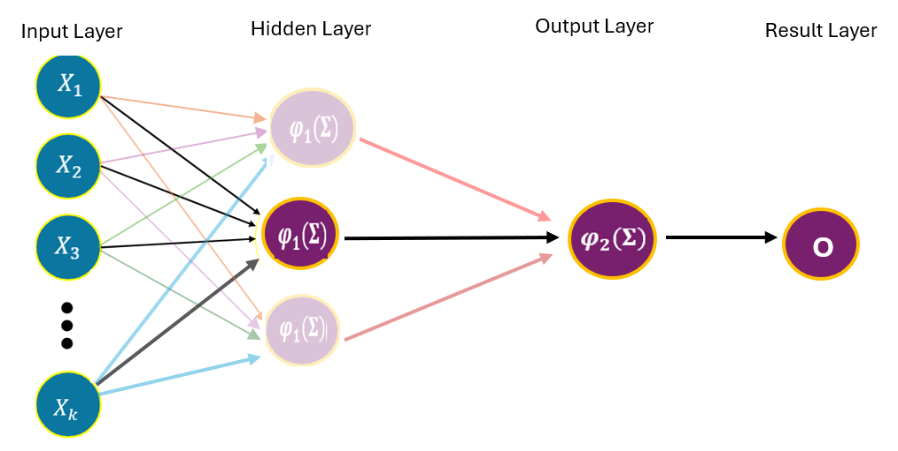
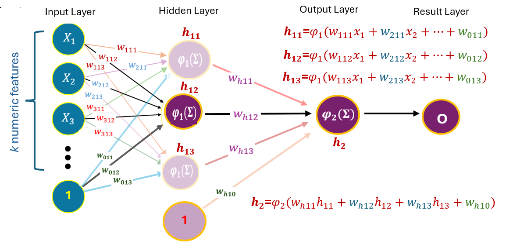
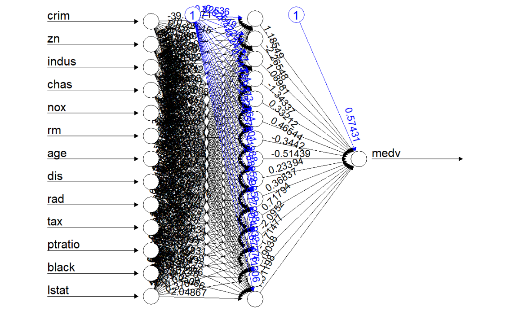
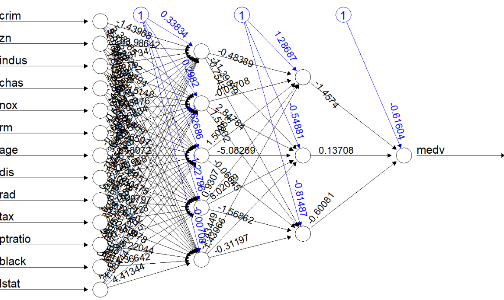
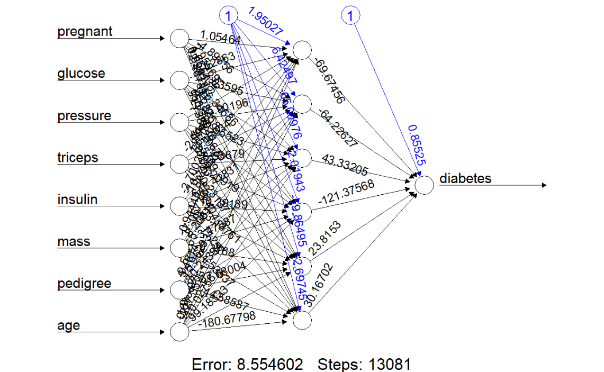
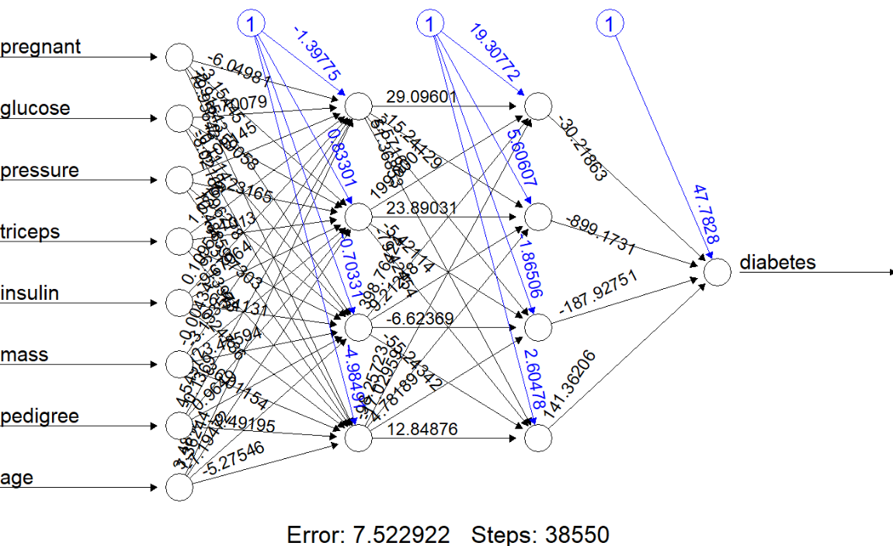

```{=html}

<style type="text/css">

/* Cascading Style Sheets (CSS) is a stylesheet language used to describe the presentation of a document written in HTML or XML. it is a simple mechanism for adding style (e.g., fonts, colors, spacing) to Web documents. */

h1.title {  /* Title - font specifications of the report title */
  font-size: 22px;
  font-weight: bold;
  color: DarkRed;
  text-align: center;
  font-family: "Gill Sans", sans-serif;
}
h4.author { /* Header 4 - font specifications for authors  */
  font-size: 18px;
  font-weight: bold;
  font-family: system-ui;
  color: navy;
  text-align: center;
}
h4.date { /* Header 4 - font specifications for the date  */
  font-size: 18px;
  font-family: system-ui;
  color: DarkBlue;
  text-align: center;
  font-weight: bold;
}
h1 { /* Header 1 - font specifications for level 1 section title  */
    font-size: 22px;
    font-family: "Times New Roman", Times, serif;
    color: navy;
    text-align: center;
    font-weight: bold;
}
h2 { /* Header 2 - font specifications for level 2 section title */
    font-size: 20px;
    font-family: "Times New Roman", Times, serif;
    color: navy;
    text-align: left;
    font-weight: bold;
}

h3 { /* Header 3 - font specifications of level 3 section title  */
    font-size: 18px;
    font-family: "Times New Roman", Times, serif;
    color: navy;
    text-align: left;
}

h4 { /* Header 4 - font specifications of level 4 section title  */
    font-size: 18px;
    font-family: "Times New Roman", Times, serif;
    color: darkred;
    text-align: left;
}

body { background-color:white; }

.highlightme { background-color:yellow; }

p { background-color:white; }

</style>
```

```{r setup, include=FALSE}
# code chunk specifies whether the R code, warnings, and output 
# will be included in the output files.
if (!require("knitr")) {
   install.packages("knitr")
   library(knitr)
}
if (!require("tidyverse")) {
   install.packages("tidyverse")
library(tidyverse)
}
if (!require("palmerpenguins")) {
   install.packages("palmerpenguins")
library(palmerpenguins)
}
if (!require("plotly")) {
   install.packages("plotly")
library(plotly)
}
if (!require("e1071")) {
   install.packages("e1071")
library(e1071)
}
if (!require("mmeln")) {
   install.packages("mmeln")
library(mmeln)
}
if (!require("MASS")) {
   install.packages("MASS")
library(MASS)
}
if (!require("ggplot2")) {
   install.packages("ggplot2")
library(ggplot2)
}
if (!require("plotly")) {
   install.packages("plotly")
library(plotly)
}
if (!require("caret")) {
   install.packages("caret")
library(caret)
}
if (!require("pander")) {
   install.packages("pander")
library(pander)
}
if (!require("randomForest")) {
   install.packages("randomForest")
library(randomForest)
}
if (!require("rpart")) {
   install.packages("rpart")
library(rpart)
}
if (!require("rpart.plot")) {
   install.packages("rpart.plot")
library(rpart.plot)
}
if (!require("ipred")) {
   install.packages("ipred")
library(ipred)
}
if (!require("mlbench")) {
   install.packages("mlbench")
library(mlbench)
}
if (!require("pROC")) {
   install.packages("pROC")
library(pROC)
}
if (!require("neuralnet")) {
   install.packages("neuralnet")
library(neuralnet)
}
if (!require("neuralnet")) {
   install.packages("neuralnet")
library(neuralnet)
}
if (!require("NeuralNetTools")) {
   install.packages("NeuralNetTools")
library(NeuralNetTools)
}
## 
knitr::opts_chunk$set(echo = TRUE,   
                      warning = FALSE, 
                      results = TRUE, 
                      message = FALSE,
                      comment = NA,
                      fig.align='center'
                      )  
```


\

# Introduction

**Multilayer Perceptrons (MLPs)**, often referred to as **deep learning models** or  **multilayer neural networks**, are a powerful class of algorithms with wide applications. These networks consist of interconnected layers of artificial "neurons," each processing information and passing it forward to subsequent layers. The first layer receives raw input data, while hidden layers transform this data through weighted connections and nonlinear functions, allowing the network to learn complex patterns. The final layer produces predictions or classifications.


```{r echo = FALSE, fig.align='center', out.width="90%"}

```


In statistical modeling, multilayer neural networks can handle intricate relationships in data. Unlike linear regression or simple decision trees,  multilayer neural network models can model highly nonlinear interactions and adapt to large-scale, high-dimensional datasets where classic statistical models often struggle. Their flexibility comes from their ability to iteratively adjust weights during training, refining their predictions as they encounter more data.

Despite their strengths, multilayer neural networks require careful tuning and large datasets to perform well. 

* Overfitting—where a model memorizes training data but fails on new inputs—is a common challenge, mitigated by techniques like dropout and regularization. 

* Their **black box** nature can also make interpreting results difficult, posing challenges in fields where explainability is crucial, such as healthcare or finance. 

**MLP**s are a foundational architecture in modern machine learning and artificial intelligence. Their ability to approximate complex, nonlinear functions makes them highly versatile for a wide range of real-world problems. 

There are various adaptations and extensions of MLPs, each developed for specific purposes across different fields. A solid understanding of MLPs is essential for grasping the underlying principles of many specialized neural network algorithms.

\

# Architecture of MLP

A Multilayer Perceptron (MLP) is generalized from the perceptron by adding one or more hidden layers between the input and output layers. That is, an MLP has three major components:

- An **input layer**
- One or more **hidden layers** 
- An **output layer**

Each layer consists of multiple **neurons (nodes)** connected via weights, with nonlinear activation functions that capture complex relationships between features and the target, thereby improving the algorithm's performance.

If an MLP has only one hidden layer, this MLP is usually called **shallow neural network**. **Deep neural networks** have two or more hidden layers.

In the subsequent sections, we will briefly introduce the theory of neural networks with an emphasis on shallow networks. Some case studies will also be included to demonstrate the application of neural network models in regression and classification.


## Mathematics of MLP

For illustration, we use the following one-hidden-layer MLP regression to explain the mathematical foundations of the algorithm. The objective is to predict the target variable 
$y$ using input features $\{x_1, x_2, \cdots, x_n \}$. If activation functions $\phi_1(\cdot)$ and $\phi(\cdot)$ are correctly specified, then the target can be expressed as a composition of weights through function composition.


```{r echo = FALSE, fig.align='center', out.width="90%"}

```

In essence, MLP is a problem of approximating a multi-variable function. Assume that there are $n$ features in the scenario of the above one-hidden-layer MLP, the relationship between the target variable $y$ is characterized by $y = f(x_1, x_2, \cdots, x_n: \mathbf{w})$, where $f(\cdot)$ is unknown and $\mathbf{w}$ is the vector of unknown parameters. That is, in the above MLP, the target can be expressed as

$$
y = f(x_1, x_2, \cdots, x_n: \mathbf{w}) = \phi_2[\phi_1(x_1, x_2, \cdots, x_n: \mathbf{w})].
$$

<font color = "red">**\color{red}Note that $f(\cdot)$ is an arbitrary function $f: \mathbb{R}^n \rightarrow \mathbb{R}$.**</font> For a given data set $\{(x_{1i}, x_{2i}, \cdots, x_{ni})\}_{i=1}^n$ and estimated $\hat{\mathbf{w}}$, depending on applications, the loss function is defined respectively by

* **Continuous Regression (MSE)**

$$
 \mathcal{L} = \frac{1}{N} \sum_{c=1}^C (y_i - \hat{y}_i)^2 
$$

* **Discrete Classification (Cross-entropy)**

$$
 \mathcal{L} = - \sum_{c=1}^C  y_c \log(\hat{y}_c)
$$
for $C$ classes. Using the gradient decent method, we can express the weight updating formula in the following

$$
\mathbf{W}^{(j+1)} \leftarrow \mathbf{W}^{(j)} - \eta \frac{\partial \mathcal{L}}{\partial \mathbf{W}}\Big|_{\mathbf{W}=\mathbf{W}^{(j)}}
$$
where $\eta$ is the hyperparameter of **learning rate**.  


## Universal Approximation Theorem

The **Universal Approximation Theorem** is a fundamental result in the theory of artificial neural networks, stating that a feedforward neural network with a single hidden layer containing a finite number of neurons can approximate continuous functions on compact subsets of $\mathbb{R}^n$ under mild conditions on the activation function. The formal statement is given in the following:    

**Cybenko's Theorem (1989)**: Let $\phi(\cdot)$ be a continuous, non-constant activation function (e.g., sigmoid). Given any continuous function $f: [0,1]^n \rightarrow \mathbb{R}$ and $\epsilon > 0$, there exists a **single-hidden-layer MLP** (multilayer perceptron) with finitely many hidden nodes (neurons), denoted by $N(\mathbf{x})$, such that 

$$
\sup_{\mathbf{x}\in [0,1]^n} \big|f(\mathbf{x}) - N(\mathbf{x}) \big| < \epsilon.
$$

The above analysis assumes the support of the multivariable function is $[0,1]^n$. This can be easily generalized to any function with general finite support $[a-1, b_1]\times [a_2, b_2] \times \cdots\times[a_k, b_k]$ via a linear transformation. For example, assume $f_k(x_k)$ has support $[a_k, b_k]$, we can use linear transformation $y_k = (x_k - a_k)/(b_k - a_k)$ which implies that $y_k \in [0,1]$. 

This explains why a **one-hidden-layer perceptron** can approximate any continuous function defined on a finite support using finitely many nodes in the hidden layer. For functions with infinite support, we can first approximate them on a finite domain and then apply the **universal approximation theorem** to achieve the desired result.


Recall that, the objective of regression analysis is to estimate the **unknown** regression function based on a sample taken from the underlying population and then use the **estimated** regression function to 

* assess the relationship between feature variables and the target variable;
* predict the value of the target variable based on the values of the input feature variables.

The **universal approximation theorem** for shallow networks guarantees their capability as a **function approximator**, making it a natural theoretical foundation for neural network regression methods.


## Some Graphical Demonstrations

This subsection uses a simulation approach to demonstrate why MLP is also a non-classical family of algorithmic regression models. We take a set of points on the surface of a hypothesized elliptic paraboloid regression surface and then use MLP to estimate the hypothetical elliptic paraboloid model. The elliptic paraboloid used to generate data is given by

$$
z = x_1^2 + x_2^2
$$
The following figure shows the hypothetical regression surface, along with the data points used to estimate it.


```{r}
#library(plotly)

# Define the elliptic paraboloid function: z = (x^2 / a^2) + (y^2 / b^2)
# Create a grid of x and y values
x <- seq(-2, 2, length =200)
y <- seq(-2, 2, length =200)
z <- outer(x, y, function(x, y) (x^2  + y^2 ))

## sample points on the surface to define a data set
x.sim <- sample(x)
y.sim <- sample(y)
z.sample <- (x.sim^2 + y.sim^2) + rnorm(200, 0, 0.5)

# Plot margins
m <- list( l = 50, r = 50, b = 100, t = 100, pad = 4)

# Create the 3D surface plot
plot_ly(x = x, y = y, z = z, type = "surface") %>%  # the surface
  add_markers(x = x.sim,   # sample points near the surface
              y = y.sim, 
              z = z.sample,   
              marker = list(size = 3, color = "darkred")) %>%
  layout(margin = m, 
          title = "Elliptic Paraboloid: Hypothesized Model for Data Generation",
          scene = list(xaxis = list(title = "X"),
                       yaxis = list(title = "Y"),
                       zaxis = list(title = "Z")
                   )
        )
```


In practice, we only observe data points from an unknown surface. We therefore remove the hypothetical regression surface and visualize just the data points to reveal the data cloud's structure.


```{r}
plot_ly() %>%
  add_markers(x = x.sim, y = y.sim, z = z.sample, 
              marker = list(size = 3, color = "darkred")) %>%
  layout( margin = m,
           title = "Sample points from the elliptic paraboloid",
           scene = list( xaxis = list(title = "X"),
                         yaxis = list(title = "Y"),
                         zaxis = list(title = "Z")
                     )
         )
```

There is a nonlinear relationship between the target variable ($z$) and feature variables ($x_1$ and $x_2$). In the following figures, we compare the performance of three models fitted to the same dataset: a single perceptron, a one-hidden-layer perceptron, and a two-hidden-layer perceptron. We then plot their corresponding estimated regression surfaces to visualize the goodness of fit.


```{r}
#library(neuralnet)
#library(ggplot2)
#library(plotly)  # For 3D visualization

# Generate training data
#set.seed(123)
#x <- seq(-2, 2, length =20)
#y <- seq(-2, 2, length =20)
#z_train <- x_train^2 + y_train^2 # + rnorm(500, sd = 0.1)  # Added noise

## The working data set: we call it the training data set
train.data <- data.frame(x = x.sim, y = y.sim, z = z.sample)

### no hidden layer
hidden0.0 <- neuralnet(z ~ x + y, 
                       data = train.data, 
                       hidden = c(0), 
                       linear.output = TRUE,
                       stepmax = 1e6)  # Increase iterations


### single hidden layer
hidden1.8 <- neuralnet(z ~ x + y, 
                       data = train.data, 
                       hidden = c(8), 
                       linear.output = TRUE,
                       stepmax = 1e6)  # Increase iterations


# Train neural network with 2 hidden layers (8 and 4 neurons)
hidden2.8.4 <- neuralnet(z ~ x + y, 
                       data = train.data, 
                       hidden = c(8,4), 
                       linear.output = TRUE,
                       stepmax = 1e6)  # Increase iterations

# Create test grid to draw the Predicted surface based on different NN models
x.test <- seq(-2, 2, length.out = 200)
y.test <- seq(-2, 2, length.out = 200)
test.grid <- expand.grid(x = x.test, y = y.test)
z.test0.0 <- matrix(predict(hidden0.0, test.grid),ncol=200)
z.test1.8 <- matrix(predict(hidden1.8, test.grid),ncol=200)
z.test2.8.4 <- matrix(predict(hidden2.8.4, test.grid),ncol=200)

```

The following figure shows the predicted surface from the perceptron model, which produces a linear hyperplane, along with the data points used to estimate the regression surface. The perceptron fits the data poorly.


```{r}
## set up plot margin
m <- list(l = 50,r = 50, b = 100, t = 100, pad = 4)

# 3D Visualization with plotly
plot_ly(x = ~x.test, y = ~y.test, z = ~z.test0.0, type = "surface") %>%
  add_markers(data = train.data, 
              x = ~x, y = ~y, z = ~z, 
              marker = list(size = 3, color = "darkred")) %>%
  layout(title = 'Perceptron Model (with no hidden layer)',
         autosize = T, 
         #width = 500, 
         #height = 500,
         margin = m, 
         scene = list(xaxis = list(title = "X"),
                     yaxis = list(title = "Y"),
                     zaxis = list(title = "Z")))
```


Next, we fit a **one-hidden-layer perceptron with 8 nodes** to the same dataset. The following figure shows both the estimated regression surface and the data points. We observe that the predicted surface closely approximates the **hypothesized regression surface**. Note that the number of nodes in the hidden layer is a tunable hyperparameter that can be optimized to improve model performance.


```{r}
# 3D Visualization with plotly
plot_ly(x = ~x.test, y = ~y.test, z = ~z.test1.8, type = "surface") %>%
  add_markers(data = train.data, 
              x = ~x, y = ~y, z = ~z, 
              marker = list(size = 3, color = "darkred")) %>%
  layout(title = 'Estimated One-hidden-layer Perceptron (with 8 nodes)',
         autosize = T, 
         #width = 500, 
         #height = 500,
         margin = m, 
         scene = list(xaxis = list(title = "X"),
                     yaxis = list(title = "Y"),
                     zaxis = list(title = "Z")))
```

Finally, we examine a two-hidden-layer perceptron architecture, with 8 nodes in the first hidden layer and 4 nodes in the second hidden layer, trained on the same data set.


```{r}
# 3D Visualization with plotly
plot_ly(x = ~x.test, y = ~y.test, z = ~z.test2.8.4, type = "surface") %>%
  add_markers(data = train.data, 
              x = ~x, y = ~y, z = ~z, 
              marker = list(size = 3, color = "darkred")) %>%
  layout(title = 'Estimated Two-hidden-layer Perceptron (with 8 and 4 nodes)',
         autosize = T, 
         #width = 500, 
         #height = 500,
         margin = m, 
         scene = list(xaxis = list(title = "X"),
                     yaxis = list(title = "Y"),
                     zaxis = list(title = "Z")))
```

The figure above shows both the estimated prediction surface and the original data points. We observe a significant discrepancy between the **estimated regression surface** and the **hypothesized (true) regression surface**. Upon closer examination, we find that the estimated regression surface yields small residuals, as the data points lie close to the fitted surface. This suggests potential **overfitting** in the two-hidden-layer perceptron model.


# MLP Modeling Process 

MLPs can learn complex, non-linear relationships due to their multiple layers of interconnected neurons. However, designing and training an effective MLP requires careful consideration of data preprocessing, architecture selection, optimization techniques, and other strategies.

## Data Preprocessing

Before training an MLP, the input data must be properly prepared to make sure the MLP learns efficiently.

### Feature Scaling

MLPs are sensitive to feature scales, so normalization (e.g., Min-Max scaling) or standardization (e.g., Z-score normalization) is typically applied to ensure stable gradient descent optimization. 

Whether the target variable must be rescaled in a neural network depends on the context, but it is often strongly recommended for optimal performance.

The scaling of the target is necessary when

* **Output Activation Constraints**: If using a sigmoid (bounded to [0, 1]) or tanh (bounded to [-1, 1]) output activation, the target variable must be scaled to match these ranges.

* **Loss Function Sensitivity**: Loss functions like MSE (Mean Squared Error) are sensitive to scale. Large target values can lead to unstable gradients or slow convergence.

* **Regularization Terms**: $L_1$/$L_2$ regularization penalizes large weights. Unscaled targets may force the network to learn disproportionately large weights to compensate.

While not always mandatory, **rescaling the target variable** typically **improves** training stability, speed, and model performance—especially for bounded activations or large-value ranges. Always validate with your specific architecture and data.


### Handling Missing Data

Handling missing values in **Multilayer Perceptrons (MLPs)** requires careful consideration, as neural networks typically expect complete input data.

All imputation methods discussed in the previous section can be used to preprocess data with missing values for MLP modeling. The general recommendation is to use stochastic multiple imputation techniques, such as MICE (Multiple Imputation by Chained Equations) and other random replacement methods that make use of the probability distribution of the underlying feature variables.


### Categorical Encoding

**Categorical encoding** transforms non-numeric variables into numerical representations for machine learning. 

* For **nominal data (no inherent order)**, common methods include one-hot encoding, which creates binary columns for each category (ideal for <15 categories), and target encoding, which replaces categories with the mean of the target variable (better for high-cardinality features but requires careful validation to avoid leakage). 

* For **ordinal data (natural order)**, ordinal encoding assigns integers while preserving the logical sequence (e.g., Small=1, Medium=2). 

* **High-cardinality features** (e.g., ZIP codes) may use frequency encoding (replacing categories with their occurrence counts) or embedding layers in neural networks to capture complex relationships. 


The choice depends on the model type and data characteristics: 

* **Tree-based models** (e.g., Random Forests) often handle label encoding well.

* **Linear models and neural networks** typically require one-hot or target encoding. 

Cross-validation is essential to evaluate the impact of encoding strategies on model performance.


### Data Splitting

Proper data splitting is crucial for training **Multilayer Perceptrons (MLPs)** to ensure robust model evaluation and prevent overfitting. For cross-sectional data, a random splitting is required:

* Two-way splitting for training and testing data sets. The training and test data ratio is usually 70%-30% or 80%-20%.

* **Nested random splitting for cross-validation** involves two layers of data partitioning: an outer loop for performance evaluation and an inner loop for hyperparameter tuning. This approach ensures unbiased model assessment by preventing data leakage between the tuning and evaluation phases.

There are other random data splitting methods based on the data structures that require special design so that the randomly split data retain the same probability structure of the data set.


## MLP Architecture Desing

In neural networks, MLP (Multilayer Perceptron) size and depth refer to its architecture, particularly the number of neurons (size) and the number of hidden layers (depth). These factors significantly impact the model's capacity, training dynamics, and generalization ability.

* **Shallow networks** (1-2 hidden layers) may suffice for simple tasks.  **Shallow networks** 
  + can approximate any continuous function (Universal Approximation Theorem).
  + often sufficient for simple tasks (e.g., small tabular datasets).
  + are less prone to overfitting but may underfit complex data.

* **Deep networks** can model complex patterns but risk overfitting and increased computational cost. **Deep networks** are
  + better at learning hierarchical representations.
  + useful for high-dimensional data (e.g., images, NLP after feature extraction).
  + more computationally expensive and prone to overfitting (requires regularization like Dropout, L2).


* **MLP Size (Number of Neurons per Layer)** is also impactful on the model performance.
  + Wider Layers (more neurons) increase model capacity, allowing more complex function approximation. It can lead to overfitting if not regularized and use more computation resources (more parameters).
  + Narrower Layers (fewer neurons) are less expressive but faster to train but may lead to underfitting complex patterns.

* **Choosing Depth & Size** is based on the following general recommendations
  + Start with 1-3 hidden layers and adjust based on performance.
  + Use similar or decreasing layer sizes.
  + Wider layers early can help feature extraction; deeper networks refine abstractions.


## Activation Functions

**Activation functions** serve distinct purposes in hidden and output layers. In hidden layers, they introduce nonlinear transformations to capture complex patterns in the data. The output layer's activation function is chosen specifically to produce predictions compatible with the target variable's characteristics. 


### Hidden Layer Activation

There are several activation functions for the hidden layer. The ReLU (Rectified Linear Unit) is widely used due to its computational efficiency and is the default for many MLP libraries. The following table outlines some of the commonly used activation functions for hidden layers.


| Activation	| Best For	 |    Pros	  |    Cons 	| Recommendation |
|:------------|:-----------|:-----------|:----------|:---------------|
| ReLU	| Default choice	| Fast, avoids vanishing gradient (for x > 0)	| "Dying ReLU" (dead neurons)	| First try in most MLPs| 
| Leaky ReLU	| Deep networks	| Fixes dying ReLU	| Slightly slower than ReLU	| Use if ReLU fails| 
| GELU	| Transformers, deep learning	| Smooth, better gradient flow	| More compute-heavy	|  Best for modern deep nets (e.g., BERT, GPT)| 
| Swish	| Experimental alternative	| Can outperform ReLU	| Slower than ReLU	|  Try if tuning performance| 
| SELU	| Self-normalizing networks	| No BatchNorm needed	| Requires careful initialization	| Use only in specific architectures| 


<font color = "red">**\color{red}Avoid using Sigmoid/Tanh in hidden layers that cause vanishing gradients in deep networks.**</font>


### Output Layer Activation

Depending on the type of the target response, the commonly used activation functions are summarized in the following table.

|  Task	     |    Activation	  |    Why?   	|      Example Use Case     |
|:-----------|:-----------------|:------------|:--------------------------|
|  Regression (unbounded)	|  Linear (no activation)	|  Outputs any real number	|  Predicting house prices|  
|  Regression (0 to 1)	|  Sigmoid	|  Bounds output to [0, 1]	|  Predicting probabilities|  
|  Binary Classification	|  Sigmoid	|  Outputs probability (0 or 1)	|  Spam detection|  
|  Multiclass Classification	|  Softmax	|  Probabilities sum to 1	|  MNIST digit classification|  
|  Multilabel Classification	|  Sigmoid (per class)	|  Independent probabilities	|  Image tagging|  


<font color = "red">**\color{red}Never use ReLU in the output layer unless outputs must be ≥0, e.g., count prediction  like Poisson regression).**</font>


### Guideline for Hidden and Output Layers 


The following table provides a guideline for choosing appropriate activation functions in MLP.

|  Scenario   | 	Hidden Layer  | 	Output Layer  |
|:------------|:----------------|:----------------|
|  General MLP	|  ReLU	|  Task-dependent (see above)|  
|  Deep Network	|  GELU/Leaky ReLU |  	Task-dependent|  
|  Transformer Model	|  GELU	|  Softmax/Sigmoid|  
|  Self-Normalizing Net	|  SELU	|  Task-dependent|  


## Training, Optimization 

Effective training requires proper optimization techniques and hyperparameter tuning.

* **Loss Function Selection** is dependent on the applications:
  + **Classification**: Cross-entropy loss
  + **Regression**: Mean Squared Error (MSE) or Mean Absolute Error (MAE)

* **Optimizer Choice** is also dependent on the applications and the required computational resources for the applications.
  + Stochastic Gradient Descent (SGD): Basic but requires careful learning rate tuning. 
  + Adaptive Optimizers (Adam, RMSprop): Automatically adjust learning rates, often leading to faster convergence. A too-high learning rate causes instability, while a too-low rate slows convergence.

* **Hyperparameter Tuning**
Methods like grid search, random search, or Bayesian optimization help find optimal configurations efficiently.

\

## Relative Improvement in Performance

When evaluating machine learning models, it is essential to quantify how much a proposed neural network (NN) model improves upon a simpler base model (e.g., linear regression for regression tasks, and logistic regression for classification). Measuring relative improvement helps determine whether the added complexity of a neural network justifies its adoption. We next briefly discuss key methods for computing and interpreting relative improvement, along with practical considerations. Recall that performance metrics for regression and classification are listed.

  + **Classification**: Accuracy, Precision, Recall, F1-score, ROC-AUC.
  + **Regression**: MSE, RMSE, $R^2$.
  
**Relative improvement** measures how much better (or worse) a neural network performs compared to a baseline model. It is typically expressed as a percentage reduction in error (for regression) or a percentage increase in accuracy/precision/recall (for classification).  The general formula is given by

$$
\text{Relative Improvement} = \frac{\text{Metric}_{\text{Base}}-\text{Metric}_{\text{NN}}}{\text{Metric}_{\text{Base}}}
$$
  
As an example, compare the RMSE between linear regression (fit it to the scaled data) and NN model. Assume the base model RMSE = 10.0 and NN model RMSE = 7. Then

$$
\text{Improvement} = \frac{10-7}{10} = 30\%.
$$

**Interpretation**: The NN reduces prediction error by 30% compared to linear regression.  
  
  
\
  
# MLP Regression

This section focuses on implementing MLP regression using the Boston Housing dataset, along with the R **neuralnet** library and other supporting libraries for data preparation and visualization. We will follow the basic steps outlined in the previous section. We will fit one-hidden-layer and two-hidden-layer MLP to predict the median house value.

We use **min-max scaling method** for all numerical variables. All features are numerical, no categorical encoding is needed. We use random splitting (70-30) to create training and testing data sets.

```{r}
# Load necessary libraries
# library(neuralnet)
# library(MASS)       # For Boston Housing dataset
# library(ggplot2)    # For visualization
# library(caret)      # Only for data splitting (we won't use its modeling functions)
# Load Boston Housing dataset
data(Boston)

# Check structure and summary
#str(Boston)
#summary(Boston)

# Feature scaling - normalize all variables to [0,1] range
normalize <- function(x) {
  return ((x - min(x)) / (max(x) - min(x)))
}

boston.scaled <- as.data.frame(lapply(Boston, normalize))

# Set seed for reproducibility
set.seed(123)
N <- length(boston.scaled$medv)
# Create train-test split (70-30)
train.reg.index <- sample(1:N,  floor(0.7*N), replace = FALSE)
train.reg.data <- boston.scaled[train.reg.index, ]
test.reg.data <- boston.scaled[-train.reg.index, ]

# Check dimensions
#dim(train_data)
#dim(test_data)
```

## One-hidden-layer Perceptron

We first build a single hidden layer perceptron model. We will tune three hyperparameters: the number of nodes in the hidden layer, learning rate, and activation function using grid search. The performance metric used to select the optimal combination of values of hyperparameters is RMSE.

```{r}
# Define grid of hyperparameters
hyper.grid.reg <- expand.grid(
  layer1 = c(5, 10, 15),
  learning.rate = c(0.01, 0.1),
  activation = c("logistic", "tanh")
)

# Initialize results storage
rmse = NULL
#layer1 = NULL
#learningrate = NULL
#activation = NULL

best.reg.rmse <- Inf
best.reg.model <- NULL

# Perform grid search
for(i in 1:nrow(hyper.grid.reg)) {
  # Get current configuration
  layer <- hyper.grid.reg$layer1[i]
  lr <- hyper.grid.reg$learning.rate[i]
  act <- hyper.grid.reg$activation[i]
  
  # Train model
  set.seed(123)
  model.reg <- neuralnet(
      medv ~ .,
      data = train.reg.data,
      hidden = layer,
      act.fct = act,
      linear.output = TRUE,  # For regression
      learningrate = lr,
      algorithm = "rprop+",
      stepmax = 1e5 )
  

    # Make predictions
    preds.reg <- predict(model.reg, test.reg.data[, -ncol(test.reg.data)])
    
    # Calculate RMSE
    rmse.reg <- sqrt(mean((preds.reg - test.reg.data$medv)^2))
    
    # Store results
    rmse[i] = rmse.reg
    
    # Update best model
    if(rmse.reg < best.reg.rmse) {
      best.reg.rmse <- rmse.reg
      best.reg.model <- model.reg 
      best.reg.params <- hyper.grid.reg[i, ]
    }
}

results.regNN <- hyper.grid.reg
results.regNN$rmse <- rmse


# View results sorted by RMSE
pander(results.regNN[order(results.regNN$rmse), ][1,])
```

With the above combination of optimal hyperparameter values, we train the final single hidden layer perceptron model.

```{r}
# Train the final model with best parameters
final.reg.model <- neuralnet(
  medv ~ .,
  data = train.reg.data,
  hidden = best.reg.params$layer1,
  act.fct = best.reg.params$activation,
  linear.output = TRUE,
  learningrate = best.reg.params$learning_rate,
  algorithm = "rprop+",
  stepmax = 1e5
)

# Plot the neural network
#plot(final.reg.model)
```


```{r echo = FALSE, fig.align='center', out.width="90%"}

```


The above NN plot shows the architecture of the final one-hidden-layer perceptron model. Next, we will use it to make predictions.

```{r}
# Make predictions on test set
pred.NN1 <- predict(final.reg.model, test.reg.data[, -ncol(test.reg.data)])

# Calculate performance metrics
rmse.NN1 <- sqrt(mean((pred.NN1  - test.reg.data$medv)^2))
mae.NN1 <- mean(abs(pred.NN1  - test.reg.data$medv))
r.squared.NN1 <- cor(pred.NN1 , test.reg.data$medv)^2

# cat("Performance Metrics:\n")
# cat("RMSE:", rmse, "\n")
# cat("MAE:", mae, "\n")
# cat("R-squared:", r_squared, "\n")

# Plot predictions vs actual
plot.NN1.data <- data.frame(
  Actual = test.reg.data$medv,
  Predicted = pred.NN1 
)

ggplot(plot.NN1.data, aes(x = Actual, y = Predicted)) +
  geom_point() +
  geom_abline(intercept = 0, slope = 1, color = "darkred") +
  annotate("text", x=0.85, y=.2, 
           label=paste("R.sq =", round(r.squared.NN1,4)), color="blue") +
  annotate("text", x=0.85, y=.13, 
           label=paste("RMSE =", round(rmse.NN1,4)), color="blue") +
  annotate("text", x=0.85, y=.06, 
           label=paste("  MAE =", round(mae.NN1,4)), color="blue") +
  ggtitle("Actual vs Predicted Values") +
  theme_minimal()
```

The figure above demonstrates a strong correlation between the predicted target values and the scaled target values. Both the mean squared error (MSE) and mean absolute error (MAE) metrics are displayed on the plot. Next, we fit a classical linear regression model to the scaled data and perform a comparative analysis between this baseline linear regression and our neural network model.


```{r}
# library(ggplot2)
# Train linear regression model
lm.model <- lm(medv ~ ., data = test.reg.data)

# Make predictions
lm.predictions <- predict(lm.model, test.reg.data[, -ncol(test.reg.data)])

# Calculate performance metrics
lm.rmse <- sqrt(mean((lm.predictions - test.reg.data$medv)^2))
lm.mae <- mean(abs(lm.predictions - test.reg.data$medv))
lm.r.squared <- cor(lm.predictions, test.reg.data$medv)^2


## improvements
RMSE.imp <- round((lm.rmse - rmse.NN1)/lm.rmse * 100,2)
MAE.imp <- round((lm.mae - mae.NN1)/lm.mae * 100, 2)
Rsq.imp <- round((r.squared.NN1 - lm.r.squared)/lm.r.squared * 100,2)

##
Performance.table <- data.frame(
  LM = c(lm.rmse, lm.mae, lm.r.squared),
  NN.1 = c(rmse.NN1, mae.NN1, r.squared.NN1),
  Improvement.percentage = c(RMSE.imp, MAE.imp, Rsq.imp)
)
rownames(Performance.table) <- c("RMSE", "MAE", "R.square")
pander(Performance.table)
```


```{r}
# Plot both predictions
comparison.data <- data.frame(
  Actual = test.reg.data$medv,
  MLP = pred.NN1,
  Linear = lm.predictions
)

ggplot(comparison.data) +
  geom_point(aes(x = Actual, y = MLP, color = "MLP")) +
  geom_point(aes(x = Actual, y = Linear, color = "Linear Regression")) +
  geom_abline(intercept = 0, slope = 1, color = "black") +
  scale_color_manual(values = c("MLP" = "blue", "Linear Regression" = "red")) +
  labs(title = "Model Comparison: Actual vs Predicted",
       x = "Actual Values",
       y = "Predicted Values",
       color = "Model Type") +
  theme(
    plot.margin = ggplot2::margin(40, 20, 20, 20, unit = "pt"),
    plot.title = element_text(hjust = 0.5, 
                              lineheight = 1.1,
                              vjust = 10)
    )
```

The above scatter plot of the true target values and predicted values based on the two models also shows that the one-hidden-perceptron model outperforms the classic linear regression model.


## Two-hidden-layer Perceptron

This subsection explores whether a two-hidden-layer perception that has more complex architecture could improve the performance.

The model-building process is identical to the previous one-hidden-layer perceptron model. We will not detail the steps as we did in the previous section.

```{r}
# Define grid of hyperparameters
hyper.grid.NN2 <- expand.grid(
  layer1 = c(5, 10, 15),
  layer2 = c(0, 3, 5),  # 0 means no second layer
  learning.rate = c(0.01, 0.1),
  activation = c("logistic", "tanh")
)

# Initialize results in storage
results <- data.frame()
best.rmse <- Inf
best.model <- NULL

# Perform grid search
for(i in 1:nrow(hyper.grid.NN2)) {
  # Get current configuration
  layer1 <- hyper.grid.NN2$layer1[i]
  layer2 <- hyper.grid.NN2$layer2[i]
  lr <- hyper.grid.NN2$learning.rate[i]
  act <- hyper.grid.NN2$activation[i]
  
  # Create hidden layers vector
  if(layer2 == 0) {
    hidden.layers <- c(layer1)
  } else {
    hidden.layers <- c(layer1, layer2)
  }
  
  # Train model
  set.seed(123)
  model.NN2 <- tryCatch({
    neuralnet(
      medv ~ .,
      data = train.reg.data,
      hidden = hidden.layers,
      act.fct = act,
      linear.output = TRUE,  # For regression
      learningrate = lr,
      algorithm = "rprop+",
      stepmax = 1e5
    )
  }, error = function(e) NULL)
  
  if(!is.null(model.NN2)) {
    # Make predictions
    preds <- predict(model.NN2, test.reg.data[, -ncol(test.reg.data)])
    
    # Calculate RMSE
    rmse <- sqrt(mean((preds - test.reg.data$medv)^2))
    
    # Store results
    results <- rbind(results, data.frame(
      layer1 = layer1,
      layer2 = layer2,
      learning_rate = lr,
      activation = act,
      rmse = rmse
    ))
    
    # Update best model
    if(rmse < best.rmse) {
      best.rmse <- rmse
      best.model <- model.NN2
      best.params <- hyper.grid.NN2[i, ]
    }
  }
}

# View results sorted by RMSE
results[order(results$rmse), ]
```

```{r}
# Train the final model with best parameters
final.model.NN2 <- neuralnet(
  medv ~ .,
  data = train.reg.data,
  hidden = if(best.params$layer2 == 0) {
        c(best.params$layer1)} else {
        c(best.params$layer1, best.params$layer2)},
  act.fct = best.params$activation,
  linear.output = TRUE,
  learningrate = best.params$learning.rate,
  algorithm = "rprop+",
  stepmax = 1e5
)

# Plot the neural network
#plot(final.model.NN2)
```

```{r echo = FALSE, fig.align='center', out.width="90%"}

```


```{r}
# Make predictions on test set
pred.NN2 <- predict(final.model.NN2, test.reg.data[, -ncol(test.reg.data)])

# Calculate performance metrics
rmse.NN2 <- sqrt(mean((pred.NN2  - test.reg.data$medv)^2))
mae.NN2 <- mean(abs(pred.NN2  - test.reg.data$medv))
r.squared.NN2 <- cor(pred.NN2 , test.reg.data$medv)^2

## vector of error metric
NN2 <- c(rmse.NN2, mae.NN2, r.squared.NN2)

# Plot predictions vs actual
plot.data.NN2 <- data.frame(
  Actual = test.reg.data$medv,
  Predicted = pred.NN2 
)

ggplot(plot.data.NN2, aes(x = Actual, y = Predicted)) +
  geom_point() +
  geom_abline(intercept = 0, slope = 1, color = "red") +
  ggtitle("Actual vs Predicted Values") +
  theme_minimal()
```


```{r}
# Train linear regression model
lm.model <- lm(medv ~ ., data = train.reg.data)

# Make predictions
lm.predictions <- predict(lm.model, test.reg.data[, -ncol(test.reg.data)])

# Calculate performance metrics
lm.rmse <- sqrt(mean((lm.predictions - test.reg.data$medv)^2))
lm.mae <- mean(abs(lm.predictions - test.reg.data$medv))
lm.r.squared <- cor(lm.predictions, test.reg.data$medv)^2

###
rmse.NN2.imp <- (lm.rmse - rmse.NN2)/lm.rmse*100
mae.NN2.imp <- (lm.mae - mae.NN2)/lm.mae * 100
Rsq.NN2.imp <- (r.squared.NN2 - lm.r.squared)/lm.r.squared * 100

NN2.improve <-c(rmse.NN2.imp, mae.NN2.imp, Rsq.NN2.imp)

perf.matrix <-data.frame(
              LM = c(lm.rmse, lm.mae, lm.r.squared),
              NN.1 = c(rmse.NN1, mae.NN1, r.squared.NN1),
              NN.2 = c(rmse.NN2, mae.NN2, r.squared.NN2)
         )

perf.matrix$NN1.Improve <- round(100*(perf.matrix$LM-perf.matrix$NN.1)/perf.matrix$LM,2)
perf.matrix$NN2.Improve <- round(100*(perf.matrix$LM-perf.matrix$NN.2)/perf.matrix$LM,2)

rownames(perf.matrix) <- c("RMSE", "MAE", "R.sq")
pander(perf.matrix)
```


```{r}
# Plot both predictions
comparison.data.NN2 <- data.frame(
  Actual = test.reg.data$medv,
  MLP = pred.NN2 ,
  Linear = lm.predictions
)

ggplot(comparison.data.NN2) +
  geom_point(aes(x = Actual, y = MLP, color = "MLP")) +
  geom_point(aes(x = Actual, y = Linear, color = "Linear Regression")) +
  geom_abline(intercept = 0, slope = 1, color = "black") +
  scale_color_manual(values = c("MLP" = "blue", "Linear Regression" = "red")) +
  labs(title = "Model Comparison: Actual vs Predicted",
       x = "Actual Values",
       y = "Predicted Values",
       color = "Model Type") +
  theme_minimal()
```


# MLP Classification

The modeling process for MLP classification is identical to that of MLP regression. As we did in the previous section on MLP regression, we will document the modeling process in detail.

The **Pima Indian Diabetes** dataset contains only numerical feature variables. Therefore, we will apply min-max scaling to all features and convert the target variable into a factor variable.


```{r}
# Load necessary libraries
# library(neuralnet)
# library(pROC)     # For ROC analysis
# library(ggplot2)  # For visualization

# Load the Pima Indians Diabetes dataset
data("PimaIndiansDiabetes2", package = "mlbench")

## removing records with missing component; imputation should be considered in
## practical applications
diabetes.data <- na.omit(PimaIndiansDiabetes2)  

# Feature scaling - normalize numeric variables to [0,1] range
normalize <- function(x) {
  return ((x - min(x)) / (max(x) - min(x)))
}
# Apply normalization to all numeric columns
numeric.cols <- sapply(diabetes.data, is.numeric)
diabetes.data[numeric.cols] <- lapply(diabetes.data[numeric.cols], normalize)

# Encode the target variable (diabetes) as numeric (0/1)
diabetes.data$diabetes <- ifelse(diabetes.data$diabetes == "pos", 1, 0)

# Two-way data splitting: 70-30%
set.seed(123)  # For reproducibility
sample.size.cls <- floor(0.70 * nrow(diabetes.data))
train.indices.cls <- sample(1:sample.size.cls, size = sample.size.cls, replace = FALSE)

train.data.cls <- diabetes.data[train.indices.cls, ]
test.data.cls <- diabetes.data[-train.indices.cls, ]
```


To simplify hyperparameter tuning and final model training with the pre-selected MLP architecture for classification, we define a custom function to determine the optimal number of nodes for both single-hidden-layer and double-hidden-layer MLPs. The criterion for selecting the optimal number of nodes is the area under the ROC curve (AUC) as the evaluation metric, though accuracy based on the default 0.5 thresholds could alternatively be used. We choose the logistic activation function while keeping all other hyperparameters at their default values.


```{r}
# Function to perform grid search for neuralnet
neuralnet.grid.search <- function(train.data, test.data, hidden.layers = 1) {
  # Define the grid of hyperparameters
  if (hidden.layers == 1) {
    hidden.nodes <- c(2, 4, 6, 8, 10)
    grid <- expand.grid(hidden = hidden.nodes)
  } else {
    hidden.nodes <- c(2, 4, 6)
    grid <- expand.grid(hidden1 = hidden.nodes, hidden2 = hidden.nodes)
  }
  
  # Add columns to store results
  grid$accuracy <- NA
  grid$auc <- NA
  
  # Formula for neural network
  nn.formula <- as.formula(paste("diabetes ~", 
                                paste(names(train.data)[!names(train.data) %in% "diabetes"], 
                                      collapse = " + ")))
  
  # Perform grid search
  for (i in 1:nrow(grid)) {
    if (hidden.layers == 1) {
      hidden <- c(grid$hidden[i])
    } else {
      hidden <- c(grid$hidden1[i], grid$hidden2[i])
    }
    
    # Train the model
    nn.model <- neuralnet(
      formula = nn.formula,
      data = train.data,
      hidden = hidden,
      linear.output = FALSE,  # For classification
      act.fct = "logistic",   # Sigmoid activation
      stepmax = 1e6           # Increase max steps for convergence
    )
    
    # Make predictions
    predictions <- predict(nn.model, test.data)
    predicted.classes <- ifelse(predictions > 0.5, 1, 0)
    
    # Calculate accuracy
    accuracy <- mean(predicted.classes == test.data$diabetes)
    
    # Calculate AUC
    roc.obj <- roc(test.data$diabetes, predictions)
    auc.value <- auc(roc.obj)
    
    # Store results
    grid$accuracy[i] <- accuracy
    grid$auc[i] <- auc.value
  }
  return(grid)
}
```


The performance table of corresponding number of nodes in one-hidden-layer MLP is given below.

```{r}
# Perform grid search for single hidden layer
grid.results.1layer <- neuralnet.grid.search(train.data=train.data.cls, 
                                             test.data=test.data.cls, 
                                             hidden.layers = 1)
pander(grid.results.1layer)
```

The optimal number of nodes in the hidden layer is the corresponds to the smallest AUC. Similarly, the performance table of two-hidden-layer MLP is given below. 

```{r}
# Perform grid search for two hidden layers
grid.results.2layer <- neuralnet.grid.search(train.data=train.data.cls, 
                                             test.data=test.data.cls, 
                                             hidden.layers = 2)
pander(grid.results.2layer)
```

**One-hidden-layer MLP**

We use the optimal number of nodes to fitthe onehidden-layer MLP to the data anf obtain


```{r}
# Formula for neural network
nn.formula <- as.formula(paste("diabetes ~", 
                              paste(names(train.data.cls)[!names(train.data.cls) %in% "diabetes"], 
                                    collapse = " + ")))

# Train single hidden layer model (using best configuration from grid search)
best.1layer <- grid.results.1layer[which.max(grid.results.1layer$auc), ]

nn.1layer <- neuralnet(
  formula = nn.formula,
  data = train.data.cls,
  hidden = best.1layer$hidden,
  linear.output = FALSE,
  act.fct = "logistic",
  stepmax = 1e6
)
##
#plot(nn.1layer, main = paste("One-hidden-layer with", best.1layer$hidden, "Nodes"))
```

```{r echo = FALSE, fig.align='center', out.width="90%"}

```


```{r}
# Train two hidden layers model (using best configuration from grid search)
best.2layer <- grid.results.2layer[which.max(grid.results.2layer$auc), ]

nn.2layer <- neuralnet(
  formula = nn.formula,
  data = train.data.cls,
  hidden = c(best.2layer$hidden1, best.2layer$hidden2),
  linear.output = FALSE,
  act.fct = "logistic",
  stepmax = 1e6
)
##
#plot(nn.2layer)
```


```{r echo = FALSE, fig.align='center', out.width="90%"}

```


In the two model plots above, the **Error** and **Steps** values displayed at the bottom represent:

* **Steps**: The number of **training iterations** (epochs) completed during model optimization. Each step corresponds to one complete forward/backward pass and weight update cycle.

* **Errors**: The **training error** reflects the loss function value (typically SSE for regression or cross-entropy for classification). The displayed **Error** represents the final error value achieved when the optimization process converges.


Next, we write a custom function to extract the performance metrics to assess the global performance through ROC curves and the corresponding areas under the ROC curves.

```{r}
# Function to evaluate model performance
evaluate.model <- function(model, test.data) {
  # Make predictions
  predictions <- predict(model, test.data)
  predicted.classes <- ifelse(predictions > 0.5, 1, 0)
  
  # Calculate metrics
  accuracy <- mean(predicted.classes == test.data$diabetes)
  confusion.matrix <- table(Predicted = predicted.classes, Actual = test.data$diabetes)
  roc.obj <- roc(test.data$diabetes, predictions)
  auc.value <- auc(roc.obj)
  
  return(list(
    accuracy = accuracy,
    confusion.matrix = confusion.matrix,
    roc.obj = roc.obj,
    auc = auc.value
  ))
}

# Evaluate single hidden layer model
perf.1layer <- evaluate.model(nn.1layer, test.data.cls)
#print(perf.1layer[c("accuracy", "confusion_matrix", "auc")])

# Evaluate two hidden layers model
perf.2layer <- evaluate.model(nn.2layer, test.data.cls)
#print(perf.2layer[c("accuracy", "confusion_matrix", "auc")])
```


We use classic logistic regression as the base model and compare it with the two MLPs using ROC curves and their corresponding AUC values in the following figure.


```{r fig.align='center', fig.width=5, fig.height=5}
# Train logistic regression model (base model)
logit.model <- glm(diabetes ~ ., data = train.data.cls, family = binomial)

# Evaluate logistic regression model
logit.pred <- predict(logit.model, test.data.cls, type = "response")
logit.classes <- ifelse(logit.pred > 0.5, 1, 0)
logit.accuracy <- mean(logit.classes == test.data.cls$diabetes)
logit.roc <- roc(test.data.cls$diabetes, logit.pred)
logit.auc <- auc(logit.roc)

##
roc.1layer <- perf.1layer$roc.obj
roc.2layer <- perf.2layer$roc.obj
roc.logit <- logit.roc

## specificity and sensitivity
sen.1layer <- roc.1layer$sensitivities
spe.1layer <- roc.1layer$specificities
sen.2layer <- roc.2layer$sensitivities
spe.2layer <- roc.2layer$specificities
sen.logit <- roc.logit$sensitivities
spe.logit <- roc.logit$specificities

## AUC
auc.1layer <- roc.1layer$auc
auc.2layer <- roc.2layer$auc
auc.logit <- roc.logit$auc

## Plot ROC curves for comparison
par(pty = "s")   # make a square plot to avaoid distortion
plot(1-spe.1layer, sen.1layer, type = "l", lty = 1,
     col = "blue", 
     xlab = "1 - specificity",
     ylab = "sensitvity",
     main = "ROC Curve Comparison")

lines(1-spe.2layer, sen.2layer, lty = 1, col = "darkred")
lines(1-spe.logit, sen.logit, lty = 1, col = "darkgreen")
legend("bottomright", 
       legend = c(paste("1-layer MLP (AUC =", round(perf.1layer$auc, 3), ")"),
                  paste("2-layer MLP (AUC =", round(perf.2layer$auc, 3), ")"),
                  paste("Logistic Reg (AUC =", round(logit.auc, 3), ")")),
                col = c("blue", "darkred", "darkgreen"), 
                lty = 1, cex = 0.7, bty = "n")
```

The ROC analysis shows that the classic logistic regression model performs slightly better than the two MLPs. The two MLPs perform equally well, even though the two-hidden-layer MLP has more parameters (weights) and is more complex than the single-hidden-layer MLP. In general, a single-hidden-layer MLP is recommended if an MLP is used for classification.


# MLP or Classical Models?


We have discussed the MLP architecture and the process of implementing MLPs alongside classic models. Case studies using the **Boston Housing Data** demonstrate that MLP regression outperforms classic linear regression, while the classic logistic regression performs better than MLP classification in the **Pima Indian Diabetes** dataset analysis. Next, we will present a general comparison between these models.

\

**MLP Classification vs. Logistic Regression**

The comparison between multilayer perceptron (MLP) classifiers and logistic regression highlights a fundamental trade-off between flexibility and simplicity. 

* Logistic regression, as a linear classifier, performs well when decision boundaries are approximately linear, offering high interpretability, computational efficiency, and robustness to overfitting—particularly with limited data. 

* MLPs, with their nonlinear activation functions, can model more complex decision boundaries but require careful tuning of architecture and regularization to avoid overfitting. 

* The added complexity of neural networks may not always be justified for simpler classification tasks. However, MLPs remain valuable when dealing with highly nonlinear data where logistic regression’s linear assumptions fail.

\

**MLP Regression vs. Classic Linear Regression**

Similar to their classification counterparts, MLP regression models and classical linear regression serve different purposes depending on the nature of the data. 

* Linear regression is optimal when relationships between predictors and the target variable are linear, providing interpretable coefficients, fast training, and low risk of overfitting. 

* MLP regression, however, excels in capturing nonlinear and interactive effects, making it suitable for more complex regression tasks where linear models underperform. 

* The trade-off lies in computational cost, tuning complexity, and the need for larger datasets to prevent **overfitting**. If the underlying data structure is unknown, a practical approach is to begin with linear regression as a baseline before considering MLPs if residuals suggest unmodeled nonlinearity.

\

**Single-Hidden-Layer vs. Two-Hidden-Layer MLPs**

The comparison between **single-** and **two-hidden-layer MLPs** underscores model complexity. 

* **Deeper networks** theoretically have greater representational power. Case studies found that the **two-hidden-layer** MLP did not outperform its simpler counterpart, despite having more parameters. This is consistent with the universal approximation theorem, which states that a single hidden layer (with sufficient neurons) can approximate any continuous function. 

* The additional layer introduced unnecessary complexity without gains in accuracy, reinforcing that deeper architectures should only be explored when simpler models prove inadequate—typically in highly nonlinear or high-dimensional problems.

\

**General Recommendations**

  + **Start simple**: Always begin with classical models (linear/logistic regression) as baselines. Their interpretability and efficiency make them ideal for initial exploration.

  + **Use MLPs judiciously**: Reserve MLPs for cases where linear models underperform due to clear nonlinearity or interaction effects. Prefer single-hidden-layer architectures unless deeper networks demonstrably improve performance.

  + **Balance complexity and performance**: Avoid unnecessary model complexity—favor the simplest model that achieves satisfactory accuracy.

  + **Hybrid approach**: Combine linear models with feature engineering or kernel methods before resorting to MLPs, particularly in resource-constrained settings.


Ultimately, model choice should be guided by problem constraints, data structure, and the trade-offs between accuracy, interpretability, and computational cost. A systematic, iterative approach—from linear models to shallow then deep networks—ensures both efficiency and performance.


